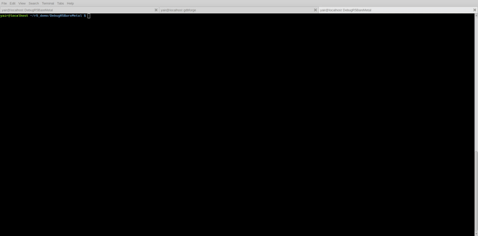

```text
███████╗ ██████╗ ██████╗  ██████╗ ███████╗
██╔════╝██╔═══██╗██╔══██╗██╔════╝ ██╔════╝
█████╗  ██║   ██║██████╔╝██║  ███╗█████╗
██╔══╝  ██║   ██║██╔══██╗██║   ██║██╔══╝
██║     ╚██████╔╝██║  ██║╚██████╔╝███████╗
╚═╝      ╚═════╝ ╚═╝  ╚═╝ ╚═════╝ ╚══════╝
    >> gdbforge: Extreme Tooling Suite <<
```

# gdbforge

**gdbforge** is a Vim-inspired multi-pane terminal front-end for GDB (and optionally Delve). It keeps the debugger's power in the TTY and adds a workspace for source, console, IO, threads, call stack, and breakpoints — with modes, a `:` command line, mouse/clipboard, and Lua automation.

## Typical use cases

- Debugging **Linux applications** without leaving the terminal
- **Embedded Linux** and board bring-up (source + GDB + process panes together)
- **MCU / cross** workflows where layout and keyboard speed matter
- Teams who want a **Vim-like** flow: normal / insert / command modes, panes, buffers
- **Go** programs via Delve (`-g dlv`), including TUI targets in an external terminal

## Demo

[](docs/media/gdbforge-demo-r5.mp4)

- **[gdbforge-demo-r5.mp4](docs/media/gdbforge-demo-r5.mp4)** — original demo on a **Cortex-R5** (MPSoC / SEGGER J-Link): multi-pane UI stepping a deep call stack, with [`lua/r5_debug`](lua/r5_debug) bring-up (`gdbforge.spawn` → JLinkGDBServer → attach). Sample program: [`examples/stack_demo.c`](examples/stack_demo.c).
- **[gdbforge-demo-linux-app.mp4](docs/media/gdbforge-demo-linux-app.mp4)** — Linux app session showing **external terminal** print vs the **internal IO** (`:b io`) pane.

```bash
mkdir -p .gdbforge/lua
cp -r lua/r5_debug .gdbforge/lua/
# then inside gdbforge:  :lua r5_debug
```

More installable workflows (Go/`dlv_ext_port`, embedded/`remotegdb`, GDB tty, R5, games): [`lua/README.md`](lua/README.md) — install, env vars (`GDBFORGE_TERMINAL=mate-terminal`, …), and how to use each script.

## Host skeleton (`cmd/demo`)

The repo is split so **gdbforge is one app** on a reusable TUI host. A second binary, **`cmd/demo`**, is the minimal showcase of that host — same chrome (modes, `:` cmdline, panes, layouts) and **no GDB/Delve**. Use it as a skeleton when building another product (trader dashboard, ops console, …) on the same framework.

```bash
go build -o bin/demo ./cmd/demo
./bin/demo
```

| Layer | What to reuse |
|-------|----------------|
| **FRAMEWORK** | `termui`, `platform`, `commands`, `ptyx`, `luahost`, … |
| **Skeleton** | `cmd/demo` (+ optional `internal/demo`) — copy / rename as `cmd/<your-app>` |
| **Debugger app** | `cmd/gdbforge` + `internal/gdb` / `dlv` / `gdbforge/*` — do **not** import these from a non-debugger app |

Recipe: wire `TermApp` + command tree + your domain packages; keep debugger imports out of the host. Details and import rules: [`docs/DEPENDENCIES.md`](docs/DEPENDENCIES.md) (`FRAMEWORK vs APP`, `task check-imports`).

## Problems it solves

- Switching constantly between a raw GDB TTY and a separate editor/viewer
- Weak or fixed pane layouts for source, console, and process state
- Limited mouse and clipboard in classic terminal debugger UIs
- Hard-to-discover keys and no in-app manual
- Accidental resume of a running inferior when changing frames/threads

## What you get

- Named layouts (`:layout wide`, `panels`, `default`, `classic`) and splits (`:vs` / `:split`)
- Code (or startup logo), GDB/dlv console, IO, Threads, Call Stack, Breakpoints
- In-app manual: `:help` or `:b help` (full text: [docs/USER_GUIDE.md](docs/USER_GUIDE.md))
- Space to toggle breakpoints; YAML persist under `./.gdbforge/breakpoints.yaml`
- Themability, clipboard/mouse selection, Vim-style modes and focus chords
- Safer while-running BP insert (no surprise continue on frame/thread switches)
- External terminal for TUI inferiors (`:set inferior-tty` / `:lua dlv_ext_port`)
- Lua automation (`gdbforge.*`) — API: [docs/LUA_API.md](docs/LUA_API.md)
- Optional Delve backend: `gdbforge -g dlv ./hello-go` then `:lua dlv_ext_port 1234`

## Install and run (PC)

**Requirements:** Linux (or similar) terminal, [Go](https://go.dev/dl/), `gdb` + `gcc` on `PATH`.

```bash
git clone https://github.com/yairgd/gdbforge.git
cd gdbforge
go build -o bin/gdbforge ./cmd/gdbforge
```

Hello world:

```bash
cat > hello.c <<'HEOF'
#include <stdio.h>
int main(void) { printf("hello, gdbforge\n"); return 0; }
HEOF
gcc -O0 -g -o hello hello.c
./bin/gdbforge ./hello
```

Inside the app: open `:help`, step with `n` / `s` / `c`, quit with Ctrl-D or `:quit`.

```bash
# Delve (Go)
./bin/gdbforge -g dlv ./hello-go

# Pass GDB options after --
./bin/gdbforge -- -nx -x ./board.gdb ./zephyr.elf
```

More demos: `gcc -O0 -g -o stack_demo examples/stack_demo.c && ./bin/gdbforge ./stack_demo`.

## Documentation

| Doc | Contents |
|-----|----------|
| **[docs/USER_GUIDE.md](docs/USER_GUIDE.md)** | Full user manual (same material as `:help`) |
| **[docs/LUA_API.md](docs/LUA_API.md)** | `gdbforge.*` Lua reference for script authors |
| **[docs/PTY_ARCHITECTURE.md](docs/PTY_ARCHITECTURE.md)** | Dual PTY master/slave, GDB vs Delve, `:b io`, external terminal |
| **[docs/DEPENDENCIES.md](docs/DEPENDENCIES.md)** | FRAMEWORK vs APP split; `cmd/demo` as host skeleton |
| **[lua/README.md](lua/README.md)** | Installable Lua workflow catalog |
| **[docs/](docs/)** | Architecture, debugger integration, developer guides |

View docs locally: `./docs/serve.sh` → <http://127.0.0.1:8765/>.

## License

MIT License
