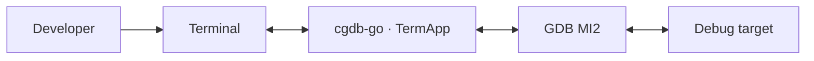
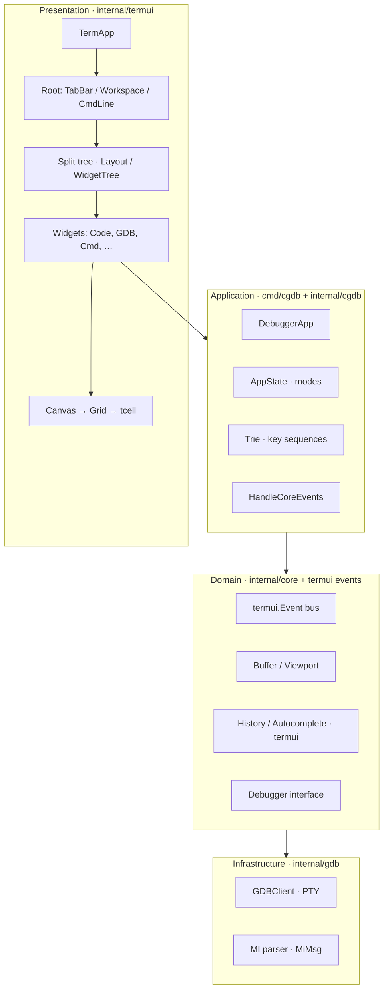
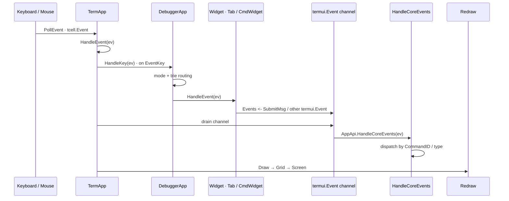
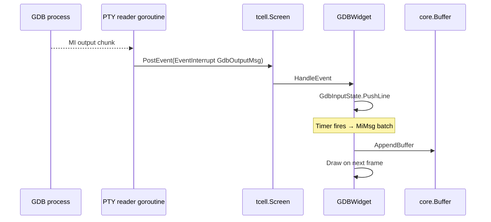
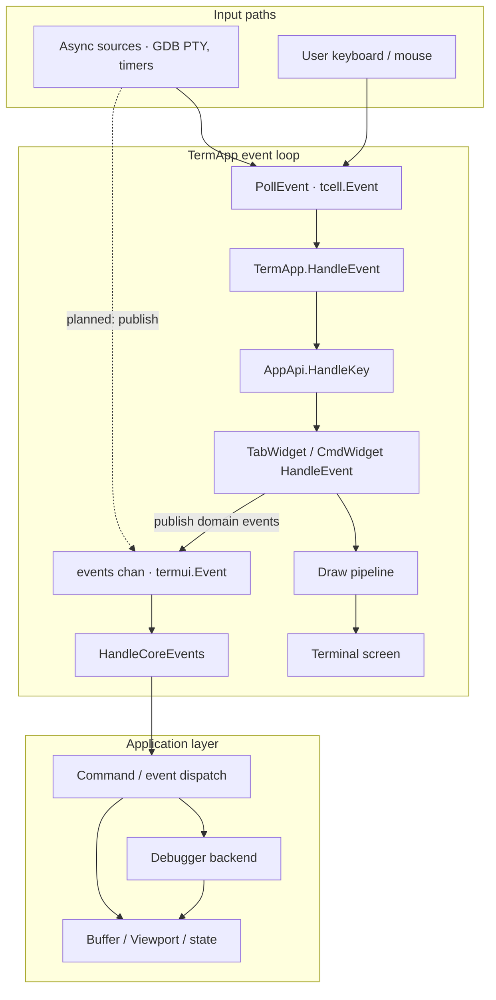
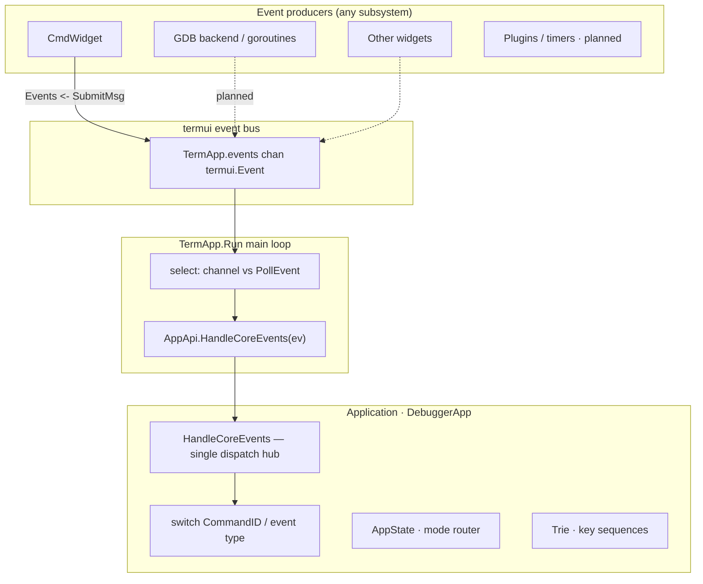
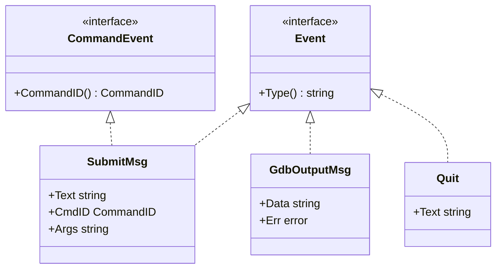

# Architecture Overview

This document describes the high-level architecture of **cgdb-go**: subsystems, boundaries, data flow, and the design principles that govern implementation decisions.

**cgdb-go is not a clone of Vim.** It is a generic application framework inspired by Vim's interaction model. Vim has a single data model (text buffers); this framework supports **multiple application-specific data models**. The GDB debugger is the first application built on it.

**Companion docs:** [UI_ARCHITECTURE.md](UI_ARCHITECTURE.md) · [DEBUGGER_INTEGRATION.md](DEBUGGER_INTEGRATION.md) · [DIRECTORY_STRUCTURE.md](DIRECTORY_STRUCTURE.md)

---

## Table of contents

- [System context](#system-context)
- [Application framework](#application-framework)
- [Startup](#startup)
- [Application data flow](#application-data-flow)
- [Application models](#application-models)
- [Buffer concept](#buffer-concept)
- [Why not :attach](#why-not-attach)
- [Design philosophy](#design-philosophy)
- [High-level architecture](#high-level-architecture)
- [Main subsystems](#main-subsystems)
- [Data flow](#data-flow)
- [Design principles](#design-principles)
- [Layer responsibilities](#layer-responsibilities)
- [Core events layer](#core-events-layer)
- [Current vs target architecture](#current-vs-target-architecture)

---

## System context

cgdb-go runs as a terminal application. It owns the UI event loop, renders into an off-screen grid, and communicates with debugger backends through abstract interfaces. The first backend is **GDB over MI2** via a pseudo-terminal.



---

## Application framework

The central idea is that Vim's interaction model maps cleanly onto a broader class of applications — not only text editors.

| Vim | This framework |
|-----|----------------|
| Single data model (text buffers) | **Multiple application-specific data models** |
| Buffers hold file content | Models hold domain state (breakpoints, orders, registers, …) |
| Windows display buffers | Widgets display models |
| `:buffer` opens a file | `:buffer` displays an application model |

Each application defines its own set of models during startup. Examples:

**GDB application**

- `CodeModel`, `BreakpointModel`, `ThreadModel`, `RegisterModel`, `MemoryModel`, `ConsoleModel`, `LoggerModel`

**Trader application** (hypothetical)

- `OrdersModel`, `PortfolioModel`, `WatchlistModel`, `ChartModel`, `LoggerModel`

The same `termui` framework (split tree, `:buffer`, `:split`, `:tab`) serves both; only the models and services differ.

---

## Startup

When an application starts, it creates:

| Component | Lifetime | Role |
|-----------|----------|------|
| **Services** | Application | Communicate with external systems; produce events |
| **Event bus** | Application | Distributes events to subscribers |
| **Models** | Application | Own state; subscribe to events; update continuously |
| **Logger** | Application | Structured logging infrastructure |
| **Runtime infrastructure** | Application | Event loop, window manager, command line |

**Widgets are not created at startup.** Models exist for the entire lifetime of the application and continuously receive updates from underlying services. The window manager creates widget instances only when the user asks to display a model.

---

## Application data flow

Application state flows in one direction. Widgets never communicate directly with services.

```text
Service
    ↓
Event Bus
    ↓
Data Model
    ↓
Widget (View)
```

Examples:

```text
GDBClient      →  BreakpointModel  →  BreakpointWidget
IBKRClient     →  OrdersModel      →  OrdersWidget
```

| Layer | Responsibility |
|-------|----------------|
| **Service** | Talk to external systems; emit events |
| **Event bus** | Route events to model subscribers |
| **Model** | Own application state; subscribe to events; maintain current data |
| **Widget** | Display a model; no business logic; no direct service access |

The sections below on terminal input, domain events, and GDB output describe how this flow is wired in the current Go implementation (`termui.Event`, `HandleCoreEvents`, `GDBClient`, etc.).

---

## Application models

Models are the source of truth for application state. They are created at startup and live until the application exits.

| Property | Behavior |
|----------|----------|
| **Creation** | Declared and initialized during application startup |
| **Updates** | Subscribe to the event bus; react to service events |
| **Lifetime** | Independent of any widget |
| **Sharing** | Multiple widgets may display the same model simultaneously |

```text
OrdersModel
      |
+-----+------+
|            |
OrdersWidget OrdersWidget
```

A widget's lifetime is independent from its model. Closing a pane destroys the widget, not the model. Opening `:buffer orders` again creates (or activates) a new widget bound to the existing `OrdersModel`.

---

## Buffer concept

The `:buffer` command does **not** represent a text file. It represents an **application model** — the same role Vim's `:buffer` plays for text buffers, extended to arbitrary domain data.

**GDB application examples:**

```text
:buffer code
:buffer breakpoints
:buffer threads
:buffer registers
:buffer memory
:buffer console
:buffer logger
```

**Trader application examples:**

```text
:buffer orders
:buffer portfolio
:buffer chart
```

Internally, these commands create (or activate) the appropriate widget for an **already existing** model. Models are created during application startup — not on demand when the user runs `:buffer`.

See [WINDOW_MANAGEMENT.md](WINDOW_MANAGEMENT.md#buffer-command) and [INPUT.md](INPUT.md#vim-like-command-system).

---

## Why not :attach

The architecture intentionally avoids a runtime attachment mechanism such as:

```text
:attach logger
:attach breakpoints
```

Such commands would imply models can appear or disappear at runtime and require the user to discover what is available. That unnecessarily complicates the experience.

Instead, every application **declares its available models during initialization**. The user only chooses **which model to display** — via `:buffer`, `:split`, or `:vsplit`. All models already exist; the window manager binds widgets to them.

---

## Design philosophy

The framework **extends** the Vim interaction model; it does not replicate Vim's text-editing semantics.

**Vim:**

```text
File
    ↓
Text Buffer
    ↓
Window
```

**This framework:**

```text
Application
      ↓
Application Models
      ↓
Widgets (Views)
      ↓
Window Manager
```

The user still works with familiar Vim concepts — `:buffer`, `:split`, `:vsplit`, `:tab` — but the underlying objects are no longer limited to text files. They can represent any application-specific data model.

---

## High-level architecture



*Source: [`diagrams/module_boundaries.mermaid`](diagrams/module_boundaries.mermaid)*

---

## Main subsystems

| Subsystem | Package | Responsibility |
|-----------|---------|----------------|
| **Services** | App layer (`cmd/cgdb`, `internal/gdb`, …) | Communicate with external systems; produce events |
| **Event bus** | `termui.Event` channel | Distribute events to models and application dispatch |
| **Models** | App layer (planned; today partially `core.Buffer`, widget-local state) | Own application state; subscribe to events |
| **Window manager** | `termui` (`Layout`, `WidgetTree`, `TabWidget`) | Layout, widget lifecycle, model-to-widget binding |
| **Terminal application** | `termui.TermApp` | Event loop, screen init, widget registry, redraw orchestration |
| **Root layout** | `termui` (planned `RootLayout`) | Fixed TabBar, flexible Workspace, fixed CmdLine |
| **Split tree** | `termui.Layout`, `WidgetTree`, `Node` | Recursive pane division inside Workspace |
| **Widget layer** | `termui.Widget` implementations | Views that display models; per-pane input handling; no business logic |
| **Rendering** | `Canvas`, `Grid`, `Cell` | Local coordinates, border composition, terminal flush |
| **Domain events** | `termui.Event` bus | Decouple widgets from app logic; all events → `HandleCoreEvents` |
| **Text model (legacy)** | `core.Buffer`, `core.Viewport` | Scrollable line storage — used today by console/source widgets; target is explicit domain models per pane |
| **CmdLine helpers** | `termui.History`, `termui.AutoCompleter` | Command-line UX (no tcell in API surface) |
| **Key sequences** | `termui.Trie` | Prefix-tree matcher for multi-key bindings |
| **App modes** | `cgdb.AppState` | Normal / Command / Search / Insert mode state |
| **Debugger backend** | `gdb.GDBClient`, `core.Debugger` | PTY I/O, MI2 parsing |
| **Application shell** | `cmd/cgdb` (`DebuggerApp`) | Composes UI, widgets, GDB; owns modes, trie, `HandleCoreEvents` |

---

## Data flow

### Service → model → widget (application layer)

At the application level, state always flows downward:

```text
Service → Event Bus → Data Model → Widget
```

Widgets display models. Models subscribe to application events. Services never talk to widgets directly. The GDB and terminal sections below describe the current wiring toward this target.

### Input → action → redraw

cgdb-go uses **two parallel event planes**:

| Plane | Type | Path |
|-------|------|------|
| **Terminal** | `tcell.Event` | `PollEvent` → `TermApp.HandleEvent` → `AppApi.HandleKey` / `HandleResize` |
| **Domain** | `termui.Event` | Any producer → `TermApp.events` channel → **`HandleCoreEvents`** |

Widgets handle terminal input locally (keys, cursor). When a widget needs the application to act — submit a `:` command, quit, forward to GDB — it **publishes** a `termui.Event` onto the bus. The main loop drains the channel and forwards every domain event to a single application hook: `AppApi.HandleCoreEvents`.



*Sources: [`diagrams/event_flow.mermaid`](diagrams/event_flow.mermaid) · [`diagrams/event_bus.mermaid`](diagrams/event_bus.mermaid)*

### Debugger output → UI

GDB output arrives asynchronously on a goroutine, is posted back into the tcell event loop via `EventInterrupt`, and is parsed into display buffers. **Target flow:** `GDBClient` (service) publishes events on the bus → domain models update → widgets redraw from model state.



*Source: [`diagrams/debugger_integration.mermaid`](diagrams/debugger_integration.mermaid)*

### End-to-end data flow



*Source: [`diagrams/data_flow.mermaid`](diagrams/data_flow.mermaid)*

**Design decision:** domain events do **not** fan out to widgets directly. Every `termui.Event` on the bus is handled in one place — `HandleCoreEvents` on the application object (`DebuggerApp` in `cmd/cgdb/main.go`). The app decides whether to exit, talk to GDB, change layout, or push state back into widgets on the next draw.

Terminal input routing (modes, trie, widget dispatch) is also centralized in **`DebuggerApp`**, keeping `TermApp` a generic event loop and draw orchestrator.

---

## Design principles

These principles are **non-negotiable** for cgdb-go. They explain many seemingly verbose abstractions (Canvas, WidgetTree, Grid).

| # | Principle | Rationale |
|---|-----------|-----------|
| 1 | Widgets should not know screen coordinates | Enables layout changes without touching widget code |
| 2 | Widgets draw only inside their assigned `Rect` | Prevents bleed-over; simplifies testing |
| 3 | `Canvas` provides local drawing coordinates | Single translation point from local to screen space |
| 4 | Layout engine owns positioning | Centralizes split ratios, resize, and border gutters |
| 5 | Rendering backend should be replaceable | Grid → tcell today; could swap to alternate terminal libs |
| 6 | Business logic lives in models; widgets are views | Services update models via events; widgets never call services |
| 7 | TabBar, CmdLine, Workspace are top-level | Split tree stays scoped to Workspace only |
| 8 | Only Workspace contains the split tree | TabBar/CmdLine never participate in recursive splits |
| 9 | Debugger backends must not import UI | Keeps GDB/OpenOCD/JTAG testable without a terminal |

---

## Layer responsibilities

### Services

- Communicate with external systems (GDB, future OpenOCD, etc.).
- Produce events; never import UI packages.
- Example: `internal/gdb.GDBClient` — PTY I/O, MI2 parsing.

### Event bus

- Distributes events from services and UI producers.
- Models and application dispatch subscribe here.
- Implementation: `termui.Event` channel on `TermApp`; all events also routed through **`HandleCoreEvents`**.

### Models

- Own application state for a domain concern (breakpoints, source, console output, …).
- Subscribe to events; update internal data continuously.
- Exist for the application lifetime; independent of widget lifetime.
- **Current state:** partially represented by `core.Buffer` and widget-local state; explicit model types per domain are the target.

### Widgets

- Display models; never own business logic.
- Never communicate directly with services.
- Created on demand when the user displays a model (`:buffer`, splits); destroyed when a pane closes.
- Multiple widgets may bind to the same model.

### Window manager

- Manages layout (split tree, tabs).
- Creates and destroys widget instances.
- Binds widgets to existing models.
- Implementation: `termui.Layout`, `WidgetTree`, `TabWidget`, `HandleCoreEvents` layout commands.

### Presentation (`internal/termui`)

- Owns `tcell.Screen` lifecycle.
- Registers top-level widgets (today: flat list; target: structured Root).
- Runs the poll/draw loop.
- Must **not** parse GDB MI records directly — delegates to widgets that use `internal/gdb`.

### Application (`cmd/cgdb` + `internal/cgdb`)

- Declares available models and services at startup.
- `DebuggerApp` embeds `termui.TermApp`, implements `AppApi`, and owns:
  - **`HandleCoreEvents`** — single dispatch hub for domain events.
  - **`AppState`** (`internal/cgdb/mode_manager.go`) — interaction mode (`ModeNormal`, `ModeCommand`, …).
  - **`Trie`** — multi-key binding table (`BindKeySeq`, `SearchPartial` in normal mode).
  - Direct references to **`TabWidget`** and **`CmdWidget`** for layout and command-line routing.
- Defines app-specific `CommandID` values (break, continue, quit, …).
- **`ModeNormal` / `ModeCommand`** are wired; focus and search modes are reserved.

### Domain (`internal/core` + `termui` event types)

- **`termui.Event` bus types** — `Event`, `CommandEvent`, `SubmitMsg` (`internal/termui/event.go`, `command.go`).
- **`core` debugger events** — `GdbOutputMsg`, etc. (`internal/core/events.go`) — for backend → UI paths.
- **`CommandID`** — infra constant `CmdUnknown` in `termui`; app-specific command IDs live in `cmd/cgdb`.
- `Buffer`, `Viewport` for text panes.
- `History`, `AutoCompleter` for command-line UX (`termui`).
- `Debugger` interface — minimal send API.

### Infrastructure (`internal/gdb`)

- Spawns GDB with `--interpreter=mi2`.
- Reads PTY output, publishes `core.GdbOutputMsg`.
- Parses MI lines into `MiMsg`, `GdbInputState`.

**Dependency rule:** `termui` → `core` ← `gdb`. Never `gdb` → `termui`.

---

## Core events layer

The **event bus** decouples UI widgets from application logic. Any subsystem may publish a `termui.Event`; the main loop delivers every event to **`HandleCoreEvents`** on the application object. Widgets stay thin — they parse local input and emit domain events; the app owns side effects.



*Source: [`diagrams/event_bus.mermaid`](diagrams/event_bus.mermaid)*

Mode and key-sequence routing happen in **`DebuggerApp.HandleKey`** before widgets see terminal keys — see [INPUT.md](INPUT.md#interaction-modes).

### Interfaces and types



| Type | Purpose |
|------|---------|
| `Event` | Base domain event — identified by `Type() string` |
| `CommandEvent` | Events carrying a resolved `CommandID` (e.g. after `:` command entry) |
| `SubmitMsg` | CmdLine submitted — `Text`, `CmdID`, `Args` |
| `GdbOutputMsg` | Raw GDB output for UI consumption |

### Command IDs

| Layer | Owns |
|-------|------|
| **`termui`** | `CommandID` type, **`CmdUnknown`** (value `0`), `SubmitMsg`, event bus channel |
| **Application** (`cmd/cgdb`) | Private constants: `cmdBreak`, `cmdQuit`, … starting at `iota + 1` |

`CmdWidget` never references app command names. It resolves user input through `termui.AutoCompleter` and emits `SubmitMsg{CmdID: …}`. Unknown commands emit `termui.CmdUnknown`.

### Wiring

```go
// termui/term_app.go
type AppApi interface {
    HandleCoreEvents(ev Event)          // all domain events land here
    HandleKey(ev *tcell.EventKey)       // mode routing, trie, widget dispatch
    HandleResize()                      // assign top-level widget rects
}

// cmd/cgdb/main.go
type DebuggerApp struct {
    *termui.TermApp
    trie      termui.Trie
    appState  cgdb.AppState
    tab       *termui.TabWidget
    cmdWidget *termui.CmdWidget
}

a.cmdWidget.Events = a.Events()

func (app *DebuggerApp) HandleCoreEvents(ev termui.Event) {
    switch msg.CommandID() {
    case termui.CmdUnknown: /* feedback */
    case cmdQuit:         /* close pane or exit */
    }
}
```

Implementation: `internal/termui/event.go`, `internal/termui/command.go`, `internal/cgdb/mode_manager.go`, `internal/termui/trie.go`, `internal/termui/term_app.go`, `internal/termui/cmd_widget.go`.

---

## Current vs target architecture

The **target** architecture is documented across this tree. The **current** codebase is mid-migration.

| Component | Target | Current state |
|-----------|--------|---------------|
| Application models | Explicit model per domain; created at startup | Partial — `core.Buffer` + widget-local state |
| Model → widget binding | `:buffer` activates widget for existing model | Partial — widgets created in layout at init |
| Service → bus → model | GDB events update models, not widgets directly | Partial — GDB uses `EventInterrupt` into widgets |
| Root layout | TabBar + Workspace + CmdLine | Flat widget list; `HandleResize` assigns tab + cmd line rects |
| TabBar | Multi-tab with header render | `TabWidget` — single tab, no header |
| Workspace | Split tree only | `Layout` / `WidgetTree` implemented |
| CmdLine | Global `:` command input | `CmdWidget` on bottom row (`H-1`); mode routing in `DebuggerApp` |
| Event bus | `termui.Event` → `HandleCoreEvents` | Channel on `TermApp`; `CmdWidget` wired |
| Key chords | Configurable multi-key sequences | `Trie` on `DebuggerApp`; `Ctrl+W` focus chords |
| Interaction modes | Normal / Focus / Command | **Normal + Command wired** via `cgdb.AppState` |
| Rendering | Diff-based grid flush | **Partial** — `BackCells` diff in `Grid.Draw`; single `frontBuffer` |
| Focus | Mode-aware routing | `WidgetTree.focus` + trie focus movement |
| Split commands | `:vs`, `:split` | **Partial** — wired in `HandleCoreEvents` |
| Debugger | Abstract backend + GDB | GDB PTY prototype in `GDBWidget` |

Entry point: `cmd/cgdb/main.go`.

Detailed tracker: [ROADMAP.md](ROADMAP.md).

---

## Related documentation

| Topic | Document |
|-------|----------|
| Widgets, canvas, grid | [UI_ARCHITECTURE.md](UI_ARCHITECTURE.md) |
| Splits, tabs, command line | [WINDOW_MANAGEMENT.md](WINDOW_MANAGEMENT.md) |
| Cells, borders, Unicode | [RENDERING.md](RENDERING.md) |
| Keyboard, modes | [INPUT.md](INPUT.md) |
| GDB MI2 | [DEBUGGER_INTEGRATION.md](DEBUGGER_INTEGRATION.md) |
| Package map | [DIRECTORY_STRUCTURE.md](DIRECTORY_STRUCTURE.md) |
