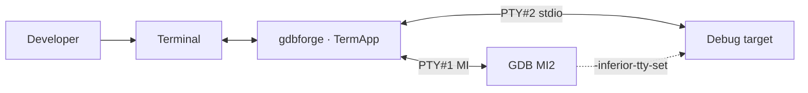
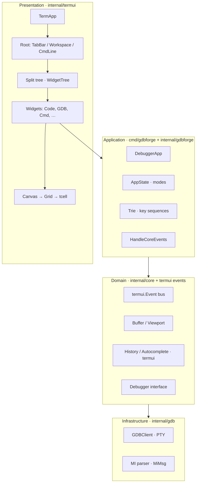
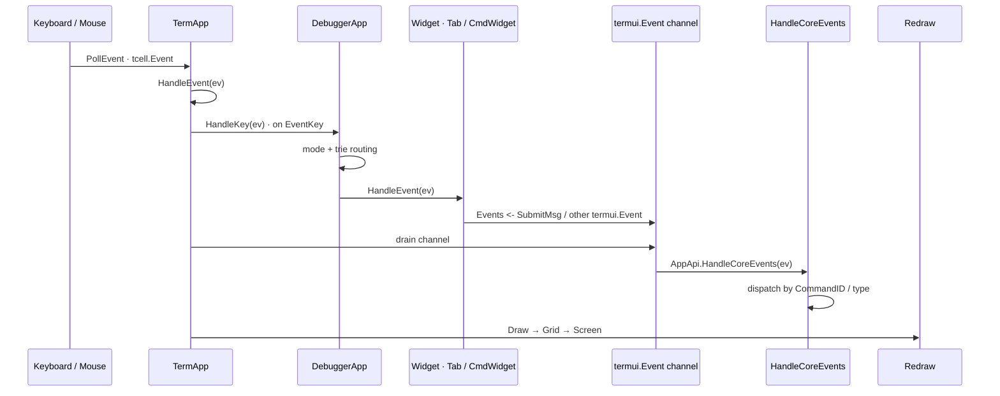
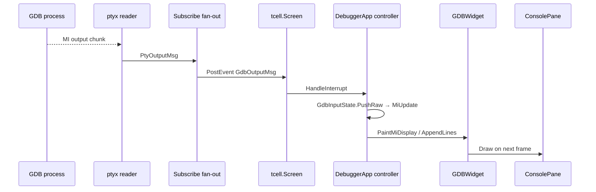
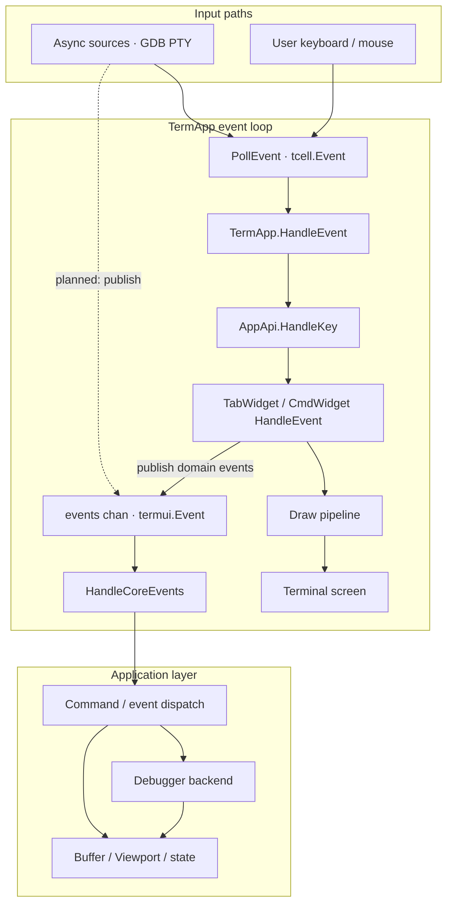
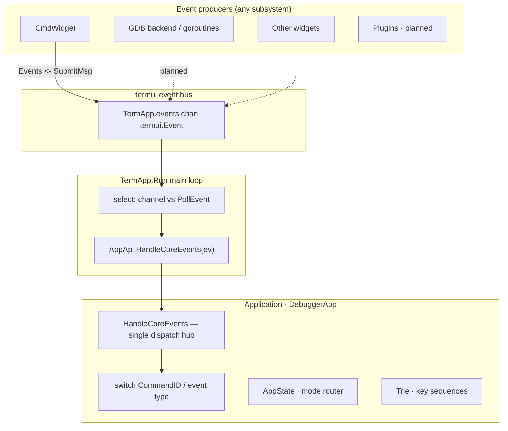
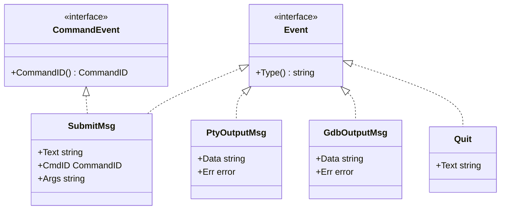

# Architecture Overview

This document describes the high-level architecture of **gdbforge**: subsystems, boundaries, data flow, and the design principles that govern implementation decisions.

**gdbforge is not a clone of Vim.** It is a generic application framework inspired by Vim's interaction model. Vim has a single data model (text buffers); this framework supports **multiple application-specific data models**. The GDB debugger is the first application built on it.

**Companion docs:** [UI_ARCHITECTURE.md](UI_ARCHITECTURE.md) · [COMMAND_SYSTEM.md](COMMAND_SYSTEM.md) · [DEBUGGER_INTEGRATION.md](DEBUGGER_INTEGRATION.md) · [DIRECTORY_STRUCTURE.md](DIRECTORY_STRUCTURE.md)

---

## MVC (current)

The GDB debugger app is organized as **Model–View–Controller**:

| Layer | Owns | Lives in |
|-------|------|----------|
| **Model** | Session + domain snapshots (breakpoints, threads, call stack, AppState, …) | `DebuggerApp`, `internal/gdb`, `internal/gdbforge/models` |
| **Controller** | Intents → mutate model → push paint / `Send` | `cmd/gdbforge` (`gdb_console.go`, `breakpoints.go`, `io_console.go`, `stopped.go`, …) |
| **View** | Paint + chrome + callbacks only (`SetItems`, `SetOnSubmit`, …) | `internal/gdbforge/widgets`, `internal/termui` |

```text
View (widget)  --OnToggle / OnSubmit-->  Controller (DebuggerApp)
Controller     --Send / Query-->         Model (GDBClient, BreakpointList, …)
Controller     --SetItems / Paint-->     View
```

GUI and MCP/AI share the same models (e.g. `BreakpointList`); widgets never own `GDBClient`, `ptyx.TTY`, or domain merge logic.

---

## Table of contents

- [MVC (current)](#mvc-current)
- [System context](#system-context)
- [Application framework](#application-framework)
- [Startup](#startup)
- [Services](#services)
- [Application data flow](#application-data-flow)
- [Application models](#application-models)
- [Widget philosophy](#widget-philosophy)
- [Generic widgets](#generic-widgets)
- [Buffer concept](#buffer-concept)
- [Why not :attach](#why-not-attach)
- [Design philosophy](#design-philosophy)
- [Platform layer](#platform-layer)
- [TermUI layer](#termui-layer)
- [High-level architecture](#high-level-architecture)
- [Main subsystems](#main-subsystems)
- [Data flow](#data-flow)
- [Design principles](#design-principles)
- [Layer responsibilities](#layer-responsibilities)
- [Core events layer](#core-events-layer)
- [Current vs target architecture](#current-vs-target-architecture)

---

## System context

gdbforge runs as a terminal application. It owns the UI event loop, renders into an off-screen grid, and communicates with debugger backends through abstract interfaces. The first backend is **GDB over MI2** via a pseudo-terminal.



GDB and the inferior use **separate** PTYs: MI on PTY #1, program stdin/stdout on PTY #2 (IO console). Details: [DEBUGGER_INTEGRATION.md](DEBUGGER_INTEGRATION.md#inferior-io-dual-pty).

---

## Application framework

The central idea is that Vim's interaction model maps cleanly onto a broader class of applications — not only text editors.

| Vim | This framework |
|-----|----------------|
| Single data model (text buffers) | **Multiple application-specific data models** |
| Buffers hold file content | Models hold domain state (breakpoints, orders, registers, …) |
| Windows display buffers | Widgets display models |
| `:buffer` opens a file | `:buffer` displays an application model |

Each application defines its own set of models during startup. Examples:

**GDB application**

- `CodeModel`, `BreakpointModel`, `ThreadModel`, `RegisterModel`, `MemoryModel`, `ConsoleModel`, `LoggerModel`

**Trader application** (hypothetical)

- `OrdersModel`, `PortfolioModel`, `WatchlistModel`, `ChartModel`, `LoggerModel`

**MSP application** (hypothetical)

- `MSPV2InfoModel`, `LoggerModel`, …

All models are created during application initialization. They live for the entire lifetime of the application, subscribe to application events, and continuously maintain their state.

The same `termui` framework (split tree, `:buffer`, `:split`, `:tab`) serves all applications; only the models and services differ.

---

## Startup

When an application starts, it creates:

| Component | Lifetime | Role |
|-----------|----------|------|
| **Services** | Application | Communicate with external systems; produce events |
| **Event bus** | Application | Distributes events to subscribers |
| **Models** | Application | Own state; subscribe to events; update continuously |
| **Logger** | Application | Structured logging infrastructure |
| **Runtime infrastructure** | Application | Event loop, window manager, command line |

**Widgets are not created at startup.** Models exist for the entire lifetime of the application and continuously receive updates from underlying services. The window manager creates widget instances only when the user asks to display a model.

---

## Services

Services communicate with the outside world. They publish events through the event bus and **never communicate directly with widgets** (target architecture).

| Service | Application |
|---------|-------------|
| `gdb.GDBClient` / `ptyx.Client` | GDB debugger — **owned by `DebuggerApp`**; widgets use callbacks + paint APIs |
| `execcli.ExecClient` | Vim-style `:!` shell / SSH PTYs — owned by `DebuggerApp` |
| `mcp.GdbMcpService` | In-app `:AI` / tool access to the live GDB `Session` (`app.GDB()`) |
| `IBKRClient` | Trader (planned) |
| `MSPV2Client` | MSP monitoring (planned) |

Each application wires its own services during startup. Controllers update domain models and push snapshots to views; MCP is a peer controller on the same `Session`.

---

## Application data flow

Application state flows in one direction:

```text
Service
    ↓
Event Bus
    ↓
Model
    ↓
Widget (View)
```

Widgets **never subscribe directly to external services**. Models own application state; widgets simply display models.

Examples:

```text
GDBClient / MCP  →  models.BreakpointList  →  BreakpointWidget + Code gutters
GDBClient        →  gdb_console controller →  GDBWidget (paint + OnSubmit)
GDBClient        →  models.CallStack / ThreadList → CallStackWidget / ThreadWidget
GdbMcpService    →  same Session (WithWrite + Subscribe)
```

| Layer | Responsibility |
|-------|----------------|
| **Service / Session** | Talk to external systems; `Send` / `Subscribe` / `WithWrite` |
| **Event bus** | Route events to controllers / model refresh |
| **Model** | Own application state; live for the app lifetime |
| **Controller** | `DebuggerApp` methods — intents, MI refresh, sync views |
| **Widget** | Display a model / console chrome; callbacks only; no `Send` |

The sections below on terminal input, domain events, and GDB output describe how this flow is wired in the current Go implementation (`termui.Event`, `HandleCoreEvents`, `ptyx`, etc.).


---

## Application models

Models are the source of truth for application state. They are created at startup and live until the application exits.

| Property | Behavior |
|----------|----------|
| **Creation** | Declared and initialized during application startup |
| **Updates** | Subscribe to the event bus; react to service events |
| **Lifetime** | Independent of any widget |
| **Sharing** | Multiple widgets may display the same model simultaneously |

```text
OrdersModel
      |
+-----+------+
|            |
OrdersWidget OrdersWidget
```

A widget's lifetime is independent from its model. Closing a pane destroys the widget, not the model. Opening `:buffer orders` again creates (or activates) a new widget bound to the existing `OrdersModel`.

### Generic model interfaces

Models are **application-specific** (`BreakpointModel`, `OrdersModel`, `MSPV2InfoModel`, …), but they expose **generic interfaces** understood by reusable widgets. Widgets never depend on application-specific model types.

```text
TextWidget   →  TextModel
GraphWidget  →  GraphModel
TableWidget  →  TableModel
TreeWidget   →  TreeModel
```

The application implements concrete models; the widget depends only on the small interface it needs.

---

## Widget philosophy

Widgets are **views**. A widget should contain little or no business logic. It receives a model (usually through an interface) and renders it.

| Widget | Role |
|--------|------|
| `LoggerWidget` | Scrollable log output |
| `GraphWidget` | Time series, histograms, scatter plots |
| `TableWidget` | Tabular data |
| `TreeWidget` | Hierarchical data |
| `TextWidget` | Line-oriented text |

Widgets should be **reusable across applications** whenever possible. The same `TableWidget` can display breakpoints in a debugger, orders in a trading app, or MSP telemetry in a monitoring app — as long as the bound model implements `TableModel`.

---

## Generic widgets

Widgets operate on **small interfaces** rather than concrete model implementations.

For example, `GraphWidget` depends on `GraphModel`. `GraphModel` represents graph data only — not how it should be drawn. Different applications may implement `GraphModel`:

| Application model | Implements |
|-------------------|------------|
| `StockChartModel` | `GraphModel` |
| `MSPV2InfoModel` | `GraphModel` |
| `CPULoadModel` | `GraphModel` |

The same `GraphWidget` displays all of them.

**Rendering style** (line graph, histogram, scatter, etc.) is a responsibility of the **widget**, not the model. The model provides data; the widget decides how to render it.

---

## Buffer concept

The meaning of `:buffer` differs from Vim:

| | Vim | This framework |
|---|-----|----------------|
| **Buffer** | Text file | Named application model |

`:buffer` does **not** open a file. It creates (or activates) a widget displaying the corresponding model. **The model already exists** — only the view is created on demand.

**GDB application examples:**

```text
:buffer code
:buffer breakpoints
:buffer threads
:buffer registers
:buffer memory
:buffer console
:buffer logger
```

**Trader application examples:**

```text
:buffer orders
:buffer portfolio
:buffer chart
```

**MSP application examples:**

```text
:buffer msp
:buffer logger
```

Models are created during application startup — not on demand when the user runs `:buffer`.

See [WINDOW_MANAGEMENT.md](WINDOW_MANAGEMENT.md#buffer-command) and [INPUT.md](INPUT.md#vim-like-command-system).

---

## Why not :attach

The architecture intentionally avoids a runtime attachment mechanism such as:

```text
:attach logger
:attach breakpoints
```

Such commands would expose the internal dependency graph between services, models, and widgets. The user should not be required to understand that wiring.

The relationship between services, models, and widgets is **defined during application startup**. Commands should express **user intent** (`:buffer logger`) rather than implementation details (`:attach logger`).

Instead, every application **declares its available models during initialization**. The user only chooses **which model to display** — via `:buffer`, `:split`, `:vsplit`, or `:tab`. All models already exist; the window manager binds widgets to them.

---

## Design philosophy

The framework **extends** Vim's interaction model rather than copying its implementation.

Vim has **one** data model: the text buffer. This framework supports **many application-defined data models**. Each application declares its available models at startup; the user interacts with them using familiar Vim commands.

**Vim:**

```text
File
    ↓
Text Buffer
    ↓
Window
```

**This framework:**

```text
Application
      ↓
Application Models
      ↓
Widgets (Views)
      ↓
Window Manager
```

Internally, `:buffer`, `:split`, `:vsplit`, and `:tab` create **views over existing models** instead of opening files. The user still works with familiar Vim concepts, but the underlying objects are no longer limited to text files — they can represent breakpoints, orders, telemetry, or any other domain state.

---

## Platform layer

The **Platform** package contains reusable infrastructure independent from any specific application.

| Component | Role |
|-----------|------|
| **Logger** | Structured logging |
| **EventBus** | Event distribution between services and models |
| **Buffer** | Reusable line-oriented data structure (no UI knowledge) |
| **Lua** | Scripting and plugin host |
| **SSH** | Remote access primitives |
| **Runtime utilities** | Shared helpers used across applications |

Platform components do not import terminal or widget packages. Today many of these live in or near `internal/core`; the target is a dedicated platform layer that applications and TermUI both depend on.

**Design decision:** `Buffer` belongs to Platform because it is a reusable data structure with no UI knowledge. Scroll position and cursor visibility are presentation concerns — see [TermUI layer](#termui-layer).

---

## TermUI layer

**TermUI** is responsible for presentation: turning model state into terminal output and routing local input.

| Component | Role |
|-----------|------|
| **Canvas** | Local-coordinate drawing context |
| **Grid** | Off-screen cell framebuffer |
| **Viewport** | Scroll window, cursor visibility, visible region over a model |
| **Widget** | View interface (`Draw`, `DrawStatusLine`, `HandleEvent`) |
| **WidgetTree** | Split-tree geometry + focus |
| **Window manager** | Tabs, splits, model-to-widget binding |

**Design decision:** `Viewport` belongs to TermUI because it manages scrolling, cursor visibility, and rendering. `Buffer` belongs to Platform because it holds data with no presentation logic.

Implementation today: `internal/termui` (Canvas, Grid, WidgetTree) plus scroll/view helpers still migrating from `internal/core`.

---

## High-level architecture



*Source: [`diagrams/module_boundaries.mermaid`](diagrams/module_boundaries.mermaid)*

---

## Main subsystems

| Subsystem | Package | Responsibility |
|-----------|---------|----------------|
| **Services** | App layer (`cmd/gdbforge`, `internal/gdb`, …) | Communicate with external systems; produce events |
| **Event bus** | `termui.Event` channel | Distribute events to models and application dispatch |
| **Models** | `internal/gdbforge/models` + `DebuggerApp` fields | Own application state; controllers push `SetItems` / paint |
| **Window manager** | `termui` (`WidgetTree`, `TabWidget`) | Layout, widget lifecycle, model-to-widget binding |
| **Terminal application** | `termui.TermApp` | Event loop, screen init, widget registry, redraw orchestration |
| **Root layout** | `termui` (planned `RootLayout`) | Fixed TabBar, flexible Workspace, fixed CmdLine |
| **Split tree** | `termui.WidgetTree`, `Node` | Recursive pane division inside Workspace |
| **Widget layer** | `termui.Widget` implementations | Views that display models; per-pane input handling; no business logic |
| **Rendering** | `Canvas`, `Grid`, `Cell` | Local coordinates, border composition, terminal flush |
| **Domain events** | `termui.Event` bus | Decouple widgets from app logic; all events → `HandleCoreEvents` |
| **Text model (legacy)** | `core.Buffer`, `core.Viewport` | Scrollable line storage — used today by console/source widgets; target is explicit domain models per pane |
| **CmdLine helpers** | `termui.History`, `termui.AutoCompleter` | Command-line UX (no tcell in API surface) |
| **Key sequences** | `termui.Trie` | Prefix-tree matcher for multi-key bindings |
| **App modes** | `platform.AppState` | Interaction mode + PTY owner + layout policy (`equalalways`) |
| **Debugger backend** | `ptyx.Client`, `ptyx.TTY`, `gdb.GDBClient`, `core.Session` | GDB MI PTY + inferior stdio PTY; MI2 parsing in gdb |
| **AI / tools** | `mcp.GdbMcpService` | Same-process `:AI` on live Session |
| **Application shell** | `cmd/gdbforge` (`DebuggerApp`) | Composes UI, widgets, GDB, MCP; owns modes, trie, `HandleCoreEvents` |

---

## Data flow

### Service → model → widget (application layer)

At the application level, state always flows downward:

```text
Service → Event Bus → Data Model → Widget
```

Widgets display models. Models subscribe to application events. Services never talk to widgets directly. The GDB and terminal sections below describe the current wiring toward this target.

### Input → action → redraw

gdbforge uses **two parallel event planes**:

| Plane | Type | Path |
|-------|------|------|
| **Terminal** | `tcell.Event` | `PollEvent` → `TermApp.HandleEvent` → `AppApi.HandleKey` / `HandleResize` |
| **Domain** | `termui.Event` | Any producer → `TermApp.events` channel → **`HandleCoreEvents`** |

Widgets handle terminal input locally (keys, cursor). When a widget needs the application to act — submit a `:` command, quit, forward to GDB — it **publishes** a `termui.Event` onto the bus. The main loop drains the channel and forwards every domain event to a single application hook: `AppApi.HandleCoreEvents`.



*Sources: [`diagrams/event_flow.mermaid`](diagrams/event_flow.mermaid) · [`diagrams/event_bus.mermaid`](diagrams/event_bus.mermaid)*

### Debugger output → UI

GDB output arrives asynchronously on a `ptyx` reader goroutine, is **fan-out** via `Subscribe`, posted into the tcell event loop as `EventInterrupt(GdbOutputMsg)`, and handled by the **app controller** (`gdb_console.go`), which paints the GDB view.



*Source: [`diagrams/debugger_integration.mermaid`](diagrams/debugger_integration.mermaid)*

Layering: `InputLine` (edit) → `ConsolePane` (REPL shell) → `GDBWidget` (view) ← controller owns MI + `Session`.

### End-to-end data flow



*Source: [`diagrams/data_flow.mermaid`](diagrams/data_flow.mermaid)*

**Design decision:** domain events do **not** fan out to widgets directly. Every `termui.Event` on the `TermApp` channel is handled in one place — `HandleCoreEvents` on the application object (`DebuggerApp` in `cmd/gdbforge/`). The app decides whether to exit, talk to GDB, change layout, or push state back into widgets on the next draw.

Typed app notifications use **`platform.EventBus`** (`Subscribe` / `Publish`) so producers and consumers wire without constructor injection:

| Message | Publisher | Subscriber |
|---------|-----------|------------|
| `CompletionMsg` | `CmdWidget` (Tab) | `CompletionBarWidget` |
| `BreakpointsChangedMsg` | `onBreakpointsChanged` (MI / MCP / `:e`) | `DebuggerApp.onBreakpointsChangedMsg` → coalesced `-break-list` |

Breakpoint sync details: [DEBUGGER_INTEGRATION.md](DEBUGGER_INTEGRATION.md#breakpoints-and-source-sync).

Terminal input routing (modes, trie, widget dispatch) is also centralized in **`DebuggerApp`**, keeping `TermApp` a generic event loop and draw orchestrator.

---

## Design principles

These principles are **non-negotiable** for gdbforge. They explain many seemingly verbose abstractions (Canvas, WidgetTree, Grid).

| # | Principle | Rationale |
|---|-----------|-----------|
| 1 | Widgets should not know screen coordinates | Enables layout changes without touching widget code |
| 2 | Widgets draw only inside their assigned `Rect` | Prevents bleed-over; simplifies testing |
| 3 | `Canvas` provides local drawing coordinates | Single translation point from local to screen space |
| 4 | Layout engine owns positioning | Centralizes split ratios, resize, and border gutters |
| 5 | Rendering backend should be replaceable | Grid → tcell today; could swap to alternate terminal libs |
| 6 | Business logic lives in models; widgets are views | Services update models via events; widgets never call services |
| 7 | Widgets depend on generic model interfaces | Same `GraphWidget` works across applications; models stay app-specific |
| 8 | TabBar, CmdLine, Workspace are top-level | Split tree stays scoped to Workspace only |
| 9 | Only Workspace contains the split tree | TabBar/CmdLine never participate in recursive splits |
| 10 | Debugger backends must not import UI | Keeps GDB/OpenOCD/JTAG testable without a terminal |
| 11 | Buffer is Platform; Viewport is TermUI | Data storage vs scroll/cursor/rendering concerns stay separated |

---

## Layer responsibilities

The [Platform layer](#platform-layer) and [TermUI layer](#termui-layer) sections above define the reusable infrastructure vs presentation split. The subsections below map those roles onto today's packages and wiring.

### Services

- Communicate with external systems (`GDBClient`, `IBKRClient`, `MSPV2Client`, `SSHClient`, …).
- Publish events on the event bus; never import UI packages; never talk to widgets directly.
- Example: `internal/gdb.GDBClient` — PTY I/O, MI2 parsing.

### Event bus

- Distributes events from services and UI producers.
- Models and application dispatch subscribe here.
- Implementation: `termui.Event` channel on `TermApp`; all events also routed through **`HandleCoreEvents`**.

### Models

- Own application state for a domain concern (breakpoints, source, console output, …).
- Application-specific types (`BreakpointModel`, `OrdersModel`, `MSPV2InfoModel`, …) that implement generic widget interfaces (`TextModel`, `GraphModel`, `TableModel`, …).
- Subscribe to events; update internal data continuously.
- Exist for the application lifetime; independent of widget lifetime.
- **Current:** `models.BreakpointList`, `models.ThreadList`, `models.CallStack`, plus `AppState` (source files, location, colors). Controllers sync views via `SetItems` / paint APIs.
- **Still aspirational:** generic `TextModel` / `TableModel` interfaces for reusable widgets across apps.

### Widgets

- Display models via small interfaces; never depend on application-specific model types.
- Never own business logic; never communicate directly with services.
- Created on demand when the user displays a model (`:buffer`, splits); destroyed when a pane closes.
- Multiple widgets may bind to the same model.
- Rendering style (line graph vs histogram, table columns, etc.) is decided by the widget, not the model.

### Window manager

- Manages layout (split tree, tabs).
- Creates and destroys widget instances.
- Binds widgets to existing models.
- Implementation: `termui.WidgetTree`, `TabWidget`, `HandleCoreEvents` layout commands.

### Presentation (`internal/termui`)

See [TermUI layer](#termui-layer). Owns:

- `tcell.Screen` lifecycle.
- Canvas, Grid, WidgetTree, Viewport (target).
- Top-level widget registration (today: flat list; target: structured Root).
- Poll/draw loop.
- Must **not** parse GDB MI records directly — delegates to app widgets that use `internal/gdb`.

### Application (`cmd/gdbforge` + `internal/gdbforge`)

- Declares available models and services at startup.
- `DebuggerApp` embeds `termui.TermApp`, implements `AppApi`, and owns:
  - **`HandleCoreEvents`** — single dispatch hub for domain events.
  - **`AppState`** (`platform.AppState` via `TermApp.State()`) — interaction mode, PTY write owner (`ui`/`mcp`), layout policy (`equalalways`).
  - **`keyBindings`** — multi-key chords (`InitKeyBindings`, `SearchPartial` in normal mode).
  - Direct references to **`TabWidget`** and **`CmdWidget`** for layout and command-line routing.
  - **`gdbClient`** — owns `GDBClient` / `Session`; widgets never hold it.
  - **`gdbMcp`** — `GdbMcpService` peer on `app.GDB()` (does not own Close of GDB).
  - Domain models — `breakpoints`, `threads`, `callstack`, …
- Defines app-specific `CommandID` values (break, continue, quit, …).
- **`ModeNormal` / `ModeCommand`** are wired; focus and search modes are reserved.

### Domain (`internal/core` + `termui` event types)

See [Platform layer](#platform-layer). Today `internal/core` holds platform primitives migrating toward a dedicated platform package:

- **`termui.Event` bus types** — `Event`, `CommandEvent`, `SubmitMsg` (`internal/termui/event.go`, `command.go`).
- **`core` PTY / UI events** — `PtyOutputMsg`, `GdbOutputMsg`, `ExecOutputMsg`, `InferiorOutputMsg` (`internal/core/events.go`).
- **`CommandID`** — infra constant `CmdUnknown` in `termui`; app-specific command IDs live in `cmd/gdbforge`.
- `Buffer` — line-oriented storage (Platform; no UI knowledge).
- `History`, `AutoCompleter` for command-line UX (`termui`).
- `Debugger` / `Session` / `PTYWriter` — send API, exclusive write, shared Subscribe.

### Infrastructure (`internal/ptyx`, `internal/gdb`, `internal/mcp`)

- **`ptyx.Client`** — process PTY (GDB / exec): exclusive `WithWrite`, `Subscribe` fan-out, `SetSize`, `Close`.
- **`ptyx.TTY`** — bare master/slave PTY for inferior stdin/stdout (`OpenTTY`, `SlaveName`).
- **`gdb.GDBClient`** — embeds `*ptyx.Client`, owns `*ptyx.TTY`, sends `-inferior-tty-set` at startup.
- **`mcp.GdbMcpService`** — `GdbCommand` + in-app LLM agent on `core.Session`.
- MI parsing: `MiMsg`, `GdbInputState` in `internal/gdb`.

**Dependency rule:** `termui` → `core` ← `gdb` / `ptyx` / `mcp`. Never `gdb` → `termui`.

---

## Core events layer

The **event bus** decouples UI widgets from application logic. Any subsystem may publish a `termui.Event`; the main loop delivers every event to **`HandleCoreEvents`** on the application object. Widgets stay thin — they parse local input and emit domain events; the app owns side effects.



*Source: [`diagrams/event_bus.mermaid`](diagrams/event_bus.mermaid)*

Mode and key-sequence routing happen in **`DebuggerApp.HandleKey`** before widgets see terminal keys — see [INPUT.md](INPUT.md#interaction-modes).

### Interfaces and types



| Type | Purpose |
|------|---------|
| `Event` | Base domain event — identified by `Type() string` |
| `CommandEvent` | Events carrying a resolved `CommandID` (e.g. after `:` command entry) |
| `SubmitMsg` | CmdLine submitted — `Text`, `CmdID`, `Args` |
| `PtyOutputMsg` | Raw PTY chunk from `Session.Subscribe` (GDB/exec/MCP) |
| `GdbOutputMsg` | UI-routed GDB chunk (`EventInterrupt` → GDBWidget) |
| `InferiorOutputMsg` | UI-routed inferior PTY chunk (`EventInterrupt` → IO / OutputWidget) |

### Command IDs and colon commands

Colon commands use a **hierarchical command tree** (`internal/commands`). See [COMMAND_SYSTEM.md](COMMAND_SYSTEM.md) for ownership (`CommandNode` / `CommandRegistry` / `CommandParser`), the DSL, and tab completion.

| Layer | Owns |
|-------|------|
| **`commands.CommandNode`** | Tree nodes — `Name`, `Children`, `Action` |
| **`commands.CommandRegistry`** | `Root` tree + key-binding trie |
| **`commands.CommandParser`** | Runtime cursor — `current`, `token`, `path` |
| **`termui.CmdWidget`** | `:` input + parser for Tab sync; **`SetOnExecute`** → app runs `ExecuteParsed()` |

Legacy **`termui.CommandID`** / `SubmitMsg` remain for infra events (`CmdExitMode`, `CmdUnknown`). Tree leaf commands execute via app-owned `ExecuteParsed()` → `CommandNode.Action`.

### Wiring (current)

```go
// cmd/gdbforge/setup.go
a.commandReg = commands.NewCommandRegistry()
a.ExapData()  // cmd/gdbforge/command_tree.go

a.cmdWidget = termui.NewCmdWidget(a.commandReg)
a.cmdWidget.Ctx = a.ctx
a.completionBar = termui.NewCompletionBarWidget(a.ctx) // Subscribes to CompletionMsg
```

Implementation: `internal/commands/`, `internal/termui/cmd_widget.go`, `internal/platform/event_bus.go`, `cmd/gdbforge/`.

---

## Current vs target architecture

The debugger app follows **MVC** today (see [MVC (current)](#mvc-current)). Remaining gaps are mostly generic framework polish, not session-in-widget ownership.

| Component | Target | Current state |
|-----------|--------|---------------|
| Application models | Explicit model per domain; created at startup | **Done for BP / threads / call stack**; `AppState` for files/location |
| Generic model interfaces | Widgets bind via `TextModel`, `GraphModel`, `TableModel`, … | Not yet — widgets use concrete DTOs (`mcp.BreakInfo`, …) |
| Model → widget binding | `:buffer` activates widget for existing model | **Partial** — builtins + `:b` / `:e`; models on app |
| Service → controller → model → view | GDB events update models; widgets paint snapshots | **Done** — app owns `GDBClient`; views are callbacks + `Set*` |
| Platform layer | `Buffer`, EventBus, Logger in platform package | Partial — primitives in `internal/core` / `platform` |
| Viewport ownership | Viewport in TermUI; Buffer in Platform | Partial — both migrating |
| Root layout | Tab + CompletionBar + CmdLine | Flat `AddWidget` list; `HandleResize` assigns rects |
| TabBar | Multi-tab with header render | `TabWidget` — single tab, no header |
| Workspace | Split tree only | `WidgetTree` / `TabWidget` implemented |
| CmdLine | Global `:` command input | `CmdWidget`; **Execute via app** (`SetOnExecute`) |
| Event bus | `termui.Event` → `HandleCoreEvents` | Channel on `TermApp`; `CmdWidget` wired |
| Key chords | Configurable multi-key sequences | `Trie` on `DebuggerApp`; `Ctrl+W` focus chords |
| Interaction modes | Normal / Focus / Command / Completion / Insert | Wired via `platform.AppState` |
| Rendering | Diff-based grid flush | **Partial** — `BackCells` diff in `Grid.Draw` |
| Focus | Mode-aware routing | `WidgetTree.focus` + trie focus movement |
| Split commands | `:vs`, `:split` | **Partial** — wired in `HandleCoreEvents` |
| Debugger | App-owned `Session`; MCP peer; view-only GDB/IO/Exec | **Working** — [DEBUGGER_INTEGRATION.md](DEBUGGER_INTEGRATION.md) |

Entry point: `cmd/gdbforge/` (`main.go` + `app.go`, `setup.go`, …).

Detailed tracker: [ROADMAP.md](ROADMAP.md).

---

## Related documentation

| Topic | Document |
|-------|----------|
| Widgets, canvas, grid | [UI_ARCHITECTURE.md](UI_ARCHITECTURE.md) |
| Splits, tabs, command line | [WINDOW_MANAGEMENT.md](WINDOW_MANAGEMENT.md) |
| Cells, borders, Unicode | [RENDERING.md](RENDERING.md) |
| Keyboard, modes | [INPUT.md](INPUT.md) |
| Command tree, DSL, parser | [COMMAND_SYSTEM.md](COMMAND_SYSTEM.md) |
| GDB MI2 | [DEBUGGER_INTEGRATION.md](DEBUGGER_INTEGRATION.md) |
| Package map | [DIRECTORY_STRUCTURE.md](DIRECTORY_STRUCTURE.md) |
