# Architecture Overview

This document describes the high-level architecture of **gdbforge**: subsystems, boundaries, data flow, and the design principles that govern implementation decisions.

**gdbforge is not a clone of Vim.** It is a generic application framework inspired by Vim's interaction model. Vim has a single data model (text buffers); this framework supports **multiple application-specific data models**. The GDB debugger is the first application built on it.

**Companion docs:** [UI_ARCHITECTURE.md](UI_ARCHITECTURE.md) · [PTY_ARCHITECTURE.md](PTY_ARCHITECTURE.md) · [COMMAND_SYSTEM.md](COMMAND_SYSTEM.md) · [DEBUGGER_INTEGRATION.md](DEBUGGER_INTEGRATION.md) · [DIRECTORY_STRUCTURE.md](DIRECTORY_STRUCTURE.md)

---

## MVC (current)

The debugger app is organized as **Model–View–Controller** with a **composition root**:

**One shared model, two peer controllers (GUI `*Ctl` + MCP/AI), views only for humans.**
`DebuggerApp` wires everything; domain logic lives on host-backed controllers (`breakCtl`, `consoleCtl`, …). AI tools call the same domain surface as the GUI. A future Lua controller can bind that surface too (must use the PTY write mux). Raw `gdb_command` remains an escape hatch only.

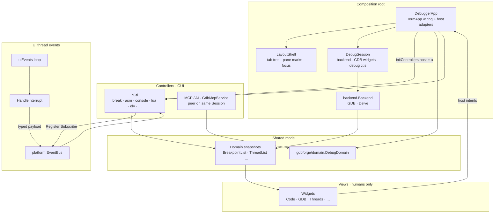

| Layer | Owns | Lives in |
|-------|------|----------|
| **Composition root** | Wire TermApp, hosts, modes, stop orchestration | `DebuggerApp` (`app.go`, `facade.go`, `controllers.go`) |
| **LayoutShell** | Pane marks, Code/GDB placement, layout apply, focus/jump-back | `cmd/gdbforge/workspace*.go`, `layout_host.go` (embedded on app) |
| **DebugSession** | Backend, debug state, GDB/DLV widgets, debug `*Ctl` group | `debug_session.go` (embedded on app) |
| **Backend** | GDB vs Delve policy; owns concrete client | `internal/gdbforge/backend` |
| **Model** | Session + domain snapshots (on `*Ctl`, not app fields) | `breakCtl.list`, `debugInfoCtl`, `asmCtl`, `internal/gdbforge/models` |
| **Domain surface** | Peer ops for AI / future Lua | `internal/gdbforge/domain` · `cmd/gdbforge/debug_domain.go` |
| **Controller** | Intents → mutate model → paint / `Send`; `Register` on EventBus | GUI: `*Ctl` · MCP: `internal/mcp` |
| **View** | Paint + host intents / callbacks | `internal/gdbforge/widgets`, `internal/termui` |

```text
View (widget)  --Host / OnSubmit-->  DebuggerApp (forwards)
*Ctl           --Send / Query-->     Model (Session via Backend, BreakpointList, …)
*Ctl           --SetItems / Paint--> View
MCP / AI       --Send / Query-->     same Model  (no widget ownership)
```

GUI and MCP/AI share the same models (e.g. `breaks.list` → `BreakpointList`); widgets never own `Backend` / `Session`, `ptyx.TTY`, or domain merge logic. MCP does not paint — views exist for the human TUI only.

### Controllers and host interfaces

Controllers (`*Ctl`) own domain logic and models. They must **not** hold `*DebuggerApp` directly — each talks to the composition root through a **narrow host interface** wired in `initControllers()`:

```go
a.breaks.host = a   // DebuggerApp implements breakHost
a.lua.host = a      // DebuggerApp implements luaHost
// …
```

**Qt analogy:** `Register` + `EventBus.Subscribe` ≈ **connect(signal, slot)**. A typed message (e.g. `GdbOutputMsg`) is the signal; the controller handler is the slot. Host interfaces ≈ the minimal **parent API** a child object is allowed to call.

```text
breakCtl  ──uses──▶  breakHost  ◀──implements──  DebuggerApp
luaCtl    ──uses──▶  luaHost    ◀──implements──  DebuggerApp
dlvCtl    ──uses──▶  dlvHost    ◀──implements──  DebuggerApp
LayoutShell ──uses──▶ layoutHost ◀──implements──  DebuggerApp
```

| Controller | Host interface | Typical host surface |
|------------|----------------|----------------------|
| `breakCtl` | `breakHost` | `Backend()`, `BPWidget()`, `RequestFrame()`, `PublishBreakpointsChanged()` |
| `consoleCtl` | `consoleHost` | `GDBWidget()`, stop pipeline hooks, `SendGdbExec` peers |
| `debugInfoCtl` | `debugInfoHost` | `GdbMcp()`, `showFrameSource`, `ApplyDebugInfoUI` |
| `bufferCtl` | `bufferHost` | `Shell()` (layout), `placeCodeInSlot`, buffer widgets |
| `asmCtl` | `asmHost` | `Shell()`, assembly widget, `Workspace` tab ops |
| `inferiorIOCtl` | `inferiorHost` | `OutputWidget()`, inferior PTY routing |
| `searchCtl` | `searchHost` | `CmdWidget()`, `ActiveCodeWidget()`, `State()` |
| `luaCtl` | `luaHost` | UI + debug + serial surface for scripts (~40 methods) |
| `dlvCtl` | `dlvHost` | Code refresh, frame sync, debug-info peers |
| `completionCtl` | `completionHost` | Wildmenu, `PublishCompletion` |
| `cmdCtl` | `cmdHost` | Cmdline submit routing |

Compile-time checks in `controllers.go` (`var _ breakHost = (*DebuggerApp)(nil)`) catch drift when the app stops implementing a host.

**List widgets** (threads, breakpoints, call stack) still take `*DebuggerApp` as a **widget host** (`BreakpointHost`, `ThreadHost`, …) for activation intents — separate from controller hosts, same idea: narrow surface, app forwards into `*Ctl`.

Consoles use `WireCLI` / `WireInferior` / `WireExec` on `CompositeTerminal`. Lua REPL still uses `ConsolePane` + `InputLine`.

| Controller | Domain | Notes |
|------------|--------|-------|
| `breakCtl` | Breakpoints, gutter paint (`BreakGutter`) | Code Space + BP list e/d |
| `asmCtl` | Assembly list/widget, `preferAsm` / `autoAsm` | `:b asm`, missing-source swap |
| `bufferCtl` | Per-path `CodeWidget` map | `:b` / `:edit` |
| `debugInfoCtl` | Threads / call stack | Stop refresh |
| `consoleCtl` | MI bridge on PTY #2; CLI `WireCLI` lifecycle | Submit / parse / gdb-exit |
| `inferiorIOCtl` | Inferior or serial console → IO pane | `WireInferior` policy |
| `completionCtl` / `searchCtl` / `luaCtl` / `dlvCtl` / `cmdCtl` | Completion, `/` search, Lua, Delve sync, cmdline | All use host interfaces |

### Composition layers (`LayoutShell` · `DebugSession`)

`DebuggerApp` embeds two structural layers so the app struct stays wiring, not domain:

```text
DebuggerApp
├── *TermApp              UI loop (PollEvent, draw)
├── LayoutShell (embed)   tab tree, pane marks, focus, :layout apply
├── DebugSession (embed)  backend, gdbWidget, debug *Ctl group
└── cross-cutting         lua, search, serial, exec, keybindings, modes
```

| Layer | Owns | Does **not** own |
|-------|------|------------------|
| **LayoutShell** | `TabWidget`, leaf marks (`code`/`gdb`/`asm`/`last`), `placeCodeInSlot`, `swapFocusedWidget`, `ApplyLayout` | Breakpoints, GDB MI, session lifecycle |
| **DebugSession** | `backend`, `debug` state, `gdbWidget`, `gdbMcp`, `breaks`/`asm`/`bufs`/`debugInfo`/`console`/`inferiorIO`/`dlv` | Tab geometry, focus marks, cmdline |
| **DebuggerApp** | `initControllers`, host adapter methods, global keys, stop orchestration glue | Per-domain merge logic (lives on `*Ctl`) |

`LayoutShell` uses `layoutHost` (not `*DebuggerApp`) for pane policy — same decoupling pattern as controller hosts.

See `cmd/gdbforge/facade.go` for the in-code summary.

### UI event path (why refactoring was possible)

Background work (GDB PTY, Lua jobs, exec) must not call widgets directly. Everything wakes the UI thread, then controllers react:

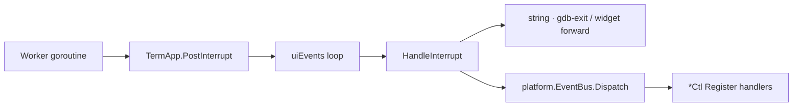

1. **`PostInterrupt(payload)`** — thread-safe enqueue (replaces the old `events chan` + `HandleCoreEvents` switch).
2. **`HandleInterrupt`** — thin app shell: string session exits + `Bus.Dispatch(data)`.
3. **`Register` on each `*Ctl`** — typed handler per message (`GdbOutputMsg`, `codeRefreshMsg`, `SubmitMsg`, …).

This separation is what made steps 1–6 safe: controllers could move behind host interfaces without fighting a monolithic interrupt switch. The bus handles **events**; host interfaces handle **dependencies**.

Legacy note: older docs refer to `HandleCoreEvents` and `TermApp.events` — removed in favor of `PostInterrupt` + `EventBus`.

### Orthogonal input mini-machines

Global job-control keys are **not** Mode policy. Three orthogonal mini-machines compose at `withGlobalKeys`:

| Machine | Owns | Lives in |
|---------|------|----------|
| **Mode** | Keymaps, Esc, `:` / `/`, ModeLua | `platform.Mode` + mode handlers |
| **Activity** | Ctrl-C / Ctrl-Z from inferior + Lua job busy | `cmd/gdbforge/activity.go` |
| **Confirm** | Ctrl-D quit / y-n gates; confirming interrupt | `cmd/gdbforge/confirm_router.go` + QuitGate / ConfirmGate |

See [INPUT.md](INPUT.md) § Dispatch.

### What `DebugDomain` means (naming)

In architecture, **domain** is the debugger problem space (breakpoints, threads, stack) and its data in `internal/gdbforge/models`.

The Go type `DebugDomain` is **not** “the whole domain” and **not** “many ways to set a breakpoint.” It is a **port / facade**: a small menu of domain *operations* so peer controllers (AI today, Lua later) can call the app without importing `DebuggerApp`.

| Piece | Role |
|-------|------|
| `models/` (`BreakpointList`, …) | Domain **data** (shared truth) |
| `domain.DebugDomain` interface | Domain **operations** exposed to peers |
| `cmd/gdbforge/debug_domain.go` | **One** real implementation (same BP path as GUI Space) |
| GUI widgets | May call app helpers directly; they do not need the interface |
| AI / future Lua | Call through `DebugDomain` only |

There is still **one** way to place a breakpoint (`ToggleInsertClear` → `Send`). The interface only adds doors into that path (and allows a fake domain in tests).

C++ analogy: an abstract class / pure virtual API. Architecture labels that fit: **port**, **use-case API**, **facade**. The name `DebugDomain` means “operations belonging to the debugger domain,” not “interface = domain” in every codebase.

---

## Table of contents

- [MVC (current)](#mvc-current)
- [What `DebugDomain` means (naming)](#what-debugdomain-means-naming)
- [Controllers and host interfaces](#controllers-and-host-interfaces)
- [Composition layers (LayoutShell · DebugSession)](#composition-layers-layoutshell--debugsession)
- [UI event path (why refactoring was possible)](#ui-event-path-why-refactoring-was-possible)
- [Orthogonal input mini-machines](#orthogonal-input-mini-machines)
- [System context](#system-context)
- [Application framework](#application-framework)
- [Startup](#startup)
- [Services](#services)
- [Application data flow](#application-data-flow)
- [Application models](#application-models)
- [Widget philosophy](#widget-philosophy)
- [Generic widgets](#generic-widgets)
- [Buffer concept](#buffer-concept)
- [Why not :attach](#why-not-attach)
- [Design philosophy](#design-philosophy)
- [Platform layer](#platform-layer)
- [TermUI layer](#termui-layer)
- [High-level architecture](#high-level-architecture)
- [Main subsystems](#main-subsystems)
- [Data flow](#data-flow)
- [Design principles](#design-principles)
- [Layer responsibilities](#layer-responsibilities)
- [Core events layer](#core-events-layer)
- [Current vs target architecture](#current-vs-target-architecture)

---

## System context

gdbforge runs as a terminal application. It owns the UI event loop, renders into an off-screen grid, and communicates with debugger backends through `backend.Backend` (`-g gdb|dlv`). GDB (MI2) and Delve share the same UI controllers via that policy surface.

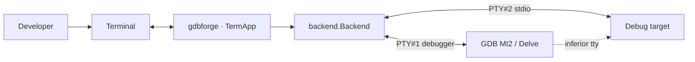

GDB and the inferior use **separate** PTYs: MI on PTY #1, program stdin/stdout on PTY #2 (IO console). Master/slave map, Delve `--tty` vs TCP headless, and external terminals: **[PTY_ARCHITECTURE.md](PTY_ARCHITECTURE.md)**. Protocol details: [DEBUGGER_INTEGRATION.md](DEBUGGER_INTEGRATION.md#inferior-io-dual-pty). Unified controller/backend layering: [DEBUGGER_INTEGRATION.md](DEBUGGER_INTEGRATION.md#unified-backend-api).

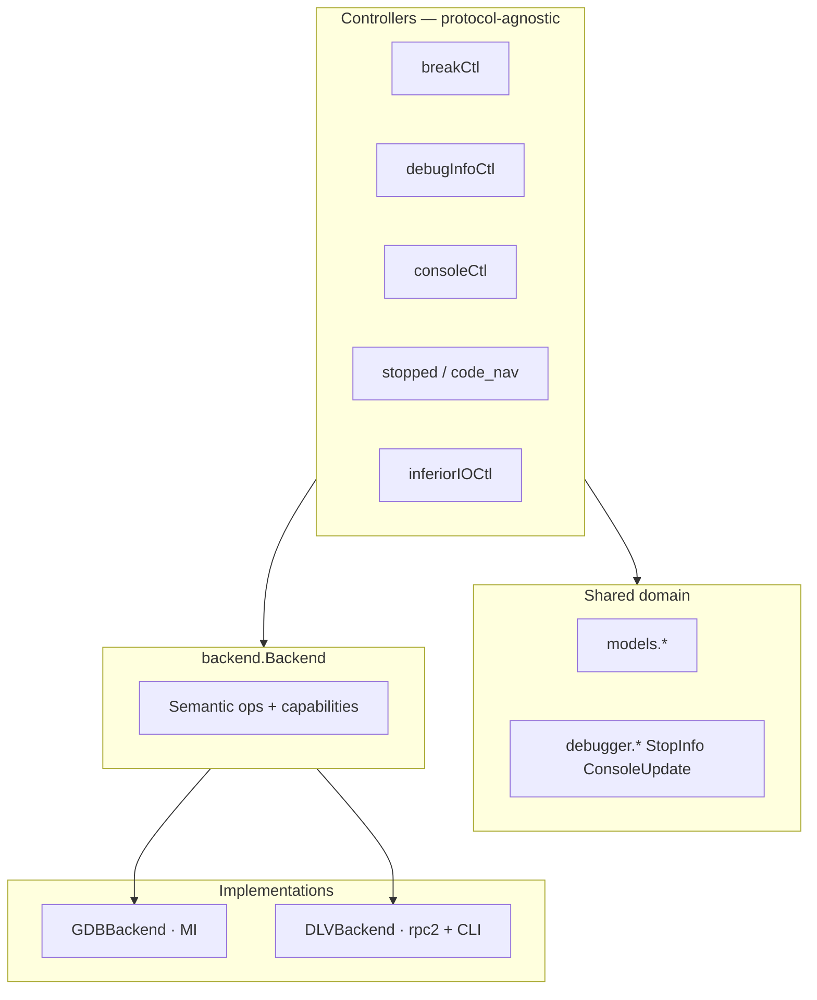

(Full diagram: [`docs/diagrams/unified_backend.mermaid`](diagrams/unified_backend.mermaid).)

---

## Application framework

The central idea is that Vim's interaction model maps cleanly onto a broader class of applications — not only text editors.

| Vim | This framework |
|-----|----------------|
| Single data model (text buffers) | **Multiple application-specific data models** |
| Buffers hold file content | Models hold domain state (breakpoints, orders, registers, …) |
| Windows display buffers | Widgets display models |
| `:buffer` opens a file | `:buffer` displays an application model |

Each application defines its own set of models during startup. Examples:

**GDB application**

- `CodeModel`, `BreakpointModel`, `ThreadModel`, `RegisterModel`, `MemoryModel`, `ConsoleModel`, `LoggerModel`

**Trader application** (hypothetical)

- `OrdersModel`, `PortfolioModel`, `WatchlistModel`, `ChartModel`, `LoggerModel`

**MSP application** (hypothetical)

- `MSPV2InfoModel`, `LoggerModel`, …

All models are created during application initialization. They live for the entire lifetime of the application, subscribe to application events, and continuously maintain their state.

The same `termui` framework (split tree, `:buffer`, `:split`, `:tab`) serves all applications; only the models and services differ.

---

## Startup

When an application starts, it creates:

| Component | Lifetime | Role |
|-----------|----------|------|
| **Services** | Application | Communicate with external systems; produce events |
| **Event bus** | Application | Distributes events to subscribers |
| **Models** | Application | Own state; subscribe to events; update continuously |
| **Logger** | Application | Structured logging infrastructure |
| **Runtime infrastructure** | Application | Event loop, window manager, command line |

**Widgets are not created at startup.** Models exist for the entire lifetime of the application and continuously receive updates from underlying services. The window manager creates widget instances only when the user asks to display a model.

---

## Services

Services communicate with the outside world. They publish events through the event bus and **never communicate directly with widgets** (target architecture).

| Service | Application |
|---------|-------------|
| `backend.Backend` | GDB vs Delve policy — **owned by `DebuggerApp`**; wraps `gdb.GDBClient` or `dlv.Client` |
| `core.Session` (`app.GDB()`) | Shared debugger session (name is historical; works for `-g dlv` too) |
| `execcli.ExecClient` | Vim-style `:!` shell / SSH PTYs — owned by `DebuggerApp` |
| `mcp.GdbMcpService` | In-app `:AI` / tool access to the live `Session` (`app.GDB()`) |
| `IBKRClient` | Trader (planned) |
| `MSPV2Client` | MSP monitoring (planned) |

Each application wires its own services during startup. Controllers update domain models and push snapshots to views; MCP is a peer controller on the same `Session`. Prefer `Backend` methods over new `isDLV()` branches.

---

## Application data flow

Application state flows in one direction:

```text
Service
    ↓
Event Bus
    ↓
Model
    ↓
Widget (View)
```

Widgets **never subscribe directly to external services**. Models own application state; widgets simply display models.

Examples:

```text
Backend / MCP     →  breakCtl.list (BreakpointList)  →  BreakpointWidget + Code/Asm gutters
Backend           →  consoleCtl                      →  GDBWidget (paint + OnSubmit)
Backend           →  debugInfoCtl (CallStack/Threads) → CallStackWidget / ThreadWidget
Backend           →  asmCtl (AssemblyList)           → AssemblyWidget (when supported)
GdbMcpService     →  same Session (WithWrite + Subscribe)
```

| Layer | Responsibility |
|-------|----------------|
| **Backend / Session** | Talk to external systems; GDB/Delve policy; `Send` / `Subscribe` / `WithWrite` |
| **Event bus** | Route events to controllers / model refresh |
| **Model** | Own application state on `*Ctl`; live for the app lifetime |
| **Controller** | `*Ctl` (+ app orchestration) — intents, refresh, sync views |
| **Widget** | Display a model / console chrome; host intents / callbacks only; no `Send` |

The sections below on terminal input, domain events, and GDB output describe how this flow is wired in the current Go implementation (`PostInterrupt`, `EventBus`, `ptyx`, etc.).


---

## Application models

Models are the source of truth for application state. They are created at startup and live until the application exits.

| Property | Behavior |
|----------|----------|
| **Creation** | Declared and initialized during application startup |
| **Updates** | Subscribe to the event bus; react to service events |
| **Lifetime** | Independent of any widget |
| **Sharing** | Multiple widgets may display the same model simultaneously |

```text
OrdersModel
      |
+-----+------+
|            |
OrdersWidget OrdersWidget
```

A widget's lifetime is independent from its model. Closing a pane destroys the widget, not the model. Opening `:buffer orders` again creates (or activates) a new widget bound to the existing `OrdersModel`.

### Generic model interfaces

Models are **application-specific** (`BreakpointModel`, `OrdersModel`, `MSPV2InfoModel`, …), but they expose **generic interfaces** understood by reusable widgets. Widgets never depend on application-specific model types.

```text
TextWidget   →  TextModel
GraphWidget  →  GraphModel
TableWidget  →  TableModel
TreeWidget   →  TreeModel
```

The application implements concrete models; the widget depends only on the small interface it needs.

---

## Widget philosophy

Widgets are **views**. A widget should contain little or no business logic. It receives a model (usually through an interface) and renders it.

| Widget | Role |
|--------|------|
| `LoggerWidget` | Scrollable log output |
| `GraphWidget` | Time series, histograms, scatter plots |
| `TableWidget` | Tabular data |
| `TreeWidget` | Hierarchical data |
| `TextWidget` | Line-oriented text |

Widgets should be **reusable across applications** whenever possible. The same `TableWidget` can display breakpoints in a debugger, orders in a trading app, or MSP telemetry in a monitoring app — as long as the bound model implements `TableModel`.

---

## Generic widgets

Widgets operate on **small interfaces** rather than concrete model implementations.

For example, `GraphWidget` depends on `GraphModel`. `GraphModel` represents graph data only — not how it should be drawn. Different applications may implement `GraphModel`:

| Application model | Implements |
|-------------------|------------|
| `StockChartModel` | `GraphModel` |
| `MSPV2InfoModel` | `GraphModel` |
| `CPULoadModel` | `GraphModel` |

The same `GraphWidget` displays all of them.

**Rendering style** (line graph, histogram, scatter, etc.) is a responsibility of the **widget**, not the model. The model provides data; the widget decides how to render it.

---

## Buffer concept

The meaning of `:buffer` differs from Vim:

| | Vim | This framework |
|---|-----|----------------|
| **Buffer** | Text file | Named application model |

`:buffer` does **not** open a file. It creates (or activates) a widget displaying the corresponding model. **The model already exists** — only the view is created on demand.

**GDB application examples:**

```text
:buffer code
:buffer breakpoints
:buffer threads
:buffer registers
:buffer memory
:buffer console
:buffer logger
```

**Trader application examples:**

```text
:buffer orders
:buffer portfolio
:buffer chart
```

**MSP application examples:**

```text
:buffer msp
:buffer logger
```

Models are created during application startup — not on demand when the user runs `:buffer`.

See [WINDOW_MANAGEMENT.md](WINDOW_MANAGEMENT.md#buffer-command) and [INPUT.md](INPUT.md#vim-like-command-system).

---

## Why not :attach

The architecture intentionally avoids a runtime attachment mechanism such as:

```text
:attach logger
:attach breakpoints
```

Such commands would expose the internal dependency graph between services, models, and widgets. The user should not be required to understand that wiring.

The relationship between services, models, and widgets is **defined during application startup**. Commands should express **user intent** (`:buffer logger`) rather than implementation details (`:attach logger`).

Instead, every application **declares its available models during initialization**. The user only chooses **which model to display** — via `:buffer`, `:split`, `:vsplit`, or `:tab`. All models already exist; the window manager binds widgets to them.

---

## Design philosophy

The framework **extends** Vim's interaction model rather than copying its implementation.

Vim has **one** data model: the text buffer. This framework supports **many application-defined data models**. Each application declares its available models at startup; the user interacts with them using familiar Vim commands.

**Vim:**

```text
File
    ↓
Text Buffer
    ↓
Window
```

**This framework:**

```text
Application
      ↓
Application Models
      ↓
Widgets (Views)
      ↓
Window Manager
```

Internally, `:buffer`, `:split`, `:vsplit`, and `:tab` create **views over existing models** instead of opening files. The user still works with familiar Vim concepts, but the underlying objects are no longer limited to text files — they can represent breakpoints, orders, telemetry, or any other domain state.

---

## Platform layer

The **Platform** package contains reusable infrastructure independent from any specific application.

| Component | Role |
|-----------|------|
| **Logger** | Structured logging |
| **EventBus** | Event distribution between services and models |
| **Buffer** | Reusable line-oriented data structure (no UI knowledge) |
| **Lua** | Scripting and plugin host |
| **SSH** | Remote access primitives |
| **Runtime utilities** | Shared helpers used across applications |

Platform components do not import terminal or widget packages. Today many of these live in or near `internal/core`; the target is a dedicated platform layer that applications and TermUI both depend on.

**Design decision:** `Buffer` belongs to Platform because it is a reusable data structure with no UI knowledge. Scroll position and cursor visibility are presentation concerns — see [TermUI layer](#termui-layer).

---

## TermUI layer

**TermUI** is responsible for presentation: turning model state into terminal output and routing local input.

| Component | Role |
|-----------|------|
| **Canvas** | Local-coordinate drawing context |
| **Grid** | Off-screen cell framebuffer |
| **Viewport** | Scroll window, cursor visibility, visible region over a model |
| **Widget** | View interface (`Draw`, `DrawStatusLine`, `HandleEvent`) |
| **WidgetTree** | Split-tree geometry + focus |
| **Window manager** | Tabs, splits, model-to-widget binding |

**Design decision:** `Viewport` belongs to TermUI because it manages scrolling, cursor visibility, and rendering. `Buffer` belongs to Platform because it holds data with no presentation logic.

Implementation today: `internal/termui` (Canvas, Grid, WidgetTree) plus scroll/view helpers still migrating from `internal/core`.

---

## High-level architecture

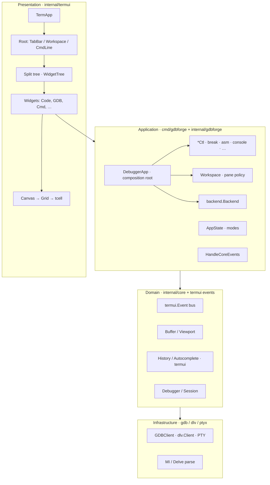

*Source: [`diagrams/module_boundaries.mermaid`](diagrams/module_boundaries.mermaid)*

---

## Main subsystems

| Subsystem | Package | Responsibility |
|-----------|---------|----------------|
| **Services** | App layer (`cmd/gdbforge`, `internal/gdb`, `internal/dlv`, …) | Communicate with external systems; produce events |
| **Event bus** | `termui.Event` channel | Distribute events to models and application dispatch |
| **Models** | `internal/gdbforge/models` on `*Ctl` | Own application state; controllers push `SetItems` / paint |
| **Workspace** | `cmd/gdbforge/workspace*.go` | Pane marks, placement, focus policy, layout apply above Tab |
| **Window manager** | `termui` (`WidgetTree`, `TabWidget`) | Generic layout / focus / splits (no debugger roles) |
| **Terminal application** | `termui.TermApp` | Event loop, screen init, widget registry, redraw orchestration |
| **Root layout** | `termui` (planned `RootLayout`) | Fixed TabBar, flexible Workspace band, fixed CmdLine |
| **Split tree** | `termui.WidgetTree`, `Node` | Recursive pane division inside Workspace |
| **Widget layer** | `termui.Widget` + `gdbforge/widgets` | Views; host intents / callbacks; no business logic |
| **Rendering** | `Canvas`, `Grid`, `Cell` | Local coordinates, border composition, terminal flush |
| **Domain events** | `termui.Event` bus | Decouple widgets from app logic; all events → `HandleCoreEvents` |
| **Text model (legacy)** | `core.Buffer`, `core.Viewport` | Scrollable line storage — used today by console/source widgets; target is explicit domain models per pane |
| **CmdLine helpers** | `termui.History`, `termui.AutoCompleter` | Command-line UX (no tcell in API surface) |
| **Key sequences** | `termui.Trie` | Prefix-tree matcher for multi-key bindings |
| **App modes** | `platform.AppState` | Interaction mode + PTY owner + layout policy (`equalalways`) |
| **Debugger backend** | `gdbforge/backend`, `ptyx`, `gdb` / `dlv`, `core.Session` | Policy surface + MI/Delve PTY + inferior stdio PTY |
| **AI / tools** | `mcp.GdbMcpService` | Same-process `:AI` on live Session |
| **Application shell** | `cmd/gdbforge` (`DebuggerApp` + `*Ctl`) | Composition root: UI, Backend, controllers, MCP; modes + `HandleCoreEvents` |

---

## Data flow

### Service → model → widget (application layer)

At the application level, state always flows downward:

```text
Service → Event Bus → Data Model → Widget
```

Widgets display models. Models subscribe to application events. Services never talk to widgets directly. The GDB and terminal sections below describe the current wiring toward this target.

### Input → action → redraw

gdbforge uses **two parallel event planes**:

| Plane | Type | Path |
|-------|------|------|
| **Terminal** | `tcell.Event` | `PollEvent` → `TermApp.HandleEvent` → `AppApi.HandleKey` / `HandleResize` |
| **Domain** | `termui.Event` | Any producer → `TermApp.events` channel → **`HandleCoreEvents`** |

Widgets handle terminal input locally (keys, cursor). When a widget needs the application to act — submit a `:` command, quit, forward to GDB — it **publishes** a `termui.Event` onto the bus. The main loop drains the channel and forwards every domain event to a single application hook: `AppApi.HandleCoreEvents`.

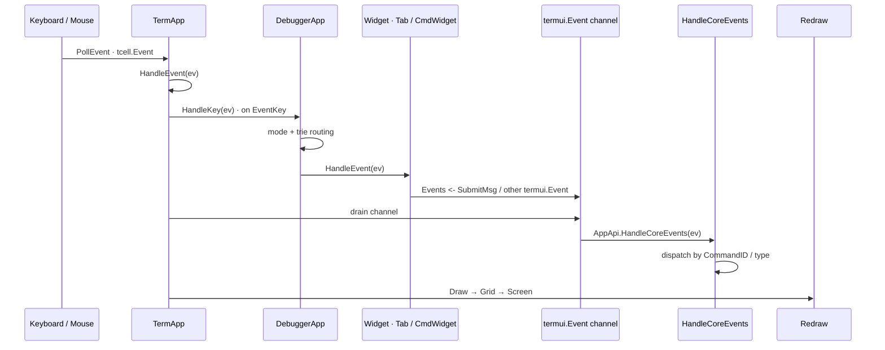

*Sources: [`diagrams/event_flow.mermaid`](diagrams/event_flow.mermaid) · [`diagrams/event_bus.mermaid`](diagrams/event_bus.mermaid)*

### Debugger output → UI

GDB **MI** output arrives on the MI PTY reader, is fan-out via `Subscribe`, posted as `EventInterrupt(GdbOutputMsg)`, and parsed by `consoleCtl` for app state. **CLI** output paints via `WireCLI` → `CompositeTerminal` (not the MI bridge).

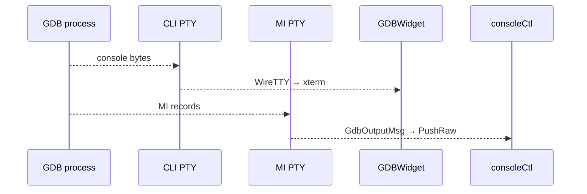

*Source: [`diagrams/debugger_integration.mermaid`](diagrams/debugger_integration.mermaid)*

Layering: `CompositeTerminal` + `WireTTY` (GDB/IO/exec panes) ← `*ptyx.TTY`. `ConsolePane` + `InputLine` remains for **Lua REPL** only. Controller owns MI `Session` on PTY #2.

### End-to-end data flow

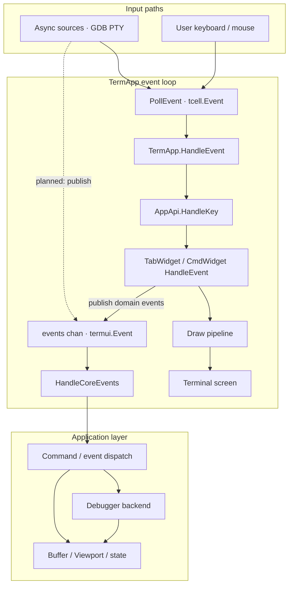

*Source: [`diagrams/data_flow.mermaid`](diagrams/data_flow.mermaid)*

**Design decision:** domain events do **not** fan out to widgets directly. Every `termui.Event` on the `TermApp` channel is handled in one place — `HandleCoreEvents` on the application object (`DebuggerApp` in `cmd/gdbforge/`). The app decides whether to exit, talk to GDB, change layout, or push state back into widgets on the next draw.

Typed app notifications use **`platform.EventBus`** (`Subscribe` / `Publish`) so producers and consumers wire without constructor injection:

| Message | Publisher | Subscriber |
|---------|-----------|------------|
| `CompletionMsg` | `CmdWidget` (Tab) | `CompletionBarWidget` |
| `BreakpointsChangedMsg` | `onBreakpointsChanged` (MI / MCP / `:e`) | `DebuggerApp.onBreakpointsChangedMsg` → coalesced `-break-list` |

Breakpoint sync details: [DEBUGGER_INTEGRATION.md](DEBUGGER_INTEGRATION.md#breakpoints-and-source-sync).

Terminal input routing (modes, trie, widget dispatch) is also centralized in **`DebuggerApp`**, keeping `TermApp` a generic event loop and draw orchestrator.

---

## Design principles

These principles are **non-negotiable** for gdbforge. They explain many seemingly verbose abstractions (Canvas, WidgetTree, Grid).

| # | Principle | Rationale |
|---|-----------|-----------|
| 1 | Widgets should not know screen coordinates | Enables layout changes without touching widget code |
| 2 | Widgets draw only inside their assigned `Rect` | Prevents bleed-over; simplifies testing |
| 3 | `Canvas` provides local drawing coordinates | Single translation point from local to screen space |
| 4 | Layout engine owns positioning | Centralizes split ratios, resize, and border gutters |
| 5 | Rendering backend should be replaceable | Grid → tcell today; could swap to alternate terminal libs |
| 6 | Business logic lives in models; widgets are views | Services update models via events; widgets never call services |
| 7 | Widgets depend on generic model interfaces | Same `GraphWidget` works across applications; models stay app-specific |
| 8 | TabBar, CmdLine, Workspace are top-level | Split tree stays scoped to Workspace only |
| 9 | Only Workspace contains the split tree | TabBar/CmdLine never participate in recursive splits |
| 10 | Debugger backends must not import UI | Keeps GDB/OpenOCD/JTAG testable without a terminal |
| 11 | Buffer is Platform; Viewport is TermUI | Data storage vs scroll/cursor/rendering concerns stay separated |

---

## Layer responsibilities

The [Platform layer](#platform-layer) and [TermUI layer](#termui-layer) sections above define the reusable infrastructure vs presentation split. The subsections below map those roles onto today's packages and wiring.

### Services

- Communicate with external systems (`backend.Backend` → GDB/Delve, `IBKRClient`, `MSPV2Client`, `SSHClient`, …).
- Publish events on the event bus; never import UI packages; never talk to widgets directly.
- Example: `internal/gdbforge/backend` wraps `gdb.GDBClient` / `dlv.Client` — PTY I/O, MI2 / Delve parse.

### Event bus

Two mechanisms, both UI-thread only for widget mutation:

| Mechanism | Use | API |
|-----------|-----|-----|
| **PostInterrupt** | Cross-thread wakeups (GDB PTY, Lua, exec) | `TermApp.PostInterrupt` → `HandleInterrupt` → `EventBus.Dispatch` |
| **EventBus** | Typed pub/sub between controllers | `platform.Subscribe`, `UIComponent.Register` |

Controllers subscribe in `registerUIComponents()`; the app shell no longer switches on every message type.

### Models

- Own application state for a domain concern (breakpoints, source, console output, …).
- Application-specific types (`BreakpointList`, `AssemblyList`, …) held by `*Ctl` controllers on **`DebugSession`**.
- Exist for the application lifetime; independent of widget lifetime.
- Controllers sync views via `SetItems` / paint APIs after `EventBus` handlers run.

### Widgets

- Display models; list panes use **widget host** interfaces (`BreakpointHost`, …); consoles use `SetOn*`.
- Never own business logic; never communicate directly with `Backend`.
- Rendering style is decided by the widget, not the model.

### Window manager

- Manages layout (split tree, tabs).
- **`termui.WidgetTree`**, **`TabWidget`** — generic geometry and focus.
- **`LayoutShell`** — gdbforge pane marks, sticky GDB, `:layout` apply (`workspace*.go`).

### Presentation (`internal/termui`)

- `tcell.Screen` lifecycle, Canvas, Grid, WidgetTree, poll/draw loop.
- Must **not** parse GDB MI — delegates to app/controllers + `internal/gdb`.

### Application (`cmd/gdbforge` + `internal/gdbforge`)

- Declares available models and services at startup.
- `DebuggerApp` embeds `termui.TermApp`, **`LayoutShell`**, and **`DebugSession`**, implements `AppApi` and all **host interfaces**:
  - **`HandleInterrupt`** — thin dispatch: string session exits + `EventBus.Dispatch`.
  - **`AppState`** — mode, PTY owner, layout policy.
  - **`keyBindings`** — multi-key chords.
  - **`LayoutShell`** — pane policy over `TabWidget`; **`layoutHost`** for decoupling.
  - **`DebugSession`** — `backend`, debug widgets, debug `*Ctl` group; `init`/`close` lifecycle.
  - **Cross-cutting** — `lua`, `search`, `serial`, `exec`, `cmdWidget`, completion bar.
  - **`gdbMcp`** — MCP peer on `app.GDB()`.
- Defines app-specific command tree (colon commands via `CommandParser`).

### Domain (`internal/core` + `termui` event types)

See [Platform layer](#platform-layer). Today `internal/core` holds platform primitives migrating toward a dedicated platform package:

- **`termui.Event` bus types** — `Event`, `CommandEvent`, `SubmitMsg` (`internal/termui/event.go`, `command.go`).
- **`core` PTY events** — `PtyOutputMsg` (`internal/core/events.go`); `GdbOutputMsg` in `internal/gdbforge/events`.
- **`CommandID`** — infra constant `CmdUnknown` in `termui`; app-specific command IDs live in `cmd/gdbforge`.
- `Buffer` — line-oriented storage (Platform; no UI knowledge).
- `History`, `AutoCompleter` for command-line UX (`termui`).
- `Debugger` / `Session` / `PTYWriter` — send API, exclusive write, shared Subscribe.

### Infrastructure (`internal/ptyx`, `internal/gdb`, `internal/mcp`)

- **`ptyx.TTY`** — unified PTY type: `Start` (process), `Open` (pair), `AttachPath` (external slave path). Exclusive `WithWrite`, `Subscribe` fan-out, `SetSize`, `Close`.
- **`gdb.GDBClient`** — **3 PTYs**: CLI (`CLITTY`), MI (`core.Session` embed), inferior; bootstrap via `new-ui mi2`.
- **`termui.CompositeTerminal` + `WireTTY`** — xterm bridge for GDB/IO/exec panes.
- **`mcp.GdbMcpService`** — `GdbCommand` + in-app LLM agent on MI `core.Session`.
- MI parsing: `MiMsg`, `GdbInputState` in `internal/gdb` (MI PTY stream only).

**Dependency rule:** `termui` → `core` ← `gdb` / `ptyx` / `mcp`. Never `gdb` → `termui`.

---

## Core events layer

The UI thread owns all widget mutation. Async producers post **`EventInterrupt`** payloads; the app dispatches typed data on **`platform.EventBus`** to controllers that registered via **`Register`**.

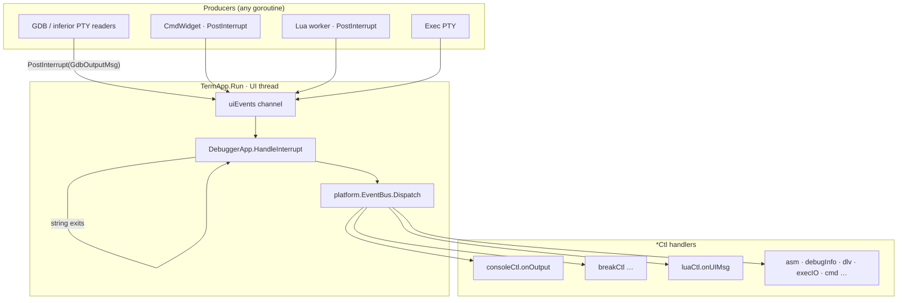

**Design decisions:**

- Domain reactions live on **controllers**, not in a giant `switch` on `DebuggerApp`.
- **`EventBus`** is for typed app notifications that can also be published synchronously (e.g. `BreakpointsChangedMsg`, `CompletionMsg`) — see [COMMAND_SYSTEM.md](COMMAND_SYSTEM.md#tab-completion-via-eventbus).
- **`PostInterrupt`** is for cross-thread wakeups into the tcell loop (GDB chunks, Lua UI jobs, exec output).

GDB output sequence (MI path only — CLI paints via `WireCLI`):

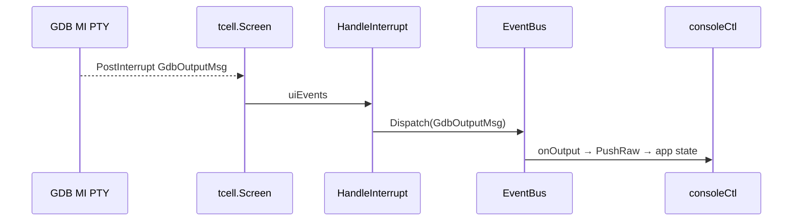

Mode and key-sequence routing happen in **`DebuggerApp.HandleKey`** before widgets see terminal keys — see [INPUT.md](INPUT.md#interaction-modes).

### Legacy: `HandleCoreEvents`

Older revisions routed all domain events through **`HandleCoreEvents`** on a `termui.Event` channel. That hub is **removed**. New code should use **`PostInterrupt`** (async → UI thread) and **`EventBus.Register` / `Subscribe`** (controller handlers).

### Interfaces and types

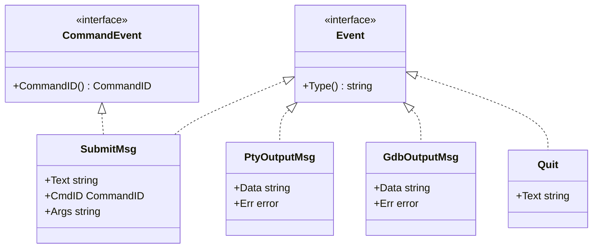

| Type | Purpose |
|------|---------|
| `Event` | Base domain event — identified by `Type() string` |
| `CommandEvent` | Events carrying a resolved `CommandID` (e.g. after `:` command entry) |
| `SubmitMsg` | CmdLine submitted — `Text`, `CmdID`, `Args` |
| `PtyOutputMsg` | Raw PTY chunk from `Session.Subscribe` (GDB MI, MCP) |
| `GdbOutputMsg` | MI PTY chunk routed to `consoleCtl` (`EventInterrupt` → parser) |

### Command IDs and colon commands

Colon commands use a **hierarchical command tree** (`internal/commands`). See [COMMAND_SYSTEM.md](COMMAND_SYSTEM.md) for ownership (`CommandNode` / `CommandRegistry` / `CommandParser`), the DSL, and tab completion.

| Layer | Owns |
|-------|------|
| **`commands.CommandNode`** | Tree nodes — `Name`, `Children`, `Action` |
| **`commands.CommandRegistry`** | `Root` tree + key-binding trie |
| **`commands.CommandParser`** | Runtime cursor — `current`, `token`, `path` |
| **`termui.CmdWidget`** | `:` input + parser for Tab sync; **`SetOnExecute`** → app runs `ExecuteParsed()` |

Legacy **`termui.CommandID`** / `SubmitMsg` remain for infra events (`CmdExitMode`, `CmdUnknown`). Tree leaf commands execute via app-owned `ExecuteParsed()` → `CommandNode.Action`.

### Wiring (current)

```go
// cmd/gdbforge/setup.go
a.commandReg = commands.NewCommandRegistry()
a.ExapData()  // cmd/gdbforge/command_tree.go

a.cmdWidget = termui.NewCmdWidget(a.commandReg)
a.cmdWidget.Ctx = a.ctx
a.completionBar = termui.NewCompletionBarWidget(a.ctx) // Subscribes to CompletionMsg
```

Implementation: `internal/commands/`, `internal/termui/cmd_widget.go`, `internal/platform/event_bus.go`, `cmd/gdbforge/`.

---

## Current vs target architecture

The debugger app follows **MVC** today (see [MVC (current)](#mvc-current)). Remaining gaps are mostly generic framework polish, not session-in-widget ownership.

| Component | Target | Current state |
|-----------|--------|---------------|
| Application models | Explicit model per domain; created at startup | **Done** — on `*Ctl` (BP / threads / call stack / assembly / buffers); `AppState` for files/location |
| Generic model interfaces | Widgets bind via `TextModel`, `GraphModel`, `TableModel`, … | Not yet — widgets use concrete DTOs / host ifaces |
| Model → widget binding | `:buffer` activates widget for existing model | **Partial** — builtins + `:b` / `:e`; models on controllers |
| Backend → controller → model → view | Debugger events update models; widgets paint snapshots | **Done** — `backend.Backend` + `*Ctl`; views are hosts / `Set*` |
| Composition root | Thin app + embedded layers | **Done** — `LayoutShell` + `DebugSession` + host adapters |
| Platform layer | `Buffer`, EventBus, Logger in platform package | Partial — `platform.EventBus` + `PostInterrupt` in use |
| Viewport ownership | Viewport in TermUI; Buffer in Platform | Partial — both migrating |
| Root layout | Tab + CompletionBar + CmdLine | Flat `AddWidget` list; `HandleResize` assigns rects |
| TabBar | Multi-tab with header render | `TabWidget` — single tab, no header |
| LayoutShell | Split tree + pane policy | **Done** — embedded; was `Workspace` |
| CmdLine | Global `:` command input | `CmdWidget`; **Execute via app** (`SetOnExecute`) |
| Event bus | PostInterrupt → EventBus → *Ctl | **Done** — `HandleCoreEvents` removed |
| Key chords | Configurable multi-key sequences | `Trie` on `DebuggerApp`; `Ctrl+W` focus chords |
| Interaction modes | Mode + Activity + Confirm mini-machines | **Done** — Mode via `AppState`; Activity `activity.go`; Confirm `confirm_router.go` |
| Rendering | Diff-based grid flush | **Partial** — `BackCells` diff in `Grid.Draw` |
| Focus | Mode-aware routing | `WidgetTree.focus` + trie focus movement |
| Split commands | `:vs`, `:split` | **Partial** — colon tree + `LayoutShell` |
| Debugger | App-owned `Session` via Backend; MCP peer; view-only consoles | **Working** — GDB + Delve (`-g`); [DEBUGGER_INTEGRATION.md](DEBUGGER_INTEGRATION.md) |

Entry point: `cmd/gdbforge/` (`main.go` + `app.go`, `setup.go`, …).

Detailed tracker: [ROADMAP.md](ROADMAP.md).

---

## Related documentation

| Topic | Document |
|-------|----------|
| Widgets, canvas, grid | [UI_ARCHITECTURE.md](UI_ARCHITECTURE.md) |
| Splits, tabs, command line | [WINDOW_MANAGEMENT.md](WINDOW_MANAGEMENT.md) |
| Cells, borders, Unicode | [RENDERING.md](RENDERING.md) |
| Keyboard, modes | [INPUT.md](INPUT.md) |
| Command tree, DSL, parser | [COMMAND_SYSTEM.md](COMMAND_SYSTEM.md) |
| PTY master/slave, IO, external tty | [PTY_ARCHITECTURE.md](PTY_ARCHITECTURE.md) |
| GDB MI2 / Delve details | [DEBUGGER_INTEGRATION.md](DEBUGGER_INTEGRATION.md) |
| Package map | [DIRECTORY_STRUCTURE.md](DIRECTORY_STRUCTURE.md) |
