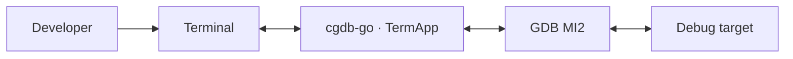
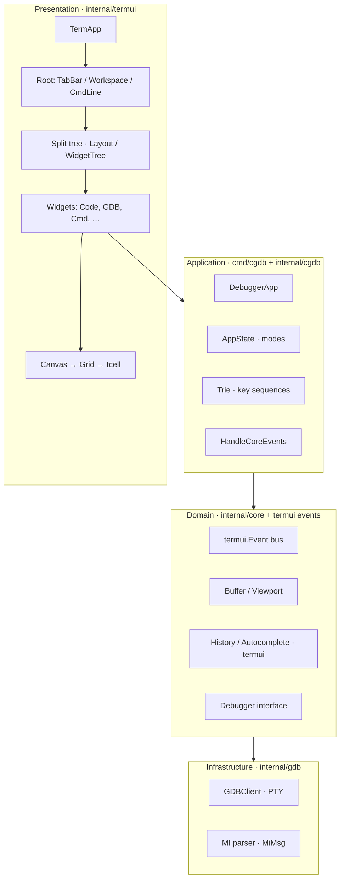
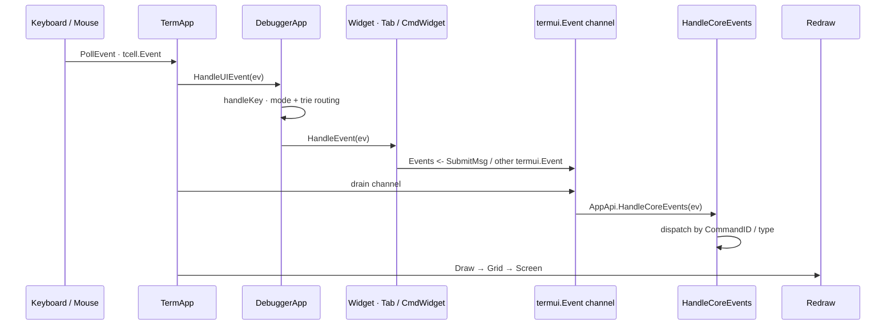
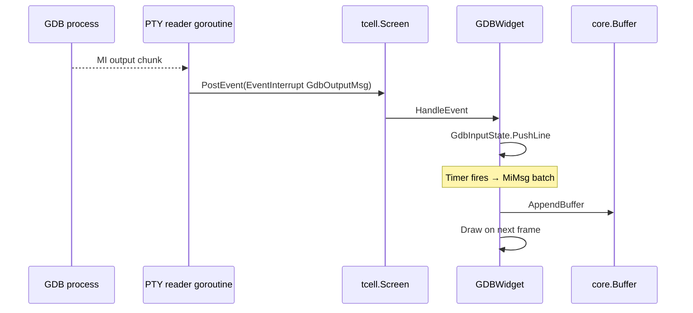
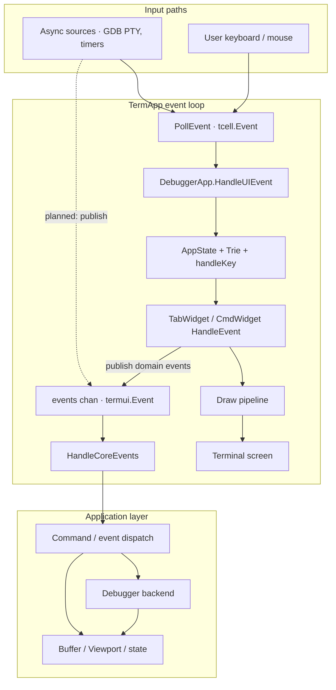
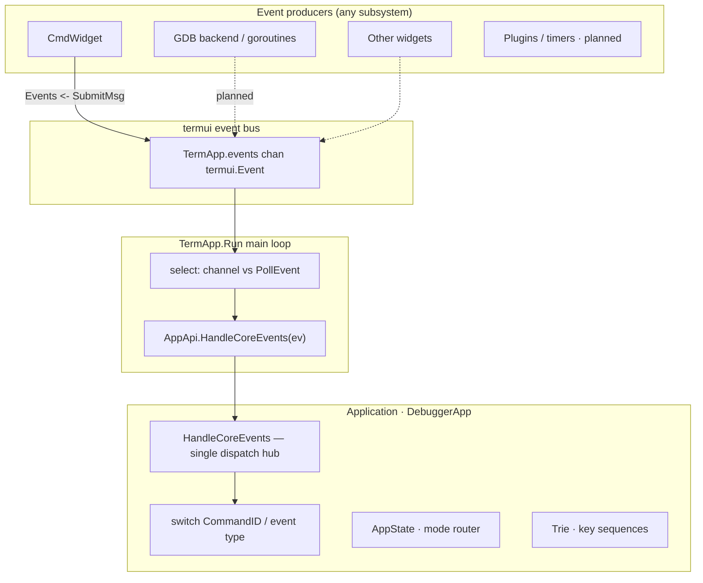
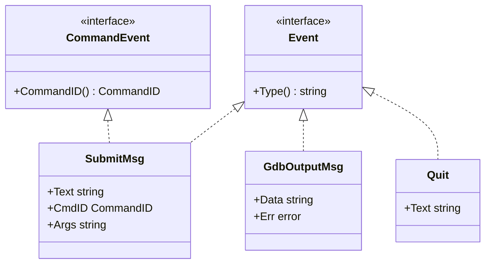

# Architecture Overview

This document describes the high-level architecture of **cgdb-go**: subsystems, boundaries, data flow, and the design principles that govern implementation decisions.

**Companion docs:** [UI_ARCHITECTURE.md](UI_ARCHITECTURE.md) · [DEBUGGER_INTEGRATION.md](DEBUGGER_INTEGRATION.md) · [DIRECTORY_STRUCTURE.md](DIRECTORY_STRUCTURE.md)

---

## Table of contents

- [System context](#system-context)
- [High-level architecture](#high-level-architecture)
- [Main subsystems](#main-subsystems)
- [Data flow](#data-flow)
- [Design principles](#design-principles)
- [Layer responsibilities](#layer-responsibilities)
- [Core events layer](#core-events-layer)
- [Current vs target architecture](#current-vs-target-architecture)

---

## System context

cgdb-go runs as a terminal application. It owns the UI event loop, renders into an off-screen grid, and communicates with debugger backends through abstract interfaces. The first backend is **GDB over MI2** via a pseudo-terminal.



---

## High-level architecture



*Source: [`diagrams/module_boundaries.mermaid`](diagrams/module_boundaries.mermaid)*

---

## Main subsystems

| Subsystem | Package | Responsibility |
|-----------|---------|----------------|
| **Terminal application** | `termui.TermApp` | Event loop, screen init, widget registry, redraw orchestration |
| **Root layout** | `termui` (planned `RootLayout`) | Fixed TabBar, flexible Workspace, fixed CmdLine |
| **Split tree** | `termui.Layout`, `WidgetTree`, `Node` | Recursive pane division inside Workspace |
| **Widget layer** | `termui.Widget` implementations | Per-pane UI and input handling |
| **Rendering** | `Canvas`, `Grid`, `Cell` | Local coordinates, border composition, terminal flush |
| **Domain events** | `termui.Event` bus | Decouple widgets from app logic; all events → `HandleCoreEvents` |
| **Text model** | `core.Buffer`, `core.Viewport` | Scrollable line storage for console/source views |
| **CmdLine helpers** | `termui.History`, `termui.AutoCompleter` | Command-line UX (no tcell in API surface) |
| **Key sequences** | `termui.Trie` | Prefix-tree matcher for multi-key bindings |
| **App modes** | `cgdb.AppState` | Normal / Command / Search / Insert mode state |
| **Debugger backend** | `gdb.GDBClient`, `core.Debugger` | PTY I/O, MI2 parsing |
| **Application shell** | `cmd/cgdb` (`DebuggerApp`) | Composes UI, widgets, GDB; owns modes, trie, `HandleCoreEvents` |

---

## Data flow

### Input → action → redraw

cgdb-go uses **two parallel event planes**:

| Plane | Type | Path |
|-------|------|------|
| **Terminal** | `tcell.Event` | `PollEvent` → `DebuggerApp.HandleUIEvent` → mode router / trie / widgets |
| **Domain** | `termui.Event` | Any producer → `TermApp.events` channel → **`HandleCoreEvents`** |

Widgets handle terminal input locally (keys, cursor). When a widget needs the application to act — submit a `:` command, quit, forward to GDB — it **publishes** a `termui.Event` onto the bus. The main loop drains the channel and forwards every domain event to a single application hook: `AppApi.HandleCoreEvents`.



*Sources: [`diagrams/event_flow.mermaid`](diagrams/event_flow.mermaid) · [`diagrams/event_bus.mermaid`](diagrams/event_bus.mermaid)*

### Debugger output → UI

GDB output arrives asynchronously on a goroutine, is posted back into the tcell event loop via `EventInterrupt`, and is parsed into display buffers.



*Source: [`diagrams/debugger_integration.mermaid`](diagrams/debugger_integration.mermaid)*

### End-to-end data flow



*Source: [`diagrams/data_flow.mermaid`](diagrams/data_flow.mermaid)*

**Design decision:** domain events do **not** fan out to widgets directly. Every `termui.Event` on the bus is handled in one place — `HandleCoreEvents` on the application object (`DebuggerApp` in `cmd/cgdb/main.go`). The app decides whether to exit, talk to GDB, change layout, or push state back into widgets on the next draw.

Terminal input routing (modes, trie, widget dispatch) is also centralized in **`DebuggerApp`**, keeping `TermApp` a generic event loop and draw orchestrator.

---

## Design principles

These principles are **non-negotiable** for cgdb-go. They explain many seemingly verbose abstractions (Canvas, WidgetTree, Grid).

| # | Principle | Rationale |
|---|-----------|-----------|
| 1 | Widgets should not know screen coordinates | Enables layout changes without touching widget code |
| 2 | Widgets draw only inside their assigned `Rect` | Prevents bleed-over; simplifies testing |
| 3 | `Canvas` provides local drawing coordinates | Single translation point from local to screen space |
| 4 | Layout engine owns positioning | Centralizes split ratios, resize, and border gutters |
| 5 | Rendering backend should be replaceable | Grid → tcell today; could swap to alternate terminal libs |
| 6 | Business logic separated from rendering | `core` has no tcell imports |
| 7 | TabBar, CmdLine, Workspace are top-level | Split tree stays scoped to Workspace only |
| 8 | Only Workspace contains the split tree | TabBar/CmdLine never participate in recursive splits |
| 9 | Debugger backends must not import UI | Keeps GDB/OpenOCD/JTAG testable without a terminal |

---

## Layer responsibilities

### Presentation (`internal/termui`)

- Owns `tcell.Screen` lifecycle.
- Registers top-level widgets (today: flat list; target: structured Root).
- Runs the poll/draw loop.
- Must **not** parse GDB MI records directly — delegates to widgets that use `internal/gdb`.

### Application (`cmd/cgdb` + `internal/cgdb`)

- `DebuggerApp` embeds `termui.TermApp`, implements `AppApi`, and owns:
  - **`HandleCoreEvents`** — single dispatch hub for domain events.
  - **`AppState`** (`internal/cgdb/mode_manager.go`) — interaction mode (`ModeNormal`, `ModeCommand`, …).
  - **`Trie`** — multi-key binding table (`BindKeySeq`, `SearchPartial` in normal mode).
  - Direct references to **`TabWidget`** and **`CmdWidget`** for layout and command-line routing.
- Defines app-specific `CommandID` values (break, continue, quit, …).
- **`ModeNormal` / `ModeCommand`** are wired; focus and search modes are reserved.

### Domain (`internal/core` + `termui` event types)

- **`termui.Event` bus types** — `Event`, `CommandEvent`, `SubmitMsg` (`internal/termui/event.go`, `command.go`).
- **`core` debugger events** — `GdbOutputMsg`, etc. (`internal/core/events.go`) — for backend → UI paths.
- **`CommandID`** — infra constant `CmdUnknown` in `termui`; app-specific command IDs live in `cmd/cgdb`.
- `Buffer`, `Viewport` for text panes.
- `History`, `AutoCompleter` for command-line UX (`termui`).
- `Debugger` interface — minimal send API.

### Infrastructure (`internal/gdb`)

- Spawns GDB with `--interpreter=mi2`.
- Reads PTY output, publishes `core.GdbOutputMsg`.
- Parses MI lines into `MiMsg`, `GdbInputState`.

**Dependency rule:** `termui` → `core` ← `gdb`. Never `gdb` → `termui`.

---

## Core events layer

The **event bus** decouples UI widgets from application logic. Any subsystem may publish a `termui.Event`; the main loop delivers every event to **`HandleCoreEvents`** on the application object. Widgets stay thin — they parse local input and emit domain events; the app owns side effects.



*Source: [`diagrams/event_bus.mermaid`](diagrams/event_bus.mermaid)*

Mode and key-sequence routing happen in **`DebuggerApp.HandleUIEvent`** / `handleKey` before widgets see terminal events — see [INPUT.md](INPUT.md#interaction-modes).

### Interfaces and types



| Type | Purpose |
|------|---------|
| `Event` | Base domain event — identified by `Type() string` |
| `CommandEvent` | Events carrying a resolved `CommandID` (e.g. after `:` command entry) |
| `SubmitMsg` | CmdLine submitted — `Text`, `CmdID`, `Args` |
| `GdbOutputMsg` | Raw GDB output for UI consumption |

### Command IDs

| Layer | Owns |
|-------|------|
| **`termui`** | `CommandID` type, **`CmdUnknown`** (value `0`), `SubmitMsg`, event bus channel |
| **Application** (`cmd/cgdb`) | Private constants: `cmdBreak`, `cmdQuit`, … starting at `iota + 1` |

`CmdWidget` never references app command names. It resolves user input through `termui.AutoCompleter` and emits `SubmitMsg{CmdID: …}`. Unknown commands emit `termui.CmdUnknown`.

### Wiring

```go
// termui/term_app.go
type AppApi interface {
    HandleUIEvent(ev tcell.Event)       // terminal-level hooks · resize, mode routing
    HandleCoreEvents(ev Event)          // all domain events land here
}

// cmd/cgdb/main.go
type DebuggerApp struct {
    *termui.TermApp
    trie      termui.Trie
    appState  cgdb.AppState
    tab       *termui.TabWidget
    cmdWidget *termui.CmdWidget
}

a.cmdWidget.Events = a.Events()

func (app *DebuggerApp) HandleCoreEvents(ev termui.Event) {
    switch msg.CommandID() {
    case termui.CmdUnknown: /* feedback */
    case cmdQuit:         /* close pane or exit */
    }
}
```

Implementation: `internal/termui/event.go`, `internal/termui/command.go`, `internal/cgdb/mode_manager.go`, `internal/termui/trie.go`, `internal/termui/term_app.go`, `internal/termui/cmd_widget.go`.

---

## Current vs target architecture

The **target** architecture is documented across this tree. The **current** codebase is mid-migration.

| Component | Target | Current state |
|-----------|--------|---------------|
| Root layout | TabBar + Workspace + CmdLine | Flat widget list; `handleResize` assigns tab + cmd line rects |
| TabBar | Multi-tab with header render | `TabWidget` — single tab, no header |
| Workspace | Split tree only | `Layout` / `WidgetTree` implemented |
| CmdLine | Global `:` command input | `CmdWidget` on bottom row (`H-1`); mode routing in `DebuggerApp` |
| Event bus | `termui.Event` → `HandleCoreEvents` | Channel on `TermApp`; `CmdWidget` wired |
| Key bindings | Configurable multi-key sequences | `Trie` on `DebuggerApp`; `Ctrl+W` focus chords |
| Interaction modes | Normal / Focus / Command | **Normal + Command wired** via `cgdb.AppState` |
| Rendering | Diff-based grid flush | Full grid draw every frame |
| Focus | Mode-aware routing | `WidgetTree.focus` + trie focus movement |
| Debugger | Abstract backend + GDB | GDB PTY prototype in `GDBWidget` |

Entry point: `cmd/cgdb/main.go`.

Detailed tracker: [ROADMAP.md](ROADMAP.md).

---

## Related documentation

| Topic | Document |
|-------|----------|
| Widgets, canvas, grid | [UI_ARCHITECTURE.md](UI_ARCHITECTURE.md) |
| Splits, tabs, command line | [WINDOW_MANAGEMENT.md](WINDOW_MANAGEMENT.md) |
| Cells, borders, Unicode | [RENDERING.md](RENDERING.md) |
| Keyboard, modes | [INPUT.md](INPUT.md) |
| GDB MI2 | [DEBUGGER_INTEGRATION.md](DEBUGGER_INTEGRATION.md) |
| Package map | [DIRECTORY_STRUCTURE.md](DIRECTORY_STRUCTURE.md) |
