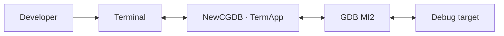
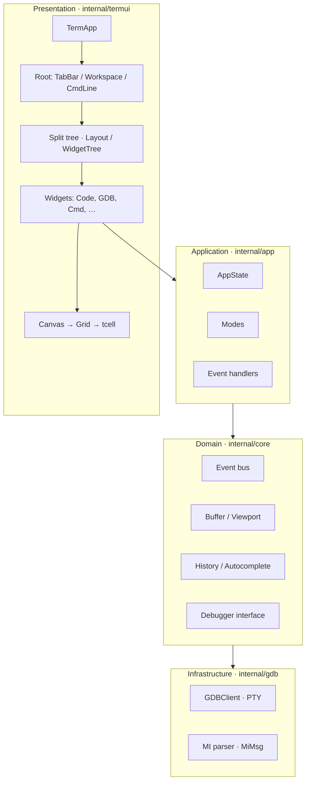
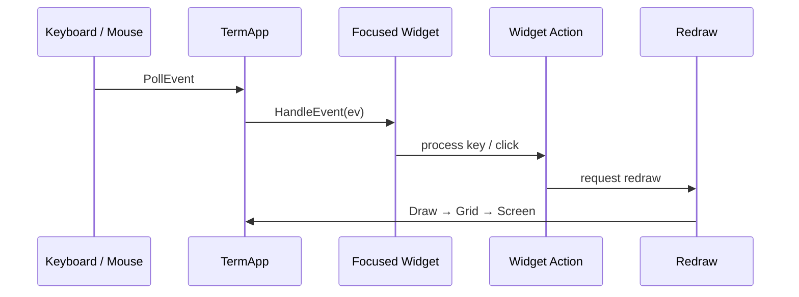
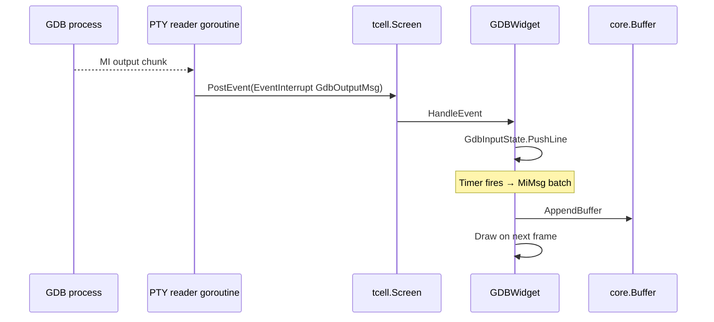
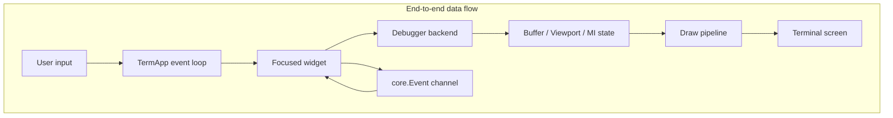
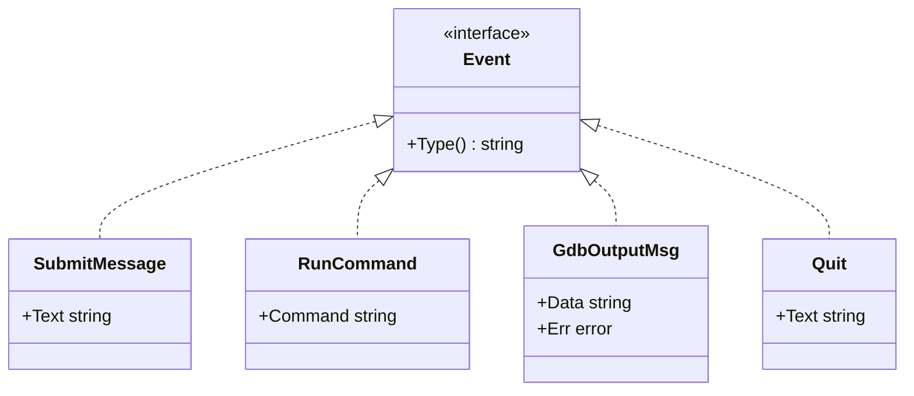

# Architecture Overview

This document describes the high-level architecture of **NewCGDB**: subsystems, boundaries, data flow, and the design principles that govern implementation decisions.

**Companion docs:** [UI_ARCHITECTURE.md](UI_ARCHITECTURE.md) · [DEBUGGER_INTEGRATION.md](DEBUGGER_INTEGRATION.md) · [DIRECTORY_STRUCTURE.md](DIRECTORY_STRUCTURE.md)

---

## Table of contents

- [System context](#system-context)
- [High-level architecture](#high-level-architecture)
- [Main subsystems](#main-subsystems)
- [Data flow](#data-flow)
- [Design principles](#design-principles)
- [Layer responsibilities](#layer-responsibilities)
- [Core events layer](#core-events-layer)
- [Current vs target architecture](#current-vs-target-architecture)

---

## System context

NewCGDB runs as a terminal application. It owns the UI event loop, renders into an off-screen grid, and communicates with debugger backends through abstract interfaces. The first backend is **GDB over MI2** via a pseudo-terminal.

---

## High-level architecture

*Source: [`diagrams/module_boundaries.mermaid`](diagrams/module_boundaries.mermaid)*

---

## Main subsystems

| Subsystem | Package | Responsibility |
|-----------|---------|----------------|
| **Terminal application** | `termui.TermApp` | Event loop, screen init, widget registry, redraw orchestration |
| **Root layout** | `termui` (planned `RootLayout`) | Fixed TabBar, flexible Workspace, fixed CmdLine |
| **Split tree** | `termui.Layout`, `WidgetTree`, `Node` | Recursive pane division inside Workspace |
| **Widget layer** | `termui.Widget` implementations | Per-pane UI and input handling |
| **Rendering** | `Canvas`, `Grid`, `Cell` | Local coordinates, border composition, terminal flush |
| **Domain events** | `core.Event` | Decouple UI from business actions |
| **Text model** | `core.Buffer`, `core.Viewport` | Scrollable line storage for console/source views |
| **Debugger backend** | `gdb.GDBClient`, `core.Debugger` | PTY I/O, MI2 parsing |
| **Legacy chat TUI** | `internal/ui/tui` | Separate Bubble Tea stack — not part of NewCGDB |

---

## Data flow

### Input → action → redraw

*Source: [`diagrams/event_flow.mermaid`](diagrams/event_flow.mermaid)*

### Debugger output → UI

GDB output arrives asynchronously on a goroutine, is posted back into the tcell event loop via `EventInterrupt`, and is parsed into display buffers.

*Source: [`diagrams/debugger_integration.mermaid`](diagrams/debugger_integration.mermaid)*

### End-to-end data flow

*Source: [`diagrams/data_flow.mermaid`](diagrams/data_flow.mermaid)*

---

## Design principles

These principles are **non-negotiable** for NewCGDB. They explain many seemingly verbose abstractions (Canvas, WidgetTree, Grid).

| # | Principle | Rationale |
|---|-----------|-----------|
| 1 | Widgets should not know screen coordinates | Enables layout changes without touching widget code |
| 2 | Widgets draw only inside their assigned `Rect` | Prevents bleed-over; simplifies testing |
| 3 | `Canvas` provides local drawing coordinates | Single translation point from local to screen space |
| 4 | Layout engine owns positioning | Centralizes split ratios, resize, and border gutters |
| 5 | Rendering backend should be replaceable | Grid → tcell today; could swap to alternate terminal libs |
| 6 | Business logic separated from rendering | `core` has no tcell imports |
| 7 | TabBar, CmdLine, Workspace are top-level | Split tree stays scoped to Workspace only |
| 8 | Only Workspace contains the split tree | TabBar/CmdLine never participate in recursive splits |
| 9 | Debugger backends must not import UI | Keeps GDB/OpenOCD/JTAG testable without a terminal |

---

## Layer responsibilities

### Presentation (`internal/termui`)

- Owns `tcell.Screen` lifecycle.
- Registers top-level widgets (today: flat list; target: structured Root).
- Runs the poll/draw loop.
- Must **not** parse GDB MI records directly — delegates to widgets that use `internal/gdb`.

### Application (`internal/app`)

- Connects UI events to domain actions (used heavily by the legacy chat TUI).
- Defines interaction modes (`NormalMode`, `InsertMode`, `CommandMode`).
- NewCGDB will expand this layer as Root layout and command routing mature.

### Domain (`internal/core`)

- `Event` types for cross-layer messaging.
- `Buffer`, `Viewport` for text panes.
- `History`, `AutoCompleter` for command-line UX.
- `Debugger` interface — minimal send API.

### Infrastructure (`internal/gdb`)

- Spawns GDB with `--interpreter=mi2`.
- Reads PTY output, publishes `core.GdbOutputMsg`.
- Parses MI lines into `MiMsg`, `GdbInputState`.

**Dependency rule:** `termui` → `core` ← `gdb`. Never `gdb` → `termui`.

---

## Core events layer

The event system decouples UI actions from business logic. It originated in the PromptCore chat application and is reused for debugger events.

| Event | Purpose |
|-------|---------|
| `SubmitMessage` | User submitted text (chat legacy) |
| `RunCommand` | Vim-style `:` command |
| `GdbOutputMsg` | Raw GDB output for UI consumption |
| `Quit` | Application exit request |

Implementation: `internal/core/events.go`. `TermApp` holds an event channel (`Emit`) for future async integration.

---

## Current vs target architecture

The **target** architecture is documented across this tree. The **current** codebase is mid-migration.

| Component | Target | Current state |
|-----------|--------|---------------|
| Root layout | TabBar + Workspace + CmdLine | Widgets registered flat on `TermApp` |
| TabBar | Multi-tab with header render | `TabWidget` — single tab, no header |
| Workspace | Split tree only | `Layout` / `WidgetTree` implemented |
| CmdLine | Global `:` command input | `CmdWidget` — history keys, no draw |
| Rendering | Diff-based grid flush | Full grid draw every frame |
| Focus | Mode-aware routing | `WidgetTree.focus` — partial |
| Debugger | Abstract backend + GDB | GDB PTY prototype in `GDBWidget` |

Entry point: `cmd/uitcell/main.go`.

Detailed tracker: [ROADMAP.md](ROADMAP.md).

---

## Related documentation

| Topic | Document |
|-------|----------|
| Widgets, canvas, grid | [UI_ARCHITECTURE.md](UI_ARCHITECTURE.md) |
| Splits, tabs, command line | [WINDOW_MANAGEMENT.md](WINDOW_MANAGEMENT.md) |
| Cells, borders, Unicode | [RENDERING.md](RENDERING.md) |
| Keyboard, modes | [INPUT.md](INPUT.md) |
| GDB MI2 | [DEBUGGER_INTEGRATION.md](DEBUGGER_INTEGRATION.md) |
| Package map | [DIRECTORY_STRUCTURE.md](DIRECTORY_STRUCTURE.md) |
