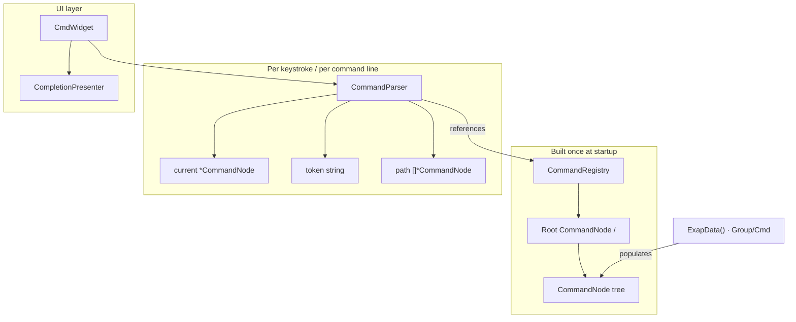
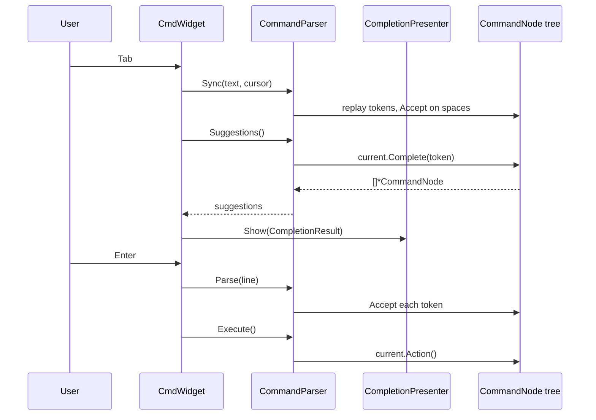

# Command System

cgdb-go routes user actions through a **hierarchical command tree**. Colon commands (`:window left`), tab completion, and key chords (`Ctrl+W h`) all resolve against the same `CommandNode` types, but through different entry points.

**Companion docs:** [INPUT.md](INPUT.md) · [ARCHITECTURE.md](ARCHITECTURE.md) · [DEVELOPER_GUIDE.md](DEVELOPER_GUIDE.md)

---

## Table of contents

- [Ownership model](#ownership-model)
- [CommandNode — the tree](#commandnode--the-tree)
- [CommandRegistry — owns the tree](#commandregistry--owns-the-tree)
- [CommandParser — navigates the tree](#commandparser--navigates-the-tree)
- [DSL — building the tree](#dsl--building-the-tree)
- [CmdWidget integration](#cmdwidget-integration)
- [Tab completion presenter](#tab-completion-presenter)
- [Key bindings](#key-bindings)
- [Adding commands](#adding-commands)

---

## Ownership model

Three types work together. Each has a distinct responsibility — do not conflate them.



| Type | Role | Owns / holds |
|------|------|----------------|
| **`CommandNode`** | One node in the hierarchy | `Name`, `Children` trie, optional `Action` |
| **`CommandRegistry`** | Application command catalog | `Root` node (the tree) + `Keys` trie for key chords |
| **`CommandParser`** | Runtime cursor over the tree | `current`, `token`, `path` — **does not own the tree** |

**Mental model:**

- **`CommandNode`** *is* the tree (data).
- **`CommandRegistry`** *owns* the tree (storage).
- **`CommandParser`** *navigates* the tree (state while the user types).

The tree is built once at startup (via the DSL or `Insert`). The parser resets and replays input on each Tab or Enter; it never mutates tree structure.

---

## CommandNode — the tree

Each node is either a **container** (has children, no action) or a **leaf** (has an `Action` callback).

```text
/  (root)
├── window
│   ├── left      → Action: OnFocusLeft
│   ├── right     → Action: OnFocusRight
│   ├── up        → Action: OnFocusUp
│   └── down      → Action: OnFocusDown
├── break
│   ├── file      → Action: BreakFile
│   └── delete    → Action: DeleteBreakpoint
└── info
    ├── registers → Action: ShowRegisters
    └── threads   → Action: ShowThreads
```

```go
type CommandNode struct {
    Parent   *CommandNode
    Children *collections.Trie[*CommandNode]
    Name     string
    Action   func(args ...any)
}
```

Children are stored in a **trie** (key-sequence trie reused for name lookup) so prefix completion is efficient: `Complete("win")` under root returns `[window]`.

| Node kind | `Action` | `Children` | Example |
|-----------|----------|------------|---------|
| Container | `nil` | non-empty | `window`, `break`, `info` |
| Leaf | set | may be empty | `left`, `delete`, `registers` |

---

## CommandRegistry — owns the tree

```go
type CommandRegistry struct {
    Root *CommandNode
    Keys *collections.Trie[*CommandNode]  // key chord → command node
}
```

- **`Root`** — entry point for colon-command parsing (`/`).
- **`Keys`** — separate trie for keyboard bindings (`<C-w>h` → move-right). Used by `KeyBindingRegistry`, not by `CommandParser`.

The application holds one `CommandRegistry` on `DebuggerApp` and passes it to `NewCmdWidget` and `InitKeyBindings`.

---

## CommandParser — navigates the tree

The parser holds a **pointer into** the registry tree plus parse state:

```go
type CommandParser struct {
    registry *CommandRegistry
    current  *CommandNode   // position in tree (parent context for current token)
    token    string         // partial word being typed
    path     []*CommandNode // accepted nodes so far
}
```

### Parser state by example

| User input (after `:`) | `current` | `token` | `path` |
|------------------------|-----------|---------|--------|
| *(empty)* | `/` (root) | `""` | `[]` |
| `win` | `/` | `"win"` | `[]` |
| `window ` | `window` | `""` | `[window]` |
| `window l` | `window` | `"l"` | `[window]` |
| `window left` (after Enter) | `left` | `""` | `[window, left]` |

### When `current` changes

`current` moves only inside **`Accept()`**:

```go
p.current = list[0]
p.path = append(p.path, p.current)
p.token = ""
```

| Trigger | Calls `Accept()`? |
|---------|-------------------|
| **Tab** | Indirectly — `Sync()` replays finished tokens (before spaces); `Suggestions()` does not move `current` |
| **Enter** | Yes — `Parse()` accepts every token |
| **Typing** | No — text lives in `CmdWidget`; parser catches up on next Tab via `Sync()` |

`current` is the **parent context** for the token under the cursor, not the highlighted suggestion. While typing `:window l`, `current` is `window` and suggestions are `[left, right, up, down]`.

### Key methods

| Method | Purpose |
|--------|---------|
| `Sync(line, cursor)` | Replay input up to cursor; rebuild `current`, `token`, `path` |
| `Suggestions()` | `current.Complete(token)` — tab completion candidates |
| `Accept()` | Move `current` to the single matching child |
| `Parse(line)` | Reset + accept all tokens (on Enter) |
| `CanExecute()` | `current.Action != nil` |
| `Execute()` | Call `current.Action` |

---

## DSL — building the tree

The DSL in `internal/commands/dsl.go` builds the tree declaratively instead of imperative `InsertName` calls.

| Function | Creates |
|----------|---------|
| `Cmd(name, action)` | Leaf node with `Action` (not yet in tree) |
| `Group(name, children...)` | Container node with children attached |
| `(n *CommandNode).Group(name, children...)` | Inserts a group into `n`, returns `n` for chaining |

### Example (`DebuggerApp.ExapData`)

```go
func (a *DebuggerApp) ExapData() {
    a.commandReg.Root.
        Group("window",
            commands.Cmd("left", a.OnFocusLeft),
            commands.Cmd("right", a.OnFocusRight),
            commands.Cmd("up", a.OnFocusUp),
            commands.Cmd("down", a.OnFocusDown),
        ).
        Group("break",
            commands.Cmd("file", a.BreakFile),
            commands.Cmd("delete", a.DeleteBreakpoint),
        ).
        Group("info",
            commands.Cmd("registers", a.ShowRegisters),
            commands.Cmd("threads", a.ShowThreads),
        )
}
```

Equivalent imperative form (older style, same result):

```go
window := root.InsertName("window")
window.InsertName("left").Action = a.OnFocusLeft
// ...
```

The DSL reads as a nested outline: groups and commands mirror the logical hierarchy (`window` → `left`) instead of spelling out each parent/child link.

### DSL rules

1. **`Cmd`** — always a leaf; must be placed inside a `Group` (or root `.Group()`).
2. **`Group`** — container; may nest other `Group` calls for deeper paths (e.g. `window` → `split` → `horizontal`).
3. **Chaining** — `.Group()` on `Root` returns `Root`, so sibling groups chain at the same level.
4. **No tree mutation at runtime** — the DSL runs once during `InitB`; the parser only reads the result.

---

## CmdWidget integration

`CmdWidget` (`internal/termui/cmd_widget.go`) owns a `CommandParser` created from the app's `CommandRegistry`.



Wiring in `cmd/cgdb/main.go`:

```go
a.cmdWidget = termui.NewCmdWidget(
    a.commandReg,
    termui.NewLogCompletionPresenter(a.ctx.Log.Named("CmdLine")),
)
```

On **Enter**, the widget calls `Parse` then `Execute` if `CanExecute()`. Leaf actions run directly on the `CommandNode` — no `CommandID` / `SubmitMsg` indirection for tree commands.

---

## Tab completion presenter

Tab completion display is decoupled from `CmdWidget` via the **`CompletionPresenter`** interface (`internal/termui/completion_presenter.go`):

```go
type CompletionResult struct {
    Input string
    Token string
    Names []string
}

type CompletionPresenter interface {
    Show(result CompletionResult)
}
```

| Implementation | File | Behavior |
|----------------|------|----------|
| `LogCompletionPresenter` | `log_completion_presenter.go` | Writes `completions: …` to `platform.Logger` (shown in `LoggerWidget`) |
| *(future)* `PopupCompletionPresenter` | — | Show candidates in a popup near the cmd line |

`CmdWidget` depends only on the interface. Swap or compose presenters without changing the widget.

---

## Key bindings

Key chords use the **same `CommandNode` type** but a **different registry**:

| Entry point | Registry | Lookup |
|-------------|----------|--------|
| Colon commands | `CommandRegistry.Root` | `CommandParser` walks name tokens |
| Key chords | `KeyBindingRegistry` trie | `SearchPartial(key)` per keypress |

```go
func (a *DebuggerApp) InitKeyBindings() {
    a.keyBindings = commands.NewKeyBindingRegistry()
    a.keyBindings.Bind(
        commands.NewCommand("move-left", func(args ...any) { a.OnFocusLeft() }),
        "<C-w>l", "<C-w><Left>",
    )
    // ...
}
```

A key binding can invoke the same handler as a colon command (`OnFocusLeft`) without sharing the parser — both are wired at init time in the application.

---

## Adding commands

### Colon command (tree)

1. Add a `Cmd` or nested `Group` in `ExapData()` (or call `Root.Group(…)` elsewhere at init).
2. Implement the handler method on `DebuggerApp` (e.g. `func (a *DebuggerApp) MyCmd(args ...any)`).
3. No `CommandID` or `HandleCoreEvents` wiring needed for tree leaves — `Execute()` calls `Action` directly.

### Key chord

1. Add `a.keyBindings.Bind(commands.NewCommand("name", handler), "keys...")` in `InitKeyBindings()`.

### Tab completion feedback

1. Implement `CompletionPresenter` (or reuse `LogCompletionPresenter`).
2. Pass to `NewCmdWidget(reg, presenter)`.

---

## Package layout

| Path | Responsibility |
|------|----------------|
| `internal/commands/command_node.go` | `CommandNode`, `CommandRegistry` |
| `internal/commands/command_parser.go` | `CommandParser` — navigation, completion, execution |
| `internal/commands/dsl.go` | `Cmd`, `Group` builders |
| `internal/commands/key_binding_gegistry.go` | `KeyBindingRegistry` |
| `internal/termui/cmd_widget.go` | `:` input, parser sync, tab/enter |
| `internal/termui/completion_presenter.go` | `CompletionPresenter` interface |
| `internal/termui/log_completion_presenter.go` | Log-backed presenter |

---

## Related documentation

- [INPUT.md](INPUT.md) — interaction modes, key routing
- [ARCHITECTURE.md](ARCHITECTURE.md) — event bus, application wiring
- [DEVELOPER_GUIDE.md](DEVELOPER_GUIDE.md) — onboarding, extension checklist
