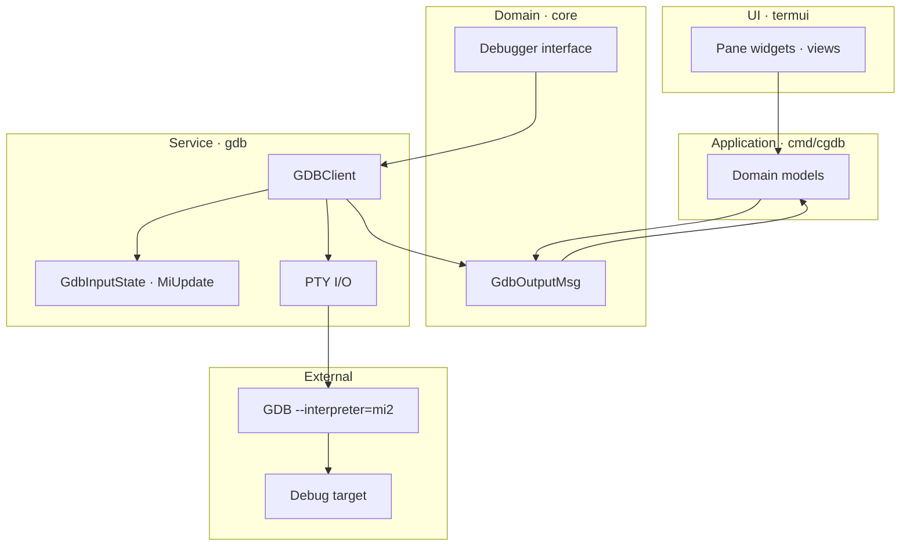
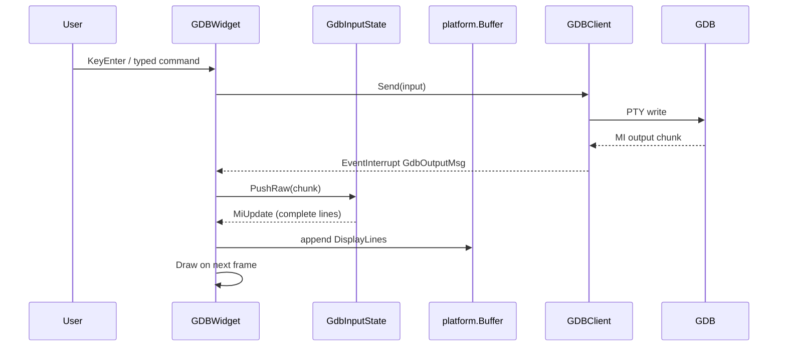
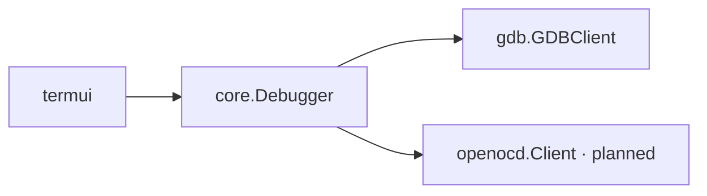

# Debugger Integration

cgdb-go connects to debug targets through **backend adapters** that implement `core.Debugger`. The first adapter is **GDB MI2 over a PTY**. Future adapters will cover **OpenOCD**, **JTAG**, and **kernel debugging** workflows.

**Companion docs:** [ARCHITECTURE.md](ARCHITECTURE.md) · [UI_ARCHITECTURE.md](UI_ARCHITECTURE.md) · [PLUGINS.md](PLUGINS.md)

---

## Table of contents

- [Integration overview](#integration-overview)
- [Debugger interface](#debugger-interface)
- [GDB integration](#gdb-integration)
- [MI2 parsing pipeline](#mi2-parsing-pipeline)
- [GDBWidget bridge](#gdbwidget-bridge)
- [Future OpenOCD integration](#future-openocd-integration)
- [Future JTAG integration](#future-jtag-integration)
- [Future kernel debugging](#future-kernel-debugging)
- [Design constraints](#design-constraints)

---

## Integration overview

Application data flows **Service → Event Bus → Model → Widget**. The debugger backend is a service; UI panes are widgets bound to models.



*Source: [`diagrams/debugger_integration.mermaid`](diagrams/debugger_integration.mermaid)*

**Dependency rule:** `internal/gdb` must not import `internal/termui`. Widgets display models; services implement `core.Debugger` and publish events. Widgets never call `GDBClient` directly.

---

## Debugger interface

```go
type Debugger interface {
    Send(cmd string) error
    SendRaw(raw string) error
}
```

Minimal by design — sends commands to the backend. Responses arrive asynchronously via channels/events, not as return values.

**Design rationale:** MI2 and GDB CLI are streaming protocols. Blocking `Send` → response would deadlock when async `*stopped` records arrive mid-command. The interface reflects fire-and-forget command submission.

Future extensions (separate interfaces):

| Interface | Purpose |
|-----------|---------|
| `DebuggerSession` | Attach/detach, symbol loading |
| `BreakpointManager` | Add/remove/list breakpoints |
| `RegisterReader` | Read register sets |
| `MemoryReader` | Read/write memory |

These will emit `core.Event` updates rather than synchronous returns.

---

## GDB integration

### Client startup

`gdb.NewGDBClient()` (`gdb_client.go`):

1. Spawns `gdb --interpreter=mi2 <target>`.
2. Starts PTY via `creack/pty`.
3. Sets raw terminal mode on PTY (no echo, non-canonical).
4. Starts reader goroutine → `core.GdbOutputMsg` channel.
5. Sends initial newline to trigger prompt.

```go
cmd := exec.Command("gdb", "--interpreter=mi2", "hello")
ptmx, err := pty.Start(cmd)
```

**Current limitation:** target binary hardcoded as `"hello"`. Will move to session configuration.

### Send paths

| Method | Use |
|--------|-----|
| `Send(cmd)` | Append `\n`, send CLI/MI command |
| `SendRaw(raw)` | Send raw bytes (SIGINT, arrow keys) |

### Output path

Reader goroutine:

```go
for {
    n, err := c.ptmx.Read(buf)
    if n > 0 {
        output <- core.GdbOutputMsg{Data: string(data)}
    }
    // ...
}
```

Channel closes on EOF/error → `GDBWidget` receives `"gdb-exit"` interrupt.

---

## MI2 parsing pipeline

GDB MI2 emits several record types:

| Prefix | Type | Example |
|--------|------|---------|
| `^` | Result | `^done`, `^error`, `^running` |
| `~` | Console stream | `~"Hello\n"` |
| `@` | Target stream | `@"program output\n"` |
| `&` | Log stream | `&"warning\n"` |
| `*` | Exec async | `*stopped,reason="breakpoint-hit"` |
| `=` | Notify async | `=breakpoint-created,...` |
| `(gdb)` | Prompt | Ready for input |

### GdbInputState (streaming)

`PushRaw` is called on the **UI thread** for each `GdbOutputMsg` chunk:

1. Append bytes to `lineBuf`; split on `\n`.
2. For each complete line, classify the MI record and accumulate an `MiUpdate`.
3. Return immediately — no timer, no wait for a “full burst”.

| Record | Effect on `MiUpdate` |
|--------|----------------------|
| `~` / `@` | Decode stream payload → `DisplayLines` |
| `&` | Ignored for display (CLI echo; UI already echoes submits) |
| `^error` | Set `Error` state; surface `msg=` |
| `^done` / `^running` / … | Update `GdbState` |
| `*stopped` | Fill `Stopped` (`reason`, `thread-id`) |
| `(gdb)` | `PromptReady` |

Incomplete lines remain in `lineBuf` across chunks.

**Design rationale:** GDB often splits writes mid-line; newline buffering is required. Per-line dispatch is enough for correctness and feels faster than a 100ms debounce.

### MiMsg (batch helper)

`MiMsg` / `NewMiMsg` / `CreateBufferForLine` remain as a batch-oriented helper for offline or test parsing. The live GDB pane uses streaming `MiUpdate` from `GdbInputState`.

```go
type MiUpdate struct {
    DisplayLines []string
    PromptReady  bool
    State        GdbState
    ErrorMsg     string
    Stopped      *MiStopMsg
}
```

### MI string decoding

`DecodeMIString` handles GDB's C-style escapes including **octal UTF-8 sequences** (`\342\235\214`). `ExpandTabs` expands tab stops for aligned output.

Implementation: `mi.go`, `mi_msg.go`, `mi_state.go`.

---

## GDBWidget bridge

`GDBWidget` connects the GDB client to the UI:



Key components:

| Component | Role |
|-----------|------|
| `platform.Buffer` + `termui.Viewport` | Scrollable output (selection/clipboard shared) |
| `InputBuf` / `Cursor` | User command editing on a dedicated prompt row |
| `applyMiUpdate` / `handleStop` | Paint streams; react to `*stopped` (stub) |

### Console layout (walking prompt)

Terminal-style after `Ctrl+L` (clear / screen reset):

1. Empty scrollback → `(gdb)` + caret at **top-left**.
2. Each new output line → prompt moves **one row down**.
3. While free rows remain → leave blank space below; do **not** jump the prompt to the bottom.
4. When the pane is full → pin prompt to the last row and scroll the viewport (`followTail`).

While the user scrolls history (`followTail` off), the prompt stays on the bottom row.

Draw highlights:

- Lines starting with `>>>` — teal bold (future: stop reason).
- Echoed / prompt text with `(gdb)` — yellow.

---

## Future OpenOCD integration

[OpenOCD](https://openocd.org/) exposes a **Telnet command port** and **TCL scripting** for embedded targets.

Planned adapter: `internal/openocd` (not yet created).

| Aspect | Plan |
|--------|------|
| Transport | TCP telnet or pipe to `openocd` process |
| Protocol | TCL commands + event text (not MI2) |
| Interface | Same `core.Debugger` for send; adapter translates |
| UI impact | None — new backend package only |



**Design decision:** OpenOCD is a **separate backend**, not a GDB wrapper. Some workflows may use both (OpenOCD for flash/reset, GDB for symbols) — session orchestration belongs in `internal/core/session.go`.

---

## Future JTAG integration

JTAG debugging may arrive through:

1. **OpenOCD** as transport (preferred — reuse OpenOCD adapter).
2. Direct **JTAG library** (e.g., libftdi) for specialized hardware bring-up.

cgdb-go UI would expose:

- Chain scan / device selection pane.
- TAP state indicator.
- DR/IR scan views.

These are **feature panes** ([PLUGINS.md](PLUGINS.md)), not core UI changes.

---

## Future kernel debugging

Kernel debugging introduces unique requirements:

| Requirement | UI response |
|-------------|-------------|
| Multiple address spaces | Memory pane with context selector |
| Crash dumps / vmcore | Read-only source + backtrace panes |
| Remote targets | Backend connection manager (not UI) |
| Module / symbol load | Async events → source pane refresh |

Planned backend options:

- GDB remote (`target remote :1234`)
- `crash` utility integration for dump analysis
- Custom `/proc/kcore` readers

**Design constraint:** kernel workflows must not fork the UI. New panes and backends extend the existing widget and event model.

---

## Design constraints

| Constraint | Reason |
|------------|--------|
| Backends never import `termui` | Testability, headless automation |
| Async-only responses | MI2 / OpenOCD are streaming |
| Parse in backend layer | Widgets display buffers, not raw MI |
| Session config outside widgets | Target binary, ports, symbols in `core/session` |

---

## Related documentation

- [INPUT.md](INPUT.md) — GDB key forwarding
- [PLUGINS.md](PLUGINS.md) — custom debugger panes
- [ROADMAP.md](ROADMAP.md) — backend milestones
- [DIRECTORY_STRUCTURE.md](DIRECTORY_STRUCTURE.md) — package map
