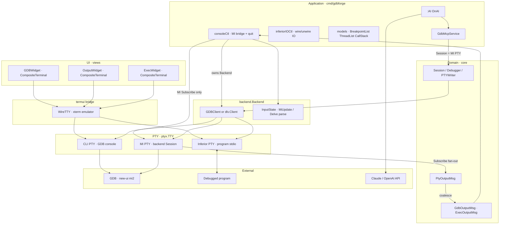
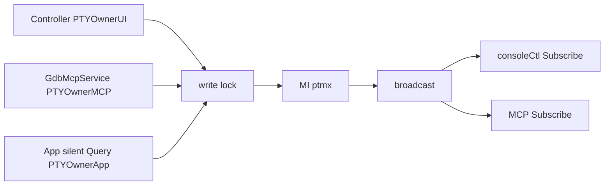
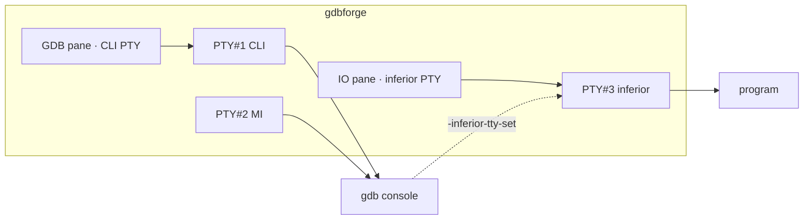
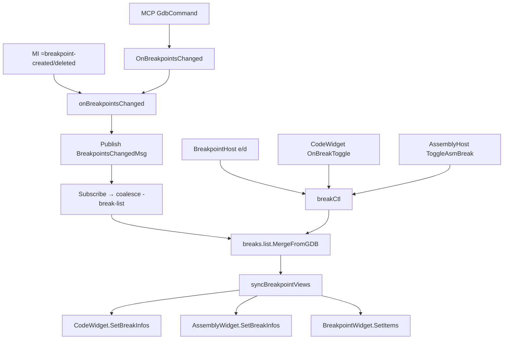
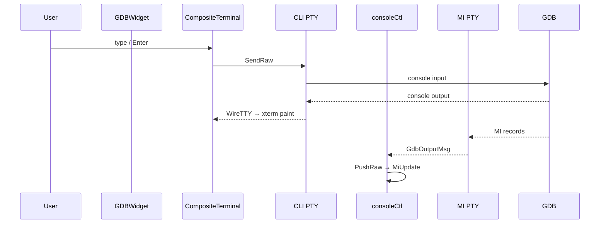
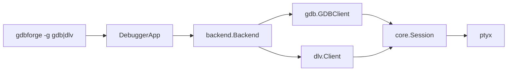
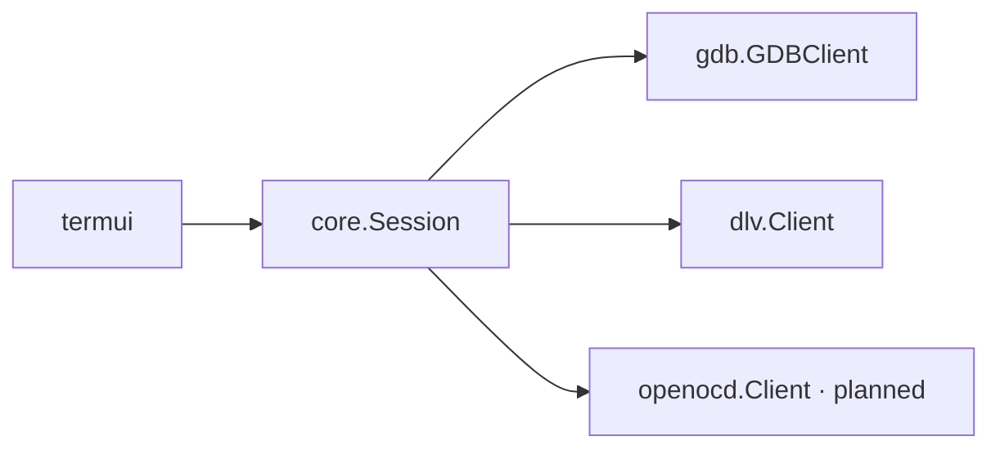

# Debugger Integration

gdbforge connects to debug targets through **`backend.Backend`** (`internal/gdbforge/backend`), which wraps adapters that implement `core.Session` (`Debugger` + lifetime + PTY mux). Supported today: **GDB** (`gdb.GDBClient`, **3 PTYs**: CLI + MI + inferior) and **Delve** (`dlv.Client`, **2 PTYs**: CLI + inferior) via `-g gdb|dlv`. The session is **owned by `DebuggerApp`** (through `Backend`) and shared by the console view, in-app `:AI`, and MCP. Program I/O is wired to the IO pane (`:b io`) via `CompositeTerminal` + `WireTTY`.

**Companion docs:** [PTY_ARCHITECTURE.md](PTY_ARCHITECTURE.md) (master/slave dual PTY, Delve TCP) · [ARCHITECTURE.md](ARCHITECTURE.md) · [UI_ARCHITECTURE.md](UI_ARCHITECTURE.md) · [EXEC_SHELL.md](EXEC_SHELL.md) · [PLUGINS.md](PLUGINS.md)

---

## Table of contents

- [Integration overview](#integration-overview)
- [Debugger interface](#debugger-interface)
- [PTY mux](#pty-mux)
- [Inferior I/O (dual PTY)](#inferior-io-dual-pty)
- [Breakpoints and source sync](#breakpoints-and-source-sync)
- [Breakpoint persistence](#breakpoint-persistence)
- [GDB integration](#gdb-integration)
- [GdbMcpService and in-app AI](#gdbmcpservice-and-in-app-ai)
- [MI2 parsing pipeline](#mi2-parsing-pipeline)
- [GDB console bridge (MVC)](#gdb-console-bridge-mvc)
- [Delve backend (peer of GDB)](#delve-backend-peer-of-gdb)
  - [Delve inferior I/O (dual PTY)](#delve-inferior-io-dual-pty)
- [Future OpenOCD integration](#future-openocd-integration)
- [Future JTAG integration](#future-jtag-integration)
- [Kernel debugging](#kernel-debugging)
- [Design constraints](#design-constraints)

---

## Integration overview

Application data flows **Service → Controller → Model → Widget** ([MVC](ARCHITECTURE.md#mvc-current)).



**Dependency rules:**

- `internal/gdb`, `internal/dlv`, and `internal/ptyx` must not import `internal/termui`
- `DebuggerApp` owns `backend.Backend` (concrete GDB or Delve client); views never hold `Session`
- External APIs use `app.GDB() core.Session` (works for `-g dlv` too)
- Prefer `Backend` methods over new `isDLV()` branches
- Never `Close()` the session from MCP/AI — the app owns lifetime
---
## Debugger interface

```go
type Debugger interface {
    Send(cmd string) error
    SendRaw(raw string) error
}

type PTYWriter interface {
    Send(cmd string) error
    SendRaw(raw string) error
}

// Session: lifetime + exclusive write + shared read.
type Session interface {
    Debugger
    Close()
    Subscribe() (ch <-chan PtyOutputMsg, cancel func())
    WithWrite(ctx context.Context, fn func(w PTYWriter) error) error
}
```

Minimal by design — sends commands to the backend. Responses arrive asynchronously via `Subscribe` / UI events, not as return values from `Send`.

**Design rationale:** MI2 and GDB CLI are streaming protocols. Blocking `Send` → response would deadlock when async `*stopped` records arrive mid-command. `GdbMcpService.GdbCommand` adds a **windowed capture** on a private subscription for tool results (best-effort until tokenized MI waiters).

**Ownership:** `DebuggerApp` creates and owns `backend.Backend` in `initBuiltins` (`backend.NewGDB` / `NewDLV` → `Close`). `gdbMcp` is a peer constructed from `app.GDB()`. Views (`GDBWidget`, `OutputWidget`, …) receive paint APIs and host intents / `SetOn*` only. Domain models live on controllers (`breakCtl.list`, …).

Future extensions (separate interfaces):

| Interface | Purpose |
|-----------|---------|
| `BreakpointManager` | Add/remove/list breakpoints |
| `RegisterReader` | Read register sets |
| `MemoryReader` | Read/write memory |

These will emit `core.Event` updates rather than synchronous returns.

---

## PTY mux

gdbforge uses **one unified type** — `*ptyx.TTY` (`Start` / `Open` / `AttachPath`) — for all PTY roles.

### GDB (3 PTYs)

| PTY | Created | Role | UI |
|-----|---------|------|-----|
| **#1 CLI** | `ptyx.Start(gdb …)` — **no** `--interpreter=mi2` | Native GDB console (readline) | `:b gdb` via `WireCLI` → `CompositeTerminal` |
| **#2 MI** | `ptyx.Open()` + `new-ui mi2 /dev/pts/N` | Backend `core.Session`; MI parser | No widget — `consoleCtl` bridge only |
| **#3 Inferior** | `ptyx.Open()` or `AttachPath` | Program stdin/stdout | `:b io` via `WireInferior` → `CompositeTerminal` |

### Delve (2 PTYs)

| PTY | Role | UI |
|-----|------|-----|
| **#1 CLI** | `dlv exec` / `dlv connect` — parser on same stream | `:b gdb` via `WireCLI` |
| **#2 Inferior** | `dlv exec --tty` | `:b io` via `WireInferior` |

### Write / read rules (MI PTY and Delve CLI PTY)

| Direction | Rule |
|-----------|------|
| **Write** | **Exclusive** — `WithWrite` / `Send` / `SendRaw` share one mutex; only one of UI / MCP / App holds it at a time |
| **Read** | **Shared** — every `Subscribe()` channel receives the same chunks |

Writers (`PTYOwner` on `AppState`):

| Owner | Who | Console paint |
|-------|-----|---------------|
| `ui` | GDB / Exec / IO console (keys → PTY via `WireTTY`) | Yes (xterm emulator) |
| `mcp` | `:AI` / `GdbCommand` | MI stream only; optional mirror via `GdbTargetPrint` |
| `app` | Silent MI / App writes: `-break-list`, file list, breakpoint toggle/delete, stop-driven thread/stack Query | MI stream only |



GDB CLI and exec (`:!`) use separate `*ptyx.TTY` instances wired with `WireTTY`. The MI bridge coalesces `PtyOutputMsg` → `GdbOutputMsg` for the parser only — **not** for GDB pane paint (CLI bytes paint via `WireTTY` on PTY #1).

## Inferior I/O (dual / triple PTY)

> **Architecture overview (master/slave, Delve TCP, external terminal diagrams):** [PTY_ARCHITECTURE.md](PTY_ARCHITECTURE.md).

There is **no** GDB MI command that writes program stdin. gdbforge allocates a bare PTY (`ptyx.Open`), keeps the **master** in-process, and tells GDB to attach the inferior to the **slave**:

```text
gdbforge (GDB session)
 ├── PTY #1 CLI master  ←→  gdb console (user types here in :b gdb)
 ├── PTY #2 MI master   ←→  gdb MI backend (Send/Subscribe for app/MCP)
 └── PTY #3 master      ←→  program stdin/stdout   ← IO pane (:b io)
         │
         └── slave path → GDB: -inferior-tty-set /dev/pts/N (via MI PTY)
```

| Side | Who holds it | Purpose |
|------|----------------|---------|
| Master (PTY #3) | gdbforge (`*ptyx.TTY`) | Read program stdout; write program stdin via `WireTTY` |
| Slave (PTY #3) | inferior (via GDB) | Program’s terminal |

**Startup** (`gdb.NewGDBClientOpts`):

1. Start GDB in **console mode** on PTY #1 (`ptyx.Start`) — **no** `--interpreter=mi2`
2. Wait up to **90s** for the first `(gdb)` prompt on CLI PTY
3. `ptyx.Open()` → PTY #2 (MI); send `new-ui mi2 <slave path>` on CLI PTY
4. Wait for MI ready on PTY #2
5. `ptyx.Open()` or `AttachPath` → PTY #3 (inferior)
6. Send `-inferior-tty-set <slaveName>` on **MI PTY** only after MI is ready
7. Wire CLI PTY → `GDBWidget`; inferior PTY → `OutputWidget` via `WireTTY`

Pass GDB options after `--`: `gdbforge -- -nx -x script.gdb elf`. `gdb.HasInitScript` detects `-x`/`-ex` so the app skips default `break main` when an init script is present.

### External terminal stdio (TUI targets)

For TUI inferiors (htop, games, …) or programs that need a **real** terminal emulator, route stdio externally instead of the in-app IO pane.

**`:b io` vs `:set inferior-tty`**

| | `:b io` (internal) | `:set inferior-tty` (external) |
|--|--------------------|--------------------------------|
| Best for | Normal debug prints, interactive shells in-pane | Full-screen TUI/curses, dedicated emulator |
| Rendering | `CompositeTerminal` (xterm in tcell) | External emulator owns display |
| Who holds PTY master | gdbforge (`*ptyx.TTY`) → `WireTTY` | `GDBFORGE_TERMINAL` (kitty, xterm, …) |

**Advantages of `:set inferior-tty`:** smooth high-volume output, real VT features, program I/O does not compete with gdbforge’s debugger panes for redraw, live attach on GDB (`-inferior-tty-set` without restart).

| Mode | How | IO pane |
|------|-----|---------|
| **internal** (default) | Internal PTY + wire `:b io` | Program stdin/stdout |
| **external** | `:set inferior-tty` (opens terminal), `GDBFORGE_INFERIOR_TTY`, Lua `open_external_tty` / `set_inferior_tty` | Note only — no subscribe |

| | **GDB** | **Delve (`-g dlv`)** |
|--|---------|----------------------|
| Attach stdio | `-inferior-tty-set` **live** (no restart) | `dlv exec --tty` only at **spawn**; `:set inferior-tty` **restarts** Delve |
| Switch back | `:set inferior-tty internal` | same (restart with internal PTY) |
| Best for TUI | `:set inferior-tty` / `:lua terminal_debug` / `gdbserver_tui` | `:lua dlv_ext_port [port] [args…]` (alias `dlv_port`) — headless dlv in another window + `dlv_connect`; stdio never leaves that window |
| Terminal picker | `GDBFORGE_TERMINAL` (kitty, xterm, mate-terminal, gnome-terminal, …) | same |

**Pattern B — local GDB/dlv, external pts**

1. Lua `gdbforge.open_external_tty()` opens kitty/xterm/… (`GDBFORGE_TERMINAL`) that runs `tty > file; sleep infinity`.
2. `gdbforge.set_inferior_tty(pts)` → GDB `-inferior-tty-set` (live). Delve restarts `dlv exec --tty …` with the new path (same program args).
3. Examples: [`lua/external_tty`](https://github.com/yairgd/gdbforge/tree/main/lua/external_tty), [`lua/terminal_debug`](https://github.com/yairgd/gdbforge/tree/main/lua/terminal_debug).

**Pattern A — gdbserver / headless dlv in the other window**

1. GDB: `gdbforge.spawn_terminal("gdbserver", ":2345", "./my_tui")` then `target remote`.
2. Delve: `:lua dlv_ext_port` / `dlv_port` (or `spawn_dlv_headless` + `dlv_connect`) — inferior inherits that terminal’s stdio.
3. Examples and **how to use each script**: [`lua/README.md`](https://github.com/yairgd/gdbforge/blob/main/lua/README.md); code: [`lua/gdbserver_tui`](https://github.com/yairgd/gdbforge/tree/main/lua/gdbserver_tui), [`lua/dlv_ext_port`](https://github.com/yairgd/gdbforge/tree/main/lua/dlv_ext_port).

Do not hold an internal PTY master and point `-inferior-tty-set` / `--tty` at an external slave at the same time. Closing the external window does not auto-rewire IO — use `:set inferior-tty internal`.

**IO console** (`OutputWidget`, pane name **IO**, `:b io`, alias `:b output`):

| Action | Path |
|--------|------|
| Program prints | `WireTTY` → `CompositeTerminal` (xterm paint) |
| User keys | `CompositeTerminal.HandleKey` → `WireTTYInput` → `tty.SendRaw` |
| Host lines (`[lua] …`) | `WriteHostLine` / `AppendHostLine` (inject-only, not a PTY) |
| Ctrl-C / Ctrl-D / Ctrl-Z | Raw bytes to **inferior** PTY via xterm key trie |
| Pane resize | `CompositeTerminal.Resize` → `tty.SetSize` |
| Serial kgdb console | `:terminal` wires `serialmux.TermTTY()` to IO pane (or `GDBFORGE_EXTERNAL_SERIAL=1` for minicom) |

Wiring policy lives in `cmd/gdbforge/io_console.go` (`inferiorIOCtl`); the widget holds `CompositeTerminal` only.

**Separation rules:**

- GDB console keys go only to the GDB PTY — they never become program stdin
- IO console keys go only to the inferior PTY — they are not GDB commands
- When a dedicated inferior TTY is active, **program stdout** stays on PTY #2. Raw non-MI text on the GDB PTY is still painted in the **GDB console** (GDB `make` / `shell` child output, load messages) — it is not redirected to the IO pane
- `+` MI status records (e.g. `+download` during `load`) are filtered from display; human-readable load lines remain



**Session model on AppState:** `SourceFiles` (refreshed from `-file-list-exec-source-files` on stop / `:edit`), `StopFile` / `StopLine` (**StopLocation** — real PC from `*stopped`, drives ━━▶), `CurrentFile` / `CurrentLine` (browse / frame selection — blue cursor), theme colors (`MarkColor`, `MarkDimColor`, `BreakColor`, `BreakDisabledColor`, `BreakCondColor`, `PCColor`, `StackBreakColor`, `CodeSelColor`, `MutedColor`; see `:set`), `EscToCode` (Esc focuses CodeWidget; `:set esctocode` / `:set noesctocode`; default **on**), `BreakMain` (insert `break main` on GDB session start; skipped when restoring `./.gdbforge/breakpoints.yaml` or when `HasInitScript`; `:set breakmain` / `:set nobreakmain`; default **on**), `GdbListenPrint` (paint App/MCP replies in GDB console; `:set gdblistenprint` / `:set nogdblistenprint`; default **on**), `ContinueAfterClear`. Each open source file has its own CodeWidget (`:edit name`); `:b filename` switches among open file buffers and builtins. `:edit` opens a FileListWidget of project sources. When source is missing and the backend supports assembly, `asmCtl.autoAsm` swaps the location leaf to Assembly and reclaims Code when a readable frame returns. Breakpoint gutters sync via `=breakpoint-*` / Space hooks → coalesced `-break-list` into `BreakGutter` maps (line and addr).

---

## Breakpoints and source sync

Breakpoints are coordinated across the debugger console, CodeWidget, AssemblyWidget, BreakpointWidget, and MCP. GDB/MCP notifies publish **`BreakpointsChangedMsg`** (`cmd/gdbforge/events.go`) on `platform.EventBus`; `breakCtl` refreshes from that event (coalesced; no sleep/timer debounce).

## Breakpoints while the inferior is running

While the program is in `continue` / `^running`, sync GDB does not process a queued `break` until the target stops. Space (and BreakpointWidget e/`d`) therefore:

1. Send Ctrl-C (`\x03`) to interrupt
2. Send `break` / `clear` / `-break-delete`
3. On **insert** (`break` / `tbreak` / `-break-insert`): send `continue` so execution can hit the new breakpoint
4. On **remove** (`clear` / `-break-delete`): send `continue` only if `:set continueafterclear` (default **off** — stay stopped)

Other App PTY commands (`-stack-select-frame`, `-thread-select`, …) also interrupt when running, but **do not** auto-`continue` — a surprise resume was resuming the inferior after call-stack / thread clicks.

`AppState.InferiorRunning` tracks `^running` → `*stopped` for this path. `AppState.ContinueAfterClear` is toggled with `:set continueafterclear` / `:set nocontinueafterclear`.

### Builtins and keys

| Surface | How to open | Keys |
|---------|-------------|------|
| **BreakpointWidget** | `:b breakpoint` (default pane) | `j`/`k` or Up/Down / Enter / click-**release** — select and **browse** Code at that BP (blue cursor; ━━▶ stays on StopLocation); Enter focuses Code; row at stop PC uses `stackbreakcolor` (stays green when selected); **`e`** — toggle enable/disable; `d` — delete; rows use AppState break colors (red/yellow/orange for conditional) |
| **OutputWidget (IO)** | `:b io` (alias `:b output`; default pane, top-right) | Program stdin/stdout via inferior PTY; type + Enter → stdin; PgUp/PgDn scroll; `<C-l>` clear; Ctrl-C/D → inferior; Ctrl-Z → SIGTSTP; ANSI |
| **ThreadWidget** | `:b threads` (default pane) | `j`/`k` or Up/Down / Enter / click-**release** — bold selection **and** MI `-thread-select <id>` + refresh stack + show code; Enter focuses Code; green when current thread matches StopLocation; filled on stop |
| **CallStackWidget** | `:b callstack` (default pane) | `j`/`k` or Up/Down / Enter / click-**release** — bold selection **and** MI `-stack-select-frame <level>` + show code; Enter focuses Code; green on **frame 0** only when it matches StopLocation; shared libs / missing sources → centered **not available** + path (may autoAsm) |
| **FileListWidget** | `:edit` | `j`/`k` or Up/Down — mark color from `:set markcolor`; Enter opens; mouse: first click selects, second click on marked row opens CodeWidget |
| **CodeWidget** | `:edit name` / stop / `:b file` | Up/Down or `j`/`k` — blue browse cursor (`codeselcolor`); ━━▶ = StopLocation (`pccolor`); **Space** — insert/remove break; **`e`** — enable/disable (yellow gutter when disabled; orange when conditional). Missing file or `.so` path: centered **not available** (Assembly may auto-swap). Global **`n`/`s`/`c`** (normal; insert when Code focused) → `-exec-next` / `-exec-step` / `-exec-continue`. |
| **AssemblyWidget** | `:b asm` / `:layout … asm` / autoAsm | Disassembly; Space toggles addr breakpoint; synced from frame/stop like Code |

Empty Breakpoint list shows `no breakpoints`. Otherwise each row is breakpoint info only (no column header), e.g. `1  y  hello.c:23`. Disabled rows are gray (`n`).

### Ownership of the list

`models.BreakpointList` on `breakCtl` (`a.breaks.list`) is the **shared model** (GUI + MCP):

| Action | Model | GDB | Code/Asm gutters |
|--------|-------|-----|--------------------|
| **e** while enabled | Row stays, `Enabled=false` | `-break-delete` | Cleared for that line/addr |
| **e** while disabled | Row stays, `Enabled=true` | `break file:line` | Restored |
| **d** | Row removed | Deleted if it was in GDB | Cleared |
| External `b` / Space / MCP | `MergeFromGDB` on the model | As GDB reports | Enabled rows; conditional → orange (`BreakCondColor`) |

Disabled rows are **kept** across `-break-list` refresh (they are intentionally absent from GDB). Controllers call `syncBreakpointViews()` → `BreakpointWidget.SetItems` + `BreakGutter` paint on Code/Asm.

### Host / callback chain

Wired in `cmd/gdbforge/builtins.go` / `breakpoints.go` (`breakCtl`):

| Hook | Handler |
|------|---------|
| `GdbMcpService.OnBreakpointsChanged` | `onBreakpointsChanged` → `Publish(BreakpointsChangedMsg)` |
| `EventBus` Subscribe | coalesced `-break-list` via `breakCtl` |
| `BreakpointHost` (toggle / delete / activate) | `breakCtl` → model + `SendCmd` |
| `CodeWidget.SetOnBreakToggle` | `breakCtl` → model + `SendCmd` |
| `AssemblyHost` (asm break toggle) | `breakCtl` / `asmCtl` → model + `SendCmd` |



`breakCtl` Subscribes to `BreakpointsChangedMsg` in `initBuiltins` and runs a coalesced `-break-list`:

| State | Behavior |
|-------|----------|
| Idle | First publish starts a background `runBreakpointRefresh` |
| Refresh in flight | Further publishes set `bpRefreshPending` only |
| After refresh | If pending → one trailing `-break-list`; else clear running flag |

No `time.Sleep` debounce — coalesce is event-driven (pending flag). Redraw uses `PostEvent(breakpointsUIMsg)` on the UI thread.

Only `=breakpoint-created` / `=breakpoint-deleted` trigger a `-break-list` refresh (not `=breakpoint-modified` hit-count updates during `n`/`continue`).
### CodeWidget details

- Syntax highlight via Chroma (`terminal256`); line numbers; breakpoint lines use a red number background.
- PC line: `━━▶` + `pccolor` row background (**StopLocation** from `*stopped` only — not moved by BP list clicks or j/k).
- Browse cursor (when focused): `codeselcolor` (default dark blue); independent of ━━▶.
- Breakpoint list activate → `ShowSelection` / browse only (blue cursor); does not rewrite StopLocation.
- Space uses basename locations (`break hello.c:23` / `clear hello.c:23`) under `PTYOwnerApp`.
- Horizontal scroll in ANSI mode uses visible columns (not raw byte offsets) so panes stay readable after `:vs`.

PTY exclusivity remains `ptyx.WithWrite`; `PTYOwner` + sticky silence tell GDBWidget when to suppress console paint for App/MCP listener traffic (`:set nogdblistenprint`). Default is to paint those replies (`gdblistenprint` on). UI console submit always paints.

### Threads and call stack on stop

On each non-exit `*stopped` (breakpoint, step, **Ctrl-C / `signal-received`**, etc.), `DebuggerApp` refreshes shared models then paints the Threads / Call Stack views.

**When the refresh runs** (avoid racing the stop reply):

1. `onGdbStopped` arms `pendingDebugInfo`
2. Trigger on MI **PromptReady** (`(gdb)`), or a **~120ms fallback** if the prompt is missed
3. Coalesced worker (`scheduleDebugInfoRefresh` / pending flag) runs the queries

**What the worker does:**

1. `Query("-thread-info")` — apply only if the capture contains `threads=` (incomplete/stale captures are retried a few times, not applied)
2. `Query("-stack-list-frames")` — apply only if the capture contains `stack=`
3. Update `models.ThreadList` / `models.CallStack` off the UI thread
4. `PostEvent(debugInfoUIMsg)` → on the UI thread: `SetItems` on the widgets, align Code from the stack, `RequestFrame`

Independent of `BreakpointsChangedMsg` (BP marks stay on breakpoint-change events). Clicking a thread still re-queries (`onThreadActivate`) for an explicit `thread <id>` switch — stop refresh should not require a click.

---

## Breakpoint persistence

Breakpoints are saved and restored via YAML under the process **cwd** (usually the build directory):

| Path | Role |
|------|------|
| `./.gdbforge/breakpoints.yaml` | Persist file (`internal/gdbforge/persist`) |

**Save** — on app quit (`Close` → `saveBreakpointsOnQuit`): writes the last `BreakpointList` snapshot (enabled + disabled rows with `file` / `line` / `enabled`).

**Restore** — on GDB session start (`builtins.go`):

1. `persist.LoadBreakpoints(".")` (missing file → no-op)
2. If saved BPs exist (or `HasInitScript`), skip default `break main`
3. `restoreSavedBreakpoints`: merge GDB’s current list (e.g. from `-x`), `break` any missing locations, re-apply disabled flags, refresh the BP pane + Code gutters

Example file:

```yaml
breakpoints:
  - file: hello.c
    line: 23
    enabled: true
  - file: hello.c
    line: 40
    enabled: false
```

Run gdbforge from the project/build dir so the YAML matches the sources you debug.

---

## GDB integration

### Client startup

`gdb.NewGDBClientOpts()` (`gdb_client.go`):

1. Builds GDB argv in **console mode** (no `--interpreter=mi2`); injects `-iex set pagination off` unless already set.
2. Appends user `gdbArgs` after `--` (e.g. `-nx -x script.gdb elf`).
3. `ptyx.Start` → **CLI PTY** (#1); `ptyx.Open` → **MI PTY** (#2) and **inferior PTY** (#3).
4. Waits for `(gdb)` on CLI PTY (up to 90s); captures startup bytes for `WriteBoot`.
5. Sends `new-ui mi2 <MI slave path>` on CLI PTY; waits for MI ready on PTY #2.
6. Sends `-inferior-tty-set <inferior slave path>` on MI PTY.

```go
cli, _ := ptyx.Start([]string{"gdb", "-iex", "set pagination off", "hello"}, ptyx.Options{})
mi, _ := ptyx.Open()
// cli.Send("new-ui mi2 " + mi.SlaveName())
// mi.Send("-inferior-tty-set " + inf.SlaveName())
```

`GDBClient` embeds `*ptyx.TTY` as the **MI** session (`core.Session`). `CLITTY()` returns PTY #1 for the GDB pane.

**Quit / exit:** typing `q`/`quit` in the GDB pane goes to the CLI PTY. When GDB exits, `WireCLI` `OnExit` and/or the MI bridge posts `"gdb-exit"` → `app.Exit()` (cgdb-like).

**Current limitation:** reply correlation (tokenized MI → waiter) is not built yet — `GdbCommand` uses idle/max window capture on the MI stream.

### Send paths

| Method | Use |
|--------|-----|
| `Send(cmd)` | Append `\n`, send CLI/MI command (takes write lock) |
| `SendRaw(raw)` | Send raw bytes (SIGINT, …) under write lock |
| `SuspendInferior()` | SIGTSTP like terminal Ctrl-Z (`^Z` on inferior PTY or `kill`) |
| `WithWrite(ctx, fn)` | Hold write lock for multi-step MCP capture |
| `CLIExecToMI(cmd)` | Map CLI `next`/`step`/`continue`/… → `-exec-*` so console/`n`/`s`/`c` do not dump source into the GDB pane; Code follows `*stopped` |

### Output path

```go
ch, cancel := client.Subscribe()
defer cancel()
for msg := range ch {
    // UI posts EventInterrupt(GdbOutputMsg); MCP/AI parse the same stream
}
```

`Close()` (or `cancel`) closes subscription channels. When the debugger process exits, the MI bridge posts `"gdb-exit"`; CLI `WireTTY` `OnExit` does the same — `HandleInterrupt` calls `app.Exit()`.

---

## GdbMcpService and in-app AI

Same process as the TUI (required for one debug context).

| Piece | Role |
|-------|------|
| `internal/mcp/gdb_service.go` | Tool core: `GdbCommand` under `WithWrite` + Subscribe capture |
| `internal/mcp/agent.go` | LLM tool loop (Anthropic or OpenAI) |
| `:AI` / `:ai` | Rest-args colon command → `OnAI` → `Ask` in a goroutine |

```text
:AI why is there a memory leak
  → GdbMcpService.Ask
  → LLM may call gdb_command("info leak") / "b main" / …
  → same Session as the GDB pane (exclusive write, shared read)
  → answer appended to GDB console
```

**Env:** `ANTHROPIC_API_KEY` or `OPENAI_API_KEY`; optional `GDBFORGE_AI_MODEL`.

**Do not** use stdio MCP inside the TUI process (keyboard owns stdin). Optional TCP MCP for external hosts can expose the same tools later; in-app `:AI` is the primary door.

---

## MI2 parsing pipeline

GDB MI2 emits several record types:

| Prefix | Type | Example |
|--------|------|---------|
| `^` | Result | `^done`, `^error`, `^running` |
| `~` | Console stream | `~"Hello\n"` |
| `@` | Target stream | `@"program output\n"` |
| `&` | Log stream | `&"warning\n"` |
| `*` | Exec async | `*stopped,reason="breakpoint-hit"` |
| `=` | Notify async | `=breakpoint-created,...` |
| `(gdb)` | Prompt | Ready for input |

### GdbInputState (streaming)

`PushRaw` is called on the **UI thread** for each coalesced `GdbOutputMsg` chunk:

1. Append bytes to `lineBuf`; split on `\n`.
2. For each complete line, classify the MI record and accumulate an `MiUpdate`.
3. Return immediately — no timer, no wait for a “full burst”.

| Record | Effect on `MiUpdate` |
|--------|----------------------|
| `~` / `@` | Decode stream payload → `DisplayLines` (ANSI ESC kept; do not strip `0x1b`) |
| Non-MI raw line | Paint into `DisplayLines` (GDB `make` / `shell` child stdout on the GDB PTY) |
| `+…` status | Filtered (e.g. `+download` noise during `load`); keep readable load text |
| `&` | Ignored for display (CLI echo; UI already echoes submits) |
| `^error` | Set `Error` state; surface `msg=` |
| `^done` / `^running` / … | Update `GdbState` |
| `*stopped` | Fill `Stopped` (`reason`, `thread-id`) |
| `(gdb)` | `PromptReady` |

Incomplete lines remain in `lineBuf` across chunks.

**Note:** GDB itself often buffers `make` / `shell` stdout until the child exits — live line-by-line build output may require `:! make` in an exec pane instead.

**Design rationale:** GDB often splits writes mid-line; newline buffering is required. Per-line dispatch is enough for correctness and feels faster than a 100ms debounce.

### MiMsg (batch helper)

`MiMsg` / `NewMiMsg` / `CreateBufferForLine` remain as a batch-oriented helper for offline or test parsing. The live GDB pane uses streaming `MiUpdate` from `GdbInputState`.

```go
type MiUpdate struct {
    DisplayLines []string
    PromptReady  bool
    State        GdbState
    ErrorMsg     string
    Stopped      *MiStopMsg
}
```

### MI string decoding

`DecodeMIString` handles GDB's C-style escapes including **octal UTF-8 sequences** (`\342\235\214`). `ExpandTabs` expands tab stops for aligned output.

Implementation: `mi.go`, `mi_msg.go`, `mi_state.go`.

---

## GDB console bridge

`GDBWidget` is a **dumb terminal view** (`CompositeTerminal` + `WireCLI`). The app owns MI policy on PTY #2 (`cmd/gdbforge/gdb_console.go`):

```text
User keys  →  CompositeTerminal.HandleKey  →  WireTTYInput  →  CLI PTY
CLI bytes  →  WireTTY  →  xterm emulator  →  GDBWidget.Draw
MI bytes   →  consoleCtl bridge  →  GdbInputState  →  models / stop pipeline
```

`initBuiltins` creates `gdb.NewGDBClientOpts`; `wireCLI` attaches CLI PTY with `OnExit`; `startGdbConsoleBridge` coalesces **MI** `Subscribe` → `EventInterrupt(GdbOutputMsg)` (~16ms / 64KiB) for parsing only — **not** GDB pane paint.

**Job control (Ctrl-Z):** `onGdbConsoleSuspend` — if `InferiorRunning`, `SuspendInferior`; otherwise `TermApp.Suspend`. Bound globally — see [INPUT.md](INPUT.md).



| Component | File | Role |
|-----------|------|------|
| `CompositeTerminal` | `termui/composite_terminal.go` | xterm emulator + key trie + `WireTTY` |
| `WireTTY` | `termui/wire_tty.go` | PTY bytes ↔ terminal controller |
| `GDBWidget` | `widgets/gdb_widget.go` | View — `WireCLI`, `Draw`, focus cursor |
| `consoleCtl` | `cmd/gdbforge/gdb_console.go` | MI bridge, quit, `OnExit`, Send on MI PTY |
| `GdbInputState` | `gdb/mi_state.go` | Stream `PushRaw` → `MiUpdate` (MI PTY only) |
| `ptyx.TTY` | `internal/ptyx/tty.go` | Unified PTY: `Start` / `Open` / `AttachPath` |

### Console layout

The GDB pane uses a full **xterm emulator** (scrollback, ANSI, cursor at emulator position). GDB’s native readline draws `(gdb)` prompts and echo — gdbforge does not synthesize a walking prompt on top.

**Lua REPL** still uses `ConsolePane` + `InputLine` (line-based REPL, not a raw tty).

---

## Delve backend (peer of GDB)

Delve plugs into the **same** architecture as GDB — no new control plane:

| Piece | Role |
|-------|------|
| CLI | `gdbforge -g dlv [-d dlv] prog [args…]` |
| `backend.DLVBackend` | Policy wrapper; `DebuggerApp.backend` |
| `internal/dlv.Client` | Implements `core.Session` over `ptyx` (`dlv exec -- prog…`) |
| `dlv.InputState` | Peer of `GdbInputState` — parse `(dlv)` prompt, `[Y/n]?` confirms, `> file:line` stops, BP lines |
| Console | Same `GDBWidget` + `consoleCtl`; prompt token `(dlv)` |
| Pane refresh | Via `Backend` + local branches in `stopped.go` / `breakpoints.go`: `breakpoints`, `stack`, `goroutines` |



**MVP limits:** Delve CLI output parsing is less structured than MI (known debt). `:edit` source-file list from `-file-list-exec-source-files` is skipped under Delve. MCP/`:AI` tools remain GDB-oriented; the shared `Query` helper still drives pane refreshes with prompt token `(dlv)`.

**Interactive yes/no:** After the inferior exits, Delve may ask `Set a suspended breakpoint … [Y/n]?`. gdbforge detects that prompt (including when it arrives without a trailing newline), paints it as a live host (same idea as GDB quit confirm), and answers with the next console submit. While confirming, breakpoint `Query("breakpoints")` is deferred so the query line cannot be consumed as `y`/`n`. Ctrl-C at a yes/no prompt sends `n` (cancel); SIGINT/`^C` is only used when the inferior is actually running.

**Tab completion:** GDB console Tab uses MI `-complete`. Under Delve, Tab completes **command names** from a static list, and for `break`/`b`/`trace`/… locspecs it runs `funcs ^<prefix>` (e.g. `b main.` → `main.main`). Symbol completion is prefix-based via Delve’s `funcs` regex — not a full MI-style completer. File:`line` locspecs are not completed yet.

Examples:

```bash
gdbforge -g dlv ./hello
gdbforge -g dlv -d /usr/local/bin/dlv ./pkg
```

Default entry breakpoint under Delve is `break main.main` (not `break main`).

### Delve inferior I/O (dual PTY)

Dual-PTY like GDB, but **`--tty` is spawn-only**:

| Piece | Role |
|-------|------|
| `dlv.Client` | Opens a `ptyx.TTY` (or uses `InferiorTTY`) |
| `dlv exec --tty <slave>` | Program stdin/stdout go to `:b io` or an external terminal — **not** the Delve console |
| `:set inferior-tty` / Lua `set_inferior_tty` | **Restarts** Delve with a new `--tty` (same program args) |

For **Go TUI programs**, prefer **`:lua dlv_port`** (headless Delve in another window + `dlv connect`) so stdio never leaves that window and you avoid a mid-session restart. See [PTY_ARCHITECTURE.md](PTY_ARCHITECTURE.md#mode-d--delve-headless--tcp-preferred-go-tui) and [External terminal (stdio / TUI targets)](#external-terminal-stdio-tui-targets).

---

## Future OpenOCD integration

[OpenOCD](https://openocd.org/) exposes a **Telnet command port** and **TCL scripting** for embedded targets.

Planned adapter: `internal/openocd` (not yet created).

| Aspect | Plan |
|--------|------|
| Transport | TCP telnet or pipe to `openocd` process |
| Protocol | TCL commands + event text (not MI2) |
| Interface | Same `core.Session` for send/subscribe; adapter translates |
| UI impact | None — new backend package only |



**Design decision:** OpenOCD is a **separate backend**, not a GDB wrapper. Some workflows may use both (OpenOCD for flash/reset, GDB for symbols) — session orchestration belongs in app/`core`.

---

## Future JTAG integration

JTAG debugging may arrive through:

1. **OpenOCD** as transport (preferred — reuse OpenOCD adapter).
2. Direct **JTAG library** (e.g., libftdi) for specialized hardware bring-up.

gdbforge UI would expose:

- Chain scan / device selection pane.
- TAP state indicator.
- DR/IR scan views.

These are **feature panes** ([PLUGINS.md](PLUGINS.md)), not core UI changes.

---

## Kernel debugging

**Current (Lua):** kgdb bring-up without Go mux — `:lua kgdb_uart` (UART + external `kdmx`) and `:lua kgdb_net` (Ethernet / `target remote`). See **[KERNEL_KGDB.md](KERNEL_KGDB.md)**. Same design rule as `remotegdb`: GDB owns RSP; gdbforge is MI UI + orchestration.

Kernel debugging still introduces longer-term UI requirements:

| Requirement | UI response |
|-------------|-------------|
| Multiple address spaces | Memory pane with context selector |
| Crash dumps / vmcore | Read-only source + backtrace panes |
| Remote targets | Backend connection manager (not UI) |
| Module / symbol load | Async events → source pane refresh |

Further planned options:

- Optional in-process UART mux (replace external `kdmx`; same `:lua kgdb_uart` UX)
- `crash` utility integration for dump analysis
- Custom `/proc/kcore` readers

**Design constraint:** kernel workflows must not fork the UI. New panes and backends extend the existing widget and event model.

---

## Design constraints

| Constraint | Reason |
|------------|--------|
| Backends never import `termui` | Testability, headless automation |
| Async-only responses | MI2 / OpenOCD are streaming |
| Exclusive PTY write / shared read | UI + AI share one `ptmx` safely |
| Parse MI in gdb layer | Widgets display buffers, not raw protocol |
| Session config outside MCP | Target binary/args from CLI; AI uses live session |
| Same-process AI | One debug context for manual + `:AI` |

---

## Related documentation

- [EXEC_SHELL.md](EXEC_SHELL.md) — `:!` exec panes (same `ptyx`)
- [INPUT.md](INPUT.md) — GDB key forwarding
- [PLUGINS.md](PLUGINS.md) — custom debugger panes
- [ROADMAP.md](ROADMAP.md) — backend milestones
- [DIRECTORY_STRUCTURE.md](DIRECTORY_STRUCTURE.md) — package map
