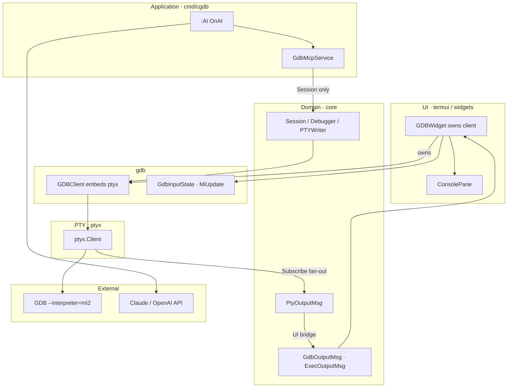
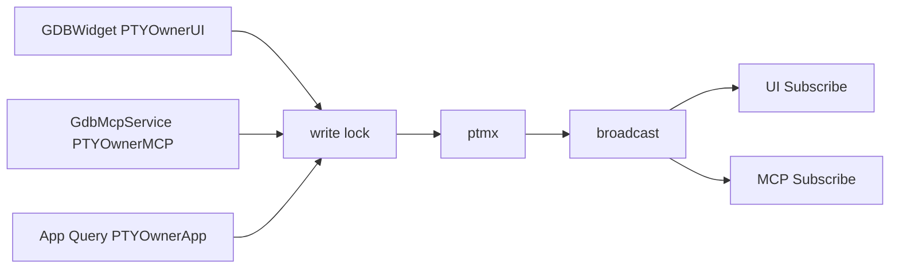
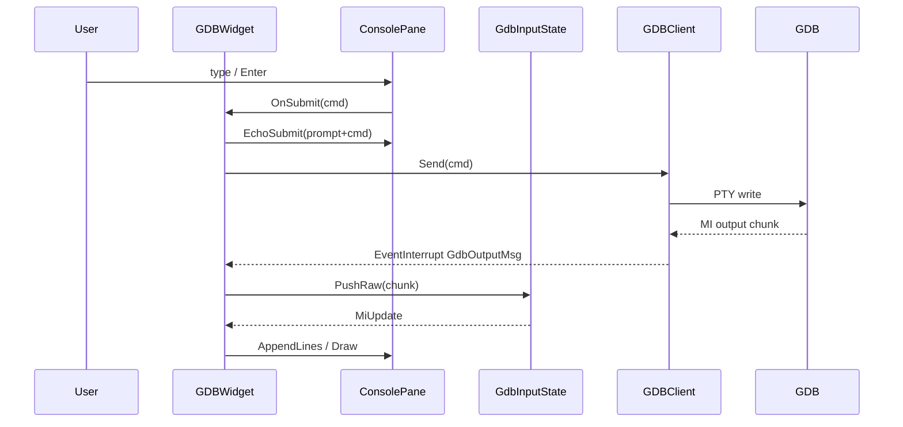
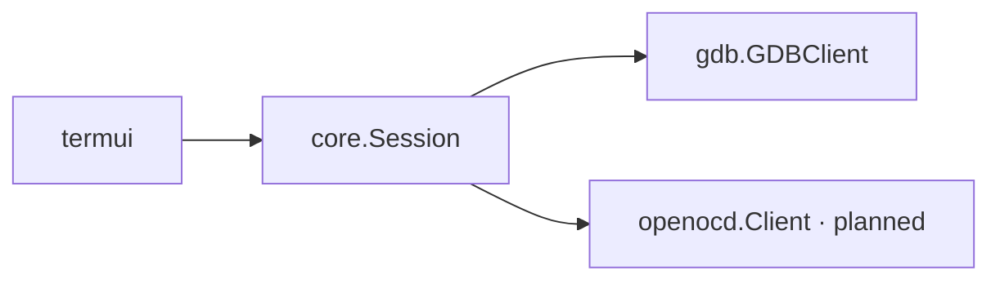

# Debugger Integration

cgdb-go connects to debug targets through **backend adapters** that implement `core.Session` (`Debugger` + lifetime + PTY mux). The first adapter is **GDB MI2 over a shared PTY** (`ptyx`). The same session is used by the GDB console, in-app `:AI`, and future MCP/REST frontends.

**Companion docs:** [ARCHITECTURE.md](ARCHITECTURE.md) · [UI_ARCHITECTURE.md](UI_ARCHITECTURE.md) · [EXEC_SHELL.md](EXEC_SHELL.md) · [PLUGINS.md](PLUGINS.md)

---

## Table of contents

- [Integration overview](#integration-overview)
- [Debugger interface](#debugger-interface)
- [PTY mux](#pty-mux)
- [GDB integration](#gdb-integration)
- [GdbMcpService and in-app AI](#gdbmcpservice-and-in-app-ai)
- [MI2 parsing pipeline](#mi2-parsing-pipeline)
- [GDBWidget bridge](#gdbwidget-bridge)
- [Future OpenOCD integration](#future-openocd-integration)
- [Future JTAG integration](#future-jtag-integration)
- [Future kernel debugging](#future-kernel-debugging)
- [Design constraints](#design-constraints)

---

## Integration overview

Application data flows **Service → Event Bus → Model → Widget** (target). Today the GDB path is still widget-local via `EventInterrupt`, but ownership and the external API are session-based.



**Dependency rules:**

- `internal/gdb` and `internal/ptyx` must not import `internal/termui`
- `GDBWidget` owns the concrete `GDBClient`; app/MCP use `core.Session` via `app.GDB()` / `gdbWidget.Session()`
- Never `Close()` the session from MCP/AI while the widget owns it

---

## Debugger interface

```go
type Debugger interface {
    Send(cmd string) error
    SendRaw(raw string) error
}

type PTYWriter interface {
    Send(cmd string) error
    SendRaw(raw string) error
}

// Session: lifetime + exclusive write + shared read.
type Session interface {
    Debugger
    Close()
    Subscribe() (ch <-chan PtyOutputMsg, cancel func())
    WithWrite(ctx context.Context, fn func(w PTYWriter) error) error
}
```

Minimal by design — sends commands to the backend. Responses arrive asynchronously via `Subscribe` / UI events, not as return values from `Send`.

**Design rationale:** MI2 and GDB CLI are streaming protocols. Blocking `Send` → response would deadlock when async `*stopped` records arrive mid-command. `GdbMcpService.GdbCommand` adds a **windowed capture** on a private subscription for tool results (best-effort until tokenized MI waiters).

**Ownership:** `GDBWidget` creates and owns the `GDBClient` (`NewGDBWidget` → `Start` → `Close`). `DebuggerApp` holds `gdbMcp` as a peer constructed from `gdbWidget.Session()`. External APIs use `app.GDB() core.Session`.

Future extensions (separate interfaces):

| Interface | Purpose |
|-----------|---------|
| `BreakpointManager` | Add/remove/list breakpoints |
| `RegisterReader` | Read register sets |
| `MemoryReader` | Read/write memory |

These will emit `core.Event` updates rather than synchronous returns.

---

## PTY mux

One `ptmx` (`ptyx.Client`). Two rules:

| Direction | Rule |
|-----------|------|
| **Write** | **Exclusive** — `WithWrite` / `Send` / `SendRaw` share one mutex; only one of UI / MCP / App holds it at a time |
| **Read** | **Shared** — every `Subscribe()` channel receives the same chunks |

Writers (`PTYOwner` on `AppState`):

| Owner | Who | Console paint |
|-------|-----|---------------|
| `ui` | GDB / Exec console submit | Yes |
| `mcp` | `:AI` / `GdbCommand` | Suppressed in GDBWidget |
| `app` | Silent MI (`Query`, e.g. file list) | Suppressed in GDBWidget |



GDB and exec (`:!`) both embed `*ptyx.Client`. UI bridges convert `PtyOutputMsg` → `GdbOutputMsg` / `ExecOutputMsg` for interrupt routing.

**Session model on AppState:** `SourceFiles`, `CurrentFile` / `CurrentLine` (updated on `*stopped`). Each open source file has its own CodeWidget (`:e filename`); `:b filename` switches among open file buffers and builtins (`about`, `logger`, `gdb`, `exec`). Stops show `-->` on the PC line and swap that file’s buffer into focus.

---

## GDB integration

### Client startup

`gdb.NewGDBClient()` wraps `ptyx.Client` (`gdb_client.go` / `ptyx/client.go`):

1. Builds `gdb --interpreter=mi2 <target>` argv.
2. `ptyx.New` — PTY, raw mode, reader fan-out.
3. Sends initial newline to trigger prompt.

```go
argv := []string{"gdb", "--interpreter=mi2", "hello"}
pty, err := ptyx.New(argv, ptyx.Options{})
```

**Current limitation:** reply correlation (tokenized MI → waiter) is not built yet — `GdbCommand` uses idle/max window capture on the raw stream.

### Send paths

| Method | Use |
|--------|-----|
| `Send(cmd)` | Append `\n`, send CLI/MI command (takes write lock) |
| `SendRaw(raw)` | Send raw bytes (SIGINT, …) under write lock |
| `WithWrite(ctx, fn)` | Hold write lock for multi-step MCP capture |

### Output path

```go
ch, cancel := client.Subscribe()
defer cancel()
for msg := range ch {
    // UI posts EventInterrupt(GdbOutputMsg); MCP/AI parse the same stream
}
```

`Close()` (or `cancel`) closes subscription channels → `GDBWidget` receives `"gdb-exit"` when its subscription ends.

---

## GdbMcpService and in-app AI

Same process as the TUI (required for one debug context).

| Piece | Role |
|-------|------|
| `internal/mcp/gdb_service.go` | Tool core: `GdbCommand` under `WithWrite` + Subscribe capture |
| `internal/mcp/agent.go` | LLM tool loop (Anthropic or OpenAI) |
| `:AI` / `:ai` | Rest-args colon command → `OnAI` → `Ask` in a goroutine |

```text
:AI why is there a memory leak
  → GdbMcpService.Ask
  → LLM may call gdb_command("info leak") / "b main" / …
  → same Session as the GDB pane (exclusive write, shared read)
  → answer appended to GDB console
```

**Env:** `ANTHROPIC_API_KEY` or `OPENAI_API_KEY`; optional `CGDB_AI_MODEL`.

**Do not** use stdio MCP inside the TUI process (keyboard owns stdin). Optional TCP MCP for external hosts can expose the same tools later; in-app `:AI` is the primary door.

---

## MI2 parsing pipeline

GDB MI2 emits several record types:

| Prefix | Type | Example |
|--------|------|---------|
| `^` | Result | `^done`, `^error`, `^running` |
| `~` | Console stream | `~"Hello\n"` |
| `@` | Target stream | `@"program output\n"` |
| `&` | Log stream | `&"warning\n"` |
| `*` | Exec async | `*stopped,reason="breakpoint-hit"` |
| `=` | Notify async | `=breakpoint-created,...` |
| `(gdb)` | Prompt | Ready for input |

### GdbInputState (streaming)

`PushRaw` is called on the **UI thread** for each `GdbOutputMsg` chunk:

1. Append bytes to `lineBuf`; split on `\n`.
2. For each complete line, classify the MI record and accumulate an `MiUpdate`.
3. Return immediately — no timer, no wait for a “full burst”.

| Record | Effect on `MiUpdate` |
|--------|----------------------|
| `~` / `@` | Decode stream payload → `DisplayLines` |
| `&` | Ignored for display (CLI echo; UI already echoes submits) |
| `^error` | Set `Error` state; surface `msg=` |
| `^done` / `^running` / … | Update `GdbState` |
| `*stopped` | Fill `Stopped` (`reason`, `thread-id`) |
| `(gdb)` | `PromptReady` |

Incomplete lines remain in `lineBuf` across chunks.

**Design rationale:** GDB often splits writes mid-line; newline buffering is required. Per-line dispatch is enough for correctness and feels faster than a 100ms debounce.

### MiMsg (batch helper)

`MiMsg` / `NewMiMsg` / `CreateBufferForLine` remain as a batch-oriented helper for offline or test parsing. The live GDB pane uses streaming `MiUpdate` from `GdbInputState`.

```go
type MiUpdate struct {
    DisplayLines []string
    PromptReady  bool
    State        GdbState
    ErrorMsg     string
    Stopped      *MiStopMsg
}
```

### MI string decoding

`DecodeMIString` handles GDB's C-style escapes including **octal UTF-8 sequences** (`\342\235\214`). `ExpandTabs` expands tab stops for aligned output.

Implementation: `mi.go`, `mi_msg.go`, `mi_state.go`.

---

## GDBWidget bridge

`GDBWidget` owns the GDB session and is a thin adapter over shared termui REPL pieces:

```text
InputLine  →  ConsolePane  →  GDBWidget  →  GDBClient (owned) → ptyx
(edit/hist)   (scrollback +     (create/Start/Close,
               walking prompt)   MI + Send)
```

`NewGDBWidget(gdbPath, prog, args...)` spawns the client; `Start(screen)` bridges `Subscribe` → `EventInterrupt(GdbOutputMsg)`; `Close()` tears the process down. Presentation is a **native GDB session** (`(gdb) b main` then raw console output) — not labeled chat (`user:` / `gdb:`).



| Component | File | Role |
|-----------|------|------|
| `InputLine` | `termui/input_line.go` | Text, cursor, readline history/editing |
| `ConsolePane` | `termui/console_pane.go` | Scrollback Viewport, walking prompt, `EchoSubmit`, key shell |
| `GDBWidget` | `cgdb/widgets/gdb_widget.go` | Owns client; `OnSubmit` → Send; MI → AppendLines |
| `GdbInputState` | `gdb/mi_state.go` | Stream `PushRaw` → `MiUpdate` |
| `ptyx.Client` | `ptyx/client.go` | Shared PTY mux |

### Console layout (walking prompt)

Terminal-style after `Ctrl+L` (clear / screen reset) — owned by `termui.ConsolePane`:

1. Empty scrollback → `(gdb)` + caret at **top-left**.
2. Each new output line → prompt moves **one row down**.
3. While free rows remain → leave blank space below; do **not** jump the prompt to the bottom.
4. When the pane is full → pin prompt to the last row and scroll the viewport (`followTail`).

While the user scrolls history (`followTail` off), the prompt stays on the bottom row.

Echo is `prompt+cmd` only (native GDB session, not chat labels).

Draw highlights:

- Lines starting with `>>>` — teal bold (future: stop reason).
- Echoed / prompt text with `(gdb)` — yellow.

---

## Future OpenOCD integration

[OpenOCD](https://openocd.org/) exposes a **Telnet command port** and **TCL scripting** for embedded targets.

Planned adapter: `internal/openocd` (not yet created).

| Aspect | Plan |
|--------|------|
| Transport | TCP telnet or pipe to `openocd` process |
| Protocol | TCL commands + event text (not MI2) |
| Interface | Same `core.Session` for send/subscribe; adapter translates |
| UI impact | None — new backend package only |



**Design decision:** OpenOCD is a **separate backend**, not a GDB wrapper. Some workflows may use both (OpenOCD for flash/reset, GDB for symbols) — session orchestration belongs in app/`core`.

---

## Future JTAG integration

JTAG debugging may arrive through:

1. **OpenOCD** as transport (preferred — reuse OpenOCD adapter).
2. Direct **JTAG library** (e.g., libftdi) for specialized hardware bring-up.

cgdb-go UI would expose:

- Chain scan / device selection pane.
- TAP state indicator.
- DR/IR scan views.

These are **feature panes** ([PLUGINS.md](PLUGINS.md)), not core UI changes.

---

## Future kernel debugging

Kernel debugging introduces unique requirements:

| Requirement | UI response |
|-------------|-------------|
| Multiple address spaces | Memory pane with context selector |
| Crash dumps / vmcore | Read-only source + backtrace panes |
| Remote targets | Backend connection manager (not UI) |
| Module / symbol load | Async events → source pane refresh |

Planned backend options:

- GDB remote (`target remote :1234`)
- `crash` utility integration for dump analysis
- Custom `/proc/kcore` readers

**Design constraint:** kernel workflows must not fork the UI. New panes and backends extend the existing widget and event model.

---

## Design constraints

| Constraint | Reason |
|------------|--------|
| Backends never import `termui` | Testability, headless automation |
| Async-only responses | MI2 / OpenOCD are streaming |
| Exclusive PTY write / shared read | UI + AI share one `ptmx` safely |
| Parse MI in gdb layer | Widgets display buffers, not raw protocol |
| Session config outside MCP | Target binary/args from CLI; AI uses live session |
| Same-process AI | One debug context for manual + `:AI` |

---

## Related documentation

- [EXEC_SHELL.md](EXEC_SHELL.md) — `:!` exec panes (same `ptyx`)
- [INPUT.md](INPUT.md) — GDB key forwarding
- [PLUGINS.md](PLUGINS.md) — custom debugger panes
- [ROADMAP.md](ROADMAP.md) — backend milestones
- [DIRECTORY_STRUCTURE.md](DIRECTORY_STRUCTURE.md) — package map
