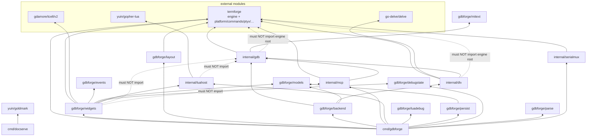

# Software Dependencies

This document describes **Go module dependencies** (third-party libraries) and **internal package dependencies** (how code in this repository imports other packages).

**Companion docs:** [DIRECTORY_STRUCTURE.md](DIRECTORY_STRUCTURE.md) · [ARCHITECTURE.md](ARCHITECTURE.md)

---

## Table of contents

- [The termforge boundary](#the-termforge-boundary)
- [External dependencies (go.mod)](#external-dependencies-gomod)
- [Internal package graph](#internal-package-graph)
- [Per-package import rules](#per-package-import-rules)
- [Command binaries](#command-binaries)
- [Forbidden edges](#forbidden-edges)
- [Verifying imports locally](#verifying-imports-locally)

---

## The termforge boundary

The generic terminal UI framework used to live in this repository as
`internal/termui` and friends. It is now a **separate Go module**,
[termforge](https://github.com/yairgd/termforge), and gdbforge consumes it like any
other dependency.

| Side | Where | Contents |
|------|-------|----------|
| **Framework** | `github.com/yairgd/termforge` (separate repo) | Widgets, split-tree window manager, tabs, canvas/grid rendering, colon commands, key bindings, PTY plumbing, terminal emulator pane |
| **Application** | this repo | GDB and Delve backends, MI parsing and models, debugger widgets, MCP service, Lua debugger bindings, layouts, persistence |

This is a hard, compiler-enforced boundary: termforge cannot import gdbforge, because
it does not depend on this module. The remaining rules below are about keeping the
*application* side tidy.

**Consequences worth knowing:**

- Anything generic you add belongs upstream in termforge, not here. If you find
  yourself writing a reusable widget or layout primitive in `internal/gdbforge`,
  that is a signal it should be contributed to termforge instead.
- Only three packages import the termforge engine root: `cmd/gdbforge`,
  `internal/gdbforge/widgets`, and `internal/gdbforge/layout`. Everything else uses
  the headless subpackages (`platform`, `commands`, `ptyx`, …) or no termforge at all.
- Backends stay headless. `internal/gdb` and `internal/dlv` must not import the
  termforge engine root, so they can be tested with no terminal. They do use
  `termforge/ptyx` and `termforge/platform`, which carry no tcell dependency.

**Composition root:** only `cmd/gdbforge` (and tests) wires application packages into
framework surfaces.

**Lua:** `internal/luahost` installs the generic script APIs. Debugger Lua bindings
(`gdb`, `dlv_*`, `set_inferior_tty`, `program`) are registered from `cmd/gdbforge` via
`internal/gdbforge/luadebug.Install`, which keeps `luahost` free of debugger knowledge.

---

## External dependencies (go.mod)

Module path: `github.com/yairgd/gdbforge`

| Dependency | Used by | Purpose |
|------------|---------|---------|
| [`github.com/yairgd/termforge`](https://github.com/yairgd/termforge) | `cmd/gdbforge`, widgets, layout, backends | Terminal UI framework |
| [`github.com/gdamore/tcell/v2`](https://github.com/gdamore/tcell) | `internal/gdbforge/widgets` | Terminal screen, input, styles |
| [`github.com/creack/pty`](https://github.com/creack/pty) | `internal/serialmux` | Pseudo-terminal allocation for the serial multiplexer |
| [`github.com/go-delve/delve`](https://github.com/go-delve/delve) | `internal/dlv` | Delve rpc2 client types |
| [`github.com/yuin/gopher-lua`](https://github.com/yuin/gopher-lua) | `internal/luahost` | Embedded Lua interpreter |
| [`github.com/alecthomas/chroma/v2`](https://github.com/alecthomas/chroma) | `internal/gdbforge/widgets` | Source syntax highlighting |
| [`github.com/yuin/goldmark`](https://github.com/yuin/goldmark) | `cmd/docserve` | Markdown rendering for the local docs server |
| [`gopkg.in/yaml.v3`](https://gopkg.in/yaml.v3) | `internal/gdbforge/persist` | Breakpoint and history persistence |
| [`golang.org/x/sys`](https://pkg.go.dev/golang.org/x/sys) | `cmd/gdbforge`, `internal/serialmux` | `unix` syscalls for terminal and process control |
| [`golang.org/x/tools`](https://pkg.go.dev/golang.org/x/tools) | `cmd/flowdoc` | Callgraph analysis for flow docs (build-time only) |

**System tools (not Go modules):**

| Tool | Required by |
|------|-------------|
| `gdb` | `internal/gdb` at runtime |
| `dlv` | `internal/dlv` at runtime (`-g dlv`) |
| `go` (see `go.mod` for version) | build |

Run `go mod graph` or `go list -m all` for exact versions and transitive modules.

---

## Internal package graph



Solid arrows into the `termforge` node mean "uses some termforge package". The dotted
edges are narrower than the module: `gdb` and `dlv` may use the headless subpackages
(`platform`, `ptyx`) but not the engine root, because pulling in the root would drag
tcell into a package that must stay testable without a terminal.

---

## Per-package import rules

| Package | May import | Must not import |
|---------|------------|-----------------|
| **`internal/gdb`** | stdlib, `termforge/ptyx`, `termforge/platform`, `gdbforge/mitext`, `gdbforge/models` | `termforge` (engine root), `tcell`, widgets |
| **`internal/dlv`** | stdlib, `delve`, `termforge/ptyx`, `termforge/platform`, `gdb`, `gdbforge/models` | `termforge` (engine root), `tcell`, widgets |
| **`internal/mcp`** | stdlib (incl. `net/http`), `termforge/ptyx`, `termforge/platform`, `gdb`, `gdbforge/domain` | `tcell`, widgets |
| **`internal/luahost`** | stdlib, `gopher-lua` | `gdb`, `dlv`, `mcp`, `gdbforge/*` |
| **`internal/serialmux`** | stdlib, `creack/pty`, `termforge/ptyx`, `termforge/devport` | widgets, `gdb`, `dlv` |
| **`internal/gdbforge/mitext`** | stdlib | everything else — pure MI string helpers |
| **`internal/gdbforge/models`** | stdlib | widgets, backends |
| **`internal/gdbforge/backend`** | `gdb`, `dlv`, `models`, `termforge/ptyx`, `termforge/platform` | `termforge` (engine root), `tcell`, widgets |
| **`internal/gdbforge/widgets`** | `termforge`, `termforge/platform`, `termforge/ptyx`, `tcell`, `chroma`, `events`, `models`, `debugstate`, `luahost`, stdlib | `gdb`, `mcp` |
| **`internal/gdbforge/layout`** | `termforge`, `termforge/platform` | widgets, backends, `mcp` |
| **`cmd/gdbforge`** | everything | — (composition root) |
| **`cmd/docserve`** | stdlib, `goldmark` | application packages |
| **`cmd/flowdoc`** | stdlib, `golang.org/x/tools` | application packages |

**Heuristic:** if code can be unit-tested without a terminal, it should not import the
termforge engine root.

---

## Command binaries

| Binary | Path | Pulls in |
|--------|------|----------|
| **`gdbforge`** | `cmd/gdbforge` | `termforge`, widgets, `layout`, `backend`, `gdb`, `dlv`, `mcp`, `luahost`, `persist`, `tcell` |
| **`docserve`** | `cmd/docserve` | `goldmark` |
| **`flowdoc`** | `cmd/flowdoc` | `golang.org/x/tools` (build-time doc generation) |

Build all commands: `task build` or `go build ./cmd/...`.

---

## Forbidden edges

These import directions are **architectural violations** — do not add them:

```text
luahost               ──X──>  gdb | dlv | mcp | gdbforge/*
gdb | dlv             ──X──>  termforge (engine root)
gdbforge/widgets      ──X──>  gdb | mcp
```

These four checks are exactly what `scripts/check_imports.sh` enforces.

**Why:** backends stay UI-agnostic and testable without a terminal; widgets render
state and raise intents rather than driving the debugger or MCP directly; `luahost`
stays a generic script host so the debugger bindings remain an application concern,
registered from `cmd/gdbforge`.

**How data crosses the boundary:** generic PTY bytes as `ptyx.PtyOutputMsg`; debugger MI
payloads as `GdbOutputMsg` in `internal/gdbforge/events`; terminal pane bytes via
`WireTTY` → `CompositeTerminal`; all composition in `cmd/gdbforge`.

**Automated check:** `task check-imports` (or `./scripts/check_imports.sh`).

---

## Verifying imports locally

Exact import lists change as code evolves. Regenerate them with:

```bash
# External modules
go list -m all

# Per-package imports
for pkg in ./internal/gdb ./internal/dlv ./internal/mcp ./internal/luahost \
           ./internal/gdbforge/backend ./internal/gdbforge/widgets \
           ./cmd/gdbforge ./cmd/docserve; do
  echo "=== $pkg ==="
  go list -f '{{join .Imports "\n"}}' $pkg | sort -u
done
```

To see which packages reach the termforge engine root:

```bash
for pkg in $(go list ./...); do
  go list -f '{{range .Imports}}{{println .}}{{end}}' "$pkg" \
    | grep -q '^github.com/yairgd/termforge$' && echo "$pkg"
done
```

To check for forbidden imports:

```bash
task check-imports
# or: ./scripts/check_imports.sh
```

---

## Related documentation

- [DIRECTORY_STRUCTURE.md](DIRECTORY_STRUCTURE.md) — file layout and package responsibilities
- [ARCHITECTURE.md](ARCHITECTURE.md) — subsystems and data flow
- [DEBUGGER_INTEGRATION.md](DEBUGGER_INTEGRATION.md) — GDB backend and event bridge
- [termforge documentation](https://yairgd.github.io/termforge/) — the framework this app is built on
