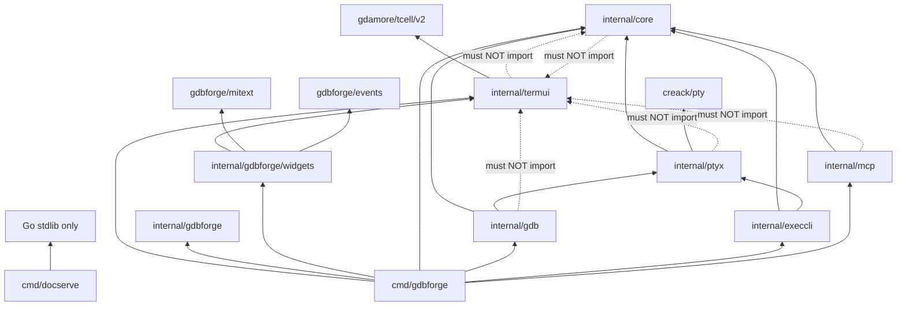

# Software Dependencies

This document describes **Go module dependencies** (third-party libraries) and **internal package dependencies** (how code in this repository imports other packages).

**Companion docs:** [DIRECTORY_STRUCTURE.md](DIRECTORY_STRUCTURE.md) · [ARCHITECTURE.md](ARCHITECTURE.md)

---

## Table of contents

- [FRAMEWORK vs APP](#framework-vs-app)
- [Quick answer: `internal/termui`](#quick-answer-internaltermui)
- [External dependencies (go.mod)](#external-dependencies-gomod)
- [Internal package graph](#internal-package-graph)
- [Per-package import rules](#per-package-import-rules)
- [Command binaries](#command-binaries)
- [Forbidden edges](#forbidden-edges)
- [Verifying imports locally](#verifying-imports-locally)


---

## FRAMEWORK vs APP

The repo is split so a future non-debugger TUI app can reuse the same host without pulling GDB/Delve.

| Layer | Packages | Role |
|-------|----------|------|
| **FRAMEWORK** | `termui`, `platform`, `commands`, `collections`, `ptyx`, `luahost`, `core` | Generic TUI, input, PTY, Lua host, shared events (`PtyOutputMsg`, `ExecOutputMsg`) |
| **APP (gdbforge)** | `internal/gdb`, `internal/dlv`, `internal/mcp`, `internal/gdbforge/*`, `cmd/gdbforge` | Debugger backends, MI parse/models, debug widgets, app events (`GdbOutputMsg`, `InferiorOutputMsg`) |

**Composition root:** only `cmd/gdbforge` (and tests) should wire APP packages into FRAMEWORK surfaces.

**Lua:** `luahost` installs framework APIs at `New`. Debugger Lua bindings (`gdb`, `dlv_*`, `set_inferior_tty`, `program`) are registered from `cmd/gdbforge` via `wireUserLuaAPI`.

## Quick answer: `internal/termui`

**Yes — `internal/termui` depends only on the Go standard library and [tcell](https://github.com/gdamore/tcell).**

It does **not** import:

- `internal/core`
- `internal/gdb`
- any other third-party UI library

That is intentional: `termui` is the **standalone TUI framework** (layout, widgets, grid/canvas rendering, keyboard/mouse input via tcell). Domain logic and debugger backends stay outside it.

Wiring happens **above** `termui`:

| Layer | Role |
|-------|------|
| `internal/termui` | Generic terminal UI framework — window manager, layout, rendering |
| `internal/gdbforge` | App state (`AppState`, modes) + debugger widgets (views) |
| `cmd/gdbforge` | Application startup — services, models, event bus; composes `termui`, widgets, `core`, `gdb`, `ptyx`, `mcp` |

Services, models, and widgets are wired in **`cmd/gdbforge`**. Data flows Service → Event Bus → Model → Widget; `termui` never imports services or models directly.

---

## External dependencies (go.mod)

Module path: `github.com/yairgd/gdbforge`

| Dependency | Used by | Purpose |
|------------|---------|---------|
| [`github.com/gdamore/tcell/v2`](https://github.com/gdamore/tcell) | `internal/termui`, `internal/gdbforge/widgets` | Terminal screen, input, styles |
| [`github.com/creack/pty`](https://github.com/creack/pty) | `internal/ptyx` | Pseudo-terminal for GDB and `:!` exec I/O |

**No third-party runtime deps:** `cmd/docserve` uses the Go standard library only.

**System tools (not Go modules):**

| Tool | Required by |
|------|-------------|
| `gdb` | `internal/gdb` at runtime |
| `go` (see `go.mod` for version) | build |

Run `go mod graph` or `go list -m all` for exact versions and transitive modules.

---

## Internal package graph



---

## Per-package import rules

| Package | May import | Must not import |
|---------|------------|-----------------|
| **`internal/termui`** | stdlib, `tcell` | `core`, `gdb`, `ptyx`, other UI libs |
| **`internal/core`** | stdlib | `termui`, `tcell`, `gdb`, `ptyx` |
| **`internal/ptyx`** | stdlib, `creack/pty`, `core` | `termui`, `tcell` |
| **`internal/gdb`** | stdlib, `ptyx`, `core` | `termui`, `tcell` |
| **`internal/execcli`** | stdlib, `ptyx`, `core` | `termui`, `tcell` |
| **`internal/mcp`** | stdlib, `core` (net/http) | `termui`, `tcell`, `gdb`, widgets |
| **`internal/gdbforge/mitext`** | stdlib | — (debugger MI string helpers; used by `gdb` + widgets) |
| **`internal/luahost`** | stdlib, gopher-lua | `gdb`, `dlv`, `mcp`, `gdbforge` (app wires debugger Lua) |
| **`internal/platform`** | stdlib, `termui` (as needed) | `gdb`, `dlv`, `mcp`, `gdbforge` |
| **`internal/gdbforge/widgets`** | `termui`, `platform`, `gdbforge/mitext`, `gdbforge/events`, stdlib | `gdb`, `mcp`, `dlv` |
| **`internal/gdbforge/*`** | app helpers (`models`, `parse`, `debugstate`, `events`, …) | must not be imported by FRAMEWORK packages |
| **`cmd/gdbforge`** | FRAMEWORK + APP packages | — (composition root) |
| **`cmd/docserve`** | stdlib only | — |

**Heuristic:** if code can be unit-tested without a terminal, it belongs in **`core`** / **`ptyx`** / **`mcp`**, not in **`termui`**.

---

## Command binaries

| Binary | Path | Pulls in |
|--------|------|----------|
| **`gdbforge`** | `cmd/gdbforge` | `termui`, widgets, `core`, `gdb`, `ptyx`, `execcli`, `mcp`, `tcell`, `creack/pty` |
| **`docserve`** | `cmd/docserve` | stdlib only |

Build all commands: `task build` or `go build ./cmd/...`.

---

## Forbidden edges

These import directions are **architectural violations** — do not add them:

```text
FRAMEWORK (termui|platform|commands|collections|ptyx|luahost|core)
        ──X──>  gdb | dlv | mcp | gdbforge/*

dlv     ──X──>  termui
widgets ──X──>  gdb | mcp
mcp     ──X──>  termui | tcell | gdb | widgets
termui  ──X──>  gdb | ptyx | gdbforge
core    ──X──>  termui | tcell | gdb | ptyx
ptyx    ──X──>  termui | tcell
gdb     ──X──>  termui | tcell
```

**Why:** FRAMEWORK must stay reusable for non-debugger apps; backends stay UI-agnostic.

**How data crosses the boundary:** generic `core.PtyOutputMsg` / `ExecOutputMsg`; debugger UI payloads in `internal/gdbforge/events` (`GdbOutputMsg`, `InferiorOutputMsg`); composition in `cmd/gdbforge`.

**Automated check:** `task check-imports` (or `./scripts/check_imports.sh`).

---

## Verifying imports locally

Exact import lists change as code evolves. Regenerate them with:

```bash
# External modules
go list -m all

# Per-package imports
for pkg in ./internal/termui ./internal/core ./internal/ptyx ./internal/gdb \
           ./internal/execcli ./internal/mcp ./internal/gdbforge/widgets ./cmd/gdbforge ./cmd/docserve; do
  echo "=== $pkg ==="
  go list -f '{{join .Imports "\n"}}' $pkg | sort -u
done
```

To check for forbidden imports:

```bash
task check-imports
# or: ./scripts/check_imports.sh

go list -f '{{.ImportPath}} imports {{.Imports}}' ./internal/... ./cmd/...
```

---

## Related documentation

- [DIRECTORY_STRUCTURE.md](DIRECTORY_STRUCTURE.md) — file layout and package responsibilities
- [ARCHITECTURE.md](ARCHITECTURE.md) — subsystems and data flow
- [DEBUGGER_INTEGRATION.md](DEBUGGER_INTEGRATION.md) — GDB backend and event bridge
- [OVERVIEW.md](OVERVIEW.md) — why tcell for gdbforge
