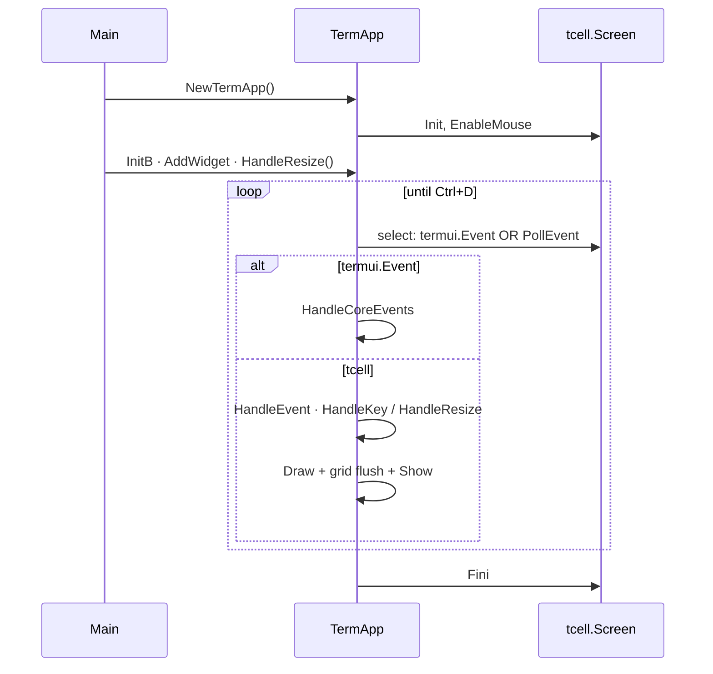
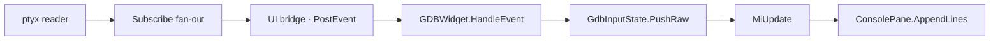

# Developer Guide

**Audience:** engineers onboarding to cgdb-go, code reviewers, and contributors implementing UI or debugger features.

**Companion docs:** [README.md](README.md) · [ARCHITECTURE.md](ARCHITECTURE.md) · [DIRECTORY_STRUCTURE.md](DIRECTORY_STRUCTURE.md)

---

## Table of contents

1. [How to read the codebase](#how-to-read-the-codebase)
2. [Glossary](#glossary)
3. [Development environment](#development-environment)
4. [Application lifecycle](#application-lifecycle)
5. [Adding a widget](#adding-a-widget)
6. [Layout and splits](#layout-and-splits)
7. [Rendering rules](#rendering-rules)
8. [GDB output path](#gdb-output-path)
9. [Threading rules](#threading-rules)
10. [Debugging with Delve](#debugging-with-delve)
11. [Troubleshooting](#troubleshooting)
12. [How to extend](#how-to-extend)
13. [File index by feature](#file-index-by-feature)

---

## How to read the codebase

### 30-minute path (orientation)

| Order | File | Why |
|-------|------|-----|
| 1 | `cmd/xgdb/main.go` → `app.go` → `setup.go` | Entry + app wiring |
| 2 | `internal/termui/term_app.go` | Event loop, grids, draw flush |
| 3 | `internal/termui/widget.go` | Widget contract |
| 4 | `internal/termui/widget_tree.go`, `layout_tree.go` | Split layout |
| 5 | `internal/termui/canvas.go` | Drawing abstraction |
| 6 | `internal/termui/grid.go`, `cell.go` | Border composition |
| 7 | `internal/termui/input_line.go`, `console_pane.go` | Shared REPL editor + transcript |
| 8 | `internal/xgdb/widgets/gdb_widget.go` | GDB adapter (MI + Debugger) |
| 9 | `internal/gdb/gdb_client.go` | PTY backend |
| 10 | `docs/ARCHITECTURE.md` | Big picture |

### Half-day path (implement a feature)

Add: `internal/termui/widget_tree.go`, `node.go`, `tab.go`, `cmd_widget.go`, `internal/gdb/mi_msg.go`, `internal/core/buffer.go`, `internal/core/events.go`, and skim `docs/diagrams/*.mermaid`.

### Mental model

```text
Application startup
  ├── Services          (ptyx / GDBClient / GdbMcpService, …) — talk to external systems
  ├── Event bus         (termui.Event channel)
  ├── Models            (CodeModel, BreakpointModel, …) — created once, live until exit
  ├── Logger
  └── Runtime           (TermApp, window manager)

User displays a model (:buffer, :split)
  └── Window manager creates Widget → binds to existing Model

TermApp
  ├── AppApi (implemented by DebuggerApp)
  │     ├── HandleKey(*tcell.EventKey)     — mode router, trie, widget dispatch
  │     ├── HandleResize()               — top-level widget rects
  │     └── HandleCoreEvents(termui.Event) — ALL domain events land here
  ├── screen tcell.Screen                — poll, lifecycle, Show (owned by TermApp)
  ├── events chan termui.Event           — bus; services and widgets may publish
  ├── DebuggerApp fields
  │     ├── appState *platform.AppState    — Mode, PTYOwner, EqualAlways
  │     ├── trie termui.Trie               — multi-key bindings
  │     ├── tab *TabWidget                 — window manager (split tree)
  │     └── cmdWidget *CmdWidget
  ├── top-level widgets (tab + cmd line)
  │     └── CmdWidget.Events → events channel
  ├── frontBuffer (*Grid)                 — shared draw target + BackCells diff
  └── select loop: drain bus OR PollEvent → draw → flush

Widget (view)
  ├── displays Model state
  ├── HandleEvent(tcell.Event)   — local keys / mouse
  ├── Draw(Canvas)
  └── publish termui.Event       — when app-level action needed (not service calls)

Data flow (target):
  Service → Event Bus → Model → Widget

GDB path (today):
  ptyx reader → Subscribe fan-out → EventInterrupt(GdbOutputMsg) → GDBWidget → ConsolePane
  GdbMcpService / :AI → same Session (WithWrite exclusive, Subscribe shared)
GDB path (target):
  Session → PtyOutputMsg on bus → Model update → Widget redraw
```

**Rules:**

- Models are created at startup; widgets are created on demand.
- Widgets never call services directly — services publish events; models subscribe (target). Today `GDBWidget` owns the GDB `Session`; MCP uses `Session` only.
- High-rate service output → model state → widget reads model on draw.
- Domain actions → publish `termui.Event`, handle in **`HandleCoreEvents`** — not in widget business logic.
- App command IDs are **private** to the application package; only `termui.CmdUnknown` lives in infra.
- Mode and key-sequence routing belong in **`DebuggerApp`**, not in `TermApp` or individual widgets.
- Console editing/layout is shared (`InputLine` / `ConsolePane`); debugger backends only supply protocol glue.
- PTY writes are exclusive (`WithWrite`); all subscribers see output. Do not spawn a second GDB for AI.

---

## Glossary

| Term | Meaning |
|------|---------|
| **Model** | Application domain object owning state (e.g. `BreakpointModel`); created at startup; subscribes to events; implements generic widget interfaces (`TextModel`, `GraphModel`, …) |
| **Widget** | View displaying a model via a small interface; implements `HandleEvent`, `Draw`, and `DrawStatusLine`; no business logic; decides rendering style |
| **Service** | External-system adapter (`ptyx` / `GDBClient` / `GdbMcpService`); produces events; never imports UI |
| **Session** | `core.Session` — Send, Close, Subscribe, WithWrite; MCP/AI external API |
| **PTY mux** | Exclusive write lock + fan-out reads on one `ptmx` |
| **Window manager** | Split tree, tabs, `:buffer` binding — creates/destroys widgets, binds to models |
| **Canvas** | Local drawing context for a `Rect` |
| **Grid** | Off-screen `[][]Cell` framebuffer |
| **Node** | Split tree node (leaf or split) |
| **WidgetTree** | Split tree + focus tracking |
| **WidgetTree** | Split tree + focus + geometry (`BuildLayout`) |
| **Workspace** | Middle band containing the split tree only |
| **CmdLine** | Top-level `:` command input band |
| **Event bus** | `TermApp.events` channel; all events → `HandleCoreEvents` |
| **CommandID** | Int token; `termui.CmdUnknown` in infra; app IDs private |
| **AppState** | `platform.AppState` — Mode, PTYOwner (ui/mcp/app), EqualAlways |
| **Trie** | Prefix tree for multi-key bindings (`<C-w>h`, …) |
| **SubmitMsg** | CmdLine submitted — carries `CmdID`, `Args`, full `Text` |
| **MI2** | GDB machine interface v2 |
| **MiMsg** | Parsed batch of MI lines (helper / tests) |
| **MiUpdate** | Streaming display update from `GdbInputState.PushRaw` |
| **GdbInputState** | Newline splitter; streams complete MI lines (no debounce timer) |
| **InputLine** | Shared readline editor (text, cursor, history) |
| **ConsolePane** | Shared natural REPL shell (scrollback + walking prompt) |

---

## Development environment

### Requirements

- Go 1.25+ (see `go.mod`)
- GDB installed (for `GDBWidget` prototype)
- UTF-8 terminal
- Optional: Delve for Go debugging

### Build

```bash
task build          # all cmd/* binaries → bin/
go build ./...      # compile check only
go test ./...       # run tests
```

### View docs locally

```bash
./docs/serve.sh
# Open http://127.0.0.1:8765/
```

See [HOSTING.md](HOSTING.md).

### Run cgdb-go prototype

```bash
go run ./cmd/xgdb
```

---

## Application lifecycle



| Phase | Code | Side effects |
|-------|------|--------------|
| **Init** | `NewTermApp` | Opens screen, enables mouse |
| **Canvas setup** | `UpdateCanvas` | Allocates grids at terminal size |
| **Register widgets** | `AddWidget` | Appends to widget slice |
| **Initial layout** | `HandleResize()` in `NewDebuggerApp` | Tab + completion bar (`H-2`) + cmdline (`H-1`) |
| **Run** | `Run` | Blocks until `Ctrl+D` |
| **Close** | `Close` / defer | Restores terminal |

---

## Adding a widget

Widgets are views. Before adding a widget, ensure the corresponding **model** exists and is updated by services via the event bus.

1. Define or use an application model that holds the pane's state.

2. Create `internal/xgdb/widgets/my_widget.go` (or `internal/termui/` for generic widgets):

```go
type MyWidget struct {
    termui.BaseWidget
    /* state */
}

func NewMyWidget() *MyWidget {
    w := &MyWidget{
        BaseWidget: termui.BaseWidget{PaneName: "MyPane"},
    }
    return w
}

func (w *MyWidget) HandleEvent(ev tcell.Event) { /* ... */ }
func (w *MyWidget) Draw(c Canvas) { /* draw within rows 0..c.H()-1 */ }
// DrawStatusLine inherited from BaseWidget; override for custom status text
```

Set `PaneName` for the per-pane status bar label shown when this pane has focus. Do not draw on row `c.H()` inside `Draw` — the layout system owns that row.

3. Register via the window manager when the user displays the model:

```go
// :buffer mymodel → window manager creates widget bound to existing MyModel
layout.NewSplit(Vertical, NewMyWidget(myModel))
```

4. Wire the command line with a `CommandRegistry` (completions use the app event bus):

```go
a.cmdWidget = termui.NewCmdWidget(a.commandReg)
a.cmdWidget.Ctx = a.ctx
a.cmdWidget.Events = a.Events()
a.completionBar = termui.NewCompletionBarWidget(a.ctx) // Subscribes to CompletionMsg
// initBuiltins also: platform.Subscribe(ctx.Bus, a.onBreakpointsChangedMsg)
```

5. Build the command tree with the DSL in `ExapData()` (`cmd/xgdb/command_tree.go`) — see [COMMAND_SYSTEM.md](COMMAND_SYSTEM.md).

6. Handle legacy bus events in the application when needed:

```go
func (app *MyApp) HandleCoreEvents(ev termui.Event) {
    msg, ok := ev.(termui.CommandEvent)
    if !ok { return }
    switch msg.CommandID() { /* ... */ }
}
```

6. Bind key chords in `InitKeyBindings()`:

```go
a.keyBindings.Bind(
    commands.NewCommand("move-left", func(args ...any) { a.OnFocusLeft() }),
    "<C-w>l", "<C-w><Left>",
)
```

**Rules:**

- Never call `screen.SetContent` with absolute coordinates — use `Canvas`.
- Never set your own position — layout assigns `Canvas`.
- Keep service/process logic out of the widget — widgets read models; services update models via events.
- Never call services from widget code.

---

## Layout and splits

```go
tree := NewWidgetTree(initialWidget)
tree.Split(Vertical, rightWidget)    // left | right
tree.Split(Horizontal, bottomWidget) // top / bottom (on focused pane)
```

Split focused pane:

- `First` = original widget
- `Second` = new widget
- `Ratio` = 0.5

`TabWidget.Draw` builds then paints the active tree:

```go
tree.BuildLayout(c)  // assign rects, draw borders
tree.Draw(c)         // widgets → clear status rows → redraw grid → status lines
```

See [WINDOW_MANAGEMENT.md](WINDOW_MANAGEMENT.md).

---

## Rendering rules

1. **Borders** — only layout engine draws split separators (into Grid).
2. **Widget content** — draw inside local `(0,0)`..`(W-1,H-1)` via `Canvas` methods (all route through Grid).
3. **Unicode** — use `DrawANSIText` for strings; `SetContent` for single runes.
4. **Clipping** — check `col < c.W()` before drawing.

Incremental diff rendering uses `BackCells` in `Grid.Draw`. See [RENDERING.md](RENDERING.md).

---

## GDB output path



**Do not** read from a GDB channel in `Draw`. **Do not** call widget methods from the reader or bridge goroutine — only `PostEvent`.

`PushRaw` streams complete MI lines (`MiUpdate`); incomplete lines stay in `lineBuf` until the next chunk. Console editing/layout lives in `InputLine` / `ConsolePane`; GDBWidget wires MI and `Session.Send`.

In-app AI: `:AI …` → `GdbMcpService.Ask` → `GdbCommand` (write lock + capture). See [DEBUGGER_INTEGRATION.md](DEBUGGER_INTEGRATION.md).

---

## Threading rules

| Thread | May do |
|--------|--------|
| **Main / tcell loop** | HandleEvent, Draw, SetContent, Grid, `PushRaw` / buffer updates |
| **ptyx reader goroutine** | Read PTY, broadcast to subscribers |
| **:AI goroutine** | HTTP to LLM; `GdbCommand` / `WithWrite` on Session |
| **Bridge goroutine** | `range` channel → `PostEvent` only |

**Never:** call `Draw` or `screen.SetContent` from a background goroutine.

---

## Debugging with Delve

Debug the cgdb-go prototype:

```bash
dlv debug ./cmd/xgdb --headless --listen=:2346 --api-version=2
# separate terminal:
dlv connect :2346
```

Note: debugging a tcell app requires running in a real terminal for screen I/O, or accepting that screen calls may fail under Delve without PTY.

Debug the docs server:

```bash
dlv debug ./cmd/docserve -- --port 8765
```

---

## Troubleshooting

| Problem | Likely cause | Fix |
|---------|--------------|-----|
| Blank screen | Forgot `UpdateCanvas` before draw | Call after init and on resize |
| Garbled borders | Nested splits without grid | Check `BuildLayout` before `Draw` |
| GDB hangs | Target binary missing | Build `hello` or fix `gdb_client.go` target |
| No GDB output | Reader goroutine exited | Check channel close / PTY errors |
| Keys affect all widgets | Normal mode forwards to tab after trie | Expected until focus mode is wired |
| Cmd line invisible | Wrong rect (`y = H` instead of `H-1`) | Fix in `HandleResize()` |
| Mermaid not rendering in docs | CDN blocked | Check network; view raw `.md` |
| Port 8765 in use | Previous docserve running | `fuser -k 8765/tcp` or `--port 8766` |

---

## How to extend

| Task | Start here |
|------|------------|
| New application model | App startup in `cmd/xgdb`; subscribe to event bus |
| New debugger pane | Model + widget pair; register builtin in `initBuiltins` or open via `:e` / layout |
| New service / backend | Implement `core.Session` (or wrap `ptyx`), new `internal/<backend>/` |
| New `:` command | Add `Cmd` / `Group` / `LeafRest` in `command_tree.go`; implement action in `actions.go` — [COMMAND_SYSTEM.md](COMMAND_SYSTEM.md) |
| `:!` / Exec pane | [EXEC_SHELL.md](EXEC_SHELL.md) |
| New key chord | `InitKeyBindings()` → `keyBindings.Bind(...)` |
| Tab switching | Extend `tab.go`, draw header in `TabWidget.Draw` |
| Diff rendering | Add `backBuffer`, per-frame clear; extend `BackCells` diff |
| Focus mode | Wire `ModeFocus` in `HandleKey`, suppress tab dispatch |

Always update docs when changing architecture-visible behavior.

---

## File index by feature

| Feature | Files |
|---------|-------|
| Event loop + bus | `term_app.go` |
| App API / dispatch | `term_app.go` (`AppApi`), `cmd/xgdb/app.go` + `input.go` |
| Interaction modes | `internal/platform/mode.go` (via `TermApp` / `AppState`) |
| Key-sequence bindings | `internal/commands` + `cmd/xgdb/keybindings.go` |
| Widget interface | `widget.go` |
| Per-pane status line | `status_line.go`, `base_widget.go` |
| Split tree | `node.go`, `layout_tree.go`, `widget_tree.go`, `tab.go` |
| Drawing | `canvas.go`, `grid.go`, `cell.go`, `rect.go`, `utf.go` |
| Tabs | `tab.go` |
| Command tree / parser / DSL | `internal/commands/` — [COMMAND_SYSTEM.md](COMMAND_SYSTEM.md) |
| Command line | `cmd_widget.go`, `history.go`; completions via `CompletionMsg` + `completion_bar.go` |
| Breakpoint sync | `stopped.go` — `Publish`/`Subscribe` `BreakpointsChangedMsg`; [DEBUGGER_INTEGRATION.md](DEBUGGER_INTEGRATION.md#breakpoints-and-source-sync) |
| Debugger panes | `internal/termui/input_line.go`, `console_pane.go`; `internal/xgdb/widgets/gdb_widget.go`; `internal/termui/logger_widget.go` |
| GDB backend | `gdb/gdb_client.go`, `gdb/mi*.go` |
| Text model | `core/buffer.go`, `core/viewport.go` |
| UI events / commands | `termui/event.go`, `termui/command.go` |
| Debugger events | `core/events.go` |
| Entry point | `cmd/xgdb/` (`main.go` + companions) |
| Docs server | `cmd/docserve/main.go` |

---

## Related documentation

- [COMMAND_SYSTEM.md](COMMAND_SYSTEM.md) — command tree, DSL, parser, tab completion
- [EXEC_SHELL.md](EXEC_SHELL.md) — `:!` exec panes, rest-args, Ctrl-O
- [UI_ARCHITECTURE.md](UI_ARCHITECTURE.md) — deep UI dive
- [DEBUGGER_INTEGRATION.md](DEBUGGER_INTEGRATION.md) — GDB MI2 details
- [ROADMAP.md](ROADMAP.md) — what's planned
- [CONTRIBUTING.md](../CONTRIBUTING.md) — commit conventions
