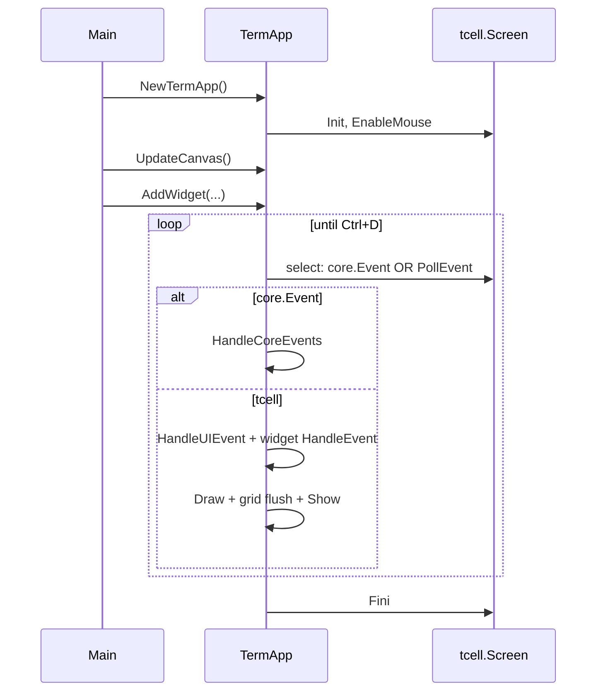
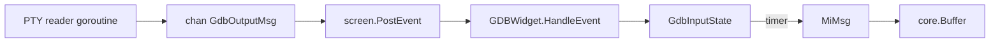

# Developer Guide

**Audience:** engineers onboarding to cgdb-go, code reviewers, and contributors implementing UI or debugger features.

**Companion docs:** [README.md](README.md) · [ARCHITECTURE.md](ARCHITECTURE.md) · [DIRECTORY_STRUCTURE.md](DIRECTORY_STRUCTURE.md)

---

## Table of contents

1. [How to read the codebase](#how-to-read-the-codebase)
2. [Glossary](#glossary)
3. [Development environment](#development-environment)
4. [Application lifecycle](#application-lifecycle)
5. [Adding a widget](#adding-a-widget)
6. [Layout and splits](#layout-and-splits)
7. [Rendering rules](#rendering-rules)
8. [GDB output path](#gdb-output-path)
9. [Threading rules](#threading-rules)
10. [Debugging with Delve](#debugging-with-delve)
11. [Troubleshooting](#troubleshooting)
12. [How to extend](#how-to-extend)
13. [File index by feature](#file-index-by-feature)

---

## How to read the codebase

### 30-minute path (orientation)

| Order | File | Why |
|-------|------|-----|
| 1 | `cmd/cgdb/main.go` | Entry point — how the app is wired |
| 2 | `internal/termui/term_app.go` | Event loop, grids, draw flush |
| 3 | `internal/termui/widget.go` | Widget contract |
| 4 | `internal/termui/widget_tree.go` | Split layout algorithm |
| 5 | `internal/termui/canvas.go` | Drawing abstraction |
| 6 | `internal/termui/grid.go`, `cell.go` | Border composition |
| 7 | `internal/termui/gdb_widget.go` | Async GDB → UI example |
| 8 | `internal/gdb/gdb_client.go` | PTY backend |
| 9 | `docs/ARCHITECTURE.md` | Big picture |

### Half-day path (implement a feature)

Add: `internal/termui/layout.go`, `node.go`, `tab.go`, `cmd_widget.go`, `internal/gdb/mi_msg.go`, `internal/core/buffer.go`, `internal/core/events.go`, and skim `docs/diagrams/*.mermaid`.

### Mental model

```text
TermApp
  ├── AppApi (implemented by DebuggerApp)
  │     ├── HandleUIEvent(tcell.Event)     — resize layout, terminal hooks
  │     └── HandleCoreEvents(core.Event)   — ALL domain events land here
  ├── events chan core.Event               — bus; any subsystem may publish
  ├── top-level widgets
  │     ├── TabBar / Workspace / CmdLine
  │     └── CmdWidget.Events → events channel
  ├── backBuffer / frontBuffer (Grid)
  └── select loop: drain bus OR PollEvent → draw

Widget
  ├── HandleEvent(tcell.Event)   — local keys / mouse
  ├── Draw(Canvas)
  └── publish core.Event         — when app-level action needed

GDB path (today):
  GDBClient (goroutine) → EventInterrupt → GDBWidget
GDB path (target):
  GDBClient → GdbOutputMsg on bus → HandleCoreEvents
```

**Rules:**

- High-rate GDB output → buffer + viewport.
- Domain actions → publish `core.Event`, handle in **`HandleCoreEvents`** — not in widget code.
- App command IDs are **private** to the application package; only `core.CmdUnknown` lives in infra.
- Never spawn GDB from widget code — use `core.Debugger` from the app layer.

---

## Glossary

| Term | Meaning |
|------|---------|
| **Widget** | UI component implementing `HandleEvent` + `Draw` |
| **Canvas** | Local drawing context for a `Rect` |
| **Grid** | Off-screen `[][]Cell` framebuffer |
| **Node** | Split tree node (leaf or split) |
| **WidgetTree** | Split tree + focus tracking |
| **Layout** | Facade over `WidgetTree` |
| **Workspace** | Middle band containing the split tree only |
| **CmdLine** | Top-level `:` command input band |
| **Event bus** | `TermApp.events` channel; all events → `HandleCoreEvents` |
| **CommandID** | Int token; `core.CmdUnknown` in infra; app IDs private |
| **SubmitMsg** | CmdLine submitted — carries `CmdID`, `Args`, full `Text` |
| **MI2** | GDB machine interface v2 |
| **MiMsg** | Parsed batch of MI lines |
| **GdbInputState** | Debounced line collector for MI bursts |

---

## Development environment

### Requirements

- Go 1.25+ (see `go.mod`)
- GDB installed (for `GDBWidget` prototype)
- UTF-8 terminal
- Optional: Delve for Go debugging

### Build

```bash
task build          # all cmd/* binaries → bin/
go build ./...      # compile check only
go test ./...       # run tests
```

### View docs locally

```bash
./docs/serve.sh
# Open http://127.0.0.1:8765/
```

See [HOSTING.md](HOSTING.md).

### Run cgdb-go prototype

```bash
go run ./cmd/cgdb
```

---

## Application lifecycle



| Phase | Code | Side effects |
|-------|------|--------------|
| **Init** | `NewTermApp` | Opens screen, enables mouse |
| **Canvas setup** | `UpdateCanvas` | Allocates grids at terminal size |
| **Register widgets** | `AddWidget` | Appends to widget slice |
| **Run** | `Run` | Blocks until `Ctrl+D` |
| **Close** | `Close` / defer | Restores terminal |

---

## Adding a widget

1. Create `internal/termui/my_widget.go`:

```go
type MyWidget struct { /* state */ }

func (w *MyWidget) HandleEvent(ev tcell.Event) { /* ... */ }
func (w *MyWidget) Draw(c Canvas) { /* draw within c.W(), c.H() */ }
```

2. Register in layout:

```go
layout := NewLayout(NewMyWidget())
layout.NewSplit(Vertical, NewOtherWidget())
```

3. To publish domain events, wire the widget to the bus:

```go
cmd := termui.NewCmdWidget(completer)
cmd.Events = app.Events()
```

4. Handle events in the application — not in the widget:

```go
func (app *MyApp) HandleCoreEvents(ev core.Event) {
    msg, ok := ev.(core.CommandEvent)
    if !ok { return }
    switch msg.CommandID() { /* ... */ }
}
```

**Rules:**

- Never call `screen.SetContent` with absolute coordinates — use `Canvas`.
- Never set your own position — layout assigns `Canvas`.
- Keep GDB/process logic out of the widget — use `core.Debugger`.

---

## Layout and splits

```go
layout := NewLayout(initialWidget)
layout.NewSplit(Vertical, rightWidget)    // left | right
layout.NewSplit(Horizontal, bottomWidget) // top / bottom (on focused pane)
```

Split focused pane:

- `First` = original widget
- `Second` = new widget
- `Ratio` = 0.5

Build + draw happens in `Layout.Draw`:

```go
l.tree.BuildLayout(c)  // assign rects, draw borders
l.tree.Draw(c)         // widget draws
```

See [WINDOW_MANAGEMENT.md](WINDOW_MANAGEMENT.md).

---

## Rendering rules

1. **Borders** — only layout engine draws split separators (into Grid).
2. **Widget content** — draw inside local `(0,0)`..`(W-1,H-1)`.
3. **Unicode** — use `DrawANSIText` for strings; `SetContent` for single runes.
4. **Clipping** — check `col < c.W()` before drawing.

Future: all content through Grid for diff rendering ([RENDERING.md](RENDERING.md)).

---

## GDB output path



**Do not** read from the GDB channel in `Draw`. **Do not** call widget methods from the reader goroutine.

Timer debounce: 100ms (`mi_state.go`). Adjust carefully — too short causes flicker; too long feels laggy.

---

## Threading rules

| Thread | May do |
|--------|--------|
| **Main / tcell loop** | HandleEvent, Draw, SetContent, Grid |
| **GDB reader goroutine** | Read PTY, send to channel, `PostEvent` only |
| **Timer goroutine** | `PostEvent("gdb-timeout")` only |

**Never:** call `Draw` or `screen.SetContent` from a background goroutine.

---

## Debugging with Delve

Debug the cgdb-go prototype:

```bash
dlv debug ./cmd/cgdb --headless --listen=:2346 --api-version=2
# separate terminal:
dlv connect :2346
```

Note: debugging a tcell app requires running in a real terminal for screen I/O, or accepting that screen calls may fail under Delve without PTY.

Debug the docs server:

```bash
dlv debug ./cmd/docserve -- --port 8765
```

---

## Troubleshooting

| Problem | Likely cause | Fix |
|---------|--------------|-----|
| Blank screen | Forgot `UpdateCanvas` before draw | Call after init and on resize |
| Garbled borders | Nested splits without grid | Check `BuildLayout` before `Draw` |
| GDB hangs | Target binary missing | Build `hello` or fix `gdb_client.go` target |
| No GDB output | Reader goroutine exited | Check channel close / PTY errors |
| Keys affect all widgets | Flat event dispatch | Expected until Root layout routes by focus |
| Mermaid not rendering in docs | CDN blocked | Check network; view raw `.md` |
| Port 8765 in use | Previous docserve running | `fuser -k 8765/tcp` or `--port 8766` |

---

## How to extend

| Task | Start here |
|------|------------|
| New debugger pane | Copy `code_widget.go`, register in layout |
| New backend | Implement `core.Debugger`, new `internal/<backend>/` |
| New `:` command | Add private `CommandID` in app, register in completer, handle in `HandleCoreEvents` |
| Tab switching | Extend `tab.go`, draw header in `TabWidget.Draw` |
| Diff rendering | Route `Canvas.SetContent` through `Grid`, compare buffers |
| Focus movement | Add methods on `WidgetTree`, wire in `TermApp` |

Always update docs when changing architecture-visible behavior.

---

## File index by feature

| Feature | Files |
|---------|-------|
| Event loop + bus | `term_app.go` |
| App API / dispatch | `term_app.go` (`AppApi`), `cmd/cgdb/main.go` (`HandleCoreEvents`) |
| Widget interface | `widget.go` |
| Split tree | `node.go`, `widget_tree.go`, `layout.go` |
| Drawing | `canvas.go`, `grid.go`, `cell.go`, `rect.go`, `utf.go` |
| Tabs | `tab.go` |
| Command line | `cmd_widget.go`, `core/history.go`, `core/autocomplete.go` |
| GDB UI | `gdb_widget.go` |
| GDB backend | `gdb/gdb_client.go`, `gdb/mi*.go` |
| Text model | `core/buffer.go`, `core/viewport.go` |
| Events / commands | `core/events.go`, `core/command.go` |
| Modes | `app/modes.go` |
| Entry point | `cmd/cgdb/main.go` |
| Docs server | `cmd/docserve/main.go` |

---

## Related documentation

- [UI_ARCHITECTURE.md](UI_ARCHITECTURE.md) — deep UI dive
- [DEBUGGER_INTEGRATION.md](DEBUGGER_INTEGRATION.md) — GDB MI2 details
- [ROADMAP.md](ROADMAP.md) — what's planned
- [CONTRIBUTING.md](../CONTRIBUTING.md) — commit conventions
