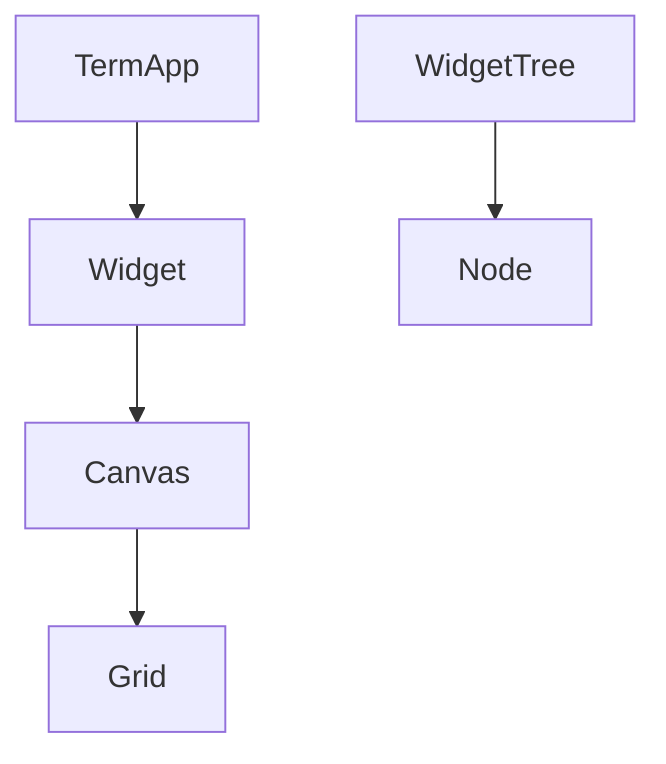
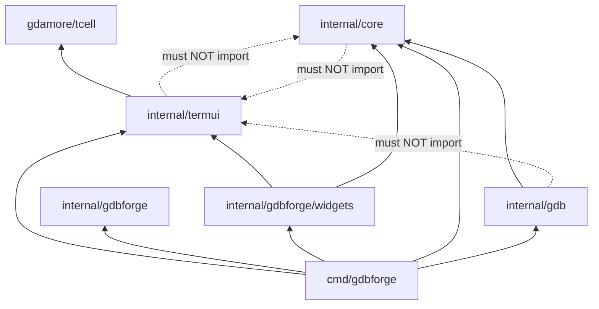

# Directory Structure

This document maps the **gdbforge** repository packages to their responsibilities.

**Companion docs:** [ARCHITECTURE.md](ARCHITECTURE.md) · [DEPENDENCIES.md](DEPENDENCIES.md) · [DEVELOPER_GUIDE.md](DEVELOPER_GUIDE.md)

---

## Table of contents

- [Repository tree](#repository-tree)
- [Command entry points](#command-entry-points)
- [internal/termui](#internaltermui)
- [internal/core](#internalcore)
- [internal/gdb](#internalgdb)
- [internal/dlv](#internaldlv)
- [internal/gdbforge](#internalgdbforge)
- [docs](#docs)
- [Dependency graph](#dependency-graph)
- [What belongs where](#what-belongs-where)

---

## FRAMEWORK vs APP

| Kind | Path | Notes |
|------|------|-------|
| FRAMEWORK | `internal/termui`, `platform`, `commands`, `collections`, `ptyx`, `luahost`, `core` | Reusable TUI / host |
| APP | `internal/gdb`, `dlv`, `mcp`, `internal/gdbforge/*`, `cmd/gdbforge` | Debugger-only |
| APP events | `internal/gdbforge/events` | `GdbOutputMsg` (MI bridge); `InferiorOutputMsg` legacy type (inferior I/O now via `WireTTY`) |
| APP state | `internal/gdbforge/debugstate` | Debugger fields formerly on `platform.AppState` |
| APP DTOs | `internal/gdbforge/models`, `parse`, `mitext` | Break/thread/stack types + MI parsers/string helpers |

Import guardrails: `task check-imports`.

---

## Repository tree

```text
gdbforge/
├── cmd/
│   ├── gdbforge/              # gdbforge debugger app
│   ├── docserve/          # Documentation HTTP server
│   └── dbug/              # (removed — was a dev helper)
├── internal/
│   ├── termui/            # TUI framework (tcell) ★
│   ├── commands/          # Command tree, parser, DSL, key bindings ★
│   ├── collections/       # Shared trie (keys + command children) ★
│   ├── platform/          # Buffer, Logger, AppContext ★
│   ├── luahost/           # Lua VM + framework API (APP wires gdb/dlv) ★
│   ├── ptyx/              # PTY sessions (FRAMEWORK) ★
│   ├── serialmux/         # UART ↔ PTY mux (kgdb one-cable) ★
│   ├── devport/           # Serial port open helper ★
│   ├── demo/               # Host showcase app (no debugger) ★
│   ├── gdbforge/              # Debugger app layer ★
│   │   ├── models/        # Break/thread/stack DTOs
│   │   ├── parse/         # MI parsers (not in mcp)
│   │   ├── mitext/        # MI string unescape / prompt tokens
│   │   ├── debugstate/    # Debugger AppState fields
│   │   ├── events/        # GdbOutputMsg (MI bridge)
│   │   ├── domain/
│   │   ├── layout/
│   │   ├── persist/
│   │   └── widgets/       # Debugger panes (no gdb/mcp imports)
│   ├── core/              # UI-agnostic domain + generic PTY/exec events ★
│   ├── gdb/               # GDB MI2 backend ★
│   ├── dlv/               # Delve CLI backend ★
│   ├── mcp/               # HTTP/MCP surface (thin; parsers elsewhere)
│   └── playground/        # Experiments (not production)
│                          # Tests: *_test.go next to each package (no internal/tests/)
├── docs/                  # gdbforge documentation ★
├── go.mod
├── Taskfile.yml
└── CONTRIBUTING.md
```

★ = primary gdbforge packages

---

## Command entry points

| Path | Binary | Purpose |
|------|--------|---------|
| `cmd/gdbforge/` | `gdbforge` | **gdbforge** debugger app (`package main`, split across files) |
| `cmd/demo/` | `demo` | Host showcase (gdbforge-like UI, basic commands; no GDB) |
| `cmd/docserve/main.go` | `docserve` | Serves `docs/` as HTML with Mermaid |

### `cmd/gdbforge` layout

`DebuggerApp` is a **composition root**: it wires `backend.Backend` and host-backed `*Ctl` controllers (`initControllers`). Domain state lives on controllers; orchestration (stop pipeline, modes, layouts) stays on the app. See `facade.go`.

| File | Responsibility |
|------|----------------|
| `main.go` | `main()` entry |
| `flags.go` | `SessionConfig`, `-g gdb\|dlv` |
| `app.go` | `DebuggerApp` — embeds `LayoutShell` + `DebugSession`; `NewDebuggerApp`, `Close` |
| `facade.go` | Composition-root comment (layers + hosts) |
| `debug_session.go` | `DebugSession` — backend init, GDB widgets, debug `*Ctl` lifecycle |
| `layout_host.go` | `layoutHost` + adapters for `LayoutShell` |
| `lua_host.go` / `dlv_host.go` | `luaHost` / `dlvHost` + adapters |
| `controllers.go` | `initControllers`, host compile checks, adapter forwards |
| `setup.go` | `InitB` — `initLayoutShell`, mode handlers, cmdline |
| `builtins.go` | Shell builtins + `DebugSession.init` |
| `gdb_console.go` | `consoleCtl` — GDB/Delve submit / paint / quit / suspend |
| `io_console.go` | `inferiorIOCtl` — Inferior PTY bridge + OutputWidget intents |
| `console_wire.go` | Shared `wireConsole` / `SetOn*` for GDB / IO / Exec |
| `breakpoints.go` | `breakCtl` — BP sync / toggle / delete / Code+Asm gutters; YAML restore |
| `assembly.go` | `asmCtl` — Assembly widget, `:b asm`, `preferAsm` / `autoAsm` |
| `buffers.go` | `bufferCtl` — per-path CodeWidgets, `:b` / `:edit` |
| `debug_info.go` | `debugInfoCtl` — Thread / call-stack view sync + activate |
| `completion.go` | `completionCtl` — CompletionMenu → CompletionView |
| `search.go` | `searchCtl` — `/` n/N \*/# on focused pane |
| `dlv_ctl.go` | `dlvCtl` — Delve confirm gate; frame-nav / suppress-stop bookkeeping |
| `coalesce.go` | `coalesceRunner` for BP / debug-info refresh bursts |
| `command_tree.go` | `ExapData` colon-command DSL |
| `keybindings.go` | `InitKeyBindings` (n/s/c, Space, …) |
| `actions.go` | Command actions (focus, split, quit, `:!` Exec, …) |
| `input.go` | `HandleInterrupt` (thin dispatch), mode keys, global Ctrl-Z |
| `layout.go` | `:layout` (+ optional `asm`); layout builders |
| `layout_behavior.go` | Per-layout normal-mode key policy |
| `focus.go` | Focus introspection (`focusedCode`, …) |
| `workspace.go` | `LayoutShell` — pane marks; embedded on app |
| `workspace_policy.go` | Code/GDB/last activation, `FocusCode` |
| `workspace_place.go` | `placeCodeInSlot`, logo slot, sticky-GDB swap / JumpBack |
| `workspace_layout.go` | `ApplyLayout` mounts layout `WidgetTree` onto Tab |
| `code_nav.go` | Thin Workspace delegates; `activeCodeWidget`; `sendGdbExec` via `Backend.MapExec` |
| `inferior_tty.go` | `:set inferior-tty` (GDB live / DLV restart) |
| `events.go` | Debugger domain events (`BreakpointsChangedMsg`) |
| `stopped.go` | Stop pipeline; `presentLocation` (Code vs autoAsm); thread/frame select |
| `lua.go` | `luaCtl` — ModeLua; `:lua` / embedded script builtins |
| `debug_domain.go` | `appDebugDomain` → `domain.DebugDomain` for MCP |

Build all commands:

```bash
task build
# or: for d in cmd/*/; do go build -o bin/$(basename $d) ./$d; done
```

---

## internal/termui

**gdbforge TUI framework.** Depends on `tcell` only. App-specific widgets live in `internal/gdbforge/widgets`.

| File | Responsibility |
|------|----------------|
| `term_app.go` | Event loop, `AppApi`, `termui.Event` channel, widget list, grid buffers; `Suspend`/`Resume` (Ctrl-Z job control) |
| `event.go`, `command.go` | UI events (`SubmitMsg`, `CompletionMsg`), `CommandID` |
| `completion_bar.go` | Wildmenu chrome row (`ModeCompletion`); draw-only-when-active |
| `cmd_widget.go` | Global `:` command line (parser for Tab; `SetOnExecute` → app) |
| `history.go`, `autocomplete.go` | CmdLine history; legacy flat completer |
| `widget.go` | `Widget` interface |
| `node.go` | Split tree node types; `SetWidget` / `GetWidget` |
| `layout_tree.go` | Tree walks and ratio algorithms |
| `widget_tree.go` | Split/focus/geometry; `ReplaceFocusedWidget` |
| `tab.go` | Tab container over a per-tab `WidgetTree` |
| `canvas.go` | Local-coordinate drawing context |
| `grid.go` | Off-screen cell framebuffer |
| `cell.go` | Border edge composition |
| `rect.go` | Rectangle primitive |
| `utf.go` | UTF-8 / ANSI text drawing (`DrawANSIText`, `StripANSI`, width helpers) |
| `app_api.go` | `AppAPI` / `UIContext` interfaces |
| `base_widget.go` | Shared widget helpers: event channels, `PaneName`, key trie, default `DrawStatusLine` |
| `input_line.go` | Reusable readline editor (text, cursor, history, paste insert) |
| `console_pane.go` | Natural REPL transcript: scrollback + live/walking prompt + InputLine (Lua REPL) |
| `composite_terminal.go` | xterm emulator + key trie; `AttachTTY`, `Paint`, `HandleKey` |
| `wire_tty.go` | `WireTTY` — PTY bytes ↔ xterm; `WireTTYOpts` (PostFrame, OnExit) |
| `termnial_widget.go` | Generic pane wrapper around one `CompositeTerminal` |
| `viewport.go` | Scroll window, follow-tail, selection/clipboard, optional ANSI + `OmitTail` |
| `viewport_word.go` | Double-click word / triple-click line select + copy |
| `viewport_clipboard.go` | Selection → CLIPBOARD + PRIMARY |
| `clipboard.go` | Middle-paste rising-edge + debounce; paste routing |
| `logger_widget.go` | Reusable log pane (`platform.Sink`, `:clear`, scroll bindings) |
| `status_line.go` | Per-pane status row helpers (`ClearStatusLine`, `PaintStatusBar`) |
| `named_widget.go` | Optional `WindowName()` hook for dynamic pane titles |

## internal/commands

**Hierarchical command tree** for colon commands, tab completion, and shared `CommandNode` types for key bindings.

| File | Responsibility |
|------|----------------|
| `command_node.go` | `CommandNode`, `CommandRegistry` — tree storage |
| `command_parser.go` | `CommandParser` — navigate tree, complete, execute |
| `dsl.go` | `Cmd`, `CmdRest`, `Group`, `Leaf`, `LeafRest` — declarative tree builder |
| `key_binding_gegistry.go` | `KeyBindingRegistry` — key chord → command |

See [COMMAND_SYSTEM.md](COMMAND_SYSTEM.md) for ownership (`CommandNode` = tree, `CommandRegistry` = owns, `CommandParser` = navigates).

## internal/gdbforge

**gdbforge application layer** — backend policy, shared models, layout builders, and debugger views.

| Path | Responsibility |
|------|----------------|
| `backend/` | `Backend` iface — GDB vs Delve policy (`Kind`, `MapExec`, `SupportsAssembly`, …) |
| `backend/gdb_backend.go` | Wraps `*gdb.GDBClient` |
| `backend/dlv_backend.go` | Wraps `*dlv.Client` |
| `backend/refresh.go` | Shared threads/stack query helpers |
| `models/breakpoints.go` | `BreakpointList` — shared BP model (GUI + MCP) |
| `models/types.go` | `BreakInfo`, `BreakGutter`, `GuttersByLine` / `GuttersByAddr` |
| `models/threads.go` | `ThreadList` — stop snapshot |
| `models/callstack.go` | `CallStack` — frame snapshot |
| `models/assembly.go` | `AssemblyList` / `AsmLine` |
| `parse/disassemble.go` | Disassembly parse for Assembly pane |
| `persist/breakpoints.go` | `./.gdbforge/breakpoints.yaml` save/load |
| `domain/domain.go` | `DebugDomain` — peer-controller surface (AI now; future Lua) |
| `layout/` | Named workspace trees (`default`, `panels`, `classic`, `wide`) — geometry only |
| `layout/default.go` | Multi-pane: Code/GDB left; IO / BP / Threads / Callstack right |
| `layout/panels.go` | Code/GDB left; IO over (Threads\|Callstack) over Breakpoints |
| `layout/classic.go` | Original cgdb: full-width Code over GDB |
| `widgets/code_widget.go` | Source view; Space → break toggle; gutters via `BreakGutter` |
| `widgets/assembly_widget.go` | `:b asm`; addr breakpoints; `AssemblyHost` |
| `widgets/break_paint.go` | Shared gutter colors (disabled / conditional / enabled) |
| `widgets/breakpoint_widget.go` | `:b breakpoint`; `BreakpointHost` intents |
| `widgets/thread_widget.go` | `:b threads`; `ThreadHost` |
| `widgets/callstack_widget.go` | `:b callstack`; `CallStackHost` |
| `widgets/file_list_widget.go` | `:edit` picker; `FileListHost` |
| `widgets/output_widget.go` | `:b io`; `CompositeTerminal` + `WireInferior` |
| `widgets/about_widget.go` | Built-in About page (singleton via `:b about`) |
| `widgets/help_widget.go` | Viewport user manual (`:help` / `:b help`) |
| `widgets/logo_widget.go` | Startup splash in the code leaf until source loads |
| `widgets/gdb_widget.go` | GDB/Delve terminal — `CompositeTerminal` + `WireCLI` |
| `widgets/exec_widget.go` | Exec/shell terminal — `CompositeTerminal` + `WireExec` |
| `widgets/lua_widget.go` | Lua script panes |

## internal/mcp

**In-process GDB tool service** for AI / MCP (same Session as the UI).

| File | Responsibility |
|------|----------------|
| `gdb_service.go` | `GdbMcpService` — `GdbCommand` under `WithWrite` + output capture |
| `tools.go` | LLM tool dispatch → `gdbforge/domain.DebugDomain` |
| `break_list.go` | Parse `-break-list` / pending BPs into `BreakInfo` |
| `thread_info.go` | Parse `-thread-info` into `ThreadInfo` |
| `stack_frames.go` | Parse `-stack-list-frames` into `StackFrame` |
| `agent.go` | `:AI` LLM loop (Anthropic / OpenAI) with domain tools + `gdb_command` |

## internal/ptyx

**Unified PTY transport** for GDB (CLI + MI + inferior), Delve, exec, and serial console legs.

| File | Responsibility |
|------|----------------|
| `tty.go` | `ptyx.TTY` — `Start` / `Open` / `AttachPath`; `Subscribe`, `Send`/`SendRaw`, `SetSize`, `Close`, `Master()` |
| `closed.go` | `ClosedError` — detect PTY session end (EOF/EIO) |
| `tty_test.go` | Fan-out, process, attach-path tests |

## internal/serialmux

**Shared UART mux** for kgdb on one serial cable — bridges hardware UART to virtual PTY legs.

| File | Responsibility |
|------|----------------|
| `mux.go` | `Mux` — `devport.Open` (UART) + `ptyx.Open` (console + gdb legs); owner routing |
| `registry.go` | One mux per device path |
| `termios_ioctl_*.go` | Raw mode on PTY masters (not the UART) |

See [PTY_ARCHITECTURE.md](PTY_ARCHITECTURE.md#serial-uart-vs-unix-pty-why-both) and [KERNEL_KGDB.md](KERNEL_KGDB.md).

## internal/devport

**Device open helper** — `go.bug.st/serial` wrapper for `/dev/ttyUSB*` (8N1).

| File | Responsibility |
|------|----------------|
| `open.go` | `Open(device, baud)` — hardware UART (used by `serialmux`) |

## internal/execcli

**External process PTY client** (Vim-style `:!` sessions) — thin wrapper over `ptyx`.

| File | Responsibility |
|------|----------------|
| `exec_client.go` | `ExecClient` embeds `*ptyx.TTY`; `ptyx.Start` |

See [EXEC_SHELL.md](EXEC_SHELL.md).

`cmd/gdbforge` wires `DebuggerApp` across `app.go`, `setup.go`, `input.go`, and related files (see table above).



---

## internal/core

**UI-agnostic domain logic.** No imports of `tcell` or other terminal packages.

Today this package holds shared primitives (`Buffer`, `Debugger` interface, backend event types). Explicit application models live in `internal/gdbforge/models` (breakpoints, threads, call stack).

| File | Responsibility |
|------|----------------|
| `events.go` | Backend events (`PtyOutputMsg`, `ExecOutputMsg` in `core`; `GdbOutputMsg` in `gdbforge/events`) |
| `debugger.go` | `Debugger` / `Session` / `PTYWriter` — send, Subscribe, WithWrite |
| `buffer.go` | Line-oriented text storage — building block for text-oriented models |
| `viewport.go` | Scroll window over buffer |

**Rule:** if it can be tested without a terminal, it belongs here.

CmdLine helpers (`history`, `autocomplete`, command registry) live in **`termui`**, not `core`. UI domain events (`SubmitMsg`, `CommandID`) also live in **`termui`**; `core/events.go` holds generic PTY/exec types; `gdbforge/events` holds `GdbOutputMsg` (MI bridge).

---

## internal/gdb

**GDB MI2 backend.** Owns GDB PTY + inferior TTY; parses MI. Implements `core.Session`.

| File | Responsibility |
|------|----------------|
| `gdb_client.go` | `GDBClient` — CLI + MI + inferior `*ptyx.TTY`; `new-ui mi2` bootstrap |
| `mi.go` | MI string decode, field extraction, tab expansion |
| `mi_msg.go` | Batch line parser → structured `MiMsg` (helper / tests) |
| `mi_state.go` | Stream splitter: `PushRaw` → `MiUpdate` per complete MI line |

**Rule:** no imports from `termui`. GDB MI → `GdbOutputMsg` → parser; inferior/CLI bytes → `WireTTY` → `CompositeTerminal`.

Application orchestration for gdbforge lives in **`cmd/gdbforge`** (`DebuggerApp` embeds `termui.TermApp` and implements `HandleCoreEvents`).

---

## internal/dlv

**Delve interactive CLI backend** (peer of `internal/gdb`). Spawns `dlv exec --` on `ptyx`; implements `core.Session`.

| File | Responsibility |
|------|----------------|
| `client.go` | `Client` embeds `*ptyx.TTY`; waits for `(dlv)` on startup |
| `input_state.go` | Stream splitter: `PushRaw` → `Update` (stops, prompts, `[Y/n]?`, BP notifies) |
| `confirm.go` | `ConfirmGate` for Delve yes/no prompts (suspended breakpoint after exit) |
| `complete.go` | Console Tab: command names + `funcs ^<prefix>` locspec completion |
| `parse.go` | Text parsers for `breakpoints` / `stack` / `goroutines` → MCP row types |

Selected with `gdbforge -g dlv`. See [DEBUGGER_INTEGRATION.md](DEBUGGER_INTEGRATION.md#delve-backend-peer-of-gdb).

---

## docs

| Path | Purpose |
|------|---------|
| `README.md` | Documentation index |
| `OVERVIEW.md` | Vision and comparison |
| `ARCHITECTURE.md` | High-level architecture |
| `PTY_ARCHITECTURE.md` | Dual PTY master/slave, `:b io`, external tty, Delve TCP |
| `UI_ARCHITECTURE.md` | Widget/canvas/grid details |
| `WINDOW_MANAGEMENT.md` | Splits, tabs, CmdLine |
| `RENDERING.md` | Grid, cells, diff rendering |
| `INPUT.md` | Keyboard, modes, commands |
| `COMMAND_SYSTEM.md` | Command tree, DSL, rest-args |
| `EXEC_SHELL.md` | `:!` exec panes, jump list |
| `DEBUGGER_INTEGRATION.md` | GDB MI / Delve details (see also PTY_ARCHITECTURE) |
| `PLUGINS.md` | Lua extensibility plans |
| `DIRECTORY_STRUCTURE.md` | This file |
| `DEPENDENCIES.md` | Go module + internal package rules |
| `ROADMAP.md` | Status and plans |
| `DEVELOPER_GUIDE.md` | Contributor onboarding |
| `HOSTING.md` | Docs server |
| `diagrams/*.mermaid` | Standalone diagram sources |
| `www/` | Browser viewer assets |
| `serve.sh` | Launch docs server |

---

## Dependency graph

Full detail: **[DEPENDENCIES.md](DEPENDENCIES.md)**.



---

## What belongs where

| Question | Package |
|----------|---------|
| Application model (domain state)? | `internal/gdbforge/models` |
| Peer control surface (AI / Lua)? | `internal/gdbforge/domain` (+ `cmd/gdbforge/debug_domain.go` impl) |
| Service (external I/O)? | `gdb` or future backend packages |
| Split pane layout / window manager? | `termui` |
| Widget (view of a model)? | `internal/gdbforge/widgets` or `termui` |
| GDB MI parsing? | `gdb` |
| Scrollable text storage primitive? | `core` |
| Key binding in normal mode? | `cmd/gdbforge/keybindings.go` + `input.go` |
| Interaction mode state? | `platform.AppState` via `TermApp` |
| Spawn/debug external process? | `gdb` (or future backend service) |
| `:buffer` / model registry? | App startup + `HandleCoreEvents` dispatch |
| Vim `:` command registry? | `internal/commands` + `cmd/gdbforge/command_tree.go` |
| Draw box borders? | `termui` Grid/Cell |
| Compose services + models + UI? | `cmd/gdbforge/setup.go` |

When unsure, ask: **"Can this be unit-tested without a terminal?"** — if yes, prefer `core` or a dedicated model package over `termui`.

---

## Related documentation

- [DEVELOPER_GUIDE.md](DEVELOPER_GUIDE.md) — file walk order
- [ARCHITECTURE.md](ARCHITECTURE.md) — subsystem overview
