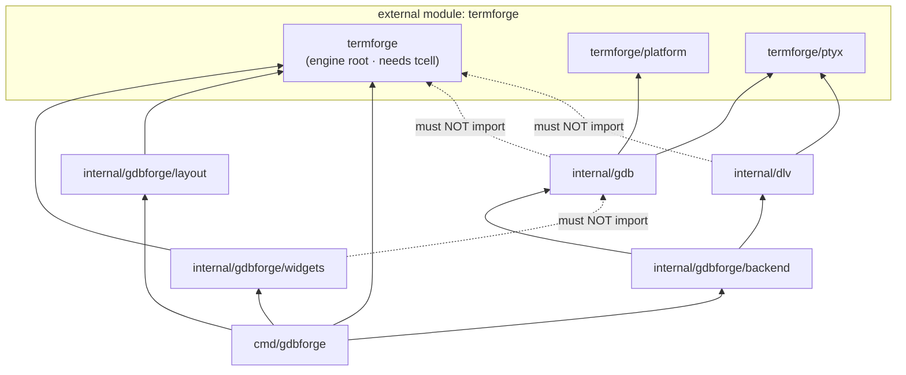

# Directory Structure

This document maps the **gdbforge** repository packages to their responsibilities.

**Companion docs:** [ARCHITECTURE.md](ARCHITECTURE.md) · [DEPENDENCIES.md](DEPENDENCIES.md) · [DEVELOPER_GUIDE.md](DEVELOPER_GUIDE.md)

---

## Table of contents

- [Framework vs application](#framework-vs-application)
- [Repository tree](#repository-tree)
- [Command entry points](#command-entry-points)
- [internal/gdbforge](#internalgdbforge)
- [internal/mcp](#internalmcp)
- [internal/serialmux](#internalserialmux)
- [internal/gdb](#internalgdb)
- [internal/dlv](#internaldlv)
- [docs](#docs)
- [Dependency graph](#dependency-graph)
- [What belongs where](#what-belongs-where)

---

## Framework vs application

The terminal UI framework lives in a **separate module**,
[termforge](https://github.com/yairgd/termforge). Everything in this repository is the
debugger application.

| Kind | Where | Notes |
|------|-------|-------|
| Framework | `github.com/yairgd/termforge` (+ `/platform`, `/commands`, `/collections`, `/ptyx`, `/execcli`, `/devport`) | Reusable TUI — see [termforge docs](https://yairgd.github.io/termforge/) |
| Application | `internal/gdb`, `internal/dlv`, `internal/mcp`, `internal/gdbforge/*`, `cmd/gdbforge` | Debugger-only |
| App events | `internal/gdbforge/events` | `GdbOutputMsg` (MI bridge) |
| App state | `internal/gdbforge/debugstate` | Debugger session fields |
| App DTOs | `internal/gdbforge/models`, `parse`, `mitext` | Break/thread/stack types + MI parsers / string helpers |
| Script host | `internal/luahost` | Generic Lua VM; debugger bindings come from `internal/gdbforge/luadebug` |

Import guardrails: `task check-imports`.

---

## Repository tree

```text
gdbforge/
├── cmd/
│   ├── gdbforge/          # Debugger app — composition root
│   ├── docserve/          # Documentation HTTP server
│   └── flowdoc/           # Code-flow catalog generator (build-time)
├── internal/
│   ├── gdbforge/          # Debugger app layer
│   │   ├── models/        # Break/thread/stack DTOs
│   │   ├── parse/         # MI parsers
│   │   ├── mitext/        # MI string unescape / prompt tokens
│   │   ├── debugstate/    # Debugger session state
│   │   ├── events/        # GdbOutputMsg (MI bridge)
│   │   ├── domain/        # DebugDomain surface for MCP
│   │   ├── debugger/      # Backend-facing debugger interfaces
│   │   ├── backend/       # backend.Backend — GDB/Delve policy surface
│   │   ├── layout/        # Named workspace builders
│   │   ├── luadebug/      # Debugger Lua bindings
│   │   ├── persist/       # Breakpoint + history YAML
│   │   └── widgets/       # Debugger panes (no gdb/mcp imports)
│   ├── gdb/               # GDB MI2 backend
│   ├── dlv/               # Delve backend (rpc2 + CLI PTY)
│   ├── mcp/               # HTTP/MCP surface
│   ├── luahost/           # Lua VM + generic script API
│   └── serialmux/         # UART ↔ PTY mux (kgdb one-cable)
│                          # Tests: *_test.go next to each package
├── docs/                  # gdbforge documentation
├── lua/                   # Shipped Lua workflows (embedded via lua/fs.go)
├── examples/              # Sample programs to debug
├── scripts/               # check_imports.sh and friends
├── go.mod                 # requires github.com/yairgd/termforge
├── Taskfile.yml
└── CONTRIBUTING.md
```

The UI framework is **not** in this tree — it is the `termforge` module. See
[termforge: package layout](https://yairgd.github.io/termforge/#package-layout).

---

## Command entry points

| Path | Binary | Purpose |
|------|--------|---------|
| `cmd/gdbforge/` | `gdbforge` | **gdbforge** debugger app (`package main`, split across files) |
| `cmd/docserve/main.go` | `docserve` | Serves `docs/` as HTML with Mermaid |
| `cmd/flowdoc/` | `flowdoc` | Generates and validates `docs/flows/flows.json` |

A framework showcase binary lives in the termforge repository at
[`cmd/demo`](https://github.com/yairgd/termforge/tree/main/cmd/demo).

### `cmd/gdbforge` layout

`DebuggerApp` is a **composition root**: it wires `backend.Backend` and host-backed `*Ctl` controllers (`initControllers`). Domain state lives on controllers; orchestration (stop pipeline, modes, layouts) stays on the app. See `facade.go`.

| File | Responsibility |
|------|----------------|
| `main.go` | `main()` entry |
| `flags.go` | `SessionConfig`, `-g gdb\|dlv` |
| `app.go` | `DebuggerApp` — embeds `LayoutShell` + `DebugSession`; `NewDebuggerApp`, `Close` |
| `facade.go` | Composition-root comment (layers + hosts) |
| `debug_session.go` | `DebugSession` — backend init, GDB widgets, debug `*Ctl` lifecycle |
| `layout_host.go` | `layoutHost` + adapters for `LayoutShell` |
| `lua_host.go` / `dlv_host.go` | `luaHost` / `dlvHost` + adapters |
| `controllers.go` | `initControllers`, host compile checks, adapter forwards |
| `setup.go` | `InitB` — `initLayoutShell`, mode handlers, cmdline |
| `builtins.go` | Shell builtins + `DebugSession.init` |
| `gdb_console.go` | `consoleCtl` — GDB/Delve submit / paint / quit / suspend |
| `io_console.go` | `inferiorIOCtl` — Inferior PTY bridge + OutputWidget intents |
| `console_wire.go` | Shared `wireConsole` / `SetOn*` for GDB / IO / Exec |
| `breakpoints.go` | `breakCtl` — BP sync / toggle / delete / Code+Asm gutters; YAML restore |
| `assembly.go` | `asmCtl` — Assembly widget, `:b asm`, `preferAsm` / `autoAsm` |
| `buffers.go` | `bufferCtl` — per-path CodeWidgets, `:b` / `:edit` |
| `debug_info.go` | `debugInfoCtl` — Thread / call-stack view sync + activate |
| `completion.go` | `completionCtl` — CompletionMenu → CompletionView |
| `search.go` | `searchCtl` — `/` n/N \*/# on focused pane |
| `dlv_ctl.go` | `dlvCtl` — Delve confirm gate; frame-nav / suppress-stop bookkeeping |
| `coalesce.go` | `coalesceRunner` for BP / debug-info refresh bursts |
| `command_tree.go` | `ExapData` colon-command DSL |
| `keybindings.go` | `InitKeyBindings` (n/s/c, Space, …) |
| `actions.go` | Command actions (focus, split, quit, `:!` Exec, …) |
| `input.go` | `HandleInterrupt` (thin dispatch), mode keys, global Ctrl-Z |
| `layout.go` | `:layout` (+ optional `asm`); layout builders |
| `layout_behavior.go` | Per-layout normal-mode key policy |
| `focus.go` | Focus introspection (`focusedCode`, …) |
| `workspace.go` | `LayoutShell` — pane marks; embedded on app |
| `workspace_policy.go` | Code/GDB/last activation, `FocusCode` |
| `workspace_place.go` | `placeCodeInSlot`, logo slot, sticky-GDB swap / JumpBack |
| `workspace_layout.go` | `ApplyLayout` mounts layout `WidgetTree` onto Tab |
| `code_nav.go` | Thin Workspace delegates; `activeCodeWidget`; `sendGdbExec` via `Backend.MapExec` |
| `inferior_tty.go` | `:set inferior-tty` (GDB live / DLV restart) |
| `inferior_tty_hold.go` | `--hold-inferior-tty` helper — keeps the external window open and releases its pts so the inferior gets a controlling terminal |
| `events.go` | Debugger domain events (`BreakpointsChangedMsg`) |
| `stopped.go` | Stop pipeline; `presentLocation` (Code vs autoAsm); thread/frame select |
| `lua.go` | `luaCtl` — ModeLua; `:lua` / embedded script builtins |
| `debug_domain.go` | `appDebugDomain` → `domain.DebugDomain` for MCP |

Build all commands:

```bash
task build
# or: for d in cmd/*/; do go build -o bin/$(basename $d) ./$d; done
```

---

## internal/gdbforge

**gdbforge application layer** — backend policy, shared models, layout builders, and debugger views.

| Path | Responsibility |
|------|----------------|
| `backend/` | `Backend` iface — semantic debugger ops + capability flags; GDB vs Delve policy |
| `backend/gdb_backend.go` | `GDBBackend` — wraps `*gdb.GDBClient`; MI strings internal |
| `backend/dlv_backend.go` | `DLVBackend` — wraps `*dlv.Client`; rpc2 + CLI |
| `backend/ops.go` | Shared `Exec`, frame/thread select, navigation helpers |
| `backend/break_cmds.go` | Breakpoint semantic commands |
| `backend/dlv_rpc.go` | Delve rpc2-backed queries and ops |
| `backend/refresh.go` | Shared threads/stack query helpers |
| `debugger/` | Cross-backend stop/console types — `StopInfo`, `ConsoleUpdate`, `InferiorIO` |
| `debugger/stop.go` | Stop pipeline input |
| `debugger/update.go` | Console update from backend parsers |
| `debugger/inferior_io.go` | Inferior routing interface (`InferiorInternal` / external) |
| `models/breakpoints.go` | `BreakpointList` — shared BP model (GUI + MCP) |
| `models/types.go` | `BreakInfo`, `BreakGutter`, `GuttersByLine` / `GuttersByAddr` |
| `models/threads.go` | `ThreadList` — stop snapshot |
| `models/callstack.go` | `CallStack` — frame snapshot |
| `models/assembly.go` | `AssemblyList` / `AsmLine` |
| `parse/disassemble.go` | Disassembly parse for Assembly pane |
| `persist/breakpoints.go` | `./.gdbforge/breakpoints.yaml` save/load |
| `domain/domain.go` | `DebugDomain` — peer-controller surface (AI now; future Lua) |
| `layout/` | Named workspace trees (`default`, `panels`, `classic`, `wide`) — geometry only |
| `layout/default.go` | Multi-pane: Code/GDB left; IO / BP / Threads / Callstack right |
| `layout/panels.go` | Code/GDB left; IO over (Threads\|Callstack) over Breakpoints |
| `layout/classic.go` | Original cgdb: full-width Code over GDB |
| `widgets/code_widget.go` | Source view; Space → break toggle; gutters via `BreakGutter` |
| `widgets/assembly_widget.go` | `:b asm`; addr breakpoints; `AssemblyHost` |
| `widgets/break_paint.go` | Shared gutter colors (disabled / conditional / enabled) |
| `widgets/breakpoint_widget.go` | `:b breakpoint`; embeds `TableWidget`; `BreakpointHost` |
| `widgets/thread_widget.go` | `:b threads`; embeds `TableWidget`; `ThreadHost` |
| `widgets/callstack_widget.go` | `:b callstack`; embeds `TableWidget`; `CallStackHost` |
| `widgets/file_list_widget.go` | `:edit` picker; embeds `TableWidget` (# · File); `FileListHost` |
| `widgets/output_widget.go` | `:b io`; `CompositeTerminal` + `WireInferior` |
| `widgets/about_widget.go` | Built-in About page (singleton via `:b about`) |
| `widgets/help_widget.go` | Viewport user manual (`:help` / `:b help`) |
| `widgets/logo_widget.go` | Startup splash in the code leaf until source loads |
| `widgets/gdb_widget.go` | GDB/Delve terminal — `CompositeTerminal` + `WireCLI` |
| `widgets/exec_widget.go` | Exec/shell terminal — `CompositeTerminal` + `WireExec` |
| `widgets/lua_widget.go` | Lua script panes |

## internal/mcp

**In-process GDB tool service** for AI / MCP (same Session as the UI).

| File | Responsibility |
|------|----------------|
| `gdb_service.go` | `GdbMcpService` — `GdbCommand` under `WithWrite` + output capture |
| `tools.go` | LLM tool dispatch → `gdbforge/domain.DebugDomain` |
| `break_list.go` | Parse `-break-list` / pending BPs into `BreakInfo` |
| `thread_info.go` | Parse `-thread-info` into `ThreadInfo` |
| `stack_frames.go` | Parse `-stack-list-frames` into `StackFrame` |
| `agent.go` | `:AI` LLM loop (Anthropic / OpenAI) with domain tools + `gdb_command` |

## internal/serialmux

**Shared UART mux** for kgdb on one serial cable — bridges hardware UART to virtual PTY legs.

| File | Responsibility |
|------|----------------|
| `mux.go` | `Mux` — `devport.Open` (UART) + `ptyx.Open` (console + gdb legs); owner routing |
| `registry.go` | One mux per device path |
| `termios_ioctl_*.go` | Raw mode on PTY masters (not the UART) |

See [PTY_ARCHITECTURE.md](PTY_ARCHITECTURE.md#serial-uart-vs-unix-pty-why-both) and [KERNEL_KGDB.md](KERNEL_KGDB.md).

## internal/gdb

**GDB MI2 backend.** Owns GDB PTY + inferior TTY; parses MI. Implements `ptyx.Session`.

| File | Responsibility |
|------|----------------|
| `gdb_client.go` | `GDBClient` — CLI + MI + inferior `*ptyx.TTY`; `new-ui mi2` bootstrap |
| `mi.go` | MI string decode, field extraction, tab expansion |
| `mi_msg.go` | Batch line parser → structured `MiMsg` (helper / tests) |
| `mi_state.go` | Stream splitter: `PushRaw` → `MiUpdate` per complete MI line |

**Rule:** no imports from `termforge`. GDB MI → `GdbOutputMsg` → parser; inferior/CLI bytes → `WireTTY` → `CompositeTerminal`.

Application orchestration for gdbforge lives in **`cmd/gdbforge`** (`DebuggerApp` embeds `termforge.App` and implements `HandleCoreEvents`).

---

## internal/dlv

**Delve backend** (peer of `internal/gdb`). Headless `dlv exec` + **rpc2** + `dlv connect` CLI PTY; inferior via `--tty`.

| File | Responsibility |
|------|----------------|
| `client.go` | `Client` — headless child, rpc2 dial, `dlv connect` PTY, inferior TTY |
| `rpc_dial.go` | `DialRPC`, `PickListenAddr` |
| `rpc_convert.go` | Delve `api.*` → `models.*` row types |
| `input_state.go` | Stream splitter: `PushRaw` → `Update` (stops, prompts, `[Y/n]?`, BP notifies) |
| `confirm.go` | `ConfirmGate` for Delve yes/no prompts (suspended breakpoint after exit) |
| `complete.go` | Console Tab: command names + `funcs ^<prefix>` locspec completion |
| `parse.go` | Text parsers for CLI fallback scrape → MCP row types |

Selected with `gdbforge -g dlv`. See [DEBUGGER_INTEGRATION.md](DEBUGGER_INTEGRATION.md#delve-backend-peer-of-gdb).

---

## docs

| Path | Purpose |
|------|---------|
| `README.md` | Documentation index |
| `OVERVIEW.md` | Vision and comparison |
| `ARCHITECTURE.md` | High-level architecture |
| `PTY_ARCHITECTURE.md` | Dual PTY master/slave, `:b io`, external tty, Delve TCP |
| *(moved to termforge)* | Widget/canvas/grid details |
| `WINDOW_MANAGEMENT.md` | Splits, tabs, CmdLine |
| *(moved to termforge)* | Grid, cells, diff rendering |
| `INPUT.md` | Keyboard, modes, commands |
| `COMMAND_SYSTEM.md` | Command tree, DSL, rest-args |
| `EXEC_SHELL.md` | `:!` exec panes, jump list |
| `DEBUGGER_INTEGRATION.md` | GDB MI / Delve details (see also PTY_ARCHITECTURE) |
| `PLUGINS.md` | Lua extensibility plans |
| `DIRECTORY_STRUCTURE.md` | This file |
| `DEPENDENCIES.md` | Go module + internal package rules |
| `ROADMAP.md` | Status and plans |
| `DEVELOPER_GUIDE.md` | Contributor onboarding |
| `HOSTING.md` | Docs server |
| `diagrams/*.mermaid` | Standalone diagram sources |
| `www/` | Browser viewer assets |
| `serve.sh` | Launch docs server |

---

## Dependency graph

Full detail: **[DEPENDENCIES.md](DEPENDENCIES.md)**.



Only `cmd/gdbforge`, `internal/gdbforge/widgets`, and `internal/gdbforge/layout` touch
the termforge engine root. Backends reach the headless subpackages only, so they stay
testable without a terminal.

---

## What belongs where

| Question | Package |
|----------|---------|
| Application model (domain state)? | `internal/gdbforge/models` |
| Peer control surface (AI / Lua)? | `internal/gdbforge/domain` (+ `cmd/gdbforge/debug_domain.go` impl) |
| Service (external I/O)? | `internal/gdb`, `internal/dlv`, or a new backend package |
| GDB MI parsing? | `internal/gdb` + `internal/gdbforge/parse` |
| Debugger pane (view of a model)? | `internal/gdbforge/widgets` |
| Named workspace preset? | `internal/gdbforge/layout` |
| Key binding in normal mode? | `cmd/gdbforge/keybindings.go` + `input.go` |
| Debugger session state? | `internal/gdbforge/debugstate` |
| Breakpoint / history persistence? | `internal/gdbforge/persist` |
| Debugger Lua binding? | `internal/gdbforge/luadebug` |
| Colon command for the debugger? | `cmd/gdbforge/command_tree.go` |
| Compose backends + controllers + UI? | `cmd/gdbforge/setup.go` |
| Split pane layout / window manager? | **termforge** — not this repo |
| Generic widget, scroll primitive, box borders? | **termforge** — not this repo |
| Interaction mode plumbing? | **termforge** (`platform.AppState` via `App`) |

Two questions settle most cases:

1. **"Can this be unit-tested without a terminal?"** If yes, keep it out of any package
   that imports the termforge engine root.
2. **"Would the stock dashboard want this?"** If yes, it belongs upstream in termforge,
   not here.

---

## Related documentation

- [DEVELOPER_GUIDE.md](DEVELOPER_GUIDE.md) — file walk order
- [ARCHITECTURE.md](ARCHITECTURE.md) — subsystem overview
