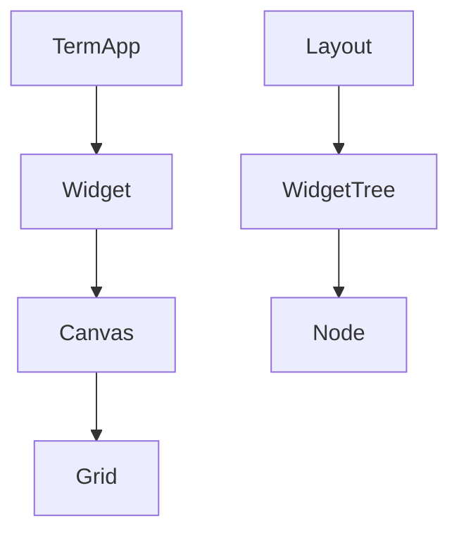
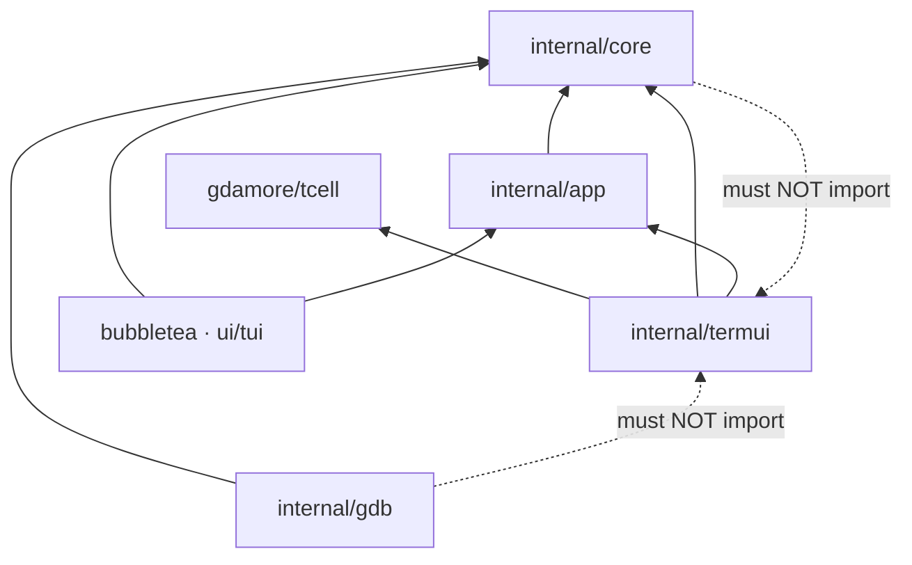

# Directory Structure

This document maps the **promptcore** repository packages to their responsibilities, with emphasis on NewCGDB components.

**Companion docs:** [ARCHITECTURE.md](ARCHITECTURE.md) · [DEVELOPER_GUIDE.md](DEVELOPER_GUIDE.md)

---

## Table of contents

- [Repository tree](#repository-tree)
- [Command entry points](#command-entry-points)
- [internal/termui](#internaltermui)
- [internal/core](#internalcore)
- [internal/gdb](#internalgdb)
- [internal/app](#internalapp)
- [internal/ui/tui](#internaluitui)
- [docs](#docs)
- [Dependency graph](#dependency-graph)
- [What belongs where](#what-belongs-where)

---

## Repository tree

```text
promptcore/
├── cmd/
│   ├── uitcell/              # NewCGDB prototype
│   ├── docserve/             # Documentation HTTP server
│   ├── tui/                  # Legacy Bubble Tea chat TUI
│   ├── dbug/                 # Debug utilities
│   └── server/               # HTTP orchestrator (PromptCore API)
├── internal/
│   ├── termui/               # NewCGDB terminal UI ★
│   ├── core/                 # UI-agnostic domain logic ★
│   ├── gdb/                  # GDB MI2 backend ★
│   ├── app/                  # Application orchestration
│   ├── api/                  # HTTP handlers
│   └── ui/
│       ├── tui/              # Legacy Bubble Tea adapter
│       └── uitcell/          # Helpers
├── docs/                     # NewCGDB documentation ★
├── internal/playground/      # Experiments (not production)
├── go.mod
├── Taskfile.yml
└── CONTRIBUTING.md
```

★ = primary NewCGDB packages

---

## Command entry points

| Path | Binary | Purpose |
|------|--------|---------|
| `cmd/uitcell/main.go` | `uitcell` | **NewCGDB prototype** — split workspace demo |
| `cmd/docserve/main.go` | `docserve` | Serves `docs/` as HTML with Mermaid |
| `cmd/tui/main.go` | `tui` | PromptCore chat TUI (Bubble Tea) |
| `cmd/dbug/main.go` | `dbug` | Development/debug helper |
| `cmd/server/orchestrator.go` | `server` | HTTP API server |

Build all commands:

```bash
task build
# or: for d in cmd/*/; do go build -o bin/$(basename $d) ./$d; done
```

---

## internal/termui

**NewCGDB presentation layer.** Depends on `tcell` and `internal/core`. Must not contain GDB spawn logic (that stays in `internal/gdb`).

| File | Responsibility |
|------|----------------|
| `term_app.go` | Event loop, `AppApi`, event bus channel, widget list, grid buffers |
| `widget.go` | `Widget` interface |
| `node.go` | Split tree node types |
| `widget_tree.go` | Split/focus/layout recursion |
| `layout.go` | `Layout` facade over `WidgetTree` |
| `canvas.go` | Local-coordinate drawing context |
| `grid.go` | Off-screen cell framebuffer |
| `cell.go` | Border edge composition |
| `rect.go` | Rectangle primitive |
| `utf.go` | UTF-8 / ANSI text drawing |
| `tab.go` | Tab container (single-tab stub) |
| `cmd_widget.go` | Command line widget stub |
| `code_widget.go` | Source view prototype |
| `gdb_widget.go` | GDB console widget |
| `app_api.go` | `AppAPI` / `UIContext` interfaces |
| `base_widget.go` | Placeholder for shared widget helpers |



---

## internal/core

**UI-agnostic domain logic.** No imports of `tcell`, `bubbletea`, or terminal packages.

| File | Responsibility |
|------|----------------|
| `events.go` | `Event`, `CommandEvent`, `SubmitMsg`, `GdbOutputMsg`, … |
| `command.go` | `CommandID`, `CmdUnknown`, `Command` struct, `Commands` registry |
| `debugger.go` | `Debugger` interface |
| `buffer.go` | Line-oriented text buffer (GDB output, source) |
| `viewport.go` | Scroll window over buffer |
| `history.go` | Command history navigation |
| `autocomplete.go` | Tab completion for CmdLine |
| `commands.go` | Reserved (legacy chat registry stub) |
| `session.go` | Session management |
| `message.go` | Message model (chat) |
| `context.go` | AI context (PromptCore) |
| `ai.go` | AI integration (PromptCore) |

**Rule:** if it can be tested without a terminal, it belongs here.

---

## internal/gdb

**GDB MI2 backend.** Talks to GDB via PTY. Parses MI output. Implements `core.Debugger`.

| File | Responsibility |
|------|----------------|
| `gdb_client.go` | Spawn GDB, PTY I/O, reader goroutine |
| `mi.go` | MI string decode, field extraction, tab expansion |
| `mi_msg.go` | Batch line parser → structured `MiMsg` |
| `mi_state.go` | Burst buffering with debounce timer |

**Rule:** no imports from `termui`. Output reaches UI via `core.GdbOutputMsg` channel + `EventInterrupt`.

---

## internal/app

**Application orchestration** between UI adapters and core.

| File | Responsibility |
|------|----------------|
| `app.go` | Connects UI ↔ core (chat application) |
| `state.go` | `AppState` |
| `handler.go` | Event handlers |
| `modes.go` | Interaction mode constants |

NewCGDB will increasingly use this layer for mode routing and session lifecycle as `TermApp` grows beyond a flat widget list.

---

## internal/ui/tui

**Legacy Bubble Tea UI adapter** for the PromptCore chat application. Separate from NewCGDB.

| File | Responsibility |
|------|----------------|
| `model.go` | Main `tea.Model` |
| `chat.go` | Chat display |
| `input.go` | Input handling |
| `layout.go` | Lip Gloss layout |
| `gdb_widget.go` | Earlier GDB experiment in Bubble Tea |
| `gdb_model.go` | GDB model for Bubble Tea |
| `cmd_input_box.go` | Command input component |

**Note:** do not add NewCGDB features here. Use `internal/termui`.

---

## docs

| Path | Purpose |
|------|---------|
| `README.md` | Documentation index |
| `OVERVIEW.md` | Vision and comparison |
| `ARCHITECTURE.md` | High-level architecture |
| `UI_ARCHITECTURE.md` | Widget/canvas/grid details |
| `WINDOW_MANAGEMENT.md` | Splits, tabs, CmdLine |
| `RENDERING.md` | Grid, cells, diff rendering |
| `INPUT.md` | Keyboard, modes, commands |
| `DEBUGGER_INTEGRATION.md` | GDB and future backends |
| `PLUGINS.md` | Lua extensibility plans |
| `DIRECTORY_STRUCTURE.md` | This file |
| `ROADMAP.md` | Status and plans |
| `DEVELOPER_GUIDE.md` | Contributor onboarding |
| `HOSTING.md` | Docs server |
| `diagrams/*.mermaid` | Standalone diagram sources |
| `www/` | Browser viewer assets |
| `serve.sh` | Launch docs server |

---

## Dependency graph



---

## What belongs where

| Question | Package |
|----------|---------|
| Split pane layout? | `termui` |
| GDB MI parsing? | `gdb` |
| Scrollable text buffer? | `core` |
| Key binding in focus mode? | `termui` widget |
| Spawn/debug external process? | `gdb` (or future backend) |
| Vim `:` command registry? | `core` + `app` dispatch |
| Draw box borders? | `termui` Grid/Cell |
| HTTP API? | `internal/api` |
| Chat AI context? | `core` / `app` (PromptCore) |

When unsure, ask: **"Can this be unit-tested without a terminal?"** — if yes, prefer `core`.

---

## Related documentation

- [DEVELOPER_GUIDE.md](DEVELOPER_GUIDE.md) — file walk order
- [ARCHITECTURE.md](ARCHITECTURE.md) — subsystem overview
