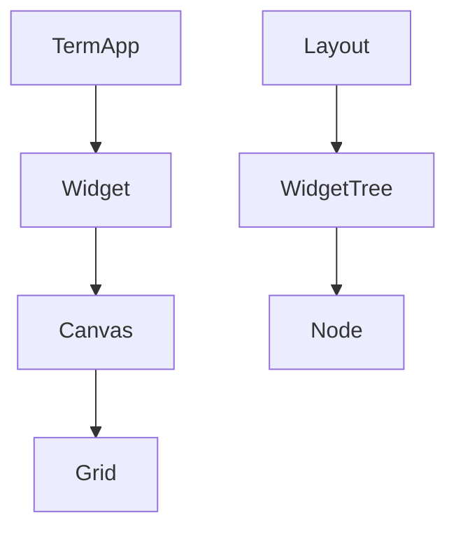
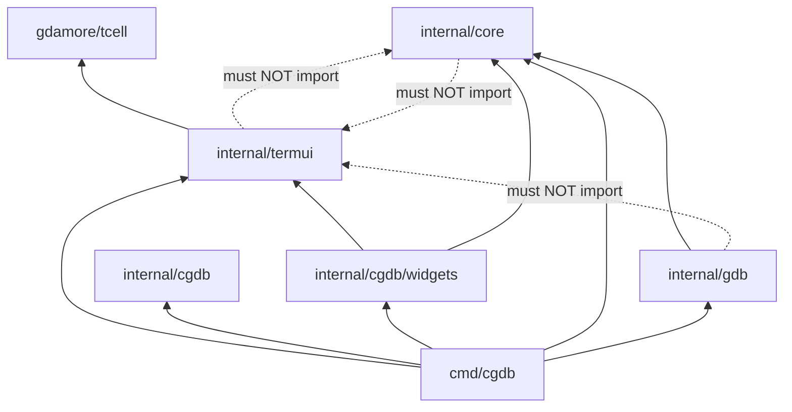

# Directory Structure

This document maps the **cgdb-go** repository packages to their responsibilities.

**Companion docs:** [ARCHITECTURE.md](ARCHITECTURE.md) · [DEPENDENCIES.md](DEPENDENCIES.md) · [DEVELOPER_GUIDE.md](DEVELOPER_GUIDE.md)

---

## Table of contents

- [Repository tree](#repository-tree)
- [Command entry points](#command-entry-points)
- [internal/termui](#internaltermui)
- [internal/core](#internalcore)
- [internal/gdb](#internalgdb)
- [internal/cgdb](#internalcgdb)
- [docs](#docs)
- [Dependency graph](#dependency-graph)
- [What belongs where](#what-belongs-where)

---

## Repository tree

```text
cgdb-go/
├── cmd/
│   ├── cgdb/              # cgdb-go debugger prototype
│   ├── docserve/          # Documentation HTTP server
│   └── dbug/              # (removed — was a dev helper)
├── internal/
│   ├── termui/            # TUI framework (tcell) ★
│   ├── cgdb/              # App layer: modes, app state ★
│   │   ├── mode_manager.go
│   │   └── widgets/
│   ├── core/              # UI-agnostic domain logic ★
│   ├── gdb/               # GDB MI2 backend ★
│   ├── playground/        # Experiments (not production)
│   └── tests/
├── docs/                  # cgdb-go documentation ★
├── go.mod
├── Taskfile.yml
└── CONTRIBUTING.md
```

★ = primary cgdb-go packages

---

## Command entry points

| Path | Binary | Purpose |
|------|--------|---------|
| `cmd/cgdb/main.go` | `cgdb` | **cgdb-go prototype** — split workspace demo |
| `cmd/docserve/main.go` | `docserve` | Serves `docs/` as HTML with Mermaid |

Build all commands:

```bash
task build
# or: for d in cmd/*/; do go build -o bin/$(basename $d) ./$d; done
```

---

## internal/termui

**cgdb-go TUI framework.** Depends on `tcell` only. App-specific widgets live in `internal/cgdb/widgets`.

| File | Responsibility |
|------|----------------|
| `term_app.go` | Event loop, `AppApi`, `termui.Event` bus, widget list, grid buffers |
| `event.go`, `command.go` | UI event bus, `SubmitMsg`, `CommandID`, `CmdUnknown` |
| `cmd_widget.go` | Global `:` command line |
| `trie.go` | Multi-key sequence prefix tree |
| `history.go`, `autocomplete.go` | CmdLine helpers |
| `widget.go` | `Widget` interface |
| `node.go` | Split tree node types |
| `widget_tree.go` | Split/focus/layout recursion |
| `layout.go` | `Layout` facade over `WidgetTree` |
| `canvas.go` | Local-coordinate drawing context |
| `grid.go` | Off-screen cell framebuffer |
| `cell.go` | Border edge composition |
| `rect.go` | Rectangle primitive |
| `utf.go` | UTF-8 / ANSI text drawing |
| `tab.go` | Tab container (single-tab stub) |
| `app_api.go` | `AppAPI` / `UIContext` interfaces |
| `base_widget.go` | Placeholder for shared widget helpers |

## internal/cgdb

**cgdb-go application layer** — app state and debugger-specific widgets.

| Path | Responsibility |
|------|----------------|
| `mode_manager.go` | `AppState`, interaction modes (`ModeNormal`, `ModeCommand`, …) |
| `widgets/code_widget.go` | Source view pane |
| `widgets/gdb_widget.go` | GDB console pane |
| `widgets/logger_widget.go` | Logger pane prototype |

`cmd/cgdb` imports this package for `cgdb.AppState`. Key routing, trie bindings, and widget composition remain in `cmd/cgdb/main.go` (`DebuggerApp`).



---

## internal/core

**UI-agnostic domain logic.** No imports of `tcell` or other terminal packages.

| File | Responsibility |
|------|----------------|
| `events.go` | Debugger events (`GdbOutputMsg`, …) |
| `debugger.go` | `Debugger` interface |
| `buffer.go` | Line-oriented text buffer (GDB output, source) |
| `viewport.go` | Scroll window over buffer |

**Rule:** if it can be tested without a terminal, it belongs here.

CmdLine helpers (`history`, `autocomplete`, command registry) live in **`termui`**, not `core`. UI domain events (`SubmitMsg`, `CommandID`) also live in **`termui`**; `core/events.go` holds debugger-backend event types (`GdbOutputMsg`, …).

---

## internal/gdb

**GDB MI2 backend.** Talks to GDB via PTY. Parses MI output. Implements `core.Debugger`.

| File | Responsibility |
|------|----------------|
| `gdb_client.go` | Spawn GDB, PTY I/O, reader goroutine |
| `mi.go` | MI string decode, field extraction, tab expansion |
| `mi_msg.go` | Batch line parser → structured `MiMsg` |
| `mi_state.go` | Burst buffering with debounce timer |

**Rule:** no imports from `termui`. Output reaches UI via `core.GdbOutputMsg` channel + `EventInterrupt`.

Application orchestration for cgdb-go lives in **`cmd/cgdb`** (`DebuggerApp` embeds `termui.TermApp` and implements `HandleCoreEvents`).

---

## docs

| Path | Purpose |
|------|---------|
| `README.md` | Documentation index |
| `OVERVIEW.md` | Vision and comparison |
| `ARCHITECTURE.md` | High-level architecture |
| `UI_ARCHITECTURE.md` | Widget/canvas/grid details |
| `WINDOW_MANAGEMENT.md` | Splits, tabs, CmdLine |
| `RENDERING.md` | Grid, cells, diff rendering |
| `INPUT.md` | Keyboard, modes, commands |
| `DEBUGGER_INTEGRATION.md` | GDB and future backends |
| `PLUGINS.md` | Lua extensibility plans |
| `DIRECTORY_STRUCTURE.md` | This file |
| `DEPENDENCIES.md` | Go module + internal package rules |
| `ROADMAP.md` | Status and plans |
| `DEVELOPER_GUIDE.md` | Contributor onboarding |
| `HOSTING.md` | Docs server |
| `diagrams/*.mermaid` | Standalone diagram sources |
| `www/` | Browser viewer assets |
| `serve.sh` | Launch docs server |

---

## Dependency graph

Full detail: **[DEPENDENCIES.md](DEPENDENCIES.md)**.



---

## What belongs where

| Question | Package |
|----------|---------|
| Split pane layout? | `termui` |
| GDB MI parsing? | `gdb` |
| Scrollable text buffer? | `core` |
| Key binding in normal mode? | `cmd/cgdb` (`Trie`, `BindKeySeq`) |
| Interaction mode state? | `internal/cgdb` (`AppState`) |
| Spawn/debug external process? | `gdb` (or future backend) |
| Vim `:` command registry? | `termui` completer + `cmd/cgdb` dispatch |
| Draw box borders? | `termui` Grid/Cell |
| Compose UI + GDB + dispatch? | `cmd/cgdb` |

When unsure, ask: **"Can this be unit-tested without a terminal?"** — if yes, prefer `core`.

---

## Related documentation

- [DEVELOPER_GUIDE.md](DEVELOPER_GUIDE.md) — file walk order
- [ARCHITECTURE.md](ARCHITECTURE.md) — subsystem overview
