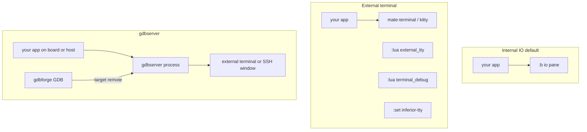

# Embedded Linux app debug

**gdbforge** is a Vim-inspired **GDB terminal UI** for **user-space** programs — on an **embedded Linux board** or **on the host**. This guide covers **remote deploy + gdbserver** (`:lua remotegdb`) and **where program stdin/stdout goes**.

## Program I/O — internal vs external

Every debug session has an **inferior** (your app). Its stdin/stdout can go to three places:

### 1. Internal IO pane (default)

- **Pane:** `:b io` (alias `:b output`) inside gdbforge
- **Best for:** line-oriented output, simple `printf`, stdin while stopped or running
- **Setup:** none — works out of the box
- **Limit:** not a full VT100; heavy TUI/curses or flood printing may feel sluggish (Ctrl-C still works)

### 2. External terminal (host)

- **Window:** real emulator (`mate-terminal`, `kitty`, `xterm`, … via `GDBFORGE_TERMINAL`)
- **Best for:** full-screen TUI, curses, high-rate stdout
- **Commands:**
  - `:lua external_tty` — open tty, then `file` / `run` yourself
  - `:lua terminal_debug [prog] [run]` — tty + optional load/break/run
  - `:set inferior-tty` — same idea from the GDB console (no Lua)
  - `:set inferior-tty internal` — switch back to `:b io`
- When external, **`:b io` shows a note only** — type in the other window

```bash
export GDBFORGE_TERMINAL=mate-terminal
./bin/gdbforge ./my_tui
:lua terminal_debug ./my_tui run
```

### 3. gdbserver (inferior in gdbserver's tty)

The debugged program runs **under gdbserver**; its stdio is gdbserver's terminal (local or on the board).

| Script | Target | I/O location |
|--------|--------|--------------|
| `:lua gdbserver_tui [prog] [port]` | **Same PC** | External terminal running local `gdbserver` |
| `:lua remotegdb [app] [host] [port]` | **Board** | SSH opens terminal; gdbserver on board runs the app |

gdbforge attaches with `target remote`; **breakpoints and stepping** stay in gdbforge panes.



---

## Remote board — `:lua remotegdb`

Deploy binary, start **gdbserver over SSH**, attach with **`target remote`**.

```bash
mkdir -p .gdbforge/lua
cp -r lua/embedded/remotegdb .gdbforge/lua/
export GDBFORGE_REMOTE_HOST=192.168.20.50
export GDBFORGE_TERMINAL=mate-terminal
./bin/gdbforge ./hello
:lua remotegdb
```

```text
:lua remotegdb ./hello 192.168.20.50 1234
```

### Workflow

1. Local app path — arg, `GDBFORGE_REMOTE_APP`, or session program
2. MD5 compare; **scp** only if remote copy missing or stale
3. SSH runs `gdbserver :PORT /tmp/app [args…]` in an external terminal
4. `wait_port` → `file` + `target remote host:PORT`

### Environment variables

| Variable | Default | Meaning |
|----------|---------|---------|
| `GDBFORGE_REMOTE_APP` | _(empty)_ | Local binary |
| `GDBFORGE_REMOTE_APP_ARGS` | _(empty)_ | Inferior argv |
| `GDBFORGE_REMOTE_HOST` | `192.168.20.50` | Board IP |
| `GDBFORGE_REMOTE_USER` | `root` | SSH user |
| `GDBFORGE_REMOTE_PORT` | `1234` | gdbserver port |
| `GDBFORGE_REMOTE_DIR` | `/tmp` | Remote install dir |
| `GDBFORGE_TERMINAL` | auto | Terminal for ssh/gdbserver window |

---

## Local host — gdbserver or direct GDB

| `:lua` | Purpose |
|--------|---------|
| `gdbserver_tui` | `gdbserver` in external terminal + `target remote localhost:PORT` |
| `terminal_debug` | Direct GDB + external tty (+ optional file/break/run) |
| `external_tty` | External tty only |
| `remotegdb_log` | Tail `/tmp/gdbserver.log` on board via SSH |

---

## Script install paths

All under [`lua/embedded/`](https://github.com/yairgd/gdbforge/tree/main/lua/embedded):

```bash
cp -r lua/embedded/remotegdb .gdbforge/lua/
cp -r lua/embedded/terminal_debug .gdbforge/lua/
cp -r lua/embedded/external_tty .gdbforge/lua/
cp -r lua/embedded/gdbserver_tui .gdbforge/lua/
```

Kernel debug (not user-space): [KERNEL_KGDB.md](KERNEL_KGDB.md). PTY details: [PTY_ARCHITECTURE.md](PTY_ARCHITECTURE.md).

See also: [Lua catalog — embedded](https://github.com/yairgd/gdbforge/blob/main/lua/embedded/README.md) · [User Guide — Lua](USER_GUIDE.md)
