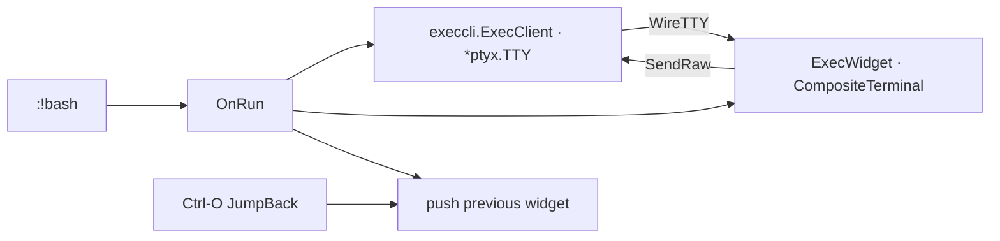

# Exec / shell panes (`:!`)

gdbforge can open an **external PTY session** in the focused pane, similar to Vim’s `:!` but as a persistent console widget (not a one-shot filter).

**Companion docs:** [COMMAND_SYSTEM.md](COMMAND_SYSTEM.md) · [UI_ARCHITECTURE.md](UI_ARCHITECTURE.md) · [INPUT.md](INPUT.md) · [DEBUGGER_INTEGRATION.md](DEBUGGER_INTEGRATION.md)

---

## User commands

| Command | Effect |
|---------|--------|
| `:!bash` | Start `bash` on a PTY; show **Exec** widget in the focused pane |
| `:!ls` | Same for `ls` (short-lived; after exit, **any key** returns to the previous widget) |
| `:!ssh user@host` | Same for any argv |
| `:b exec` | Re-show the last Exec widget (if still registered) |
| `:b gdb` / `:b about` / `:b help` / `:b logger` / `:b breakpoint` / `:b threads` / `:b callstack` / `:b io` / `:b output` | Swap other built-in views into the focused pane |
| `:edit` / `:edit file.c` | Project source picker, or open a source file (`:e` = unique prefix) |
| `:b file.c` | Switch to an already-open file buffer |
| `<C-o>` (normal mode) | Jump back to the **previous widget** in this pane (Vim-style jump list) |

Bang may be glued or spaced: `:!ls` and `:! ls` both work.

---

## Architecture



| Layer | Package / type | Role |
|-------|----------------|------|
| Command | `LeafRest("!", OnRun)` | Rest-args leaf; remainder of line → argv |
| PTY | `*ptyx.TTY` (`ptyx.Start`) | Process PTY: `Subscribe`, `SendRaw`, `SetSize` |
| Client | `internal/execcli.ExecClient` | Thin embed of `*ptyx.TTY` |
| Terminal | `CompositeTerminal` + `WireTTY` | xterm emulator in Exec pane |
| Widget | `widgets.ExecWidget` | View — `WireExec`, keys, cursor |
| App | `DebuggerApp.OnRun` | Owns `ExecClient`; `swapFocusedWidget`; insert mode |

GDB/IO panes use the same **`WireTTY`** pattern; exec has **no MI parser** — plain terminal bytes only.

**Nested gdbforge:** You can run `./gdbforge` from `:!bash`, but nested full TUIs inside the Exec pane are **not supported** — use an external terminal or tmux pane for a second gdbforge session.

---

## Rest-args (`LeafRest` / `RestArgs`)

Normal colon commands walk **every** token as a tree child (`:set equalalways`). That cannot parse `:!ssh root@host`.

A **rest-args** leaf (`RestArgs == true`) means: after accepting this node, **stop walking the tree** and pass remaining tokens to `Action`.

```text
:!ssh root@host
  │ └──────────┘
  │    p.args  (not Accept()'d as children)
  └─ current stays on "!" node → OnRun
```

Implementation: `internal/commands/dsl.go` (`CmdRest` / `LeafRest`) and `CommandParser.Parse` / `Sync` (including glued `:!ls`).

---

## Terminal rendering

Exec uses **`CompositeTerminal`** (xterm via `gitpod-io/xterm-go`):

- Full ANSI/VT sequences from bash, ssh, etc.
- Keys forwarded as raw bytes (`WireTTYInput`)
- Inverse cursor when the Exec pane is focused
- Scrollback in the emulator buffer

Copy/paste: mouse selection + clipboard bridge (same as other panes); paste sends bytes to the PTY.

---

## Copy / paste

| Action | Behavior |
|--------|----------|
| Mouse drag + `Ctrl-C` | Copy selection (ANSI stripped where applicable) |
| `Ctrl-V` | Paste into **`:`` cmdline** when in command mode; in Exec pane, keys go to PTY |
| Middle-click | Platform PRIMARY paste where supported |
| `EventClipboard` | In command mode → `CmdWidget` only; otherwise → focused widget |

---

## Jump list (`Ctrl-O`)

`Workspace.swapFocusedWidget` (thin `DebuggerApp` delegate) pushes the outgoing widget before `:b` / `:e` / `:!` swaps.

| API | Role |
|-----|------|
| `pushWidgetJump` | Append (dedupe consecutive, cap 32) — on `Workspace` |
| `JumpBack` | Pop and `ReplaceFocusedWidget` without pushing |
| Binding | `<C-o>` in `cmd/gdbforge/keybindings.go` (normal mode) |

Example: GDB → `:b about` → `<C-o>` → GDB again.

---

## Lifecycle notes

- Each `:!…` **restarts** the exec session (closes previous `ExecClient`).
- When the PTY process exits, the Exec pane shows  
  `[exec] process exited — press any key to return`, then **any key** runs `JumpBack` to the previous widget and clears the `exec` builtin.
- App exit (`:quit` / GDB `q` → `gdb-exit`) still closes `execClient` if present (`DebuggerApp.Close`).

---

## Key source files

| Path | Responsibility |
|------|----------------|
| `cmd/gdbforge/command_tree.go` | `LeafRest("!", a.OnRun)` |
| `cmd/gdbforge/actions.go` | `OnRun`, `startExecSession` |
| `cmd/gdbforge/workspace_place.go` | `swapFocusedWidget`, `JumpBack`, jump list |
| `cmd/gdbforge/keybindings.go` | `<C-o>` |
| `internal/execcli/exec_client.go` | `ptyx.Start` wrapper |
| `internal/gdbforge/widgets/exec_widget.go` | Exec terminal view |
| `internal/termui/composite_terminal.go` | xterm + `WireTTY` |
| `internal/termui/wire_tty.go` | PTY ↔ terminal bridge |
| `internal/ptyx/tty.go` | Unified PTY type |
