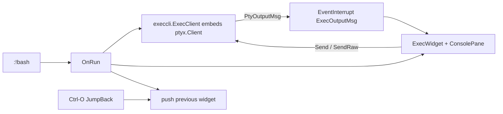

# Exec / shell panes (`:!`)

gdbforge can open an **external PTY session** in the focused pane, similar to Vim’s `:!` but as a persistent console widget (not a one-shot filter).

**Companion docs:** [COMMAND_SYSTEM.md](COMMAND_SYSTEM.md) · [UI_ARCHITECTURE.md](UI_ARCHITECTURE.md) · [INPUT.md](INPUT.md) · [DEBUGGER_INTEGRATION.md](DEBUGGER_INTEGRATION.md)

---

## User commands

| Command | Effect |
|---------|--------|
| `:!bash` | Start `bash` on a PTY; show **Exec** widget in the focused pane |
| `:!ls` | Same for `ls` (short-lived; after exit, **any key** returns to the previous widget) |
| `:!ssh user@host` | Same for any argv |
| `:b exec` | Re-show the last Exec widget (if still registered) |
| `:b gdb` / `:b about` / `:b help` / `:b logger` / `:b breakpoint` / `:b threads` / `:b callstack` / `:b io` / `:b output` | Swap other built-in views into the focused pane |
| `:edit` / `:edit file.c` | Project source picker, or open a source file (`:e` = unique prefix) |
| `:b file.c` | Switch to an already-open file buffer |
| `<C-o>` (normal mode) | Jump back to the **previous widget** in this pane (Vim-style jump list) |

Bang may be glued or spaced: `:!ls` and `:! ls` both work.

---

## Architecture



| Layer | Package / type | Role |
|-------|----------------|------|
| Command | `LeafRest("!", OnRun)` | Rest-args leaf; remainder of line → argv |
| PTY | `internal/ptyx.Client` | Shared PTY: mutex writes, `Subscribe` fan-out, `SetSize` |
| Client | `internal/execcli.ExecClient` | Thin wrapper (`*ptyx.Client` + initial winsize) |
| Event | `core.ExecOutputMsg` | UI-routed PTY chunks to the UI thread |
| Widget | `widgets.ExecWidget` | View — ConsolePane + live prompt + ANSI; `SetOnSubmit` |
| App | `DebuggerApp.OnRun` | Owns `ExecClient`; wire intents; `Workspace.swapFocusedWidget`; insert mode |

GDB uses the same `ptyx.Client` via app-owned `gdb.GDBClient`. Exec reuses **ConsolePane** but has **no MI parser** — plain text + ANSI.

---

## Rest-args (`LeafRest` / `RestArgs`)

Normal colon commands walk **every** token as a tree child (`:set equalalways`). That cannot parse `:!ssh root@host`.

A **rest-args** leaf (`RestArgs == true`) means: after accepting this node, **stop walking the tree** and pass remaining tokens to `Action`.

```text
:!ssh root@host
  │ └──────────┘
  │    p.args  (not Accept()'d as children)
  └─ current stays on "!" node → OnRun
```

Implementation: `internal/commands/dsl.go` (`CmdRest` / `LeafRest`) and `CommandParser.Parse` / `Sync` (including glued `:!ls`).

---

## ConsolePane live prompt

For both GDB and Exec, the input caret can sit on the **same row** as the last buffer line when that line is marked live (`SetLivePrompt` / `EnsureLivePrompt`):

- **GDB:** on MI `(gdb)` ready → `EnsureLivePrompt()` with `"(gdb) "`
- **Exec:** incomplete PTY line (bash PS1) → `SetLivePrompt(true)` while pending

When `livePrompt` is set and follow-tail is on, `ConsolePane.Draw` paints the host line (ANSI-aware) and draws `InputLine` immediately after its visible width.

---

## ANSI rendering

Exec enables `ConsolePane.SetANSI(true)`. Scrollback uses `DrawANSIText` / `StripANSI` in `internal/termui/utf.go`:

- SGR colors (`\x1b[01;32m` …) → tcell styles
- OSC / private CSI (title, bracketed paste) → skipped, not drawn
- Copy selection strips ANSI so the clipboard is plain text

---

## Copy / paste

| Action | Behavior |
|--------|----------|
| Mouse drag + `Ctrl-C` | Copy selection from scrollback (ANSI stripped) |
| `Ctrl-V` | Paste into the **input line** or **`:` cmdline** (viewport is read-only) |
| Middle-click | Paste into the input under the pointer (Linux terminal style) |
| `EventClipboard` | In command mode → `CmdWidget` only; otherwise → workspace widgets |

---

## Jump list (`Ctrl-O`)

`Workspace.swapFocusedWidget` (thin `DebuggerApp` delegate) pushes the outgoing widget before `:b` / `:e` / `:!` swaps.

| API | Role |
|-----|------|
| `pushWidgetJump` | Append (dedupe consecutive, cap 32) — on `Workspace` |
| `JumpBack` | Pop and `ReplaceFocusedWidget` without pushing |
| Binding | `<C-o>` in `cmd/gdbforge/keybindings.go` (normal mode) |

Example: GDB → `:b about` → `<C-o>` → GDB again.

---

## Lifecycle notes

- Each `:!…` **restarts** the exec session (closes previous `ExecClient`).
- When the PTY process exits (or Ctrl-D closes it), the Exec pane shows  
  `[exec] process exited — press any key to return`, then **any key** runs `JumpBack` to the previous widget and clears the `exec` builtin.
- App exit (`:quit` / Ctrl-D → debugger quit → `gdb-exit`) still closes `execClient` if present (`DebuggerApp.Close`).

---

## Key source files

| Path | Responsibility |
|------|----------------|
| `cmd/gdbforge/command_tree.go` | `LeafRest("!", a.OnRun)` |
| `cmd/gdbforge/actions.go` | `OnRun` |
| `cmd/gdbforge/workspace_place.go` | `swapFocusedWidget`, `JumpBack`, jump list |
| `cmd/gdbforge/builtins.go` | Thin `DebuggerApp` delegates to `Workspace` |
| `cmd/gdbforge/keybindings.go` | `<C-o>` |
| `internal/execcli/exec_client.go` | PTY process I/O |
| `internal/gdbforge/widgets/exec_widget.go` | Exec console view (`SetOn*`) |
| `internal/commands/{dsl,command_parser,command_node}.go` | Rest-args |
| `internal/termui/console_pane.go` | Live prompt + paste into input |
| `internal/termui/utf.go` | ANSI draw / strip |
| `internal/core/events.go` | `ExecOutputMsg` |
