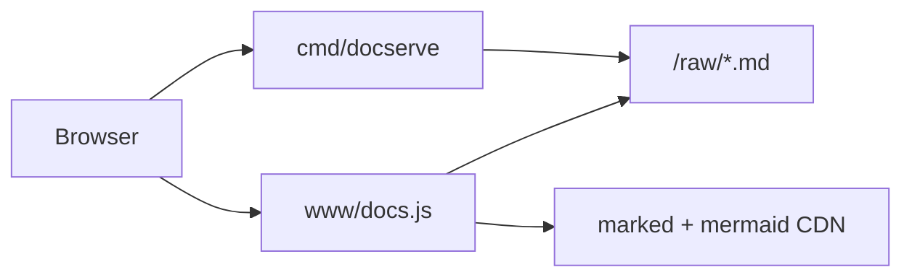

# Hosting cgdb-go Documentation

## What lives in the repository

Commit the whole `docs/` tree:

| Path | Purpose |
|------|---------|
| `docs/README.md` | Documentation index |
| `docs/*.md` | Topic guides |
| `docs/diagrams/*.mermaid` | Standalone diagram sources |
| `docs/www/` | CSS + client-side Markdown/Mermaid renderer |
| `docs/serve.sh` | Convenience launcher |
| `cmd/docserve/` | Go HTTP server + static export |
| `.github/workflows/docs.yml` | GitHub Pages deploy |

Markdown sources stay in `docs/` — unchanged. GitHub Pages serves a **generated static copy** built by `docserve --export`.

After clone:

```bash
git clone <repo-url>
cd cgdb-go
./docs/serve.sh
```

Open the URL printed in the terminal (default `http://127.0.0.1:8765/`).

---

## Local documentation server

### Quick start

```bash
./docs/serve.sh
# equivalent:
go run ./cmd/docserve
# or:
task docs
```

### Options

```bash
go run ./cmd/docserve --port 8765
go run ./cmd/docserve --host 0.0.0.0 --port 8765   # LAN access
go run ./cmd/docserve --strict-port                  # fail if port busy
```

Environment variable:

| Variable | Effect |
|----------|--------|
| `CGDB_GO_DOCS_ROOT` | Override path to docs directory |

### URLs

| Page | URL |
|------|-----|
| Index | `/` |
| Overview | `/doc/OVERVIEW.md` |
| Architecture | `/doc/ARCHITECTURE.md` |
| Developer guide | `/doc/DEVELOPER_GUIDE.md` |
| Any `.md` file | `/doc/<filename>.md` |
| Diagrams index | `/diagrams` |
| Single diagram | `/diagrams/<name>.mermaid` |
| Raw markdown | `/raw/<filename>.md` |

Links between Markdown files in the HTML viewer resolve to `/doc/<name>.md` automatically.

### How it works



1. Go server returns HTML shell with page metadata.
2. `docs.js` fetches raw markdown from `/raw/`.
3. **marked** renders Markdown to HTML.
4. **mermaid** renders fenced ` ```mermaid ` blocks client-side.

No build step or Node.js required for local use. Network access needed for CDN scripts on first load.

---

## Static export (GitHub Pages)

The same viewer works as a static site — no Go runtime on GitHub Pages.

### Export locally

```bash
go run ./cmd/docserve --export _site --base /cgdb-go/ \
  --site-origin https://YOUR_USER.github.io
# or:
task docs:export
```

| Flag | Purpose |
|------|---------|
| `--export DIR` | Write static site to `DIR` and exit |
| `--base PATH` | URL prefix for project Pages (e.g. `/cgdb-go/`) |
| `--site-origin URL` | Absolute origin for canonical / Open Graph / sitemap (e.g. `https://user.github.io`) |
| `--serve-static DIR` | Preview a previously exported directory |

Output layout:

```text
_site/
  .nojekyll
  robots.txt
  sitemap.xml          # when --site-origin is set
  index.html           # pre-rendered Markdown + SEO meta
  doc/*.md             # HTML shells with pre-rendered body
  raw/*.md
  raw/diagrams/*
  www/site.css, docs.js
  diagrams/index.html
  diagrams/*.mermaid
```

### SEO included in export

| Item | Behavior |
|------|----------|
| `robots.txt` | Allows crawl; points at `sitemap.xml` when origin is set |
| `sitemap.xml` | All doc + diagram URLs (requires `--site-origin`) |
| `<title>` | First `#` heading from the Markdown (fallback: file name) |
| Meta description | First prose paragraph (~155 chars) |
| Canonical + `og:url` | Absolute URL from `--site-origin` + `--base` |
| Open Graph / Twitter | `og:title`, `og:description`, `twitter:card`, … |
| Pre-rendered HTML | Markdown converted at export so crawlers see content without JS |

### Google Search Console

1. Deploy Pages and open the site URL.
2. In [Google Search Console](https://search.google.com/search-console), add a URL-prefix property for `https://YOUR_USER.github.io/cgdb-go/`.
3. Verify (HTML file upload, DNS, or meta tag — HTML file is easiest for project Pages).
4. Submit `https://YOUR_USER.github.io/cgdb-go/sitemap.xml`.

### Preview exported site

```bash
task docs:preview
# equivalent:
go run ./cmd/docserve --export _site --base /cgdb-go/
go run ./cmd/docserve --serve-static _site --port 8766
```

Open `http://127.0.0.1:8766/cgdb-go/` when previewing with the default project base path.

---

## GitHub Pages

### One-time setup

1. Push this repository to GitHub.
2. Open **Settings → Pages → Build and deployment**.
3. Set **Source** to **GitHub Actions**.

### Automatic deploy

Workflow: `.github/workflows/docs.yml`

- Triggers on push to `main` when `docs/**` or `cmd/docserve/**` changes.
- Runs `go run ./cmd/docserve --export _site --base /<repo-name>/`.
- Publishes `_site/` to GitHub Pages.

Project site URL:

```text
https://<github-user>.github.io/cgdb-go/
```

Replace `cgdb-go` with your repository name.

Manual deploy:

```bash
go run ./cmd/docserve --export _site --base /cgdb-go/
# upload _site/ contents to gh-pages branch or Pages artifact
```

---

## Task runner integration

| Task | Command |
|------|---------|
| Local server | `task docs` |
| Export static site | `task docs:export` |
| Export + preview | `task docs:preview` |

---

## CI and artifacts

GitHub Actions deploys docs automatically (see above).

Manual artifact:

```bash
go run ./cmd/docserve --export _site --base /cgdb-go/
tar czf cgdb-go-docs.tar.gz _site/
```

---

## Security note

`docserve` binds to `127.0.0.1` by default (local only). To expose on a LAN:

```bash
go run ./cmd/docserve --host 0.0.0.0 --port 8765
```

Use only on trusted networks or behind a firewall / reverse proxy with authentication.

The server serves files only from `docs/` (or the exported static dir) with path traversal checks. It does not execute server-side Markdown rendering.

---

## Related documentation

- [README.md](README.md) — documentation map
- [DEVELOPER_GUIDE.md](DEVELOPER_GUIDE.md) — contributor setup
