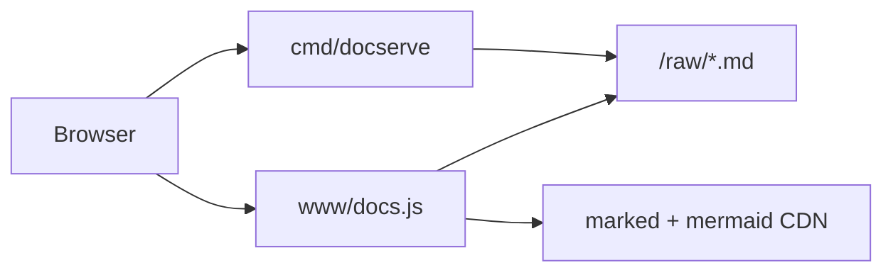

# Hosting NewCGDB Documentation

## What lives in the repository

Commit the whole `docs/` tree:

| Path | Purpose |
|------|---------|
| `docs/README.md` | Documentation index |
| `docs/*.md` | Topic guides |
| `docs/diagrams/*.mermaid` | Standalone diagram sources |
| `docs/www/` | CSS + client-side Markdown/Mermaid renderer |
| `docs/serve.sh` | Convenience launcher |
| `cmd/docserve/` | Go HTTP documentation server |

After clone:

```bash
git clone <repo-url>
cd promptcore
./docs/serve.sh
```

Open the URL printed in the terminal (default `http://127.0.0.1:8765/`).

---

## Local documentation server

### Quick start

```bash
./docs/serve.sh
# equivalent:
go run ./cmd/docserve
```

### Options

```bash
go run ./cmd/docserve --port 8765
go run ./cmd/docserve --host 0.0.0.0 --port 8765   # LAN access
go run ./cmd/docserve --strict-port                  # fail if port busy
```

Environment variable:

| Variable | Effect |
|----------|--------|
| `NEWCGDB_DOCS_ROOT` | Override path to docs directory |

### URLs

| Page | URL |
|------|-----|
| Index | `/` |
| Overview | `/doc/OVERVIEW.md` |
| Architecture | `/doc/ARCHITECTURE.md` |
| Developer guide | `/doc/DEVELOPER_GUIDE.md` |
| Any `.md` file | `/doc/<filename>.md` |
| Diagrams index | `/diagrams` |
| Single diagram | `/diagrams/<name>.mermaid` |
| Raw markdown | `/raw/<filename>.md` |

Links between Markdown files in the HTML viewer resolve to `/doc/<name>.md` automatically.

### How it works



1. Go server returns HTML shell with page metadata.
2. `docs.js` fetches raw markdown from `/raw/`.
3. **marked** renders Markdown to HTML.
4. **mermaid** renders fenced ` ```mermaid ` blocks client-side.

No build step or Node.js required. Network access needed for CDN scripts on first load.

---

## Task runner integration

```bash
task docs
```

Defined in `Taskfile.yml` — runs the documentation server.

---

## CI and artifacts

Suggested CI steps (not yet in pipeline):

```bash
go build -o bin/docserve ./cmd/docserve
tar czf newcgdb-docs.tar.gz docs/ cmd/docserve/
```

For static hosting without Go at runtime, pre-render HTML in CI (custom pipeline — not included by default).

---

## Security note

`docserve` binds to `127.0.0.1` by default (local only). To expose on a LAN:

```bash
go run ./cmd/docserve --host 0.0.0.0 --port 8765
```

Use only on trusted networks or behind a firewall / reverse proxy with authentication.

The server serves files only from `docs/` with path traversal checks. It does not execute server-side Markdown rendering.

---

## Comparison to Python alternative

Some projects use a Python docs server (e.g. `serve.py`). NewCGDB uses **Go** (`cmd/docserve`) to stay consistent with the project's primary language and avoid a Python dependency.

Behavior matches the Autonomia docs viewer pattern: HTML shell + client-side marked + mermaid.

---

## Related documentation

- [README.md](README.md) — documentation map
- [DEVELOPER_GUIDE.md](DEVELOPER_GUIDE.md) — contributor setup
