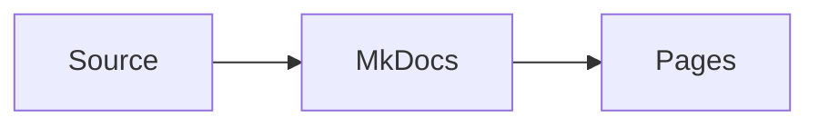

# Hosting gdbforge Documentation

The documentation site is built with [MkDocs Material](https://squidfunk.github.io/mkdocs-material/). Markdown sources live in `docs/`, while `mkdocs.yml` defines navigation, theme settings, extensions, and site metadata.

## Local development

Install the documentation dependency:

```bash
python3 -m pip install -r requirements-docs.txt
```

Start the development server:

```bash
./docs/serve.sh
# or
task docs
```

Open <http://127.0.0.1:8765/>. MkDocs watches the configuration and documentation files and reloads the browser after changes.

To use another address:

```bash
MKDOCS_DEV_ADDR=0.0.0.0:8000 ./docs/serve.sh
```

Only expose the development server on trusted networks.

## Build the static site

```bash
python3 -m mkdocs build --clean
# or
task docs:export
```

The generated site is written to `_site/`. This directory is a build artifact and is excluded from Git.

To catch broken links and configuration warnings in local checks, use:

```bash
python3 -m mkdocs build --strict
```

## GitHub Pages

The workflow in `.github/workflows/docs.yml` builds and publishes the MkDocs site whenever documentation-related files change on `main`. It can also be started manually with `workflow_dispatch`.

One-time repository setup:

1. Open **Settings → Pages** in GitHub.
2. Under **Build and deployment**, select **GitHub Actions** as the source.
3. Push the MkDocs files to `main`, or run the **Deploy docs** workflow manually.

The project site is published at:

```text
https://yairgd.github.io/gdbforge/
```

The workflow:

1. Checks out the repository.
2. Installs Python and the packages in `requirements-docs.txt`.
3. Runs `python -m mkdocs build --clean`.
4. Uploads `_site/` as a GitHub Pages artifact.
5. Deploys the artifact.

## Search engine optimization

The generated site includes:

- Unique page titles and descriptions
- Canonical URLs
- Open Graph and Twitter Card metadata
- `SoftwareApplication` and `TechArticle` JSON-LD structured data
- `robots.txt` with sitemap discovery
- `sitemap.xml` and `sitemap.xml.gz`
- Crawlable static HTML and semantic headings

After the first deployment, add `https://yairgd.github.io/gdbforge/` as a URL-prefix property in [Google Search Console](https://search.google.com/search-console/) and submit:

```text
https://yairgd.github.io/gdbforge/sitemap.xml
```

## Important files

| Path | Purpose |
|------|---------|
| `mkdocs.yml` | Site metadata, theme, navigation, and Markdown extensions |
| `requirements-docs.txt` | Documentation build dependencies |
| `docs/*.md` | Documentation pages |
| `docs/stylesheets/extra.css` | gdbforge theme customizations |
| `docs/javascripts/mermaid.js` | Mermaid diagram initialization |
| `docs/overrides/main.html` | Social metadata and JSON-LD template |
| `docs/robots.txt` | Search crawler and sitemap directives |
| `docs/media/` | Screenshots, GIFs, and videos |
| `docs/serve.sh` | Local server launcher |
| `.github/workflows/docs.yml` | GitHub Pages deployment |

## Adding a page

1. Add the Markdown file under `docs/`.
2. Add a concise, unique `description` in YAML front matter.
3. Add the page to `nav` in `mkdocs.yml`.
4. Link to it using a path relative to the current Markdown file.
5. Run `python3 -m mkdocs build --strict` before publishing.

Mermaid diagrams can be embedded directly:

````markdown

````
