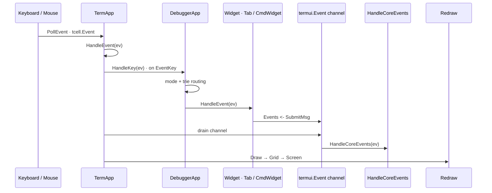
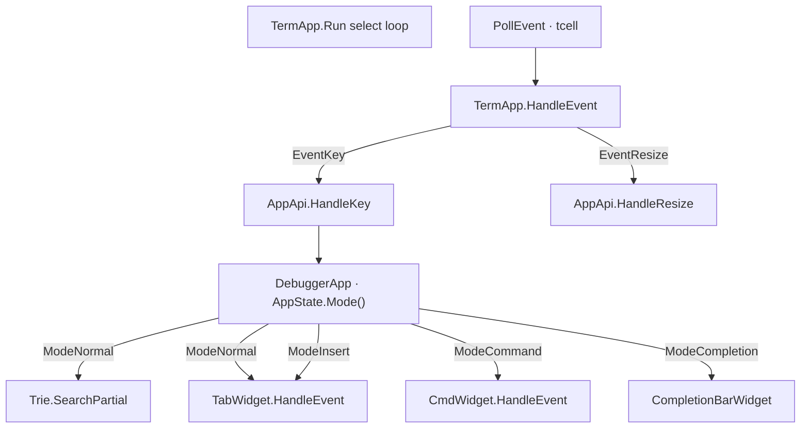
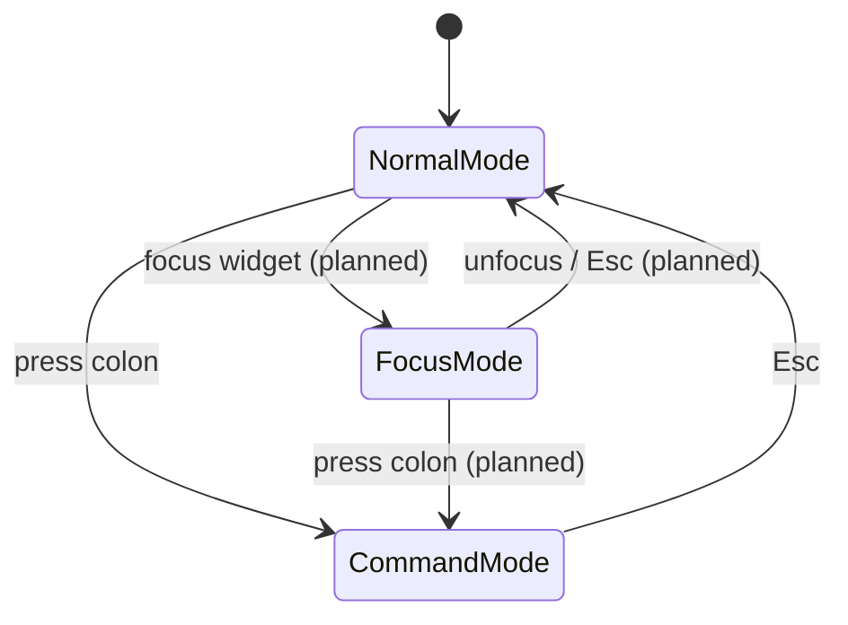
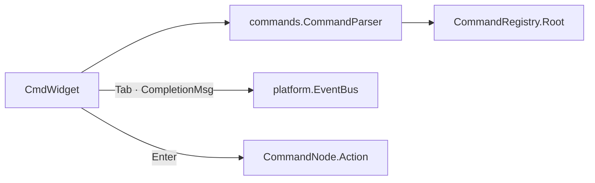

# Input System

cgdb-go handles keyboard and mouse input through **tcell**, routes events based on **interaction mode**, and will support a **Vim-like command system** via the global CmdLine.

**Companion docs:** [UI_ARCHITECTURE.md](UI_ARCHITECTURE.md) · [WINDOW_MANAGEMENT.md](WINDOW_MANAGEMENT.md) · [ARCHITECTURE.md](ARCHITECTURE.md)

---

## Table of contents

- [Input overview](#input-overview)
- [Keyboard handling](#keyboard-handling)
- [Key-sequence trie](#key-sequence-trie)
- [Mouse handling](#mouse-handling)
- [Interaction modes](#interaction-modes)
- [Vim-like command system](#vim-like-command-system)
- [Async input from debugger](#async-input-from-debugger)
- [Planned keybindings](#planned-keybindings)

---

## Input overview

```text
Keyboard / Mouse
        ↓
TermApp (select loop)
        ├── termui.Event  → AppApi.HandleCoreEvents
        └── tcell.Event   → TermApp.HandleEvent
                                ├── EventResize → UpdateCanvas, AppApi.HandleResize
                                └── EventKey    → AppApi.HandleKey
                                      ├── mode router (AppState)
                                      ├── Trie (key sequences)
                                      └── TabWidget / CmdWidget HandleEvent → redraw
```



*Sources: [`diagrams/event_flow.mermaid`](diagrams/event_flow.mermaid) · [`diagrams/input_routing.mermaid`](diagrams/input_routing.mermaid) · [`diagrams/event_bus.mermaid`](diagrams/event_bus.mermaid)*

**Design principles:**

1. One thread owns input and rendering.
2. Async sources (GDB PTY) inject **tcell** events via `PostEvent`, never by calling widget methods directly.
3. Domain actions (commands, quit, debugger routing) publish **`termui.Event`** to the bus; the application handles them in **`HandleCoreEvents`**, not in individual widgets.
4. **Mode-aware routing** lives in the application layer (`DebuggerApp`), not in `TermApp` — the framework stays generic.

---

## Keyboard handling

### Event types

| tcell event | Handling |
|-------------|----------|
| `EventKey` | Primary keyboard input |
| `EventResize` | Terminal size change → reallocate canvas |
| `EventInterrupt` | Async injection (GDB output, redraw wakes) |
| `EventMouse` | Mouse click/scroll (enabled via `EnableMouse`) |

### Dispatch (current)

1. `TermApp.HandleEvent` — global shortcuts (`Ctrl+D` quit, resize → `UpdateCanvas`, redraw interrupt).
2. `AppApi.HandleResize` — assign top-level chrome rects (tab / completion bar / cmdline; see [WINDOW_MANAGEMENT.md](WINDOW_MANAGEMENT.md)).
3. `AppApi.HandleKey` — application-level key routing by `AppState.Mode()`:
   - **`ModeNormal`** — `:` enters command mode; other keys go through the **Trie** then to `TabWidget`.
   - **`ModeInsert`** — focused pane (e.g. GDB console); Esc → normal.
   - **`ModeCommand`** — all keys go to `CmdWidget`.
   - **`ModeCompletion`** — wildmenu (`CompletionBarWidget`): arrows cycle; Esc → `ModeCommand`.



*Source: [`diagrams/input_routing.mermaid`](diagrams/input_routing.mermaid)*

**Gap:** focus-aware routing inside the workspace is partial (`WidgetTree.focus` exists). Insert mode is wired for the focused console pane.

### Widget-level handling

GDB console keys are handled by shared termui pieces, then GDB-specific callbacks:

| Layer | File | Owns |
|-------|------|------|
| `InputLine` | `termui/input_line.go` | Editing + history chords |
| `ConsolePane` | `termui/console_pane.go` | Enter / Ctrl-L / PgUp / selection; walking prompt Draw |
| `GDBWidget` | `cgdb/widgets/gdb_widget.go` | `OnSubmit` → echo + `Debugger.Send`; Ctrl-C/D → interrupt/quit; MI |
| `ExecWidget` | `cgdb/widgets/exec_widget.go` | Line submit → PTY `Send`; ANSI scrollback; live bash/ssh prompt |

When the GDB pane is focused (insert):

| Key | Action |
|-----|--------|
| `Enter` | Echo `(gdb) cmd` to scrollback, send to GDB, clear input line |
| `Backspace` / `Delete` | Edit input (`InputLine`) |
| `Left` / `Right`, `Home` / `End` | Move cursor (`Ctrl-B/F/A/E`) |
| `Up` / `Down` | Local readline-style history (`Ctrl-P/N`) |
| `Ctrl+C` | Copy selection if any; otherwise SIGINT (`\x03`) |
| `Ctrl+D` | Send `q` to GDB |
| `Ctrl+L` | Clear scrollback (screen reset — prompt returns to top-left) |
| `Ctrl+V` | Paste clipboard into the input line |
| `PgUp` / `PgDn` | Scroll output viewport |
| Rune | Insert into input buffer |

**Normal mode:** `<C-o>` jumps back to the previous widget after `:b` / `:e` / `:!` (see [EXEC_SHELL.md](EXEC_SHELL.md)).

The `(gdb)` prompt walks down line-by-line under the scrollback while there is free space, then pins to the bottom and scrolls when the pane is full. Look stays a native GDB session (not chat labels).

Example: `CmdWidget` (`cmd_widget.go`):

| Key | Action |
|-----|--------|
| `Enter` | Parse command, emit `SubmitMsg` on event bus |
| `Up` / `Down` | History navigation |
| `Tab` | Complete command name |
| `Backspace` on lone `:` | Deactivate widget (app should reset mode — see gap below) |
| Rune / editing keys | Insert, move cursor |

Command mode entry and exit:

| Key | Handler | Action |
|-----|---------|--------|
| `:` | `HandleKey` in normal mode | `SetMode(ModeCommand)`, `CmdWidget.Activate()` |
| `Esc` | `CmdWidget` → `SubmitMsg{CmdID: CmdExitMode}` | `HandleCoreEvents` resets mode, deactivates widget |
| `Enter` | `HandleKey` after submit | `SetMode(ModeNormal)`, `CmdWidget.Deativate()` |

On Enter, `CmdWidget` resolves the first token against `AutoCompleter`, sets `CmdID` (or `termui.CmdUnknown`), and publishes to `TermApp.events`. **`HandleCoreEvents`** in the app dispatches by `CommandID`.

---

## Key-sequence bindings

Multi-key bindings (Vim-style `<C-w>h`, etc.) are registered on a **`commands.KeyBindingRegistry`** owned by `DebuggerApp` (`cmd/cgdb/keybindings.go`).

```go
func (a *DebuggerApp) InitKeyBindings() {
    a.keyBindings = commands.NewKeyBindingRegistry()
    a.keyBindings.Bind(
        commands.NewCommand("move-left", func(args ...any) { a.OnFocusLeft() }),
        "<C-w>l", "<C-w><Left>",
    )
}
```

In **normal mode** (`cmd/cgdb/input.go`), each key event calls `keyBindings.SearchPartial(key)` before forwarding to the tab.

**Current bindings:**

| Sequence | Action |
|----------|--------|
| `<C-w>h`, `<C-w><Right>` | Focus right pane |
| `<C-w>l`, `<C-w><Left>` | Focus left pane |
| `<C-w>k`, `<C-w><Up>` | Focus up pane |
| `<C-w>j`, `<C-w><Down>` | Focus down pane |

Implementation: `internal/collections/trie.go` via `KeyBindingRegistry`.

**Design decision:** bindings live on the application object, not in `TermApp`, so key chords remain app-specific while shared packages provide the prefix-tree machinery.

---

## Mouse handling

`tcell` mouse support is enabled in `NewTermApp`:

```go
screen.EnableMouse()
```

**Current state:** no widget handles `EventMouse` yet.

**Planned uses:**

| Action | Behavior |
|--------|----------|
| Click pane | Focus that pane |
| Click tab | Switch tab |
| Drag split gutter | Resize split ratio |
| Scroll | Scroll source/console viewport |
| Click breakpoint gutter | Toggle breakpoint |

**Design decision:** mouse is **optional enhancement**, not primary UX. All operations must have keyboard equivalents for SSH / minimal terminal environments.

---

## Interaction modes



*Source: [`diagrams/input_modes.mermaid`](diagrams/input_modes.mermaid)*

| Mode | Keys go to | Purpose | Status |
|------|------------|---------|--------|
| **Normal** | Trie + `TabWidget` | Navigation, key sequences, workspace input | **Implemented** |
| **Focus** | Focused Workspace widget | Pane-specific editing (source scroll, GDB input) | Planned |
| **Command** | `CmdWidget` | `:` UI commands | **Implemented** |
| **Search** | TBD | Search prompt (e.g. `/` in source) | Reserved |

Mode state lives in **`platform.AppState`** on `TermApp` (`State()`):

```go
// internal/platform/mode.go
type Mode int
const (
    ModeNormal Mode = iota
    ModeInsert
    ModeCommand
)

type PTYOwner int // none | ui | mcp — who holds PTY write intent

type AppState struct {
    // mode, ptyOwner, equalAlways (mutex-protected)
}
```

`DebuggerApp` switches modes in `HandleKey` / `HandleCoreEvents`. Layout policy: `:set equalalways` / `:set noequalalways`. PTY owner is set while the console or `:AI`/MCP holds the write mux.

**Design decision:** modes mirror Vim's normal / insert / command separation, adapted for debugger UX:

- Normal mode avoids accidentally typing into GDB when navigating; trie handles multi-key chords.
- Focus mode will be pane-local (like Vim insert, but per-widget semantics).
- Command mode is for UI operations, not debugger commands.

**Gaps:**

- `ModeFocus` / `ModeInsert` / `ModeSearch` are defined but not routed yet.
- `NewTabTwoHozSplitWins` creates a horizontal split of its two widgets.

---

## Vim-like command system

The CmdLine accepts `:` prefixed commands. Press `:` to activate `CmdWidget`; type a command and press Enter.

**Full reference:** [COMMAND_SYSTEM.md](COMMAND_SYSTEM.md) — command tree ownership, DSL, `CommandParser`, tab completion.

### Architecture (current)



Flow:

1. User presses `:` → `DebuggerApp` sets `ModeCommand`, `CmdWidget.Activate()` (`cmd/cgdb/input.go`).
2. User types `:b `, presses **Tab** → parser `SuggestionNames` → `Publish(CompletionMsg)`; `CompletionBarWidget` shows the wildmenu and app enters `ModeCompletion`.
3. User presses **Enter** → `CommandParser.Parse` + `Execute` → leaf `Action` runs (e.g. `OnFocusLeft`).
4. Tree is built at startup via DSL in `ExapData()` (`cmd/cgdb/command_tree.go`).

### Legacy note

Older docs described a flat `termui.AutoCompleter` + `CommandID` + `SubmitMsg` path for every colon command. Tree leaves now execute via `CommandParser` directly. `SubmitMsg` / `HandleCoreEvents` remain for infra events (`CmdExitMode`, layout commands not yet in the tree).

### Command categories

| Category | Examples | Dispatch |
|----------|----------|----------|
| Model / window | `:buffer code`, `:buffer breakpoints`, `:vs`, `:split`, `:close` | Window manager binds widget to existing model — **partial** (`:vs` / `:split` wired) |
| Tab | `:tabnew`, `:tabclose` | `HandleCoreEvents` → tab widget (planned) |
| Debugger | `:gdb break`, `:gdb info registers` | Colon tree under `gdb`; GDB CLI still typed in the GDB pane |
| UI | `:quit` | `HandleCoreEvents` → `app.Exit()` (implemented) |

The `:buffer <name>` command displays an application model, not a file. Each `<name>` must be declared at startup (e.g. `code`, `breakpoints`, `console`). There is no `:attach` command — all models exist from initialization. See [ARCHITECTURE.md](ARCHITECTURE.md#buffer-concept).

**Design decision:** UI commands and GDB CLI commands share familiar ideas (`:gdb break file`) but all routing happens in **`HandleCoreEvents`**. Widgets publish events; the app decides whether to mutate layout, talk to services, or exit.

---

## Async input from debugger

GDB output is **not keyboard input** but arrives through the same event loop so it stays ordered with keys and draw:

```go
screen.PostEvent(tcell.NewEventInterrupt(msg))  // core.GdbOutputMsg
screen.PostEvent(tcell.NewEventInterrupt("gdb-exit"))
```

Bridge path:

1. `ptyx` reader → `Subscribe` fan-out → UI bridge `PostEvent(GdbOutputMsg)` (bridge only calls `PostEvent`, never widgets)
2. UI thread `HandleInterrupt` / `GDBWidget.HandleEvent` → `GdbInputState.PushRaw`
3. Each complete MI line → `MiUpdate` → `ConsolePane.AppendLines` / prompt attach

Incomplete lines stay in `GdbInputState.lineBuf` until the next `\n`. There is **no debounce timer**.

See [DEBUGGER_INTEGRATION.md](DEBUGGER_INTEGRATION.md) for PTY mux and `:AI`.

**Design rationale:** MI chunks may split mid-line; newline splitting is enough. Streaming per complete record keeps the console snappy while all UI mutation stays on the tcell event loop.

---

## Keybindings

### Normal mode

| Key | Action | Status |
|-----|--------|--------|
| `:` | Enter command mode | Implemented |
| `Ctrl+W h/j/k/l` or arrows | Focus direction (via trie) | Implemented |
| `Ctrl+D` | Quit | Implemented (`TermApp`) |
| `Tab` / `Shift-Tab` | Cycle focus | Planned |
| `1-9` | Switch tab | Planned |

### Focus mode (planned)

| Key | Action |
|-----|--------|
| `Esc` | Return to normal mode |
| `:` | Enter command mode |
| Pane-specific | Widget handles (scroll, GDB input, etc.) |

### Command mode

| Key | Action | Status |
|-----|--------|--------|
| `Enter` | Execute command | Implemented |
| `Esc` | Cancel, return to normal mode | Implemented |
| `Up` / `Down` | Command history | Implemented |
| `Tab` | Completion | Implemented |

---

## Related documentation

- [COMMAND_SYSTEM.md](COMMAND_SYSTEM.md) — command tree, DSL, parser, tab completion
- [WINDOW_MANAGEMENT.md](WINDOW_MANAGEMENT.md) — CmdLine placement
- [DEBUGGER_INTEGRATION.md](DEBUGGER_INTEGRATION.md) — GDB input forwarding
- [DEVELOPER_GUIDE.md](DEVELOPER_GUIDE.md) — adding event handlers
