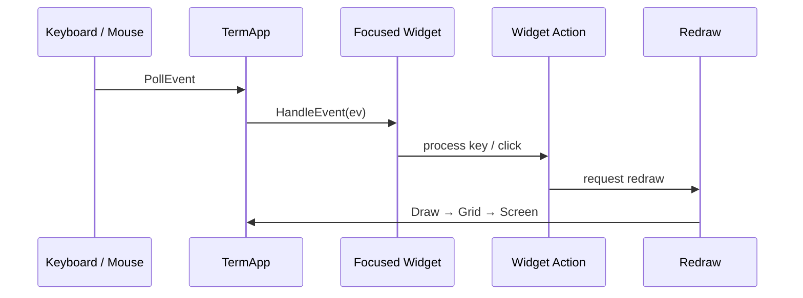
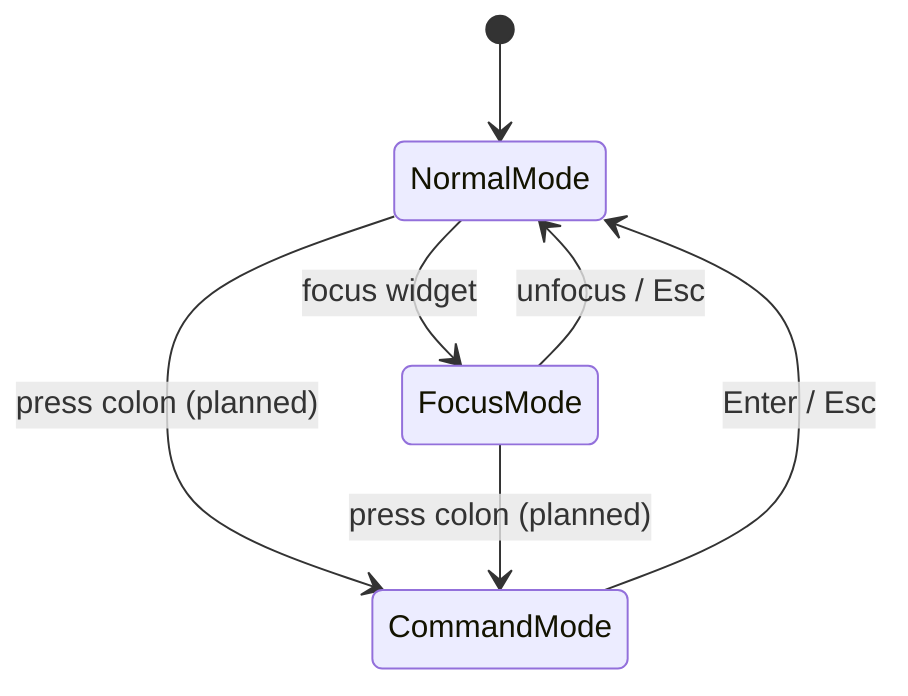
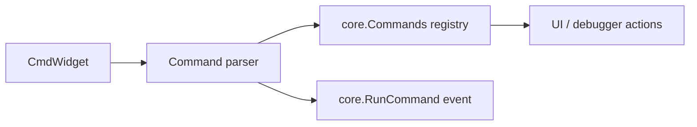

# Input System

NewCGDB handles keyboard and mouse input through **tcell**, routes events based on **interaction mode**, and will support a **Vim-like command system** via the global CmdLine.

**Companion docs:** [UI_ARCHITECTURE.md](UI_ARCHITECTURE.md) · [WINDOW_MANAGEMENT.md](WINDOW_MANAGEMENT.md) · [ARCHITECTURE.md](ARCHITECTURE.md)

---

## Table of contents

- [Input overview](#input-overview)
- [Keyboard handling](#keyboard-handling)
- [Mouse handling](#mouse-handling)
- [Interaction modes](#interaction-modes)
- [Vim-like command system](#vim-like-command-system)
- [Async input from debugger](#async-input-from-debugger)
- [Planned keybindings](#planned-keybindings)

---

## Input overview

```text
Keyboard / Mouse
        ↓
TermApp
        ↓
Mode router (planned)
        ↓
Focused Widget / CmdLine
        ↓
Widget Action / core.Event
        ↓
Redraw
```



*Source: [`diagrams/event_flow.mermaid`](diagrams/event_flow.mermaid)*

**Design principle:** one thread owns input and rendering. Async sources (GDB PTY) inject events via `PostEvent`, never by calling widget methods directly.

---

## Keyboard handling

### Event types

| tcell event | Handling |
|-------------|----------|
| `EventKey` | Primary keyboard input |
| `EventResize` | Terminal size change → reallocate canvas |
| `EventInterrupt` | Async injection (GDB output, timers) |
| `EventMouse` | Mouse click/scroll (enabled via `EnableMouse`) |

### Dispatch (current)

1. `TermApp.HandleEvent` — global shortcuts (`Ctrl+D` quit, resize).
2. Each top-level widget's `HandleEvent` — receives **every** event today.

**Gap:** no mode router; no focus-aware top-level dispatch. Target: Root layout sends events only to CmdLine, TabBar, or focused Workspace leaf based on mode.

### Widget-level handling

Example: `GDBWidget` (`gdb_widget.go`):

| Key | Action |
|-----|--------|
| `Enter` | Send input buffer to GDB |
| `Backspace` | Edit input |
| `Left` / `Right` | Move cursor |
| `Up` / `Down` | Send escape sequences to GDB (history) |
| `Ctrl+C` | Send SIGINT (`\x03`) |
| `Ctrl+D` | Send `q\n` to GDB |
| Rune | Insert into input buffer |

Example: `CmdWidget` (`cmd_widget.go`):

| Key | Action |
|-----|--------|
| `Enter` | Add to history (no command dispatch yet) |
| `Up` / `Down` | History navigation |

---

## Mouse handling

`tcell` mouse support is enabled in `NewTermApp`:

```go
screen.EnableMouse()
```

**Current state:** no widget handles `EventMouse` yet.

**Planned uses:**

| Action | Behavior |
|--------|----------|
| Click pane | Focus that pane |
| Click tab | Switch tab |
| Drag split gutter | Resize split ratio |
| Scroll | Scroll source/console viewport |
| Click breakpoint gutter | Toggle breakpoint |

**Design decision:** mouse is **optional enhancement**, not primary UX. All operations must have keyboard equivalents for SSH / minimal terminal environments.

---

## Interaction modes



*Source: [`diagrams/input_modes.mermaid`](diagrams/input_modes.mermaid)*

| Mode | Keys go to | Purpose |
|------|------------|---------|
| **Normal** | Global handler | Navigation, tab switch, quit, enter focus |
| **Focus** | Focused Workspace widget | Pane-specific editing (source scroll, GDB input) |
| **Command** | CmdLine | `:` UI commands |

Mode constants exist in `internal/app/modes.go`:

```go
const (
    InsertMode Mode = iota  // legacy chat TUI
    NormalMode
    CommandMode
)
```

**Design decision:** three modes mirror Vim's normal / insert / command separation, adapted for debugger UX:

- Normal mode avoids accidentally typing into GDB when navigating.
- Focus mode is pane-local (like Vim insert, but per-widget semantics).
- Command mode is for UI operations, not debugger commands.

**Gap:** modes are not wired into `TermApp` yet. `CmdWidget.active` is a local stub.

---

## Vim-like command system

The CmdLine accepts `:` prefixed commands (leading `:` may be implicit when entering command mode).

### Planned architecture



Flow:

1. User presses `:` in Normal or Focus mode → enter Command mode, focus CmdLine.
2. User types command, presses Enter.
3. Parser tokenizes input (command + args).
4. Registry dispatches to handler.
5. Handler mutates layout, focus, or emits debugger action.
6. Return to previous mode.

### Command categories

| Category | Examples |
|----------|----------|
| Window | `:vsplit`, `:hsplit`, `:close`, `:focus left` |
| Tab | `:tabnew`, `:tabclose`, `:tabn`, `:tabp` |
| Debugger | `:break`, `:continue`, `:step` (may delegate to backend) |
| UI | `:quit`, `:redraw`, `:set option` |

`core.AutoCompleter` in `CmdWidget` already seeds debugger vocabulary:

```go
"break", "continue", "next", "step", "print", "bt", "info", "run", "quit"
```

**Design decision:** UI commands and GDB CLI commands share syntax where familiar (`:break main`) but route differently — UI commands handled locally; debugger commands forwarded through `core.Debugger`.

`core.RunCommand` event type exists for this dispatch path.

---

## Async input from debugger

GDB output is **not keyboard input** but arrives through the same event loop:

```go
screen.PostEvent(tcell.NewEventInterrupt(msg))  // core.GdbOutputMsg
screen.PostEvent(tcell.NewEventInterrupt("gdb-timeout"))
screen.PostEvent(tcell.NewEventInterrupt("gdb-exit"))
```

`GDBWidget` uses a **burst timer** (`GdbInputState.Timer`, 100ms) to batch MI lines before parsing into `MiMsg`. This prevents partial-line flicker when GDB sends rapid output.

**Design rationale:** MI output arrives in arbitrary chunk boundaries. Line buffering + debounce produces stable UI updates without implementing a full async state machine in the draw path.

---

## Planned keybindings

### Normal mode (planned)

| Key | Action |
|-----|--------|
| `:` | Enter command mode |
| `Tab` / `Shift-Tab` | Cycle focus |
| `Ctrl+W h/j/k/l` | Focus direction |
| `Ctrl+D` | Quit |
| `1-9` | Switch tab |

### Focus mode (planned)

| Key | Action |
|-----|--------|
| `Esc` | Return to normal mode |
| `:` | Enter command mode |
| Pane-specific | Widget handles (scroll, GDB input, etc.) |

### Command mode (planned)

| Key | Action |
|-----|--------|
| `Enter` | Execute command |
| `Esc` | Cancel, return to previous mode |
| `Up` / `Down` | Command history |
| `Tab` | Completion |

---

## Related documentation

- [WINDOW_MANAGEMENT.md](WINDOW_MANAGEMENT.md) — CmdLine placement
- [DEBUGGER_INTEGRATION.md](DEBUGGER_INTEGRATION.md) — GDB input forwarding
- [DEVELOPER_GUIDE.md](DEVELOPER_GUIDE.md) — adding event handlers
