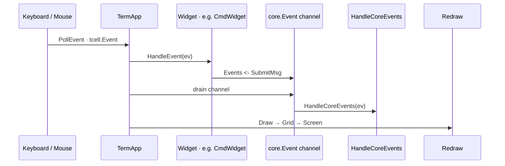
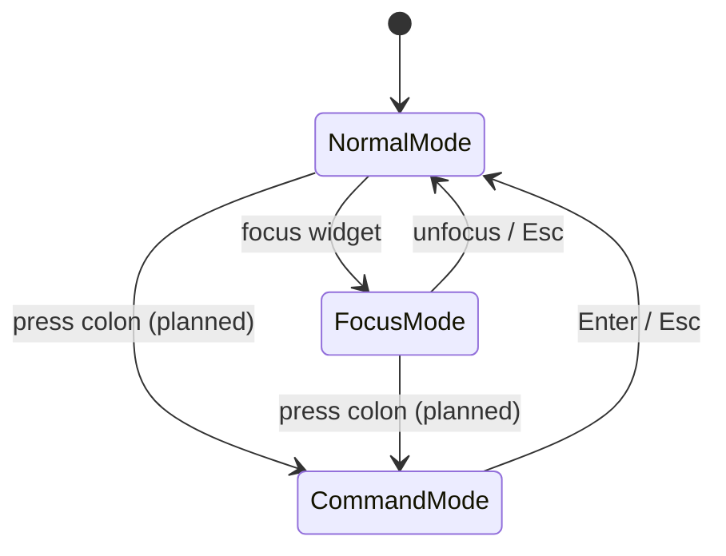

# Input System

cgdb-go handles keyboard and mouse input through **tcell**, routes events based on **interaction mode**, and will support a **Vim-like command system** via the global CmdLine.

**Companion docs:** [UI_ARCHITECTURE.md](UI_ARCHITECTURE.md) · [WINDOW_MANAGEMENT.md](WINDOW_MANAGEMENT.md) · [ARCHITECTURE.md](ARCHITECTURE.md)

---

## Table of contents

- [Input overview](#input-overview)
- [Keyboard handling](#keyboard-handling)
- [Mouse handling](#mouse-handling)
- [Interaction modes](#interaction-modes)
- [Vim-like command system](#vim-like-command-system)
- [Async input from debugger](#async-input-from-debugger)
- [Planned keybindings](#planned-keybindings)

---

## Input overview

```text
Keyboard / Mouse
        ↓
TermApp (select loop)
        ├── tcell.Event  → HandleUIEvent + widget HandleEvent → redraw
        └── core.Event   → HandleCoreEvents (application dispatch hub)
```



*Sources: [`diagrams/event_flow.mermaid`](diagrams/event_flow.mermaid) · [`diagrams/event_bus.mermaid`](diagrams/event_bus.mermaid)*

**Design principles:**

1. One thread owns input and rendering.
2. Async sources (GDB PTY) inject **tcell** events via `PostEvent`, never by calling widget methods directly.
3. Domain actions (commands, quit, debugger routing) publish **`core.Event`** to the bus; the application handles them in **`HandleCoreEvents`**, not in individual widgets.

---

## Keyboard handling

### Event types

| tcell event | Handling |
|-------------|----------|
| `EventKey` | Primary keyboard input |
| `EventResize` | Terminal size change → reallocate canvas |
| `EventInterrupt` | Async injection (GDB output, timers) |
| `EventMouse` | Mouse click/scroll (enabled via `EnableMouse`) |

### Dispatch (current)

1. `TermApp.HandleEvent` — global shortcuts (`Ctrl+D` quit, resize).
2. Each top-level widget's `HandleEvent` — receives **every** event today.

**Gap:** no mode router; no focus-aware top-level dispatch. Target: Root layout sends events only to CmdLine, TabBar, or focused Workspace leaf based on mode.

### Widget-level handling

Example: `GDBWidget` (`gdb_widget.go`):

| Key | Action |
|-----|--------|
| `Enter` | Send input buffer to GDB |
| `Backspace` | Edit input |
| `Left` / `Right` | Move cursor |
| `Up` / `Down` | Send escape sequences to GDB (history) |
| `Ctrl+C` | Send SIGINT (`\x03`) |
| `Ctrl+D` | Send `q\n` to GDB |
| Rune | Insert into input buffer |

Example: `CmdWidget` (`cmd_widget.go`):

| Key | Action |
|-----|--------|
| `:` (when inactive) | Enter command mode |
| `Enter` | Parse command, emit `SubmitMsg` on event bus |
| `Esc` | Cancel command mode |
| `Up` / `Down` | History navigation |
| `Tab` | Complete command name |
| `Backspace` on lone `:` | Exit command mode |

On Enter, `CmdWidget` resolves the first token against `AutoCompleter`, sets `CmdID` (or `core.CmdUnknown`), and publishes to `TermApp.events`. **`HandleCoreEvents`** in the app dispatches by `CommandID`.

---

## Mouse handling

`tcell` mouse support is enabled in `NewTermApp`:

```go
screen.EnableMouse()
```

**Current state:** no widget handles `EventMouse` yet.

**Planned uses:**

| Action | Behavior |
|--------|----------|
| Click pane | Focus that pane |
| Click tab | Switch tab |
| Drag split gutter | Resize split ratio |
| Scroll | Scroll source/console viewport |
| Click breakpoint gutter | Toggle breakpoint |

**Design decision:** mouse is **optional enhancement**, not primary UX. All operations must have keyboard equivalents for SSH / minimal terminal environments.

---

## Interaction modes



*Source: [`diagrams/input_modes.mermaid`](diagrams/input_modes.mermaid)*

| Mode | Keys go to | Purpose |
|------|------------|---------|
| **Normal** | Global handler | Navigation, tab switch, quit, enter focus |
| **Focus** | Focused Workspace widget | Pane-specific editing (source scroll, GDB input) |
| **Command** | CmdLine | `:` UI commands |

Mode constants are planned for `cmd/cgdb` / `termui`:

```go
const (
    NormalMode Mode = iota
    FocusMode
    CommandMode
)
```

**Design decision:** three modes mirror Vim's normal / insert / command separation, adapted for debugger UX:

- Normal mode avoids accidentally typing into GDB when navigating.
- Focus mode is pane-local (like Vim insert, but per-widget semantics).
- Command mode is for UI operations, not debugger commands.

**Gap:** modes are not wired into `TermApp` yet. `CmdWidget.active` implements local command-mode activation when `:` is pressed.

---

## Vim-like command system

The CmdLine accepts `:` prefixed commands. Press `:` to activate `CmdWidget`; type a command and press Enter.

### Architecture


Flow:

1. User presses `:` → `CmdWidget` enters command mode.
2. User types `:break main`, presses Enter.
3. `CmdWidget` tokenizes input (`break`, args `main`).
4. `AutoCompleter` resolves `break` → app-private `cmdBreak` ID.
5. `SubmitMsg{Text, CmdID, Args}` published on event bus.
6. **`HandleCoreEvents`** switches on `CommandID()` — exit, forward to GDB, layout change, etc.
7. Unknown commands arrive with `core.CmdUnknown`.

### Command ID ownership

| Layer | Constants | Visibility |
|-------|-----------|------------|
| `core` | `CmdUnknown` | Infra — shared sentinel for unrecognized commands |
| `cmd/cgdb` | `cmdBreak`, `cmdQuit`, … | **Private to app** — `iota + 1` so `0` stays `CmdUnknown` |

The completer is built in the application with app command IDs:

```go
completer := core.NewSimpleCompleter([]core.Command{
    {ID: cmdBreak, Name: "break"},
    {ID: cmdQuit, Name: "quit"},
})
cmd.Events = app.Events()
```

`termui` never imports app command constants — it only emits resolved IDs from the completer.

### Command categories

| Category | Examples | Dispatch |
|----------|----------|----------|
| Window | `:vsplit`, `:close`, `:focus left` | `HandleCoreEvents` → layout (planned) |
| Tab | `:tabnew`, `:tabclose` | `HandleCoreEvents` → tab widget (planned) |
| Debugger | `:break`, `:continue`, `:step` | `HandleCoreEvents` → `core.Debugger` (planned) |
| UI | `:quit` | `HandleCoreEvents` → `app.Exit()` (implemented) |

**Design decision:** UI commands and GDB CLI commands share familiar syntax (`:break main`) but all routing happens in **`HandleCoreEvents`**. Widgets publish events; the app decides whether to mutate layout, talk to GDB, or exit.

---

## Async input from debugger

GDB output is **not keyboard input** but arrives through the same event loop:

```go
screen.PostEvent(tcell.NewEventInterrupt(msg))  // core.GdbOutputMsg
screen.PostEvent(tcell.NewEventInterrupt("gdb-timeout"))
screen.PostEvent(tcell.NewEventInterrupt("gdb-exit"))
```

`GDBWidget` uses a **burst timer** (`GdbInputState.Timer`, 100ms) to batch MI lines before parsing into `MiMsg`. This prevents partial-line flicker when GDB sends rapid output.

**Design rationale:** MI output arrives in arbitrary chunk boundaries. Line buffering + debounce produces stable UI updates without implementing a full async state machine in the draw path.

---

## Planned keybindings

### Normal mode (planned)

| Key | Action |
|-----|--------|
| `:` | Enter command mode |
| `Tab` / `Shift-Tab` | Cycle focus |
| `Ctrl+W h/j/k/l` | Focus direction |
| `Ctrl+D` | Quit |
| `1-9` | Switch tab |

### Focus mode (planned)

| Key | Action |
|-----|--------|
| `Esc` | Return to normal mode |
| `:` | Enter command mode |
| Pane-specific | Widget handles (scroll, GDB input, etc.) |

### Command mode (planned)

| Key | Action |
|-----|--------|
| `Enter` | Execute command |
| `Esc` | Cancel, return to previous mode |
| `Up` / `Down` | Command history |
| `Tab` | Completion |

---

## Related documentation

- [WINDOW_MANAGEMENT.md](WINDOW_MANAGEMENT.md) — CmdLine placement
- [DEBUGGER_INTEGRATION.md](DEBUGGER_INTEGRATION.md) — GDB input forwarding
- [DEVELOPER_GUIDE.md](DEVELOPER_GUIDE.md) — adding event handlers
