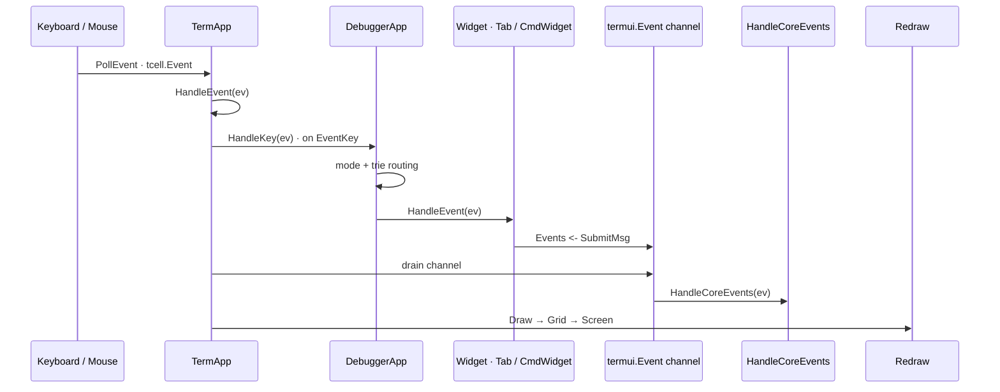
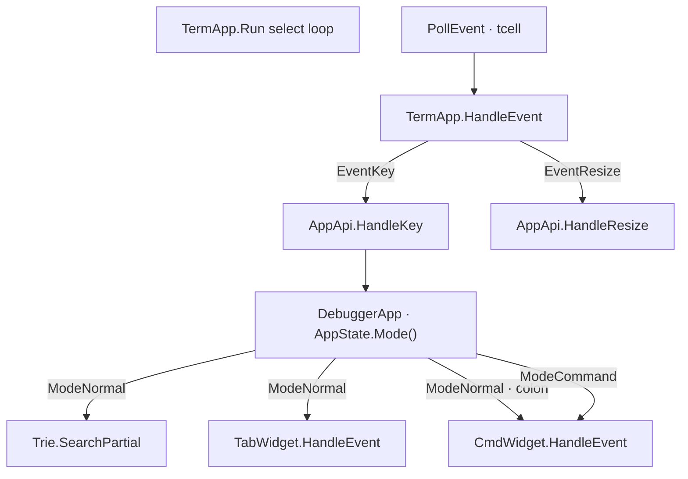
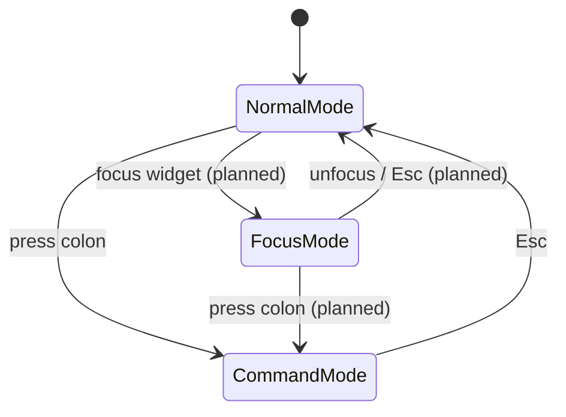
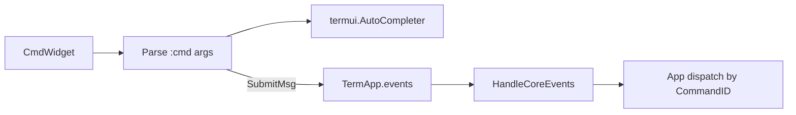

# Input System

cgdb-go handles keyboard and mouse input through **tcell**, routes events based on **interaction mode**, and will support a **Vim-like command system** via the global CmdLine.

**Companion docs:** [UI_ARCHITECTURE.md](UI_ARCHITECTURE.md) · [WINDOW_MANAGEMENT.md](WINDOW_MANAGEMENT.md) · [ARCHITECTURE.md](ARCHITECTURE.md)

---

## Table of contents

- [Input overview](#input-overview)
- [Keyboard handling](#keyboard-handling)
- [Key-sequence trie](#key-sequence-trie)
- [Mouse handling](#mouse-handling)
- [Interaction modes](#interaction-modes)
- [Vim-like command system](#vim-like-command-system)
- [Async input from debugger](#async-input-from-debugger)
- [Planned keybindings](#planned-keybindings)

---

## Input overview

```text
Keyboard / Mouse
        ↓
TermApp (select loop)
        ├── termui.Event  → AppApi.HandleCoreEvents
        └── tcell.Event   → TermApp.HandleEvent
                                ├── EventResize → UpdateCanvas, AppApi.HandleResize
                                └── EventKey    → AppApi.HandleKey
                                      ├── mode router (AppState)
                                      ├── Trie (key sequences)
                                      └── TabWidget / CmdWidget HandleEvent → redraw
```



*Sources: [`diagrams/event_flow.mermaid`](diagrams/event_flow.mermaid) · [`diagrams/input_routing.mermaid`](diagrams/input_routing.mermaid) · [`diagrams/event_bus.mermaid`](diagrams/event_bus.mermaid)*

**Design principles:**

1. One thread owns input and rendering.
2. Async sources (GDB PTY) inject **tcell** events via `PostEvent`, never by calling widget methods directly.
3. Domain actions (commands, quit, debugger routing) publish **`termui.Event`** to the bus; the application handles them in **`HandleCoreEvents`**, not in individual widgets.
4. **Mode-aware routing** lives in the application layer (`DebuggerApp`), not in `TermApp` — the framework stays generic.

---

## Keyboard handling

### Event types

| tcell event | Handling |
|-------------|----------|
| `EventKey` | Primary keyboard input |
| `EventResize` | Terminal size change → reallocate canvas |
| `EventInterrupt` | Async injection (GDB output, timers) |
| `EventMouse` | Mouse click/scroll (enabled via `EnableMouse`) |

### Dispatch (current)

1. `TermApp.HandleEvent` — global shortcuts (`Ctrl+D` quit, resize → `UpdateCanvas`, redraw interrupt).
2. `AppApi.HandleResize` — assign top-level widget rects (tab = full height; cmd line at row `H-1`).
3. `AppApi.HandleKey` — application-level key routing by `AppState.Mode()`:
   - **`ModeNormal`** — `:` enters command mode; other keys go through the **Trie** then to `TabWidget`.
   - **`ModeCommand`** — all keys go to `CmdWidget`.



*Source: [`diagrams/input_routing.mermaid`](diagrams/input_routing.mermaid)*

**Gap:** `ModeFocus` / `ModeInsert` are defined but not wired. Tab still receives keys in normal mode alongside the trie; focus-aware routing inside the workspace is partial (`WidgetTree.focus` exists, no global focus mode yet).

### Widget-level handling

Example: `GDBWidget` (`gdb_widget.go`):

| Key | Action |
|-----|--------|
| `Enter` | Send input buffer to GDB |
| `Backspace` | Edit input |
| `Left` / `Right` | Move cursor |
| `Up` / `Down` | Send escape sequences to GDB (history) |
| `Ctrl+C` | Send SIGINT (`\x03`) |
| `Ctrl+D` | Send `q\n` to GDB |
| Rune | Insert into input buffer |

Example: `CmdWidget` (`cmd_widget.go`):

| Key | Action |
|-----|--------|
| `Enter` | Parse command, emit `SubmitMsg` on event bus |
| `Up` / `Down` | History navigation |
| `Tab` | Complete command name |
| `Backspace` on lone `:` | Deactivate widget (app should reset mode — see gap below) |
| Rune / editing keys | Insert, move cursor |

Command mode entry and exit:

| Key | Handler | Action |
|-----|---------|--------|
| `:` | `HandleKey` in normal mode | `SetMode(ModeCommand)`, `CmdWidget.Activate()` |
| `Esc` | `CmdWidget` → `SubmitMsg{CmdID: CmdExitMode}` | `HandleCoreEvents` resets mode, deactivates widget |
| `Enter` | `HandleKey` after submit | `SetMode(ModeNormal)`, `CmdWidget.Deativate()` |

On Enter, `CmdWidget` resolves the first token against `AutoCompleter`, sets `CmdID` (or `termui.CmdUnknown`), and publishes to `TermApp.events`. **`HandleCoreEvents`** in the app dispatches by `CommandID`.

---

## Key-sequence trie

Multi-key bindings (Vim-style `<C-w>h`, etc.) are registered on a **`termui.Trie`** owned by `DebuggerApp`.

```go
type DebuggerApp struct {
    *termui.TermApp
    trie      termui.Trie
    appState  cgdb.AppState
    // ...
}

func (app *DebuggerApp) BindKeySeq(fn termui.Callback, seqs ...string) {
    for _, seq := range seqs {
        app.trie.Bind(seq, fn)
    }
}
```

Sequence syntax (parsed by `Trie.ParseSequence`):

| Token | Example |
|-------|---------|
| Control | `<C-w>`, `<C-d>` |
| Arrow keys | `<Up>`, `<Left>` |
| Single rune | append after modifiers, e.g. `<C-w>h` |

In **normal mode**, each key event calls `Trie.SearchPartial(ev)` before `TabWidget.HandleEvent`. The trie tracks partial matches across keystrokes; on an exact match it invokes the bound callback (e.g. `OnFocusLeft` → `tab.FocusLeft()`).

**Current bindings** (`cmd/cgdb/main.go`):

| Sequence | Action |
|----------|--------|
| `<C-w>h`, `<C-w><Right>` | Focus right pane |
| `<C-w>l`, `<C-w><Left>` | Focus left pane |
| `<C-w>k`, `<C-w><Up>` | Focus up pane |
| `<C-w>j`, `<C-w><Down>` | Focus down pane |

Implementation: `internal/termui/trie.go`.

**Design decision:** the trie lives on the application object, not in `TermApp`, so key bindings remain app-specific while `termui` provides the generic prefix-tree machinery.

---

## Mouse handling

`tcell` mouse support is enabled in `NewTermApp`:

```go
screen.EnableMouse()
```

**Current state:** no widget handles `EventMouse` yet.

**Planned uses:**

| Action | Behavior |
|--------|----------|
| Click pane | Focus that pane |
| Click tab | Switch tab |
| Drag split gutter | Resize split ratio |
| Scroll | Scroll source/console viewport |
| Click breakpoint gutter | Toggle breakpoint |

**Design decision:** mouse is **optional enhancement**, not primary UX. All operations must have keyboard equivalents for SSH / minimal terminal environments.

---

## Interaction modes



*Source: [`diagrams/input_modes.mermaid`](diagrams/input_modes.mermaid)*

| Mode | Keys go to | Purpose | Status |
|------|------------|---------|--------|
| **Normal** | Trie + `TabWidget` | Navigation, key sequences, workspace input | **Implemented** |
| **Focus** | Focused Workspace widget | Pane-specific editing (source scroll, GDB input) | Planned |
| **Command** | `CmdWidget` | `:` UI commands | **Implemented** |
| **Search** | TBD | Search prompt (e.g. `/` in source) | Reserved |

Mode state lives in **`internal/cgdb`** (`AppState`), not in `termui`:

```go
// internal/cgdb/mode_manager.go
type Mode int

const (
    ModeNormal Mode = iota
    ModeCommand
    ModeSearch
    ModeInsert
)

type AppState struct {
    mode Mode
}
```

`DebuggerApp` owns `appState cgdb.AppState` and switches modes in `HandleKey` and `HandleCoreEvents`. `TermApp` has no knowledge of modes.

**Design decision:** modes mirror Vim's normal / insert / command separation, adapted for debugger UX:

- Normal mode avoids accidentally typing into GDB when navigating; trie handles multi-key chords.
- Focus mode will be pane-local (like Vim insert, but per-widget semantics).
- Command mode is for UI operations, not debugger commands.

**Gaps:**

- `ModeFocus` / `ModeInsert` / `ModeSearch` are defined but not routed yet.
- `NewTabTwoHozSplitWins` currently passes only the first widget to `NewLayout`; the second widget argument is not wired into a split yet.

---

## Vim-like command system

The CmdLine accepts `:` prefixed commands. Press `:` to activate `CmdWidget`; type a command and press Enter.

### Architecture



Flow:

1. User presses `:` → `DebuggerApp` sets `ModeCommand`, `CmdWidget.Activate()`.
2. User types `:break main`, presses Enter.
3. `CmdWidget` tokenizes input (`break`, args `main`).
4. `AutoCompleter` resolves `break` → app-private `cmdBreak` ID.
5. `SubmitMsg{Text, CmdID, Args}` published on event bus.
6. **`HandleCoreEvents`** switches on `CommandID()` — exit, forward to GDB, layout change, etc.
7. Unknown commands arrive with `termui.CmdUnknown`.

### Command ID ownership

| Layer | Constants | Visibility |
|-------|-----------|------------|
| `termui` | `CmdUnknown` | Infra — shared sentinel for unrecognized commands |
| `cmd/cgdb` | `cmdBreak`, `cmdQuit`, … | **Private to app** — `iota + 1` so `0` stays `CmdUnknown` |

The completer is built in the application with app command IDs:

```go
completer := termui.NewSimpleCompleter([]termui.Command{
    {ID: cmdBreak, Name: "break"},
    {ID: cmdQuit, Name: "quit"},
})
a.cmdWidget = termui.NewCmdWidget(completer)
a.cmdWidget.Events = a.Events()
```

`termui` never imports app command constants — it only emits resolved IDs from the completer.

### Command categories

| Category | Examples | Dispatch |
|----------|----------|----------|
| Window | `:vs`, `:split`, `:close` (via `:quit` on last pane) | **Partial** — `:vs` / `:split` wired in `HandleCoreEvents` |
| Tab | `:tabnew`, `:tabclose` | `HandleCoreEvents` → tab widget (planned) |
| Debugger | `:break`, `:continue`, `:step` | `HandleCoreEvents` → `core.Debugger` (planned) |
| UI | `:quit` | `HandleCoreEvents` → `app.Exit()` (implemented) |

**Design decision:** UI commands and GDB CLI commands share familiar syntax (`:break main`) but all routing happens in **`HandleCoreEvents`**. Widgets publish events; the app decides whether to mutate layout, talk to GDB, or exit.

---

## Async input from debugger

GDB output is **not keyboard input** but arrives through the same event loop:

```go
screen.PostEvent(tcell.NewEventInterrupt(msg))  // core.GdbOutputMsg
screen.PostEvent(tcell.NewEventInterrupt("gdb-timeout"))
screen.PostEvent(tcell.NewEventInterrupt("gdb-exit"))
```

`GDBWidget` uses a **burst timer** (`GdbInputState.Timer`, 100ms) to batch MI lines before parsing into `MiMsg`. This prevents partial-line flicker when GDB sends rapid output.

**Design rationale:** MI output arrives in arbitrary chunk boundaries. Line buffering + debounce produces stable UI updates without implementing a full async state machine in the draw path.

---

## Keybindings

### Normal mode

| Key | Action | Status |
|-----|--------|--------|
| `:` | Enter command mode | Implemented |
| `Ctrl+W h/j/k/l` or arrows | Focus direction (via trie) | Implemented |
| `Ctrl+D` | Quit | Implemented (`TermApp`) |
| `Tab` / `Shift-Tab` | Cycle focus | Planned |
| `1-9` | Switch tab | Planned |

### Focus mode (planned)

| Key | Action |
|-----|--------|
| `Esc` | Return to normal mode |
| `:` | Enter command mode |
| Pane-specific | Widget handles (scroll, GDB input, etc.) |

### Command mode

| Key | Action | Status |
|-----|--------|--------|
| `Enter` | Execute command | Implemented |
| `Esc` | Cancel, return to normal mode | Implemented |
| `Up` / `Down` | Command history | Implemented |
| `Tab` | Completion | Implemented |

---

## Related documentation

- [WINDOW_MANAGEMENT.md](WINDOW_MANAGEMENT.md) — CmdLine placement
- [DEBUGGER_INTEGRATION.md](DEBUGGER_INTEGRATION.md) — GDB input forwarding
- [DEVELOPER_GUIDE.md](DEVELOPER_GUIDE.md) — adding event handlers
