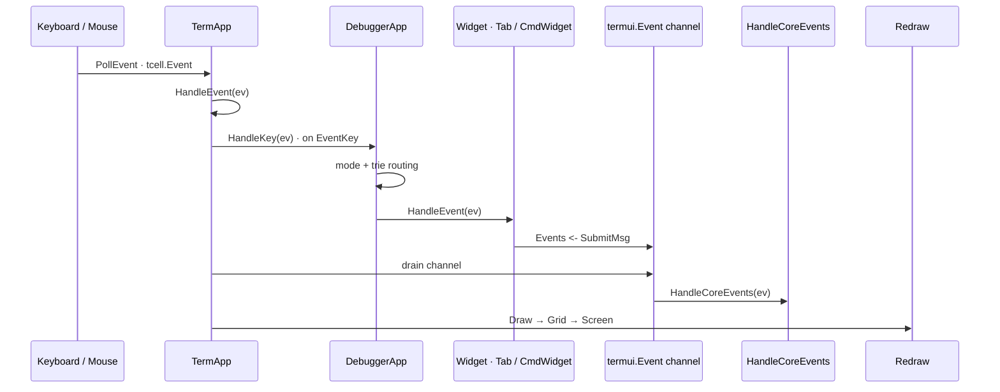
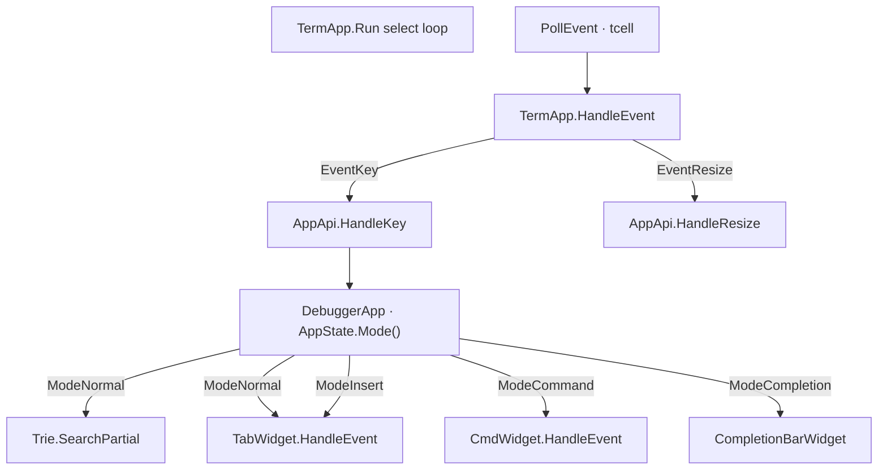
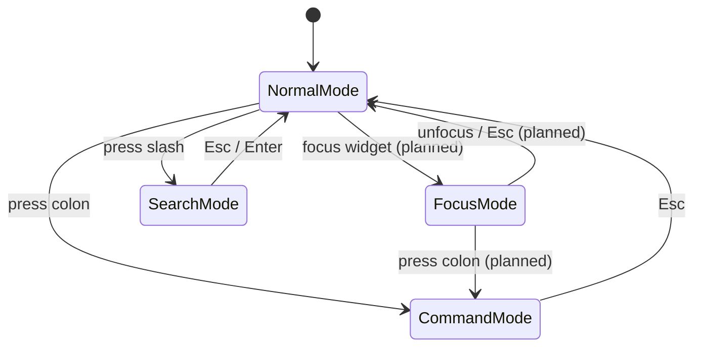
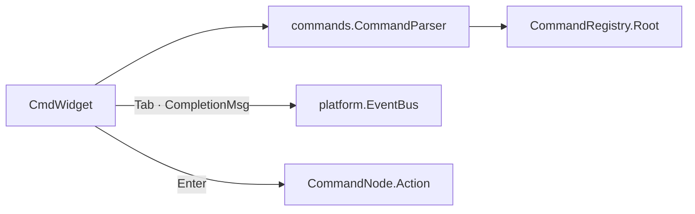

# Input System

gdbforge handles keyboard and mouse input through **tcell**, routes events based on **interaction mode**, and will support a **Vim-like command system** via the global CmdLine.

**Companion docs:** [UI_ARCHITECTURE.md](UI_ARCHITECTURE.md) · [WINDOW_MANAGEMENT.md](WINDOW_MANAGEMENT.md) · [ARCHITECTURE.md](ARCHITECTURE.md)

---

## Table of contents

- [Input overview](#input-overview)
- [Keyboard handling](#keyboard-handling)
- [Key-sequence trie](#key-sequence-trie)
- [Mouse handling](#mouse-handling)
- [Interaction modes](#interaction-modes)
- [Vim-like command system](#vim-like-command-system)
- [Async input from debugger](#async-input-from-debugger)
- [Planned keybindings](#planned-keybindings)

---

## Input overview

```text
Keyboard / Mouse
        ↓
TermApp (select loop)
        ├── termui.Event  → AppApi.HandleCoreEvents
        └── tcell.Event   → TermApp.HandleEvent
                                ├── EventResize → UpdateCanvas, AppApi.HandleResize
                                └── EventKey    → AppApi.HandleKey
                                      ├── mode router (AppState)
                                      ├── Trie (key sequences)
                                      └── TabWidget / CmdWidget HandleEvent → redraw
```



*Sources: [`diagrams/event_flow.mermaid`](diagrams/event_flow.mermaid) · [`diagrams/input_routing.mermaid`](diagrams/input_routing.mermaid) · [`diagrams/event_bus.mermaid`](diagrams/event_bus.mermaid)*

**Design principles:**

1. One thread owns input and rendering.
2. Async sources (GDB PTY) inject **tcell** events via `PostEvent`, never by calling widget methods directly.
3. Domain actions (commands, quit, debugger routing) publish **`termui.Event`** to the bus; the application handles them in **`HandleCoreEvents`**, not in individual widgets.
4. **Mode-aware routing** lives in the application layer (`DebuggerApp`), not in `TermApp` — the framework stays generic.

---

## Keyboard handling

### Event types

| tcell event | Handling |
|-------------|----------|
| `EventKey` | Primary keyboard input |
| `EventResize` | Terminal size change → reallocate canvas |
| `EventInterrupt` | Async injection (GDB output, redraw wakes) |
| `EventMouse` | Mouse click/scroll (enabled via `EnableMouse`) |

### Dispatch (current)

1. `TermApp.HandleEvent` — global shortcuts (`Ctrl+D` quit, resize → `UpdateCanvas`, redraw interrupt).
2. `AppApi.HandleResize` — assign top-level chrome rects (tab / completion bar / cmdline; see [WINDOW_MANAGEMENT.md](WINDOW_MANAGEMENT.md)).
3. `AppApi.HandleKey` — application-level key routing by `AppState.Mode()`:
   - **Global (every mode)** — `withGlobalKeys` in `setup.go` runs first: **Ctrl-Z** suspends the inferior if running, otherwise suspends gdbforge (`TermApp.Suspend` / tcell `Suspend`+`Resume`); **Ctrl-C** interrupts via the debugger PTY (GDB/dlv); **Ctrl-D** sends quit to GDB/dlv (confirm if inferior alive). Works with any focused pane (Code, GDB, cmdline, Lua, …).
   - **`ModeNormal`** — `:` enters command mode; `/` enters search mode; **Esc** restores the last non-Code/non-GDB pane when one was focused (e.g. Breakpoints), else focuses the CodeWidget leaf when `:set esctocode` (default); **`i`** focuses the remembered GDB leaf and enters insert; **Up/Down/Space/e/n/s/c** are global for Code/GDB (`n` → search-next when a pattern is active, else MI `-exec-next`; `s`/`c` → `-exec-step`/`-exec-continue`); **`*`/`#`** search word under cursor forward/back; **`N`** previous search match; other panes keep their own Up/Down/Space; other keys go through the **Trie** then the focused widget.
   - **`ModeInsert`** — GDB console (after `i`); Esc → normal (+ last non-Code/non-GDB pane, or CodeWidget when `esctocode`). If a **CodeWidget** is focused, **`n`/`s`/`c`** still send next/step/continue (Handled fallthrough — not when GDB or another pane owns focus).
   - **`ModeCommand`** — all keys go to `CmdWidget` (after global Ctrl-Z / Ctrl-D).
   - **`ModeSearch`** — all keys go to `CmdWidget` in search kind; live highlight on the focused `SearchHost`; Enter commits; Esc reverts.
   - **`ModeCompletion`** — wildmenu: arrows cycle; Esc → prior mode; typed keys edit source line and re-query.
   - **`ModeLua`** — keys go to the active `LuaWidget` until Esc.



*Source: [`diagrams/input_routing.mermaid`](diagrams/input_routing.mermaid)*

**Gap:** focus-aware routing inside the workspace is partial (`WidgetTree.focus` exists). Insert mode is wired for the focused console pane.

### Widget-level handling

GDB / Delve console keys are handled by shared termui pieces, then backend-specific callbacks:

| Layer | File | Owns |
|-------|------|------|
| `InputLine` | `termui/input_line.go` | Editing + history chords |
| `ConsolePane` | `termui/console_pane.go` | Enter / Ctrl-L / PgUp / selection; walking prompt Draw |
| `GDBWidget` | `internal/gdbforge/widgets/gdb_widget.go` | `OnSubmit` → echo + `Debugger.Send`; Ctrl-C/D → interrupt/quit |
| `cmd/gdbforge/input.go` | Tab → `gdbTabComplete` | GDB: MI `-complete`; Delve: `dlv.Complete` (commands + `funcs`) |
| `ExecWidget` | `internal/gdbforge/widgets/exec_widget.go` | Line submit → PTY `Send`; ANSI scrollback; live bash/ssh prompt |

When the GDB pane is focused (insert):

| Key | Action |
|-----|--------|
| `Enter` | Echo `(gdb)`/`(dlv) cmd` to scrollback, send to debugger, clear input line |
| `Tab` | Wildmenu completion — GDB MI `-complete`; Delve command names + `funcs ^<prefix>` for `b`/`break`/… (e.g. `b main.`) |
| `Backspace` / `Delete` | Edit input (`InputLine`) |
| `Left` / `Right`, `Home` / `End` | Move cursor (`Ctrl-B/F/A/E`) |
| `Up` / `Down` | Local readline-style history (`Ctrl-P/N`) |
| `Ctrl+C` | Copy selection if any; otherwise interrupt (Delve: only if inferior running; at `[Y/n]?` sends `n`) |
| `Ctrl+D` | Send `q` / quit |
| `Ctrl+L` | Clear scrollback (screen reset — prompt returns to top-left) |
| `Ctrl+Z` | Global: SIGTSTP inferior if running, else suspend gdbforge (job control; `fg` to resume) |
| `Ctrl+V` | Paste **CLIPBOARD** into the input line |
| Middle-click | Paste **PRIMARY** (X11) when available, else CLIPBOARD — rising-edge only (~120ms debounce; motion while held does not re-paste) |
| `PgUp` / `PgDn` | Scroll output viewport |
| Rune | Insert into input buffer |
| Mouse drag | Select scrollback text (copies to CLIPBOARD + PRIMARY) |
| Double-click | Select word under cursor and copy |
| Triple-click | Select whole line and copy |

**Normal mode:** `<C-o>` jumps back to the previous widget after `:b` / `:e` / `:!` (see [EXEC_SHELL.md](EXEC_SHELL.md)).

The `(gdb)` / `(dlv)` prompt walks down line-by-line under the scrollback while there is free space, then pins to the bottom and scrolls when the pane is full. Delve `[Y/n]?` confirms (e.g. suspended breakpoint after exit) use the same live-host path as GDB quit confirm. Look stays a native debugger session (not chat labels).

Example: `CmdWidget` (`cmd_widget.go`) — uses the same `ClipboardIO` bridge as Viewport / ConsolePane:

| Key | Action |
|-----|--------|
| `Enter` | Parse command, emit `SubmitMsg` on event bus |
| `Up` / `Down` | History navigation |
| `Tab` | Complete command name |
| `Backspace` on lone `:` | Deactivate widget (app should reset mode — see gap below) |
| `Ctrl+V` / middle-click | Paste into the cmdline (CLIPBOARD / PRIMARY; first line only; middle-click rising-edge) |
| `Ctrl+C` / `Ctrl+X` | Copy / cut text after `:` |
| Rune / editing keys | Insert, move cursor |

Command mode entry and exit:

| Key | Handler | Action |
|-----|---------|--------|
| `:` | `HandleKey` in normal mode | `SetMode(ModeCommand)`, `CmdWidget.Activate()` |
| Click cmdline | `HandleMouse` | Same as `:` (enter command mode); sets caret from click column |
| Click outside cmdline (command mode) | `HandleMouse` | Leave command mode (like Esc), then focus the pane under the pointer |
| `Esc` | `CmdWidget` → `SubmitMsg{CmdID: CmdExitMode}` | `HandleCoreEvents` resets mode, deactivates widget |
| `Enter` | `HandleKey` after submit | `SetMode(ModeNormal)`, `CmdWidget.Deativate()` |

On Enter, `CmdWidget` resolves the first token against `AutoCompleter`, sets `CmdID` (or `termui.CmdUnknown`), and publishes to `TermApp.events`. **`HandleCoreEvents`** in the app dispatches by `CommandID`.

---

## Key-sequence bindings

Multi-key bindings (Vim-style `<C-w>h`, etc.) are registered on a **`commands.KeyBindingRegistry`** owned by `DebuggerApp` (`cmd/gdbforge/keybindings.go`).

```go
func (a *DebuggerApp) InitKeyBindings() {
    a.keyBindings = commands.NewKeyBindingRegistry()
    a.keyBindings.Bind(
        commands.NewCommand("move-left", func(args ...any) { a.OnFocusLeft() }),
        "<C-w>l", "<C-w><Left>",
    )
}
```

In **normal mode** (`cmd/gdbforge/input.go`), key→action maps live on a **mode key trie** (`keyBindings` via `InitKeyBindings`): Esc, `:`, `i`, Up/Down/Space/`e`/`n`/`s`/`c`, and window chords. Gated binds use `Handled` fallthrough so list panes keep Up/Down/Space. **Ctrl-Z** is not on the trie — it is intercepted by `withGlobalKeys` for every mode. Insert and completion modes use `insertKeys` / `completionKeys` the same way.

**Current bindings:**

| Sequence | Action |
|----------|--------|
| `<C-w>h`, `<C-w><Right>` | Focus right pane |
| `<C-w>l`, `<C-w><Left>` | Focus left pane |
| `<C-w>k`, `<C-w><Up>` | Focus up pane |
| `<C-w>j`, `<C-w><Down>` | Focus down pane |

Implementation: `internal/collections/trie.go` via `KeyBindingRegistry`.

**Design decision:** bindings live on the application object, not in `TermApp`, so key chords remain app-specific while shared packages provide the prefix-tree machinery.

---

## Mouse handling

`tcell` mouse support is enabled in `NewTermApp` (`EnableMouse` with motion events).

**Implemented today:**

| Action | Behavior |
|--------|----------|
| Click pane | Focus that pane; leave command mode if clicking outside the cmdline |
| Click cmdline | Enter command mode; set caret from column |
| Scroll wheel | Scroll focused viewport (source / console / lists) |
| Drag in viewport | Text selection; copy to CLIPBOARD and X11 PRIMARY (`platform/clipboard.go`) |
| Double-click | Select word (`termui/viewport_word.go`) and copy |
| Triple-click | Select line and copy |
| Middle-click | Paste PRIMARY (preferred) or CLIPBOARD — **rising edge only** (debounce ~120ms) |
| Thread / Call Stack / Breakpoints click | Activate on **button release** (not every drag sample); skip same-row drag that was a text select; debounce duplicate activate ~300ms |

**Clipboard note:** Selection copy writes both CLIPBOARD and PRIMARY so middle-click paste outside gdbforge (other X11 clients) sees the same text. Middle-paste inside gdbforge prefers PRIMARY.

**Still planned:** click tab to switch; drag split gutter to resize; click breakpoint gutter to toggle.

**Design decision:** mouse is an **enhancement**, not the only UX. All operations must have keyboard equivalents for SSH / minimal terminals.

---

## Interaction modes



*Source: [`diagrams/input_modes.mermaid`](diagrams/input_modes.mermaid)*

| Mode | Keys go to | Purpose | Status |
|------|------------|---------|--------|
| **Normal** | Trie + focused `FocusKeyHandler` | Navigation, key sequences, workspace input | **Implemented** |
| **Insert** | Focused console (GDB/IO/exec) or Code-gated `n`/`s`/`c` | Type into debugger / program; Esc → normal | **Implemented** |
| **Command** | `CmdWidget` (`CmdKindCommand`) | `:` UI commands | **Implemented** |
| **Search** | `CmdWidget` (`CmdKindSearch`) + `SearchHost` pane | `/` live buffer search; `*`/`#` word; `n`/`N` next/prev | **Implemented** |
| **Completion** | Wildmenu + source line edit | Tab completion (`ModeCompletion`) | **Implemented** |
| **Lua** | Active `LuaWidget` | `:lua snake` then `:b snake` (cell demos); `gdbforge.print` → `:b io` | **Implemented** |

Mode state lives in **`platform.AppState`** on `TermApp` (`State()`):

```go
// internal/platform/mode.go
type Mode int
const (
    ModeNormal Mode = iota
    ModeInsert
    ModeCommand
    ModeCompletion
    ModeLua
    ModeSearch
)
```

`DebuggerApp` registers mode handlers in `InitB` wrapped with `withGlobalKeys` (Ctrl-Z). Layout policy: `:set equalalways` / `:set noequalalways`; `:layout default|panels|classic|wide`. IO pane: `:set clearoutput` / `:set noclearoutput`. PTY owner is set while the console, `:AI`/MCP, or App writers hold the write mux. Focus roles (Code / GDB / last pane) live on `DebuggerApp` (`focus.go` / `code_nav.go`).

**Design decision:** modes mirror Vim's normal / insert / command separation, adapted for debugger UX:

- Normal mode avoids accidentally typing into GDB when navigating; trie handles multi-key chords.
- Insert mode is pane-local typing (GDB CLI, IO stdin, exec shell).
- Command mode is for UI operations, not debugger commands.
- Search mode muxes the same `CmdWidget` with a leading `/` (separate history; no Tab). Target is the focused pane's `SearchHost` (`viewport_search.go`). `*` / `#` search the word under the cursor; `n` / `N` jump matches (`n` is GDB next when no pattern is active).
- Ctrl-Z / Ctrl-D are mode-independent (GDB-like job control / quit).

**Gaps:**

- Dedicated Focus mode (pane-local keys exclusive of global) is still planned.
- `NewTabTwoHozSplitWins` creates a horizontal split of its two widgets.

---

## Vim-like command system

The CmdLine accepts `:` prefixed commands. Press `:` to activate `CmdWidget`; type a command and press Enter.

**Full reference:** [COMMAND_SYSTEM.md](COMMAND_SYSTEM.md) — command tree ownership, DSL, `CommandParser`, tab completion.

### Architecture (current)



Flow:

1. User presses `:` → `DebuggerApp` sets `ModeCommand`, `CmdWidget.Activate()` (`cmd/gdbforge/input.go`).
2. User types `:b `, presses **Tab** → parser `SuggestionNames` → `Publish(CompletionMsg)`; `CompletionBarWidget` shows the wildmenu and app enters `ModeCompletion`.
3. User presses **Enter** → `CommandParser.Parse` + `Execute` → leaf `Action` runs (e.g. `OnFocusLeft`).
4. Tree is built at startup via DSL in `ExapData()` (`cmd/gdbforge/command_tree.go`).

### Legacy note

Older docs described a flat `termui.AutoCompleter` + `CommandID` + `SubmitMsg` path for every colon command. Tree leaves now execute via `CommandParser` directly. `SubmitMsg` / `HandleCoreEvents` remain for infra events (`CmdExitMode`, layout commands not yet in the tree).

### Command categories

| Category | Examples | Dispatch |
|----------|----------|----------|
| Model / window | `:buffer code`, `:buffer breakpoints`, `:vs`, `:split`, `:close` | Window manager binds widget to existing model — **partial** (`:vs` / `:split` wired) |
| Tab | `:tabnew`, `:tabclose` | `HandleCoreEvents` → tab widget (planned) |
| Debugger | `:gdb break`, `:gdb info registers` | Colon tree under `gdb`; GDB CLI still typed in the GDB pane |
| UI | `:quit` / `:q` | confirm if inferior alive (Ctrl-D); `:q!` / `:quit!` force exit |

The `:buffer <name>` command displays an application model, not a file. Each `<name>` must be declared at startup (e.g. `code`, `breakpoints`, `console`). There is no `:attach` command — all models exist from initialization. See [ARCHITECTURE.md](ARCHITECTURE.md#buffer-concept).

**Design decision:** UI commands and GDB CLI commands share familiar ideas (`:gdb break file`) but all routing happens in **`HandleCoreEvents`**. Widgets publish events; the app decides whether to mutate layout, talk to services, or exit.

---

## Async input from debugger

GDB output is **not keyboard input** but arrives through the same event loop so it stays ordered with keys and draw:

```go
screen.PostEvent(tcell.NewEventInterrupt(msg))  // core.GdbOutputMsg
screen.PostEvent(tcell.NewEventInterrupt("gdb-exit"))
```

Bridge path:

1. `ptyx` reader → `Subscribe` fan-out → UI bridge `PostEvent(GdbOutputMsg)` (bridge only calls `PostEvent`, never widgets)
2. UI thread `HandleInterrupt` / `GDBWidget.HandleEvent` → `GdbInputState.PushRaw`
3. Each complete MI line → `MiUpdate` → `ConsolePane.AppendLines` / prompt attach

Incomplete lines stay in `GdbInputState.lineBuf` until the next `\n`. There is **no debounce timer**.

See [DEBUGGER_INTEGRATION.md](DEBUGGER_INTEGRATION.md) for dual-PTY layout (GDB vs inferior), `:AI`, and EventBus-driven breakpoint refresh (`BreakpointsChangedMsg`).

**Design rationale:** MI chunks may split mid-line; newline splitting is enough. Streaming per complete record keeps the console snappy while all UI mutation stays on the tcell event loop.

---

## Keybindings

### Normal mode

| Key | Action | Status |
|-----|--------|--------|
| `Esc` | Focus last non-Code/non-GDB pane if one was active; else CodeWidget leaf when `esctocode` (default); else leave insert → normal only | Implemented |
| `i` | Focus GDB leaf (remembered) and enter insert mode | Implemented |
| `Up` / `Down` | Move CodeWidget cursor line (global) | Implemented |
| `Space` | Toggle breakpoint at CodeWidget cursor (global) | Implemented |
| `e` | Enable/disable breakpoint at CodeWidget cursor (yellow when disabled) | Implemented |
| `n` | GDB next via MI `-exec-next` (normal; also insert when CodeWidget focused) | Implemented |
| `s` | GDB step via MI `-exec-step` (normal; also insert when CodeWidget focused) | Implemented |
| `c` | GDB continue via MI `-exec-continue` (normal; also insert when CodeWidget focused) | Implemented |
| `:` | Enter command mode | Implemented |
| `/` | Enter search mode (focused pane) | Implemented |
| `*` / `#` | Search word under cursor forward / back | Implemented |
| `n` / `N` | Next / previous search match (`n` = GDB next if no pattern) | Implemented |
| `Ctrl+W h/j/k/l` or arrows | Focus direction (via trie) | Implemented |
| `Ctrl+W o` | Only focused pane | Implemented |
| `Ctrl+O` | Jump back after `:b` / `:edit` / `:!` | Implemented |
| `Ctrl+D` | Send `q` to GDB (confirm if inferior alive) | Implemented |
| `Ctrl+Z` | Suspend inferior if running, else suspend gdbforge (**any mode**) | Implemented |
| `Tab` / `Shift-Tab` | Cycle focus | Planned |
| `1-9` | Switch tab | Planned |

### Focused pane (widget keys)

Keys reach the focused leaf when not consumed by the trie / command mode:

| Widget | Key | Action |
|--------|-----|--------|
| **CodeWidget** | `e` | Enable/disable breakpoint at cursor (yellow when disabled; same as BreakpointWidget `e`) |
| **CodeWidget** | **Space** | Insert/remove breakpoint at cursor line |
| **BreakpointWidget** (`:b breakpoint`) | `j`/`k` or Up/Down, Enter / click-release | Select row; browse Code with blue cursor (━━▶ stays on StopLocation); green when row is stop PC |
| **BreakpointWidget** | `e` | Toggle enable (remove/re-add in GDB; row stays) |
| **BreakpointWidget** | `d` | Delete from list and GDB |
| **ThreadWidget** / **CallStackWidget** | `j`/`k` or Up/Down, Enter / mouse **release** | Bold selection; activate sends MI `-thread-select` / `-stack-select-frame` (not CLI `thread`/`frame`, so the GDB console stays quiet); updates Code browse; green on stop PC; missing / `.so` → **not available** |
| **OutputWidget** (`:b io`, alias `:b output`) | PgUp/PgDn; type + Enter | Program stdin/stdout (inferior PTY); `<C-l>` clear; Ctrl-C → inferior; global Ctrl-D quits debugger; Ctrl-Z → SIGTSTP via inferior PTY |

Full sync path: [DEBUGGER_INTEGRATION.md](DEBUGGER_INTEGRATION.md#breakpoints-and-source-sync). Persist: [breakpoint persistence](DEBUGGER_INTEGRATION.md#breakpoint-persistence).

### Insert / Lua (focused panes)

When not in normal mode, keys go to the focused console or Lua widget (after global Ctrl-Z). See mode table above.

### Command mode

| Key | Action | Status |
|-----|--------|--------|
| `Enter` | Execute command | Implemented |
| `Esc` | Cancel, return to normal mode | Implemented |
| `Up` / `Down` | Command history | Implemented |
| `Tab` | Completion | Implemented |
| `Ctrl+Z` | Suspend (global) | Implemented |

---

## Related documentation

- [COMMAND_SYSTEM.md](COMMAND_SYSTEM.md) — command tree, DSL, parser, tab completion
- [WINDOW_MANAGEMENT.md](WINDOW_MANAGEMENT.md) — CmdLine placement
- [DEBUGGER_INTEGRATION.md](DEBUGGER_INTEGRATION.md) — GDB/Delve input forwarding, Delve Tab/`funcs` completion, yes/no confirms
- [DEVELOPER_GUIDE.md](DEVELOPER_GUIDE.md) — adding event handlers
