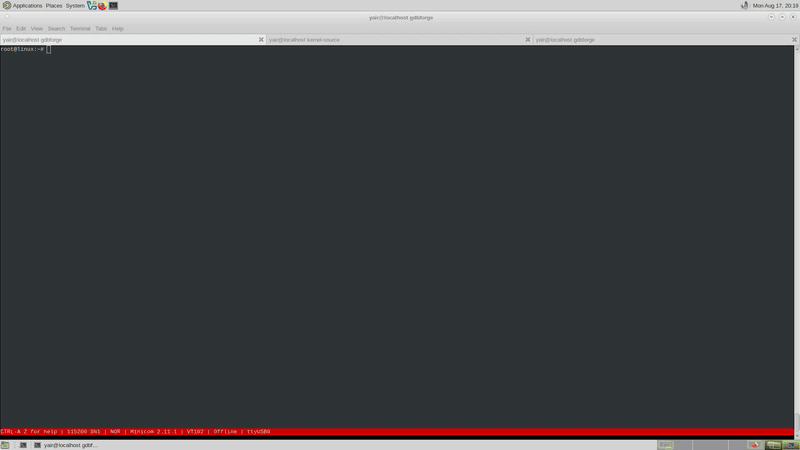
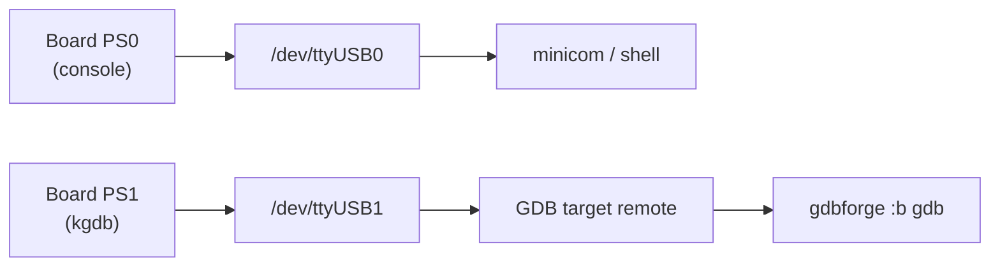
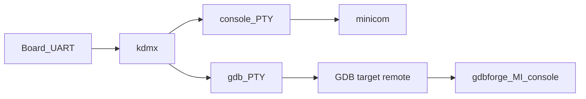
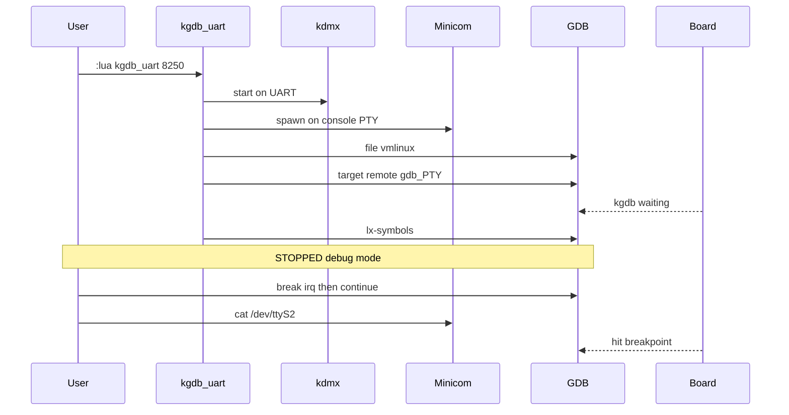
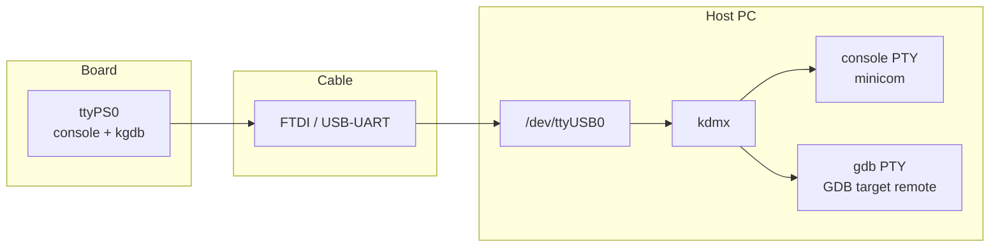
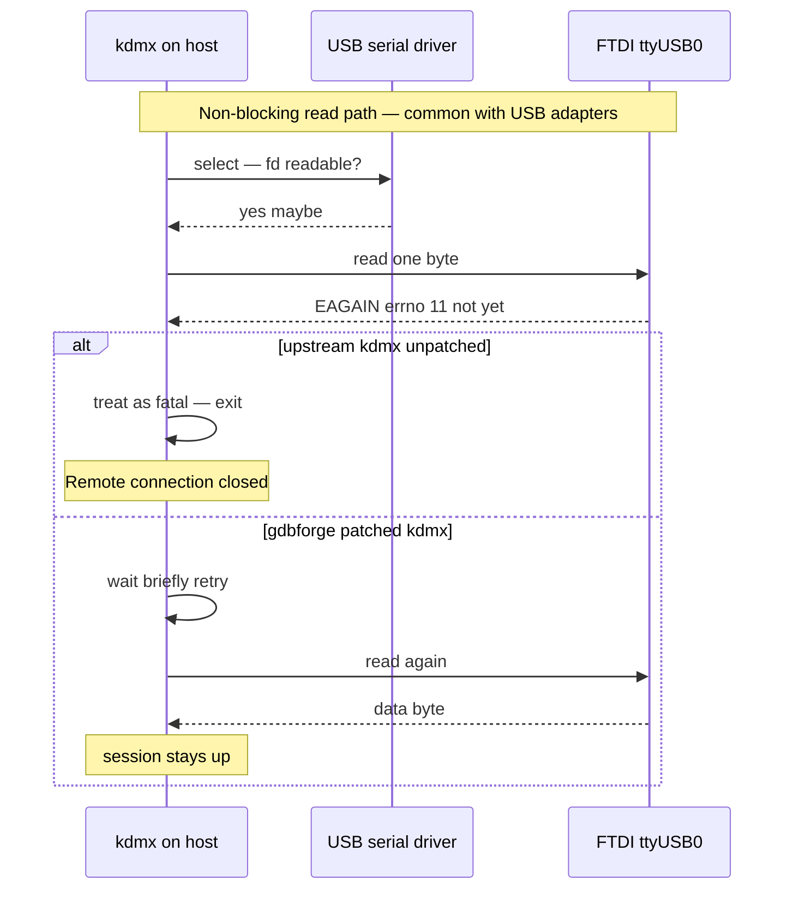
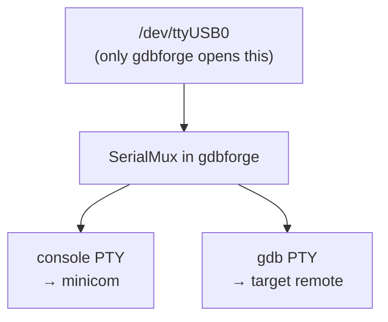
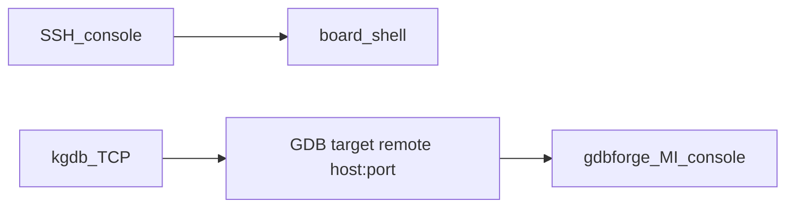

# Kernel / module debugging (kgdb)

gdbforge treats **kernel and module debug** as a first-class workflow. **v1** is implemented as **Lua extensions** that orchestrate existing tools; the UI stays the normal GDB MI console (`:b gdb`). A future option is an in-process UART mux that replaces external `kdmx` without changing the user command.

| Piece | Role (v1) |
|-------|-----------|
| gdbforge | GDB session, panes, breakpoints, Lua |
| `kdmx` (agent-proxy) | Split one board UART into console PTY + gdb PTY |
| minicom (or override) | Live Linux console on the console PTY |
| GDB | `target remote` to gdb PTY or TCP; `lx-symbols` from the **kernel** GDB scripts (not vendored here) |

Scripts (catalog under [`lua/`](https://github.com/yairgd/gdbforge/tree/main/lua)):

| `:lua` | Path | Mux? |
|--------|------|------|
| `kgdb_uart` | Shared UART + kgdboc | Yes — external `kdmx` |
| `kgdb_serial` | Shared UART + kgdboc | Yes — **in-process** mux (semi-auto) |
| `kgdb_trigger` | Break-in helper (after `kgdb_serial`) | Uses mux |
| `kgdb_net` | Ethernet kgdb (e.g. kgdboe) | No |
| `kgdb_common` | Shared helpers only | — |

See **[Path 0 — Two UARTs (manual)](#path-0--two-uarts-manual-recommended)** when the board has separate console and kgdb cables (**no mux, no Lua script**) — includes a [two-UART screencast](#path-0--two-uarts-manual-recommended).

See **[Path 1 — UART + kdmx (`kgdb_uart`)](#path-1--uart--kdmx)** for the [main kernel demo screencast](../README.md#demo) — one UART, kdmx split, **~2 s break-in**, `lx-symbols`, driver read breakpoint.

See **[Path 1b — One UART, in-process mux](#path-1b--one-uart-in-process-mux-semi-automatic)** for the in-process alternative (`:lua kgdb_serial` / `:lua kgdb_trigger`).

---

## Path 0 — Two UARTs (manual, recommended)

**When to use this:** the board exposes **two independent serial links** — one for the Linux console and one wired to a second UART that kgdb can use. This is the **simplest and most reliable** kgdb setup: console and gdb never share a wire, so there is **no owner switch**, **no kdmx**, and **breakpoints triggered from the shell work**.

{ loading=lazy }

[Watch on YouTube — two UARTs](https://www.youtube.com/watch?v=yhOO8CEh1LA)

The screencast shows gdbforge + GDB on a **dedicated kgdb UART** (`/dev/ttyUSB1`) while a **separate console UART** stays in minicom (`/dev/ttyUSB0`): `lx-symbols`, a breakpoint in a loadable module, trigger from the console (`cat /dev/…`), stop in `:b gdb`, step, `continue` back to the shell — no serial mux and no Lua bring-up script.

### Wiring (example — adjust names for your board)

| Board UART | Role | Host side |
|------------|------|-----------|
| **PS0** / `ttyS0` | Linux **console** — login shell, minicom | `/dev/ttyUSB0` |
| **PS1** / `ttyPS1` | **kgdb** stub line (gdb remote protocol) | `/dev/ttyUSB1` |

Nothing on the host may open **both** devices as one session — they are separate cables. gdbforge talks to the **kgdb** port via GDB; you keep a normal terminal (minicom, screen, …) on the **console** port.



### Prerequisites

- Kernel built with kgdb (`CONFIG_KGDB`, `CONFIG_KGDB_SERIAL`, …) and a matching **`vmlinux`** on the host.
- Kernel GDB helpers so **`lx-symbols`** works — source the kernel tree's `vmlinux-gdb.py` (not shipped in gdbforge).
- Two USB–serial adapters (or onboard dual-UART wiring) with known device nodes on the host.
- **Do not** run `:lua kgdb_serial`, kdmx, or `:serial-switch` for this path — they are for **one** shared UART only.

### Stage 1 — Console + kgdboc (board, once per boot)

1. Start **minicom** (or your usual serial terminal) on the **console** device, e.g. `minicom -D /dev/ttyUSB0`.
2. From that console shell, point kgdb at the **debug UART** (the second cable, not the console):

```text
echo ttyPS1,115200 > /sys/module/kgdboc/parameters/kgdboc
```

Use the tty name that matches **PS1** on your board (`ttyS1`, `ttyAMA1`, …). This tells the kernel which port speaks the gdb stub protocol when kgdb stops.

Optional: boot with `kgdboc=ttyPS1,115200` on the kernel cmdline instead of the `echo` above.

### Stage 2 — gdbforge + GDB attach (host)

Start gdbforge with GDB (no special Lua script):

```bash
./gdbforge -g gdb
```

In **`:b gdb`**, load symbols and attach to the **kgdb UART only** (`/dev/ttyUSB1` in the example — **not** the console cable):

```text
(gdb) file /path/to/vmlinux
(gdb) source /path/to/kernel-source/vmlinux-gdb.py
(gdb) target remote /dev/ttyUSB1
(gdb) lx-symbols /path/to/kernel-source
```

After `target remote`, gdbforge enters **kgdb mode** on the MI console (`n` / `s` / `c`, lighter post-stop refresh). The console minicom window stays independent on `/dev/ttyUSB0`.

### Stage 3 — Break in while the kernel is running

With the kernel running and GDB already attached on PS1, trigger a stop from the **console** (PS0):

```text
echo g > /proc/sysrq-trigger
```

GDB on PS1 receives the kgdb stop packet (`$T05…`). gdbforge shows the stop in `:b gdb` (Call Stack, source when symbols match). Step with `n` / `s`, then `(gdb) continue` to return the kernel to the shell on PS0.

### Stage 4 — Module / driver breakpoint

This is the usual loop after the first attach:

1. In **`:b gdb`**, set a breakpoint in the loadable module or driver (e.g. an IRQ handler or ioctl path):

```text
(gdb) break my_driver_irq
```

2. `(gdb) continue` — the kernel runs; **minicom on PS0 stays live** (no UART switch).
3. On the **console**, exercise the driver so the breakpoint hits — in the two-UART screencast, something like:

```text
cat /dev/my_device
```

4. GDB stops on PS1; debug in gdbforge (`n`, `s`, `bt`, …).
5. `(gdb) continue` — execution returns to the shell prompt on the console UART.

Because console and gdb use **different wires**, step 3 works reliably: the kgdb stop reply always reaches GDB even though you triggered the stop from minicom.

### Typical session (quick reference)

```text
# Host terminal A — console (always)
minicom -D /dev/ttyUSB0

# Host terminal B — gdbforge
./gdbforge -g gdb
(gdb) file vmlinux
(gdb) source …/vmlinux-gdb.py
(gdb) target remote /dev/ttyUSB1
(gdb) lx-symbols /path/to/kernel-source
(gdb) break my_driver_fn
(gdb) continue

# In minicom (console):
cat /dev/my_device          # → hits BP; debug in :b gdb
# … n / s / bt …
(gdb) continue              # → back to shell on PS0
```

### Compared to one UART / mux

| | Two UARTs (this path) | One UART (`kgdb_serial` / kdmx) |
|--|----------------------|----------------------------------|
| Host setup | minicom + `target remote` on second device | mux + PTYs + owner switch |
| Console while kernel runs | Always on PS0 | Only when mux owner = console |
| `cat` / driver → breakpoint | **Works** | Fails unless gdb leg owns UART before trigger |
| Lua scripts required | **No** | `kgdb_serial` / `kgdb_trigger` or kdmx |
| Demo screencast | **Yes** (above) | **Yes** ([Path 1](#path-1--uart--kdmx)) |

When you only have **one** cable, use [Path 1b — One UART, in-process mux](#path-1b--one-uart-in-process-mux-semi-automatic) or [Path 1 — UART + kdmx](#path-1--uart--kdmx) instead.

---

## Path 1 — UART + kdmx

**When to use this:** one USB serial cable to the board; **kdmx** splits it into a console PTY (minicom) and a gdb PTY. The **`:lua kgdb_uart`** script automates kgdboc setup, kdmx, sysrq break-in, and `target remote` — stopped in debug mode in about **two seconds**.

{ loading=lazy }

[Watch on YouTube — `:lua kgdb_uart`](https://www.youtube.com/watch?v=6eEIxdKQTWY)

The screencast shows the full loop: `:lua kgdb_uart` → `lx-symbols` → breakpoint on a driver's **read** handler → `(gdb) continue` → `cat /dev/…` in minicom → stop in `:b gdb` → step → `continue` back to the shell.



**Future:** replace the `kdmx` box with an optional in-process `SerialMux` behind the same `:lua kgdb_uart` UX.

### One-shot UX

```bash
export GDBFORGE_KGDB_UART=/dev/ttyUSB0
export GDBFORGE_KGDB_VMLINUX=/path/to/vmlinux
export GDBFORGE_KGDB_MODULES=/path/to/kernel/build   # optional, for lx-symbols
export GDBFORGE_TERMINAL=mate-terminal

# kdmx on PATH (build from agent-proxy); board waiting in kgdb:
#   kgdboc=<uart>,kgdbwait

./bin/gdbforge -g gdb
# then:
:lua kgdb_uart 8250
```

After the script returns you are **stopped in debug mode** (`file` + `target remote` + `lx-symbols`). Then:

```text
break <irq_handler>     # e.g. 8250 path
continue
# in minicom: cat /dev/ttyS2   → hit BP
```



### Prerequisites

- Host: **kdmx** from [agent-proxy](https://git.kernel.org/pub/scm/utils/kernel/kgdb/agent-proxy.git) — see [Building kdmx (tested setup)](#building-kdmx-tested-setup) below. Nothing else may hold the serial device.
- Board: kgdb + kgdboc; typically boot with `kgdboc=<uart>,kgdbwait` (or break in before attach).
- Matching `vmlinux` / module debug info; kernel GDB helpers available so `lx-symbols` works (kernel `scripts/gdb`, auto-load safe path — **not** shipped in gdbforge).

### Env (`kgdb_uart`)

| Variable | Default | Meaning |
|----------|---------|---------|
| `GDBFORGE_KGDB_UART` | _(required)_ | Serial device, e.g. `/dev/ttyUSB0` |
| `GDBFORGE_KGDB_BAUD` | `115200` | Baud |
| `GDBFORGE_KGDB_VMLINUX` | _(empty)_ | Path to `vmlinux` |
| `GDBFORGE_KGDB_MODULES` | _(empty)_ | Extra search path for `lx-symbols` |
| `GDBFORGE_KGDB_SCRIPTS` | _(empty)_ | Kernel tree with `scripts/gdb` (sourced so `lx-symbols` exists) |
| `GDBFORGE_KGDB_KDMX` | `kdmx` | `kdmx` binary |
| `GDBFORGE_KGDB_CONSOLE_CMD` | `minicom` | Console program (`minicom -D <pty> -o`, else `<cmd> <pty>`) |
| `GDBFORGE_KGDB_TAKEOVER` | `auto` | How to claim the UART: `auto` (kill known serial consoles), `force` (kill any holder), `never` (abort while held) |
| `GDBFORGE_KGDB_FORCE` | `0` | Deprecated alias for `GDBFORGE_KGDB_TAKEOVER=force` |
| `GDBFORGE_KGDB_RETRIES` | `3` | kdmx start attempts |
| `GDBFORGE_TERMINAL` | auto | Emulator for `spawn_terminal` |

### UART ownership

kdmx must be the **only** reader of the serial device, so `kgdb_uart` claims it before
starting kdmx. Holders are found with `fuser` (falling back to `lsof`), then handled
according to `GDBFORGE_KGDB_TAKEOVER`:

| Mode | Behavior |
|------|----------|
| `auto` (default) | Terminate known serial consoles — `minicom`, `picocom`, `screen`, `socat`, `tio`, `cu`, `agent-proxy`, stale `kdmx`. Any other holder aborts the run. |
| `force` | Terminate whatever holds the device. |
| `never` | Never kill; abort while the device is held. |

Terminated processes get `SIGTERM`, then `SIGKILL` if they don't release within 5s.
minicom is reopened on the **console PTY** instead of the raw device.

If two programs read the same UART, kdmx dies with
`serial port read() [1] unexpected errno 11` and GDB later reports
**`Remote connection closed`**. The script now detects that and prints the kdmx log.

### kdmx and `errno 11` (EAGAIN)

**Why patch? (simple)** One USB cable carries both the **Linux shell** (minicom) and **GDB** (kgdb). **kdmx** splits that single wire into two virtual ports. On USB serial, the host sometimes signals “maybe data” but `read()` still returns “not yet” — that is normal (`EAGAIN`, errno 11). **Original kdmx treats that as a crash and quits**, so GDB loses the connection (`Remote connection closed`). The **gdbforge patch** waits briefly and keeps running instead. You do **not** need this patch if you use **two UARTs**, **Ethernet** (`:lua kgdb_net`), or the **in-process mux** (`:lua kgdb_serial`) — only when you rely on **one UART + kdmx** (`:lua kgdb_uart`).

**Typical wiring (board UART + FTDI → host USB)** — this is the common case the patch targets:

```text
Board ttyPS0  ──wire──►  FTDI USB adapter  ──USB──►  Host /dev/ttyUSB0  ──►  kdmx
   (console + kgdb)         (serial bridge)              (one open fd)
```

The board UART is fine. The timing quirk happens on the **PC side**: kdmx reads **`/dev/ttyUSB0`** through the **USB serial driver** (FTDI, CP2102, …). That stack is asynchronous — `select()` can wake up before a byte is actually available to `read()`.





| Layer | Role in EAGAIN issue |
|-------|----------------------|
| Board `ttyPS0` | Normal UART; not the root cause |
| FTDI / USB cable | Converts serial ↔ USB; buffering adds timing |
| Host `/dev/ttyUSB0` | Where kdmx reads — **EAGAIN happens here** |
| kdmx | Must tolerate “not yet”; upstream does not |

**Technical detail:** upstream kdmx opens fds non-blocking; `select()` can report readable while `read()` still returns `EAGAIN`. Upstream exits on that; pressing a key in minicom often reproduces it on FTDI → `ttyUSB0` setups.

gdbforge needs a **patched** kdmx that retries the read and lets each caller recover.
The patch identifies itself in `-v`:

```bash
$ kdmx -v
kdmx 141210a-gdbforge1     # patched — recommended for :lua kgdb_uart
$ kdmx -v                  # upstream agent-proxy without patch
kdmx 141210a               # exits on EAGAIN — avoid for one-UART + kdmx
```

`kgdb_uart` prints which binary it chose and warns when it is not the patched build.
Override with `GDBFORGE_KGDB_KDMX=/path/to/kdmx`.

### Building kdmx (tested setup)

**Source:** [agent-proxy](https://git.kernel.org/pub/scm/utils/kernel/kgdb/agent-proxy.git) (`kdmx/` subdirectory).

**Use the tested commit — not `master`.** Clone agent-proxy and **checkout the SHA below**. We have **not** validated arbitrary newer upstream commits; stick to this known-good base, then apply the gdbforge patch.

**Tested upstream commit** (used for the `:lua kgdb_uart` screencast and day-to-day kernel debug):

```text
468fe4c31e6c62c9bbb328b06ba71eaf7be0b76a
```

Short: `468fe4c` — *“Makefile: Bump version number for fixes”* (2018-04-30).

Vanilla upstream **at that SHA** still exits on EAGAIN — the patch is always required for one-UART + kdmx. Apply the gdbforge patch from this repo, then build:

```bash
git clone https://git.kernel.org/pub/scm/utils/kernel/kgdb/agent-proxy.git
cd agent-proxy
git checkout 468fe4c31e6c62c9bbb328b06ba71eaf7be0b76a   # not master — use this SHA
patch -p1 < /path/to/gdbforge/tools/kdmx-gdbforge.patch
cd kdmx && make
./kdmx -v
# → kdmx 141210a-gdbforge1
```

Point gdbforge at the built binary (or put it on `PATH` ahead of any upstream `kdmx`):

```bash
export GDBFORGE_KGDB_KDMX=$HOME/agent-proxy/kdmx/kdmx
# example host path; adjust for your clone location
```

| Item | Value |
|------|--------|
| Upstream repo | `https://git.kernel.org/pub/scm/utils/kernel/kgdb/agent-proxy.git` |
| **Checkout** | **`468fe4c31e6c62c9bbb328b06ba71eaf7be0b76a`** (not `master`) |
| gdbforge patch | [`tools/kdmx-gdbforge.patch`](../tools/kdmx-gdbforge.patch) (required after checkout) |
| Expected `kdmx -v` | `kdmx 141210a-gdbforge1` |

If you already have agent-proxy checked out elsewhere (e.g. `~/agent-proxy`), `git checkout 468fe4c`, apply the patch, and `make` in `kdmx/`. `kgdb_uart` also looks for `./bin/kdmx` next to the gdbforge binary when `GDBFORGE_KGDB_KDMX` is unset.

---

## Path 1b — One UART, in-process mux (semi-automatic)

**Status:** experimental. gdbforge holds the physical UART and publishes **two PTYs**
(console + gdb). This replaces external `kdmx` for the same cable, but **one shared
UART cannot be fully automated** the way two independent links can.

| Setup | Console while kernel runs | GDB while stopped | Automation |
|-------|---------------------------|-------------------|------------|
| **One UART** (`kgdb_serial`) | minicom on console PTY | `target remote` on gdb PTY | Semi-auto — you switch owner or use `:lua kgdb_trigger` |
| **Two UARTs** (console + debug) | Real second port or SSH | Dedicated kgdb line | Much easier — no mux race |
| **Ethernet** (`kgdb_net`) | SSH | TCP `target remote` | Easiest — no serial mux |

### Architecture



At any moment **one leg owns USB RX/TX**. gdbforge switches owner; it does **not**
parse kgdb RSP packets to guess state.

### Scripts

| Command | When | What it does |
|---------|------|--------------|
| `:lua kgdb_serial` | Once per session | Open USB, create mux + 2 PTYs, spawn minicom, print PTY paths |
| `:lua kgdb_trigger` | Each break-in | `echo g > /proc/sysrq-trigger` then `:serial-switch gdb` |
| `:lua kgdb_trigger console` | Manual | `:serial-switch console` |
| `:serial-switch gdb` | Manual | GDB leg owns USB |
| `:serial-switch console` | Manual | minicom leg owns USB |
| `:serial-switch status` | Anytime | Show current owner |

Install (project overrides embedded catalog):

```bash
mkdir -p .gdbforge/lua
cp -r lua/kernel/kgdb_serial lua/kernel/kgdb_trigger .gdbforge/lua/
go build -o gdbforge ./cmd/gdbforge
```

### Env

| Variable | Default | Meaning |
|----------|---------|---------|
| `GDBFORGE_KGDB_UART` | `/dev/ttyUSB0` | Physical serial device |
| `GDBFORGE_KGDB_BAUD` | `115200` | Baud |
| `GDBFORGE_KGDB_TAKEOVER` | `auto` | Claim UART from other holders (`fuser`) |

Board-side kgdboc (once per boot, in minicom or via `serial_send`):

```text
echo ttyPS1,115200 > /sys/module/kgdboc/parameters/kgdboc
```

(Adjust `ttyPS1` for your board.)

### Happy path — semi-automatic loop

After **`target remote` works once**, the usual repetitive cycle is:

```text
# ── once ──
:lua kgdb_serial
:serial-switch gdb
(gdb) file /path/to/vmlinux
(gdb) source /path/to/kernel-source/vmlinux-gdb.py
(gdb) target remote /dev/pts/N          ← gdb PTY printed by kgdb_serial (NOT console PTY)
(gdb) lx-symbols

# ── each break-in (kernel was running, minicom had console) ──
:lua kgdb_trigger                       ← sysrq + switch to gdb
# … debug in :b gdb: n / s / c / bt …

# ── back to console ──
(gdb) continue                          ← UART returns to minicom on ^running
# minicom live again

# ── repeat ──
:lua kgdb_trigger
…
```

**`continue` behaviour:** gdbforge **does not** switch UART immediately on
`continue` (that would block GDB from finishing the continue packet). It **arms**
a switch and moves USB back to minicom when MI reports **`^running`** (kernel
actually running). You should see:

```text
serial-switch: console (kernel running)
  minicom -D /dev/pts/M
```

Or switch manually after the kernel is running:

```text
:serial-switch console
```

### Validated manual break-in (when scripts misbehave)

Same order every time — **switch gdb before sysrq**, or the kgdb stop reply
(`$T…`) goes to minicom and GDB never sees it:

```text
:serial-switch gdb
(gdb) target remote /dev/pts/N          ← once per mux session (gdb PTY only)
gdbforge.serial_send("echo g > /proc/sysrq-trigger")
# … debug …
(gdb) continue                          ← or :serial-switch console after ^running
```

**Do not** type `echo g` in minicom **after** `:serial-switch gdb` — minicom TX
is frozen while GDB owns the wire. Use `gdbforge.serial_send(...)` or switch
console first.

`:lua kgdb_trigger` intentionally does **sysrq then switch** (minimal script).
For the safest manual order, use the sequence above instead.

### Why one UART is only semi-automatic

| Problem | Why |
|---------|-----|
| Stop packet race | Kernel enters kgdb and sends `$T…` on serial **before** MI says stopped. Owner must already be gdb (or entering-debugger). |
| SysRq on serial | `echo g` must reach the board on the active TX path — owner matters. |
| `continue` vs console | Switching UART too early on `continue` corrupts the gdb stub session. |
| Re-trigger | After first attach, kernel running + stale GDB state may need `^C` / `interrupt` before another sysrq. |

Two UARTs (or Ethernet + SSH) avoid all of this: console and gdb never share a wire.

### Known limitation: breakpoint from console

If the kernel is **running** with the mux on the **console** leg (normal after
`(gdb) continue`), triggering a **kernel breakpoint from minicom** — e.g.
`cat /dev/…` on a driver you are debugging — fails the same way as a mistimed
sysrq: kgdb sends `$T05…` on serial **immediately**, the packet lands in
minicom, and GDB never sees it. Manual `:serial-switch gdb` afterward is too
late; `:lua kgdb_trigger` does not help (it only sysrq-s, not BP-from-console).

Owner-based switching cannot fix this without **RSP packet parsing** on the
wire (kdmx-class demux). For console-driven breakpoints, use **two UARTs**,
**`:lua kgdb_kdmx`**, or **`:lua kgdb_net`**, or stay on the gdb leg and do not
return to minicom before the trigger.

### When things go wrong — recovery

Typical failure modes and what operators do in practice:

| Symptom | Likely cause | Recovery |
|---------|--------------|----------|
| GDB hangs / no stop after sysrq | Stop packet went to minicom | `:serial-switch gdb`, re-send sysrq, or full re-attach |
| `Remote connection closed` | mux/GDB wedged, wrong PTY, or continue switched too early | Start clean session (below) |
| minicom dead after `continue` | Switch before `^running`, or kernel panic | `:serial-switch console` after kernel runs; else reset board |
| GDB stuck, UI frozen | kgdb on slow serial + heavy MI | Use kgdb mode (`n`/`s`/`c` CLI); avoid piling MI queries |
| Second break-in fails | GDB still thinks it's running | In `:b gdb`: **Ctrl-C** (`^C`), then `interrupt`, then trigger again |
| Nothing helps | Session corrupted | **Kill and restart** (below) |

**Clean restart (usual fix):**

```text
1. (gdb) kill                    # or detach if kill unsupported
2. :serial-switch console        # optional — see minicom
3. Reset board / fix kernel if needed
4. :lua kgdb_serial              # or :terminal close then kgdb_serial again
5. :serial-switch gdb
6. (gdb) target remote /dev/pts/N   ← from scratch, new gdb PTY if mux reopened
7. lx-symbols if needed
8. break-in again (manual or :lua kgdb_trigger)
```

If gdbforge itself hangs on `:q!` with serial mux open, Ctrl-C may still be needed
once; `:terminal close` releases the USB port before quit when possible.

### kgdb mode in gdbforge

After `target remote` or `:serial-switch gdb`, gdbforge enables **kgdb mode**:

- CLI `next` / `step` / `continue` (not slow MI `-exec-*` on serial)
- `n` / `s` / `c` keys in the gdb buffer
- Lighter post-stop work (Call Stack may show frame 0 until `(gdb)` prompt; full
  backtrace depends on `-stack-list-frames` after stop)

### Quick reference

```text
:lua kgdb_serial              setup mux + minicom
:lua kgdb_trigger               sysrq + switch gdb (semi-auto break-in)
:serial-switch gdb|console      manual UART owner
:terminal status                mux + PTY paths
:terminal close                 release USB
(gdb) target remote <gdb PTY>   attach once per mux session
(gdb) continue                  running → minicom on ^running
```

### Relation to `kgdb_uart` (kdmx)

| | `kgdb_uart` (kdmx) | `kgdb_serial` (in-process) |
|--|-------------------|---------------------------|
| Who opens USB | kdmx subprocess | gdbforge |
| PTYs | kdmx creates | gdbforge `internal/serialmux` |
| Maturity | Production-ish + patched kdmx | Experimental semi-auto |
| When to prefer | Stable daily driver | Single binary, no kdmx, accept manual steps |

---

## Path 2 — Ethernet / separate console (no mux)

Console is SSH (or a second UART). GDB uses TCP — same `target remote` model as QEMU/OpenOCD stubs.



```bash
export GDBFORGE_REMOTE_HOST=192.168.20.50
export GDBFORGE_KGDB_PORT=6443
export GDBFORGE_KGDB_VMLINUX=/path/to/vmlinux
export GDBFORGE_KGDB_SSH_CONSOLE=1   # optional

:lua kgdb_net 8250
```

Optional: `GDBFORGE_KGDB_KO` + module name → SSH read of `/sys/module/.../sections` then `add-symbol-file` (when network is up). Prefer `lx-symbols` when kernel GDB scripts are loaded.

---

## Symbols (`lx-symbols`)

`lx-symbols` **loads symbols into GDB on the host**. It does not upload files to the board. Modules must already be loaded on the target; local `.ko` / build tree must match.

gdbforge does **not** copy Linux `scripts/gdb` into the repo. `lx-symbols` only exists
once GDB sources the kernel's own `vmlinux-gdb.py`; otherwise you get:

```text
Undefined command: "lx-symbols".  Try "help".
```

The Lua scripts look for it next to `vmlinux`, in `GDBFORGE_KGDB_MODULES`, or under
`GDBFORGE_KGDB_SCRIPTS` (`<tree>/scripts/gdb/vmlinux-gdb.py`), then `source` it after
`add-auto-load-safe-path`. Equivalent manual form:

```text
source /path/to/kernel-source/vmlinux-gdb.py
lx-symbols /path/to/kernel-source
```

A stale `list_for_each: Uninitialized list '<modules>' treated as empty` warning means
`lx-symbols` ran with **no live target** — fix the connection first.

### `Undefined command: "import"`

This means GDB sourced the script as a **GDB command file** instead of Python, which
is what `script-extension soft` (the default) does when Python is unavailable. The
first Python line, `import os`, is then read as a GDB command.

The Lua scripts now probe the session's GDB (`gdbforge.debugger_path()`) with
`gdb -nx --batch -ex 'python print(...)'` before sourcing, and refuse to source with
the real reason instead of that cascade. Common causes:

| Cause | Fix |
|-------|-----|
| Bad `PYTHONHOME` / `PYTHONPATH` inherited from the shell | `unset PYTHONHOME PYTHONPATH` |
| GDB built without Python (common for vendor cross-GDBs) | `gdbforge -g gdb -d /path/to/python-enabled-gdb` |

Check by hand with:

```bash
gdb -nx --batch -ex 'python print("ok")'
```

A hostile `~/.gdbinit` can also interfere; start with `gdbforge -g gdb -- -nx` to skip it.

Fallback: pass addresses / use SSH sysfs + `add-symbol-file` (see `kgdb_common`).

---

## Design note

Kernel bring-up stays a **Lua recipe** (like `remotegdb` / Cortex-R5 scripts): gdbforge core stays the debugger UI + session. In-process UART mux is optional later; document and keep the same `:lua kgdb_uart` entry point.

See also: [LUA_API.md](LUA_API.md), [lua/README.md](https://github.com/yairgd/gdbforge/blob/main/lua/README.md), [DEBUGGER_INTEGRATION.md](DEBUGGER_INTEGRATION.md) (kernel section).
