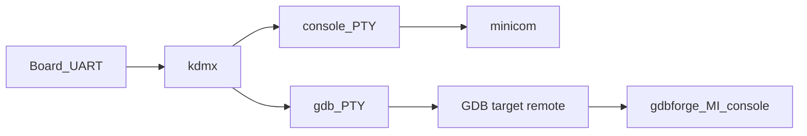
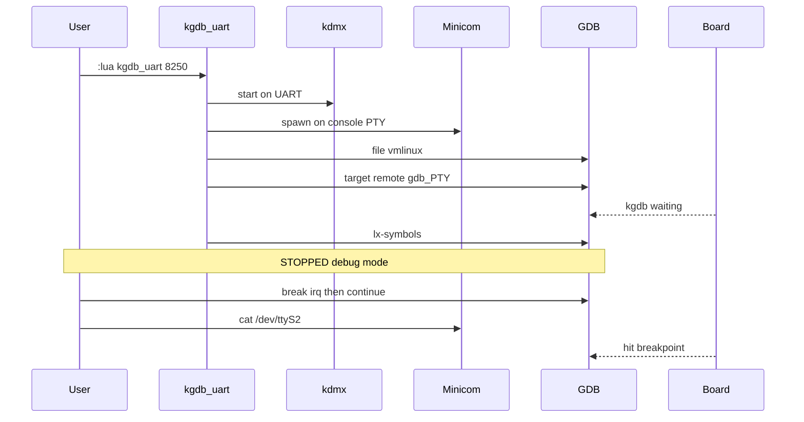
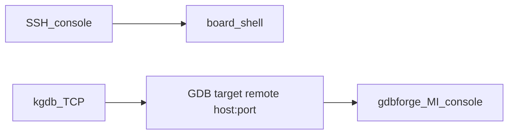

# Kernel / module debugging (kgdb)

gdbforge treats **kernel and module debug** as a first-class workflow. **v1** is implemented as **Lua extensions** that orchestrate existing tools; the UI stays the normal GDB MI console (`:b gdb`). A future option is an in-process UART mux that replaces external `kdmx` without changing the user command.

| Piece | Role (v1) |
|-------|-----------|
| gdbforge | GDB session, panes, breakpoints, Lua |
| `kdmx` (agent-proxy) | Split one board UART into console PTY + gdb PTY |
| minicom (or override) | Live Linux console on the console PTY |
| GDB | `target remote` to gdb PTY or TCP; `lx-symbols` from the **kernel** GDB scripts (not vendored here) |

Scripts (catalog under [`lua/`](https://github.com/yairgd/gdbforge/tree/main/lua)):

| `:lua` | Path | Mux? |
|--------|------|------|
| `kgdb_uart` | Shared UART + kgdboc | Yes — external `kdmx` |
| `kgdb_net` | Ethernet kgdb (e.g. kgdboe) | No |
| `kgdb_common` | Shared helpers only | — |

---

## Path 1 — UART + kdmx



**Future:** replace the `kdmx` box with an optional in-process `SerialMux` behind the same `:lua kgdb_uart` UX.

### One-shot UX

```bash
export GDBFORGE_KGDB_UART=/dev/ttyUSB0
export GDBFORGE_KGDB_VMLINUX=/path/to/vmlinux
export GDBFORGE_KGDB_MODULES=/path/to/kernel/build   # optional, for lx-symbols
export GDBFORGE_TERMINAL=mate-terminal

# kdmx on PATH (build from agent-proxy); board waiting in kgdb:
#   kgdboc=<uart>,kgdbwait

./bin/gdbforge -g gdb
# then:
:lua kgdb_uart 8250
```

After the script returns you are **stopped in debug mode** (`file` + `target remote` + `lx-symbols`). Then:

```text
break <irq_handler>     # e.g. 8250 path
continue
# in minicom: cat /dev/ttyS2   → hit BP
```



### Prerequisites

- Host: `kdmx` from [agent-proxy](https://git.kernel.org/pub/scm/utils/kernel/kgdb/agent-proxy.git) (`kdmx/` + `make`), nothing else holding the serial device.
- Board: kgdb + kgdboc; typically boot with `kgdboc=<uart>,kgdbwait` (or break in before attach).
- Matching `vmlinux` / module debug info; kernel GDB helpers available so `lx-symbols` works (kernel `scripts/gdb`, auto-load safe path — **not** shipped in gdbforge).

### Env (`kgdb_uart`)

| Variable | Default | Meaning |
|----------|---------|---------|
| `GDBFORGE_KGDB_UART` | _(required)_ | Serial device, e.g. `/dev/ttyUSB0` |
| `GDBFORGE_KGDB_BAUD` | `115200` | Baud |
| `GDBFORGE_KGDB_VMLINUX` | _(empty)_ | Path to `vmlinux` |
| `GDBFORGE_KGDB_MODULES` | _(empty)_ | Extra search path for `lx-symbols` |
| `GDBFORGE_KGDB_SCRIPTS` | _(empty)_ | Kernel tree with `scripts/gdb` (sourced so `lx-symbols` exists) |
| `GDBFORGE_KGDB_KDMX` | `kdmx` | `kdmx` binary |
| `GDBFORGE_KGDB_CONSOLE_CMD` | `minicom` | Console program (`minicom -D <pty> -o`, else `<cmd> <pty>`) |
| `GDBFORGE_KGDB_TAKEOVER` | `auto` | How to claim the UART: `auto` (kill known serial consoles), `force` (kill any holder), `never` (abort while held) |
| `GDBFORGE_KGDB_FORCE` | `0` | Deprecated alias for `GDBFORGE_KGDB_TAKEOVER=force` |
| `GDBFORGE_KGDB_RETRIES` | `3` | kdmx start attempts |
| `GDBFORGE_TERMINAL` | auto | Emulator for `spawn_terminal` |

### UART ownership

kdmx must be the **only** reader of the serial device, so `kgdb_uart` claims it before
starting kdmx. Holders are found with `fuser` (falling back to `lsof`), then handled
according to `GDBFORGE_KGDB_TAKEOVER`:

| Mode | Behavior |
|------|----------|
| `auto` (default) | Terminate known serial consoles — `minicom`, `picocom`, `screen`, `socat`, `tio`, `cu`, `agent-proxy`, stale `kdmx`. Any other holder aborts the run. |
| `force` | Terminate whatever holds the device. |
| `never` | Never kill; abort while the device is held. |

Terminated processes get `SIGTERM`, then `SIGKILL` if they don't release within 5s.
minicom is reopened on the **console PTY** instead of the raw device.

If two programs read the same UART, kdmx dies with
`serial port read() [1] unexpected errno 11` and GDB later reports
**`Remote connection closed`**. The script now detects that and prints the kdmx log.

### kdmx and `errno 11` (EAGAIN)

Upstream kdmx treats **any** unexpected `errno` from a read as fatal, including
`EAGAIN` (errno 11), which is not an error: the fds are opened non-blocking, and
`select()` can report a fd readable while `read()` still returns `EAGAIN`. When that
happens kdmx exits, both PTYs disappear, and GDB reports `Remote connection closed`.
Pressing a key in the console window reproduces it reliably.

gdbforge ships a patched build at `bin/kdmx` that retries the read and lets each
caller recover, and identifies itself in `-v`:

```bash
$ ./bin/kdmx -v
kdmx 141210a-gdbforge1     # patched
$ kdmx -v
kdmx 141210a               # upstream: exits on EAGAIN
```

`kgdb_uart` prefers `bin/kdmx`, prints which binary it chose, and warns when it is
not the patched build. Override with `GDBFORGE_KGDB_KDMX=/path/to/kdmx`.

---

## Path 2 — Ethernet / separate console (no mux)

Console is SSH (or a second UART). GDB uses TCP — same `target remote` model as QEMU/OpenOCD stubs.



```bash
export GDBFORGE_REMOTE_HOST=192.168.20.50
export GDBFORGE_KGDB_PORT=6443
export GDBFORGE_KGDB_VMLINUX=/path/to/vmlinux
export GDBFORGE_KGDB_SSH_CONSOLE=1   # optional

:lua kgdb_net 8250
```

Optional: `GDBFORGE_KGDB_KO` + module name → SSH read of `/sys/module/.../sections` then `add-symbol-file` (when network is up). Prefer `lx-symbols` when kernel GDB scripts are loaded.

---

## Symbols (`lx-symbols`)

`lx-symbols` **loads symbols into GDB on the host**. It does not upload files to the board. Modules must already be loaded on the target; local `.ko` / build tree must match.

gdbforge does **not** copy Linux `scripts/gdb` into the repo. `lx-symbols` only exists
once GDB sources the kernel's own `vmlinux-gdb.py`; otherwise you get:

```text
Undefined command: "lx-symbols".  Try "help".
```

The Lua scripts look for it next to `vmlinux`, in `GDBFORGE_KGDB_MODULES`, or under
`GDBFORGE_KGDB_SCRIPTS` (`<tree>/scripts/gdb/vmlinux-gdb.py`), then `source` it after
`add-auto-load-safe-path`. Equivalent manual form:

```text
source /path/to/kernel-source/vmlinux-gdb.py
lx-symbols /path/to/kernel-source
```

A stale `list_for_each: Uninitialized list '<modules>' treated as empty` warning means
`lx-symbols` ran with **no live target** — fix the connection first.

### `Undefined command: "import"`

This means GDB sourced the script as a **GDB command file** instead of Python, which
is what `script-extension soft` (the default) does when Python is unavailable. The
first Python line, `import os`, is then read as a GDB command.

The Lua scripts now probe the session's GDB (`gdbforge.debugger_path()`) with
`gdb -nx --batch -ex 'python print(...)'` before sourcing, and refuse to source with
the real reason instead of that cascade. Common causes:

| Cause | Fix |
|-------|-----|
| Bad `PYTHONHOME` / `PYTHONPATH` inherited from the shell | `unset PYTHONHOME PYTHONPATH` |
| GDB built without Python (common for vendor cross-GDBs) | `gdbforge -g gdb -d /path/to/python-enabled-gdb` |

Check by hand with:

```bash
gdb -nx --batch -ex 'python print("ok")'
```

A hostile `~/.gdbinit` can also interfere; start with `gdbforge -g gdb -- -nx` to skip it.

Fallback: pass addresses / use SSH sysfs + `add-symbol-file` (see `kgdb_common`).

---

## Design note

Kernel bring-up stays a **Lua recipe** (like `remotegdb` / Cortex-R5 scripts): gdbforge core stays the debugger UI + session. In-process UART mux is optional later; document and keep the same `:lua kgdb_uart` entry point.

See also: [LUA_API.md](LUA_API.md), [lua/README.md](https://github.com/yairgd/gdbforge/blob/main/lua/README.md), [DEBUGGER_INTEGRATION.md](DEBUGGER_INTEGRATION.md) (kernel section).
