# MPSoC debug (Zynq UltraScale+)

**gdbforge** is a Vim-inspired **GDB terminal UI** for **Xilinx Zynq UltraScale+ MPSoC** development. Lua scripts under [`lua/mpsoc/`](https://github.com/yairgd/gdbforge/tree/main/lua/mpsoc) spawn **J-Link GDB Server** or **OpenOCD + Digilent JTAG-HS2**, attach with `target remote`, load your ELF, and set breakpoints — the Code pane stays usable while the probe runs in the background.

Scripts live in two folders (copy what you need into `.gdbforge/lua/`):

| Directory | CPU | Workflows |
|-----------|-----|-----------|
| [`lua/mpsoc/cortex_a53/`](https://github.com/yairgd/gdbforge/tree/main/lua/mpsoc/cortex_a53) | Cortex-A53 | Bare-metal, Linux kernel attach |
| [`lua/mpsoc/cortex_r5/`](https://github.com/yairgd/gdbforge/tree/main/lua/mpsoc/cortex_r5) | Cortex-R5 | Bare-metal, OpenAMP / remoteproc |

## Demo — Cortex-R5 / J-Link

**Cortex-R5 / J-Link** — multi-pane UI stepping a deep call stack (`gdbforge.spawn` → JLinkGDBServer → attach). Sample: [`examples/stack_demo.c`](https://github.com/yairgd/gdbforge/blob/main/examples/stack_demo.c). [Watch on YouTube](https://www.youtube.com/watch?v=jbS5SE7Xu3g).

{ loading=lazy }

### Zephyr on the R5

[`examples/zephyr_cortex_r5/`](https://github.com/yairgd/gdbforge/tree/main/examples/zephyr_cortex_r5) is a ready-to-build Zephyr application for the same core: a main loop, two worker threads, a mutex-guarded struct and a recursive call chain worth a backtrace, configured for the `zephyr` profile so RPU threads show up in the Threads pane. It builds against upstream `kv260_r5` on an unmodified Zephyr tree, and a snippet picks the console — `-S jtag-console` for SEGGER RTT over the probe, `-S uart0-console` for PS UART0. Its `build.sh` will either adopt a Zephyr you already have (`init --use <dir>`) or fetch one (`init --download`), then `build -c jtag|uart0` and `debug`.

## Quick start — Cortex-R5 + J-Link

```bash
mkdir -p .gdbforge/lua
cp -r lua/mpsoc/cortex_r5 .gdbforge/lua/
export GDBFORGE_JLINK=/opt/JLink_Linux_V914a_x86_64/JLinkGDBServer
./bin/gdbforge ./your_app.elf
:lua r5_baremetal_jlink
```

## Before you attach: park the board (host side)

Bare-metal bring-up has a prerequisite none of the `:lua` scripts can satisfy: the PS must already be initialised, and on the A53 the core must still be at **EL3**. A board that booted normally is neither, which is why an app can load cleanly over JTAG and then produce nothing at all.

**Cortex-A53.** The Xilinx standalone BSP is built `EL3=1` / `EL1_NONSECURE=0`, so `boot.S` has exactly one entry path. It reads `currentEL` and sends anything else to `b error` — a two-instruction spin reached before `_startup` and `main`, with no UART output, which reads as a bad ELF or a broken probe. GDB cannot undo it: a core cannot raise its own exception level, and `load` / `set $pc` run at whatever EL it is already at. FSBL and ATF do run at EL3, but ATF hands U-Boot down to EL2, so by the time there is a U-Boot prompt to halt at, EL3 is gone (`p/x $cpsr` reads `0x200002c9`, mode nibble `9`). The answer is not to boot the board at all.

**Cortex-R5.** Exception levels do not apply, but the same boot decision does: with no FSBL, nothing has configured the clocks, PLLs and MIO, so the app runs with no UART, and nothing has released the RPU from reset either.

```mermaid
flowchart TB
  subgraph normal ["Normal boot - too late to debug bare metal"]
    BootROM1[BootROM reads mode pins] --> FSBL["FSBL - psu_init, EL3"]
    FSBL --> ATF[ATF - EL3]
    ATF --> UBoot["U-Boot - EL2 (cpsr mode 9)"]
    UBoot --> Spin["app loads, boot.S hits b error, spins silently"]
  end
  subgraph parked ["zynqmp-park-el3.sh - JTAG boot mode"]
    BootMode["USE_ALT set: ALT_BOOT_MODE = JTAG"] --> Reset[rst -system]
    Reset --> BootROM2[BootROM runs no bootloader]
    BootROM2 --> PsuInit["xsdb sources psu_init.tcl over the DAP"]
    PsuInit --> Park["A53 reset and halted - EL3 (cpsr mode d)"]
    Park --> Attach["gdbforge attaches, load, run"]
  end
```



[`scripts/zynqmp-park-el3.sh`](https://github.com/yairgd/gdbforge/blob/main/scripts/zynqmp-park-el3.sh) produces the second of those two states: it sets `USE_ALT` in `CRL_APB.BOOT_MODE_USER` so the BootROM takes JTAG as the boot mode, issues a system reset so no FSBL, ATF or U-Boot runs, sources your `psu_init.tcl` against the PSU target (not a core — after a system reset the A53s are in *APU Reset* and every read-modify-write in `psu_init` fails), and leaves the chosen A53 halted at EL3 with the clocks up. For R5 work the `psu_init` half is the part that matters; the parked A53 is incidental.

Run it **from a shell, before gdbforge, with no debug session open**:

```bash
scripts/zynqmp-park-el3.sh -p <platform>/hw/psu_init.tcl               # Digilent / Xilinx cable
scripts/zynqmp-park-el3.sh -p <platform>/hw/psu_init.tcl --jtag jlink  # SEGGER J-Link
```

It starts its own `hw_server` and stops it again before it returns, so the cable is free for gdbforge as soon as the summary is printed — no `pkill hw_server` in between. A `hw_server` that was already running when it started is left alone, and the summary then says so and how to release it.

The script also ships inside the binary, which is the way to reach it when gdbforge was installed as a release build rather than cloned:

```bash
gdbforge --list-scripts                                                   # what is bundled
gdbforge --run-script zynqmp-park-el3.sh --help                           # its own options
gdbforge --run-script zynqmp-park-el3.sh -p <platform>/hw/psu_init.tcl --jtag jlink
```

Everything after the script name is passed through untouched, and no TUI or probe server is started. Bundling changes nothing else: `xsdb` still has to be on `PATH`, and the cable rule below still applies.

It is a separate script, and gdbforge cannot run it for you: it drives `xsdb`, which needs `hw_server` to own the JTAG cable, and openocd or JLinkGDBServer is holding that cable for as long as a session is open. Sharing does not fail cleanly — small transfers get through and a bulk one corrupts with `ftdi_read_data returned 69, expected 70`.

### Which cable — `--jtag digilent` or `--jtag jlink`

`hw_server` only drives cables AMD ships a driver for: the Platform Cable USB II and the Digilent FTDI modules, which covers the JTAG-HS2/HS3/SMT2 dongles and the ones soldered onto the ZCU10x boards. That is the default, `--jtag digilent`, and it needs nothing extra.

A **J-Link is not one of them**, and plugging one in does not make it appear in `jtag targets` however it is wired — `hw_server` never looks for it. It can still be used, through **Xilinx Virtual Cable**. XVC is a small TCP protocol that says no more than "shift these bits through the TAP", and `hw_server` speaks it as a client, so anything serving XVC becomes a cable it accepts. SEGGER ship exactly that server with the J-Link tools, as `JLinkXVCDServer`:

```
xsdb → hw_server → XVC over TCP → JLinkXVCDServer → J-Link → board
```

Nothing above that socket can tell the difference: the PSU and A53 targets enumerate, `psu_init`'s DAP writes land, `rst -system` resets the chip. It is only slower, because every JTAG shift becomes a TCP round trip, so expect `psu_init` to take seconds rather than milliseconds.

`--jtag jlink` starts `JLinkXVCDServer` unless something already serves `--xvc-url` (default `TCP:127.0.0.1:2542`), adds `-xvc-url` to the `xsdb` connect, and kills the server again on the way out — but only the one it started, so a server you left running is left alone. Use `--jlink-serial <SN>` to pick between several probes.

Two J-Link-specific traps:

- **The probe has to be on the PS JTAG pins.** A PL-only chain has no DAP, so there is no A53 to park and no path for `psu_init`.
- **VTREF must be wired.** The J-Link refuses to drive JTAG at all if its reference-voltage input reads 0 V, and fails with `Target voltage too low` before the XVC port ever opens — wiring only TCK/TMS/TDI/TDO/GND is not enough, VTREF needs the PS JTAG bank supply (1.8 V on ZynqMP). Check what the probe sees with `JLinkExe` and `ShowHWStatus`. Larger J-Links can be told to assume a voltage with the `VTREF` command; the small ones answer *"does not support setting a fixed VTref"* and have to see the real thing.

Either way, the same rule about sharing applies, and more sharply with a J-Link: `JLinkGDBServer` and `JLinkXVCDServer` both want the one probe, so the park has to finish and release it before gdbforge starts.

Two things to know afterwards:

- **Do not let the debugger reset the target.** `monitor halt` is fine; `monitor reset` discards `psu_init` and leaves a board with no clocks.
- **The board stays in JTAG boot mode**, so it will not boot from QSPI/SD and looks bricked to anyone who power-cycles it and waits for a console. A power-on reset clears it; `scripts/zynqmp-park-el3.sh --clear-boot-mode` clears it deliberately.

`--help` on the script carries the full rationale, plus `--no-serdes` for boards whose gigabit-transceiver bring-up takes the JTAG session with it, and a `CABLES` section on the XVC bridge.

This applies to the **bare-metal** scripts only. `a53_kernel_*` and `r5_openamp_*` attach to a board running Linux, where JTAG boot mode is exactly the wrong thing — those need a normal boot.

## TCM ECC: why the R5 scripts zero TCM before `load`

The R5 TCMs are ECC-protected, and a store narrower than the ECC granule is a read-modify-write. Aim one at a granule that has never been written since power-on and the read half finds no valid syndrome, which the core reports as a **synchronous parity error** data abort — `DFSR.FS = 0b11001`, and in Zephyr `K_ERR_ARM_SYNC_PARITY_ERROR`, fatal reason 52.

`load` cannot avoid this on its own. An ELF's `bss` and `noinit` are `NOBITS`: they have an address and a size but no bytes in the file, so no loader writes them. The first thing a Zephyr app does is `arch_bss_zero()`, whose very first `strb` lands on `__bss_start` — the first address `load` did not touch — and aborts before `main`.

Nothing else fills that gap over JTAG. On a normally booted board the FSBL's `XFsbl_TcmEccInit` writes the whole TCM, and under Linux the `zynqmp_r5_remoteproc` driver zeroes the TCM carveouts before loading firmware. Park the board with `zynqmp-park-el3.sh` and there is no FSBL by design, so neither happens.

So `r5_baremetal_jlink` and `r5_baremetal_openocd_digilent` write 64 KB of zeros over ATCM at `0x0` between `monitor halt` and `load`. The ordering is the whole trick: `load` then rewrites everything the fill touched, which also resyncs anything gdb had cached for breakpoints in that range. Run it after `load` instead and it erases the image.

`GDBFORGE_R5_TCM_INIT` picks the banks. `atcm` is the default and is enough for an image that fits in ATCM; `all` adds BTCM at `0x20000`, and `btcm` does that bank alone. **Only ask for a bank your image actually uses.** BTCM is not always powered or mapped, and writing one that is not there fails silently at the probe, after which unrelated memory access — including inserting a breakpoint — starts reporting `Cannot access memory at address …`. The scripts verify each write via `gdb_query` and warn rather than carry on quietly. `0` disables the fill entirely, for firmware that has already turned ECC checking off in `ACTLR` (Zephyr's `CONFIG_DISABLE_TCM_ECC=y`) or a core whose TCM someone else initialises.

The `r5_openamp_*` scripts do not do this and do not need to: they attach without `load`, to firmware remoteproc has already placed in a TCM it cleared first.

## Script catalog

| `:lua` | Probe | Purpose |
|--------|-------|---------|
| `a53_baremetal_jlink` | J-Link | A53 bare-metal load + break main |
| `a53_baremetal_openocd_digilent` | OpenOCD | A53 bare-metal (Digilent HS2) |
| `a53_kernel_jlink` | J-Link | A53 Linux kernel — JTAG attach, `vmlinux` + `lx-symbols` |
| `a53_kernel_openocd_digilent` | OpenOCD | A53 Linux kernel (Digilent HS2) |
| `r5_baremetal_jlink` | J-Link | R5 bare-metal load + break main |
| `r5_baremetal_openocd_digilent` | OpenOCD | R5 bare-metal (Digilent HS2) |
| `r5_openamp_jlink` | J-Link | R5 OpenAMP attach + load |
| `r5_openamp_openocd_digilent` | OpenOCD | R5 OpenAMP (Digilent HS2) |

`scripts/zynqmp-park-el3.sh` is deliberately not in that table: it is a host-side helper run from a shell before gdbforge starts, not a `:lua` script — see [Before you attach](#before-you-attach-park-the-board-host-side).

## Environment variables

| Variable | Default / meaning |
|----------|-------------------|
| `GDBFORGE_JLINK` | Path to `JLinkGDBServer` |
| `GDBFORGE_JLINK_CHIP` | Chip prefix (`XCZU3CG`) |
| `GDBFORGE_JLINK_DEVICE` | Full device override |
| `GDBFORGE_JLINK_PORT` | GDB port (`2334`) |
| `GDBFORGE_JLINK_NORESET` | start `JLinkGDBServer` with `-noreset`, so connecting keeps the clocks, resets and PLLs that `psu_init` set up |
| `GDBFORGE_R5_CORE` | RPU core `0`/`1` |
| `GDBFORGE_R5_TCM_INIT` | TCM banks to zero before `load`: `atcm` (default), `btcm`, `all`, or `0` for none — see [TCM ECC](#tcm-ecc-why-the-r5-scripts-zero-tcm-before-load) |
| `GDBFORGE_A53_CORE` | APU core `0`–`3` |
| `GDBFORGE_OPENOCD` | `openocd` on PATH |
| `GDBFORGE_OPENOCD_PORT` | GDB port (`3333`) |

Edit defaults at the top of any script, or export before running. Each script implements `help()` — run `:lua <name>` and check the Lua pane output.

These belong to `zynqmp-park-el3.sh`, not to gdbforge, and are read only by that script:

| Variable | Default / meaning |
|----------|-------------------|
| `ZYNQMP_PSU_INIT` | `psu_init.tcl` for the board, instead of `-p` |
| `ZYNQMP_HW_SERVER_URL` | Where `hw_server` is, or where to start one (`TCP:127.0.0.1:3121`) |
| `ZYNQMP_HW_SERVER_BIN` | Full path to `hw_server`, if it is not in `PATH` or beside `xsdb` |
| `ZYNQMP_JTAG` | Cable kind, `digilent` (default) or `jlink`, instead of `--jtag` |
| `ZYNQMP_XVC_URL` | XVC server address (`TCP:127.0.0.1:2542`), `--jtag jlink` only |
| `ZYNQMP_JLINK_SERIAL` | Which J-Link, when several are plugged in |
| `ZYNQMP_JLINK_XVCD` | Full path to `JLinkXVCDServer`, if it is not in `PATH` or under `/opt/SEGGER/JLink*/` or `/opt/JLink*/` |

The A53 kernel scripts stop the CPU through JTAG; for day-to-day kernel work over a serial line or Ethernet, [kgdb](KERNEL_KGDB.md) is usually easier.

See also: [Lua catalog — MPSoC](https://github.com/yairgd/gdbforge/blob/main/lua/mpsoc/README.md) · [User Guide — Lua](USER_GUIDE.md) · [`scripts/zynqmp-park-el3.sh`](https://github.com/yairgd/gdbforge/blob/main/scripts/zynqmp-park-el3.sh) (`--help` carries the full EL3 / `psu_init` rationale)
