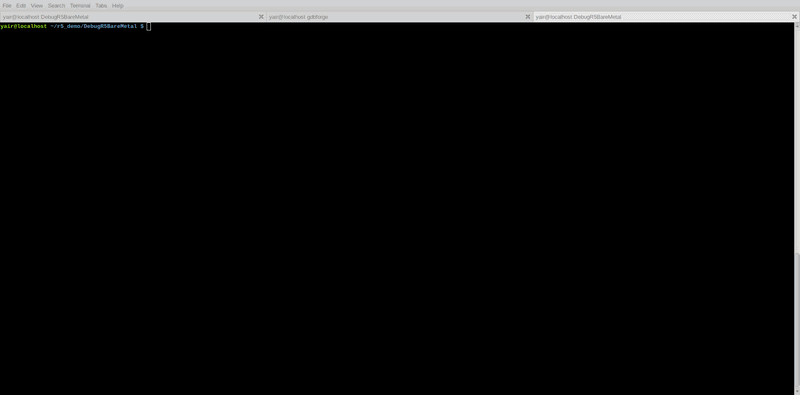

# MPSoC debug (Zynq UltraScale+)

**gdbforge** is a Vim-inspired **GDB terminal UI** for **Xilinx Zynq UltraScale+ MPSoC** development. Lua scripts under [`lua/mpsoc/`](https://github.com/yairgd/gdbforge/tree/main/lua/mpsoc) spawn **J-Link GDB Server** or **OpenOCD + Digilent JTAG-HS2**, attach with `target remote`, load your ELF, and set breakpoints — the Code pane stays usable while the probe runs in the background.

Scripts live in two folders (copy what you need into `.gdbforge/lua/`):

| Directory | CPU | Workflows |
|-----------|-----|-----------|
| [`lua/mpsoc/cortex_a53/`](https://github.com/yairgd/gdbforge/tree/main/lua/mpsoc/cortex_a53) | Cortex-A53 | Bare-metal, Linux kernel attach |
| [`lua/mpsoc/cortex_r5/`](https://github.com/yairgd/gdbforge/tree/main/lua/mpsoc/cortex_r5) | Cortex-R5 | Bare-metal, OpenAMP / remoteproc |

## Demo — Cortex-R5 / J-Link

**Cortex-R5 / J-Link** — multi-pane UI stepping a deep call stack (`gdbforge.spawn` → JLinkGDBServer → attach). Sample: [`examples/stack_demo.c`](https://github.com/yairgd/gdbforge/blob/main/examples/stack_demo.c). [Watch on YouTube](https://www.youtube.com/watch?v=jbS5SE7Xu3g).

{ loading=lazy }

## Quick start — Cortex-R5 + J-Link

```bash
mkdir -p .gdbforge/lua
cp -r lua/mpsoc/cortex_r5 .gdbforge/lua/
export GDBFORGE_JLINK=/opt/JLink_Linux_V914a_x86_64/JLinkGDBServer
./bin/gdbforge ./your_app.elf
:lua r5_baremetal_jlink
```

## Before you attach: park the board (host side)

Bare-metal bring-up has a prerequisite none of the `:lua` scripts can satisfy: the PS must already be initialised, and on the A53 the core must still be at **EL3**. A board that booted normally is neither, which is why an app can load cleanly over JTAG and then produce nothing at all.

**Cortex-A53.** The Xilinx standalone BSP is built `EL3=1` / `EL1_NONSECURE=0`, so `boot.S` has exactly one entry path. It reads `currentEL` and sends anything else to `b error` — a two-instruction spin reached before `_startup` and `main`, with no UART output, which reads as a bad ELF or a broken probe. GDB cannot undo it: a core cannot raise its own exception level, and `load` / `set $pc` run at whatever EL it is already at. FSBL and ATF do run at EL3, but ATF hands U-Boot down to EL2, so by the time there is a U-Boot prompt to halt at, EL3 is gone (`p/x $cpsr` reads `0x200002c9`, mode nibble `9`). The answer is not to boot the board at all.

**Cortex-R5.** Exception levels do not apply, but the same boot decision does: with no FSBL, nothing has configured the clocks, PLLs and MIO, so the app runs with no UART, and nothing has released the RPU from reset either.

```mermaid
flowchart TB
  subgraph normal ["Normal boot - too late to debug bare metal"]
    BootROM1[BootROM reads mode pins] --> FSBL["FSBL - psu_init, EL3"]
    FSBL --> ATF[ATF - EL3]
    ATF --> UBoot["U-Boot - EL2 (cpsr mode 9)"]
    UBoot --> Spin["app loads, boot.S hits b error, spins silently"]
  end
  subgraph parked ["zynqmp-park-el3.sh - JTAG boot mode"]
    BootMode["USE_ALT set: ALT_BOOT_MODE = JTAG"] --> Reset[rst -system]
    Reset --> BootROM2[BootROM runs no bootloader]
    BootROM2 --> PsuInit["xsdb sources psu_init.tcl over the DAP"]
    PsuInit --> Park["A53 reset and halted - EL3 (cpsr mode d)"]
    Park --> Attach["gdbforge attaches, load, run"]
  end
```



[`scripts/zynqmp-park-el3.sh`](https://github.com/yairgd/gdbforge/blob/main/scripts/zynqmp-park-el3.sh) produces the second of those two states: it sets `USE_ALT` in `CRL_APB.BOOT_MODE_USER` so the BootROM takes JTAG as the boot mode, issues a system reset so no FSBL, ATF or U-Boot runs, sources your `psu_init.tcl` against the PSU target (not a core — after a system reset the A53s are in *APU Reset* and every read-modify-write in `psu_init` fails), and leaves the chosen A53 halted at EL3 with the clocks up. For R5 work the `psu_init` half is the part that matters; the parked A53 is incidental.

Run it **from a shell, before gdbforge, with no debug session open**:

```bash
scripts/zynqmp-park-el3.sh -p <platform>/hw/psu_init.tcl
pkill hw_server          # release the cable, then start gdbforge
```

It is a separate script, and gdbforge cannot run it for you: it drives `xsdb`, which needs `hw_server` to own the JTAG cable, and openocd or JLinkGDBServer is holding that cable for as long as a session is open. Sharing does not fail cleanly — small transfers get through and a bulk one corrupts with `ftdi_read_data returned 69, expected 70`.

Two things to know afterwards:

- **Do not let the debugger reset the target.** `monitor halt` is fine; `monitor reset` discards `psu_init` and leaves a board with no clocks.
- **The board stays in JTAG boot mode**, so it will not boot from QSPI/SD and looks bricked to anyone who power-cycles it and waits for a console. A power-on reset clears it; `scripts/zynqmp-park-el3.sh --clear-boot-mode` clears it deliberately.

`--help` on the script carries the full rationale, plus `--no-serdes` for boards whose gigabit-transceiver bring-up takes the JTAG session with it.

This applies to the **bare-metal** scripts only. `a53_kernel_*` and `r5_openamp_*` attach to a board running Linux, where JTAG boot mode is exactly the wrong thing — those need a normal boot.

## Script catalog

| `:lua` | Probe | Purpose |
|--------|-------|---------|
| `a53_baremetal_jlink` | J-Link | A53 bare-metal load + break main |
| `a53_baremetal_openocd_digilent` | OpenOCD | A53 bare-metal (Digilent HS2) |
| `a53_kernel_jlink` | J-Link | A53 Linux kernel — JTAG attach, `vmlinux` + `lx-symbols` |
| `a53_kernel_openocd_digilent` | OpenOCD | A53 Linux kernel (Digilent HS2) |
| `r5_baremetal_jlink` | J-Link | R5 bare-metal load + break main |
| `r5_baremetal_openocd_digilent` | OpenOCD | R5 bare-metal (Digilent HS2) |
| `r5_openamp_jlink` | J-Link | R5 OpenAMP attach + load |
| `r5_openamp_openocd_digilent` | OpenOCD | R5 OpenAMP (Digilent HS2) |

`scripts/zynqmp-park-el3.sh` is deliberately not in that table: it is a host-side helper run from a shell before gdbforge starts, not a `:lua` script — see [Before you attach](#before-you-attach-park-the-board-host-side).

## Environment variables

| Variable | Default / meaning |
|----------|-------------------|
| `GDBFORGE_JLINK` | Path to `JLinkGDBServer` |
| `GDBFORGE_JLINK_CHIP` | Chip prefix (`XCZU3CG`) |
| `GDBFORGE_JLINK_DEVICE` | Full device override |
| `GDBFORGE_JLINK_PORT` | GDB port (`2334`) |
| `GDBFORGE_R5_CORE` | RPU core `0`/`1` |
| `GDBFORGE_A53_CORE` | APU core `0`–`3` |
| `GDBFORGE_OPENOCD` | `openocd` on PATH |
| `GDBFORGE_OPENOCD_PORT` | GDB port (`3333`) |

Edit defaults at the top of any script, or export before running. Each script implements `help()` — run `:lua <name>` and check the Lua pane output.

These two belong to `zynqmp-park-el3.sh`, not to gdbforge, and are read only by that script:

| Variable | Default / meaning |
|----------|-------------------|
| `ZYNQMP_PSU_INIT` | `psu_init.tcl` for the board, instead of `-p` |
| `ZYNQMP_HW_SERVER_URL` | `hw_server` URL (`TCP:127.0.0.1:3121`) |

The A53 kernel scripts stop the CPU through JTAG; for day-to-day kernel work over a serial line or Ethernet, [kgdb](KERNEL_KGDB.md) is usually easier.

See also: [Lua catalog — MPSoC](https://github.com/yairgd/gdbforge/blob/main/lua/mpsoc/README.md) · [User Guide — Lua](USER_GUIDE.md) · [`scripts/zynqmp-park-el3.sh`](https://github.com/yairgd/gdbforge/blob/main/scripts/zynqmp-park-el3.sh) (`--help` carries the full EL3 / `psu_init` rationale)
