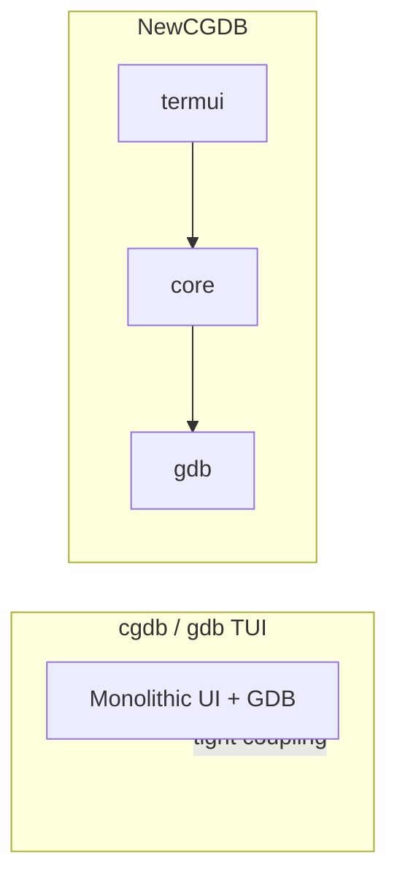

# Project Overview

**NewCGDB** is a terminal-native debugger front-end inspired by [cgdb](https://github.com/cgdb/cgdb) but rebuilt from first principles in Go. It aims to combine the familiarity of a curses debugger UI with a modular architecture that supports multiple debugger backends and long-term extensibility.

**Companion docs:** [ARCHITECTURE.md](ARCHITECTURE.md) · [ROADMAP.md](ROADMAP.md) · [DEVELOPER_GUIDE.md](DEVELOPER_GUIDE.md)

---

## Table of contents

- [Vision](#vision)
- [Goals](#goals)
- [Motivation](#motivation)
- [Comparison to cgdb and gdb TUI](#comparison-to-cgdb-and-gdb-tui)
- [Target users](#target-users)
- [Non-goals (for now)](#non-goals-for-now)

---

## Vision

NewCGDB should feel like **cgdb for the 2020s**: a keyboard-driven debugger workspace in the terminal, with source views, breakpoints, registers, memory, and a GDB console — but implemented as a **composable widget system** rather than a monolithic ncurses application.

The long-term vision:

- A **single UI codebase** that adapts to GDB today, OpenOCD/JTAG tomorrow, and kernel-debugging workflows later.
- **Vim-inspired interaction** — normal mode, focus mode, and a `:` command line — without sacrificing discoverability for new users.
- **Scriptable automation** via Lua plugins for custom panes, workflows, and CI integration.
- **Efficient rendering** through an off-screen grid and future diff-based terminal updates.

NewCGDB is developed inside the **PromptCore** repository. PromptCore itself is a broader context-engine project; NewCGDB reuses its event, buffer, and history primitives while keeping debugger UI concerns isolated in `internal/termui`.

---

## Goals

| Goal | Description |
|------|-------------|
| **Modular UI** | Widgets, layout engine, and rendering backend are separate layers |
| **Backend agnostic** | `core.Debugger` interface; GDB is the first implementation |
| **Terminal fidelity** | Unicode, box-drawing borders, ANSI-aware text rendering |
| **Low latency feel** | Off-screen grid; path to diff rendering to minimize I/O |
| **Contributor-friendly** | Clear package boundaries, documented architecture, browsable docs |
| **Familiar UX** | Split panes, tabs, GDB console, future vim-style commands |

---

## Motivation

### Why not just use cgdb?

[cgdb](https://github.com/cgdb/cgdb) is mature and widely used, but it carries decades of C/ncurses heritage:

- UI, layout, and GDB interaction are tightly coupled.
- Extending cgdb (custom panes, alternate backends) requires deep familiarity with its internals.
- Rendering is tied to ncurses; swapping backends or optimizing redraw is difficult.

NewCGDB treats these as **architectural constraints to avoid from day one**, not as bugs to patch later.

### Why not Bubble Tea / Lip Gloss only?

The repository already contains a **Bubble Tea** chat TUI (`cmd/tui`, `internal/ui/tui`). Bubble Tea excels at application-level TUI with declarative models, but NewCGDB needs:

- Fine-grained **split-tree layout** with resizable panes and shared border drawing.
- A **replaceable framebuffer** (`Grid`) for diff rendering.
- Direct **tcell** access for mouse, focus, and low-level drawing control.

The NewCGDB stack (`internal/termui`) is intentionally lower-level than Bubble Tea. The two UI stacks coexist; NewCGDB is the debugger direction.

### Why Go?

- Strong concurrency model for debugger I/O (PTY readers, async MI records).
- Single static binary deployment.
- Growing ecosystem for terminal UIs (`tcell`, `bubbletea`) and tooling.

---

## Comparison to cgdb and gdb TUI

| Aspect | **cgdb** | **gdb TUI** (`layout src`) | **NewCGDB** (target) |
|--------|----------|----------------------------|----------------------|
| **UI toolkit** | ncurses | readline + ANSI (limited layout) | tcell + custom Grid |
| **Layout** | Fixed panes, configurable | Single source + status; no splits | Recursive split tree in Workspace |
| **Command entry** | GDB console in dedicated window | Integrated in TUI | CmdLine (`:`) + per-pane input |
| **Extensibility** | Limited | GDB Python, no UI hooks | Planned Lua plugins + widget API |
| **Backends** | GDB only | GDB only | GDB first; OpenOCD/JTAG planned |
| **Rendering** | ncurses direct | Minimal | Widget → Canvas → Grid → tcell |
| **Language** | C | C (GDB internals) | Go |
| **Maturity** | Production | Production (inside GDB) | Early prototype |

### What NewCGDB preserves from cgdb

- Terminal-native workflow — no GUI dependency.
- Source + console + auxiliary views in one screen.
- Keyboard-first interaction with optional mouse support.

### What NewCGDB changes

- **Explicit widget tree** instead of implicit window list.
- **Layout engine** assigns geometry; widgets never set global coordinates.
- **Event bus** (`core.Event`) decouples UI actions from debugger logic.
- **Pluggable rendering** at the Grid → terminal boundary.

---

## Target users

| User | Needs |
|------|-------|
| **Embedded developers** | GDB today; OpenOCD/JTAG later; register and memory views |
| **Kernel / systems hackers** | Multi-pane layout, scriptable workflows |
| **Daily C/C++ developers** | Fast terminal debugger with cgdb-like ergonomics |
| **Tool builders** | Clean APIs to embed or extend debugger panes |

---

## Non-goals (for now)

- Replacing GDB's own TUI inside the GDB project.
- GUI or web-based debugger (terminal-first).
- Shipping a production-ready 1.0 — the current codebase is an **architecture prototype**.
- Remote debugging transport (that belongs in backend layers, not the UI).

See [ROADMAP.md](ROADMAP.md) for phased delivery plans.

---

## Next steps

- Architecture deep dive: [ARCHITECTURE.md](ARCHITECTURE.md)
- UI internals: [UI_ARCHITECTURE.md](UI_ARCHITECTURE.md)
- Onboarding: [DEVELOPER_GUIDE.md](DEVELOPER_GUIDE.md)
