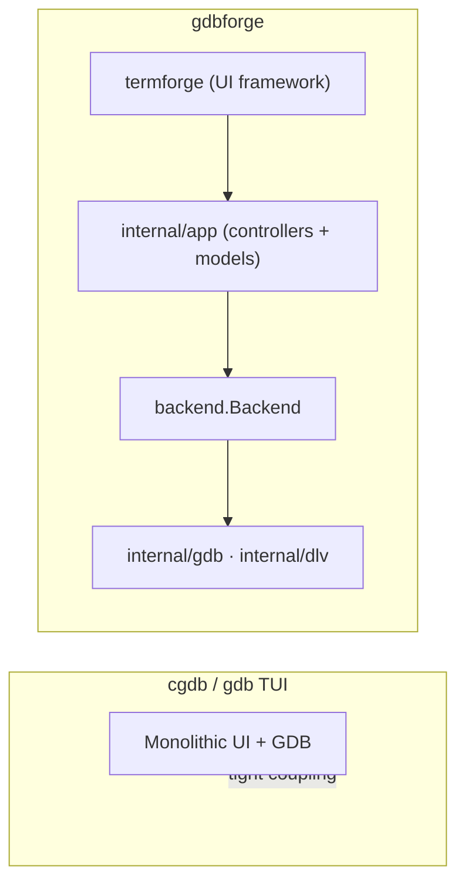

# gdbforge overview — goals, motivation, and how it compares

**gdbforge** is a terminal-native debugger front-end inspired by [cgdb](https://github.com/cgdb/cgdb) but rebuilt from first principles in Go. It aims to combine the familiarity of a curses debugger UI — source, console, breakpoints, threads, and call stack on one screen — with a modular architecture that supports multiple debugger backends and long-term extensibility.

**Companion docs:** [USER_GUIDE.md](USER_GUIDE.md) · [ARCHITECTURE.md](ARCHITECTURE.md) · [ROADMAP.md](ROADMAP.md) · [DEVELOPER_GUIDE.md](DEVELOPER_GUIDE.md)

---

## Table of contents

- [Vision](#vision)
- [Goals](#goals)
- [Motivation](#motivation)
- [Comparison to cgdb and gdb TUI](#comparison-to-cgdb-and-gdb-tui)
- [Target users](#target-users)
- [Non-goals (for now)](#non-goals-for-now)

---

## Vision

gdbforge is **not a clone of Vim**. It is a debugger built on a **generic application framework** inspired by Vim's interaction model — that framework is [**termforge**](https://github.com/yairgd/termforge), extracted from this project into its own module, and the debugger is its first application.

Vim has a single data model (text buffers). termforge supports **multiple application-specific data models** — breakpoints, registers, and console output in a debugger; orders, portfolio, and charts in a trading app. The user still works with familiar concepts (`:buffer`, `:split`, `:vsplit`, `:tab`), but `:buffer` selects which **model** to display, not which file to open.

gdbforge should feel like **cgdb for the 2020s**: a keyboard-driven debugger workspace in the terminal with source, breakpoints, threads, the call stack, assembly, and a real GDB console — built as a **composable widget system over domain models**, not a monolithic ncurses application. Register and memory panes are on the [roadmap](ROADMAP.md), not in the binary yet.

The long-term direction:

- **Cover the whole debugging session**, not just source display — probe bring-up, program I/O, and run control inside one workspace.
- **Stay backend-agnostic**: GDB and Delve today behind one `backend.Backend` interface (`-g gdb|dlv`), with room for a native OpenOCD adapter.
- **Scriptable automation** via Lua for custom workflows, target bring-up, and CI.
- **Efficient rendering** — an off-screen grid with an incremental cell diff, so remote SSH sessions on large terminals stay responsive. That engine is termforge's.

gdbforge is a **terminal debugger in Go**, inspired by [cgdb](https://github.com/cgdb/cgdb). The module path is `github.com/yairgd/gdbforge`.

---

## Goals

| Goal | Description |
|------|-------------|
| **Model-driven UI** | Services → event bus → models → widgets; widgets never talk to services |
| **Modular UI** | Widgets, layout engine, and rendering backend are separate layers |
| **Backend agnostic** | `ptyx.Session` + `backend.Backend`; GDB and Delve via `-g gdb\|dlv`; `:AI` shares the live session |
| **Terminal fidelity** | Unicode, box-drawing borders, ANSI-aware text rendering |
| **Low latency feel** | Off-screen grid; only changed cells are flushed to the terminal |
| **Contributor-friendly** | Clear package boundaries, documented architecture, browsable docs |
| **Familiar UX** | `:buffer` for models, split panes, tabs, Vim-style window commands |

---

## Motivation

### Why not just use cgdb?

For many people, cgdb is the right answer — it is mature, widely packaged, and does its job well. gdbforge exists because of a few things cgdb does not set out to do:

- cgdb presents a fixed source/console arrangement; gdbforge wanted arbitrary splits and named layouts, plus list panes for breakpoints, threads, and the call stack.
- cgdb's UI, layout, and GDB interaction are closely coupled, which makes adding a custom pane or a second debugger backend a deep change. gdbforge separates the UI from the backend, which is how Delve was added as a second backend.
- Rendering is tied to ncurses, so swapping the drawing backend or changing the redraw strategy is difficult.

These are design trade-offs, not defects: cgdb's tighter coupling is part of why it is small and dependable. gdbforge takes the opposite trade and pays for it in size and youth.

### Why not Bubble Tea / Lip Gloss?

Bubble Tea excels at application-level TUI with declarative models, but gdbforge needs:

- Fine-grained **split-tree layout** with resizable panes and shared border drawing.
- A **replaceable framebuffer** (`Grid`) for diff rendering.
- Direct **tcell** access for mouse, focus, and low-level drawing control.

The gdbforge stack (`termforge`) is intentionally lower-level than Bubble Tea.

### Why Go?

- Strong concurrency model for debugger I/O (PTY readers, async MI records).
- Single static binary deployment.
- Growing ecosystem for terminal UIs (`tcell`) and tooling.

---

## Comparison to cgdb and gdb TUI

gdbforge is an external front-end: GDB remains the debugger, and MI keeps the source view and list panes in step with it without filling the console with navigation commands.

| Aspect | **cgdb** | **gdb TUI** (`layout src`) | **gdbforge** |
|--------|----------|----------------------------|--------------|
| **UI toolkit** | ncurses | readline + ANSI (limited layout) | tcell + custom Grid (via termforge) |
| **Layout** | Fixed source/console panes, configurable sizes | Single source + status; no splits | Recursive split tree (`:vs`, `:split`, named layouts) |
| **Tabs** | No | No | One tab only (no tab bar yet) |
| **Command entry** | GDB console in dedicated window | Integrated in TUI | `:` command line with Tab completion, plus the GDB console pane |
| **Program I/O** | Shares the terminal with the debugger | Shares the terminal with GDB | Dedicated `:b io` pane, or a separate terminal emulator |
| **List views** | Breakpoint and other info via GDB commands | None | Breakpoints, threads, and call stack as panes that refresh on stop |
| **Assembly view** | Via GDB commands | Dedicated window (`layout asm`) | Assembly pane (`:b asm`) — GDB backend only |
| **Register / memory views** | Via GDB commands | Register window (`layout regs`) | Via GDB commands only — no pane yet |
| **Extensibility** | Limited | GDB Python, no UI hooks | Lua scripting (`gdbforge.*`); API not yet frozen |
| **Backends** | GDB only | GDB only | GDB and Delve (`-g gdb\|dlv`); no native OpenOCD adapter |
| **Rendering** | ncurses direct | Minimal | Widget → Canvas → Grid → tcell, with an incremental cell diff |
| **Language** | C | C (GDB internals) | Go |
| **Maturity** | Mature; packaged by most distributions | Mature; shipped inside GDB itself | v1.x releases since August 2026; small contributor base |

The three tools overlap heavily and each is better at different things. The GDB TUI needs no installation at all and has a register window gdbforge lacks. cgdb is far more battle-tested and is packaged by most distributions. gdbforge adds arbitrary splits, a separate pane for the program's own I/O, list views for breakpoints, threads and the call stack, a Delve backend, and Lua scripting for target bring-up.

### What gdbforge preserves from cgdb

- Terminal-native workflow — no GUI dependency.
- Source + console + auxiliary views in one screen.
- Keyboard-first interaction with optional mouse support.

### What gdbforge changes

- **Application models** instead of text buffers as the primary data unit.
- **Explicit widget tree** instead of implicit window list.
- **Layout engine** assigns geometry; widgets never set global coordinates.
- **Service → model → widget** data flow; widgets display models and never call services directly.
- **Event bus** decouples services from models and application dispatch.
- **Pluggable rendering** at the Grid → terminal boundary.

```mermaid
flowchart LR
    subgraph Legacy["cgdb / gdb TUI"]
        Monolith["Monolithic UI + GDB"]
    end

    subgraph gdbforge["gdbforge"]
        UI["termforge (UI framework)"]
        App["internal/app (controllers + models)"]
        Backend["backend.Backend"]
        GDB["internal/gdb · internal/dlv"]
        UI --> App
        App --> Backend
        Backend --> GDB
    end

    Legacy -.->|"tight coupling"| Monolith
```

---

## Target users

| User | Needs |
|------|-------|
| **Embedded developers** | Probe bring-up in one command; a native OpenOCD adapter and register/memory views later |
| **Kernel / systems hackers** | Multi-pane layout, scriptable workflows |
| **Daily C/C++ developers** | Fast terminal debugger with cgdb-like ergonomics |
| **Tool builders** | Clean APIs to embed or extend debugger panes |

---

## Non-goals (for now)

- Replacing GDB's own TUI inside the GDB project.
- Reimplementing GDB. gdbforge is a front-end; the debugger stays in charge.
- A GUI or web-based debugger — terminal-first.
- Implementing probe drivers. OpenOCD, the J-Link GDB Server, and `gdbserver` do that job; gdbforge orchestrates them.
- Remote debugging transport (that belongs in backend layers, not the UI).

See [ROADMAP.md](ROADMAP.md) for phased delivery plans.

---

## Next steps

- Commands and everyday debugging: [USER_GUIDE.md](USER_GUIDE.md)
- Common setup questions: [FAQ.md](FAQ.md)
- Architecture deep dive: [ARCHITECTURE.md](ARCHITECTURE.md)
- UI internals: [termforge: UI Architecture](https://yairgd.github.io/termforge/UI_ARCHITECTURE/)
- Onboarding: [DEVELOPER_GUIDE.md](DEVELOPER_GUIDE.md)
