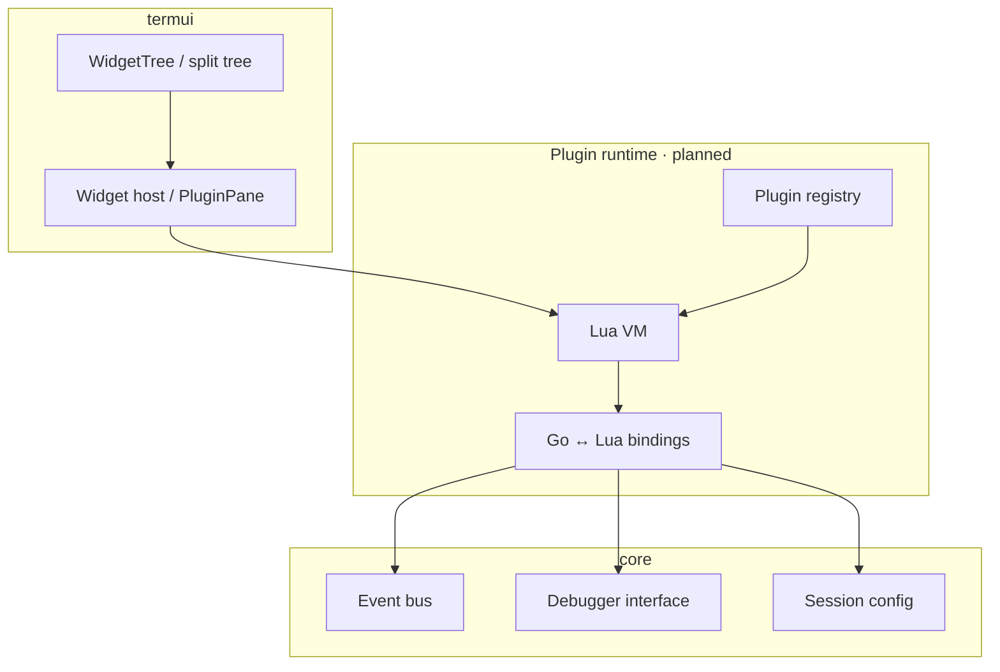
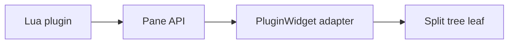
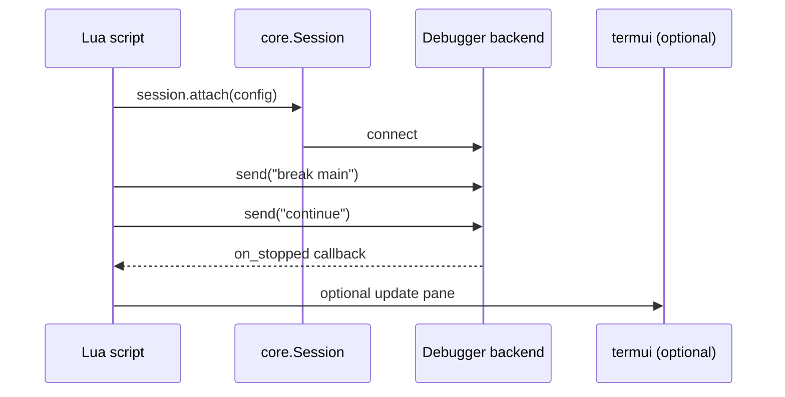

# Plugin Architecture

gdbforge is designed for **extensibility**: custom debugger panes, scripted automation, and user-defined workflows. This document describes the planned plugin system centered on **Lua** integration.

**Status:** MVP landed — embedded `gopher-lua`, `ModeLua`, `LuaWidget` (cell draw / keys / tick for demos), `:lua` DSL, `gdbforge.*` API. Automation `gdbforge.print` → `:b io`. Pane demos: `:lua snake` / `:lua tetris` (then `:b` to refocus). User extensions: `./.gdbforge/lua/**/*.lua` → `:lua <basename>`. Use `gdbforge.spawn` for JLink; `spawn_terminal` for gdbserver/TUI; `gdbforge.run` is interactive `:!`.

**User API reference:** **[LUA_API.md](LUA_API.md)**. Script catalog: [../lua/README.md](../lua/README.md).

**Companion docs:** [ARCHITECTURE.md](ARCHITECTURE.md) · [DEBUGGER_INTEGRATION.md](DEBUGGER_INTEGRATION.md) · [UI_ARCHITECTURE.md](UI_ARCHITECTURE.md)

---

## Table of contents

- [Goals](#goals)
- [Why Lua](#why-lua)
- [Architecture overview](#architecture-overview)
- [Feature panes](#feature-panes)
- [Automation workflows](#automation-workflows)
- [Plugin API surface (planned)](#plugin-api-surface-planned)
- [Security model](#security-model)
- [Comparison to alternatives](#comparison-to-alternatives)
- [Implementation phases](#implementation-phases)

---

## Goals

| Goal | Description |
|------|-------------|
| **Custom panes** | Users add register views, trace buffers, hardware monitors |
| **Workflow automation** | Script repetitive debug sequences (attach, load, break, run) |
| **CI integration** | Headless scripts drive debugger backends without UI |
| **Low coupling** | Plugins never import Go UI packages directly |
| **Safe defaults** | Sandboxed Lua; explicit permission for dangerous ops |

---

## Why Lua

| Factor | Lua | Alternative (Python/WASM) |
|--------|-----|---------------------------|
| Embedding size | Small (`gopher-lua`, `yuin/gopher-lua`) | Python heavy; WASM complex |
| Debugger ecosystem | GDB/LLDB use Python — Lua fills **UI script** niche | Python overlaps with GDB scripts |
| Sandboxing | Well-understood coroutine model | Python sandbox harder |
| cgdb precedent | cgdb uses Tcl — Lua is lighter modern equivalent | Tcl declining in new projects |

**Design decision:** Lua scripts extend **gdbforge UI and session orchestration**, not replace GDB's own Python scripting. Avoid duplicating GDB's introspection API — delegate to `core.Session` instead.

---

## Architecture overview



Plugins load from:

| Location | Purpose |
|----------|---------|
| `~/.config/gdbforge/plugins/` | User plugins |
| `./.gdbforge/plugins/` | Project-local plugins |
| Built-in `embed` | Shipping default panes |

The same project directory also holds session data such as `./.gdbforge/breakpoints.yaml` (breakpoint save/restore — [DEBUGGER_INTEGRATION.md](DEBUGGER_INTEGRATION.md#breakpoint-persistence)).

---

## Feature panes

A **feature pane** is a Workspace leaf widget provided by a plugin.



### Pane lifecycle (planned)

1. Plugin registers pane metadata (title, init function).
2. User runs `:plugin load trace` or config auto-loads.
3. Runtime creates `PluginWidget` implementing `termui.Widget`.
4. Lua `on_draw(canvas)` / `on_key(event)` callbacks fire each frame/event.

### Example use cases

| Pane | Function |
|------|----------|
| RTOS task list | Parse GDB `info threads`, custom sort/filter |
| Peripheral register map | SVD-driven register tree (embedded) |
| Trace buffer | Collect `*stopped` events over time |
| CI status | Show test harness connection |

**Design decision:** plugins draw through the same **Canvas** abstraction as native widgets — they do not get raw screen access.

---

## Automation workflows

Headless and semi-headless workflows run Lua without full UI:



Use cases:

| Workflow | Mode |
|----------|------|
| Nightly regression | Headless — no `TermApp` |
| Repeatable bring-up | Script + visible UI |
| Custom `:command` | Lua registers command handler |

**Design decision:** automation APIs are a **subset** of pane APIs — same Lua module, different entry point (`main()` vs pane callbacks).

### Landed: external terminal stdio (TUI)

For TUI inferiors, do not pipe through `:b io`. Use:

| API | Role |
|-----|------|
| `gdbforge.open_external_tty()` | Spawn kitty/xterm/… (`GDBFORGE_TERMINAL`) holding a pts; return `/dev/pts/N` |
| `gdbforge.set_inferior_tty(path\|"internal")` | GDB `-inferior-tty-set` (live) or restore IO pane |
| `gdbforge.spawn_terminal(...)` | Real terminal emulator + argv (gdbserver / headless dlv) |
| `gdbforge.wait_port(port, timeout)` | Wait until listen (pattern A) |

Examples: [`lua/external_tty`](../lua/external_tty), [`lua/gdbserver_tui`](../lua/gdbserver_tui), [`lua/dlv_port`](../lua/dlv_port), [`lua/terminal_debug`](../lua/terminal_debug). Details: [DEBUGGER_INTEGRATION.md](DEBUGGER_INTEGRATION.md#external-terminal-stdio-tui-targets). Install layout: [lua/README.md](../lua/README.md).

---

## Plugin API surface (planned)

### Events

```lua
-- Subscribe to domain events
on_event("BreakpointHit", function(ev)
  pane:append_line("hit at " .. ev.line)
end)
```

Maps to Go `core.Event` types.

### Debugger

```lua
debugger.send("info registers")
debugger.on_output(function(text) ... end)
```

Maps to `core.Session` (`Send` / `Subscribe` / `WithWrite`) — same handle used by `:AI` / `GdbMcpService`.

### UI

```lua
pane:set_title("My Trace")
pane:draw_text(0, 0, "hello", "bold")
ui.command("my-cmd", function(args) ... end)
```

Maps to `Canvas` drawing helpers and command registry.

### Splits / workspace

```lua
ui.open_pane("my-plugin.trace", { direction = "vertical" })
```

Maps to `WidgetTree.Split` / focus APIs on the active tab.

---

## Security model

| Level | Capability |
|-------|------------|
| **Trusted** (built-in) | Full API |
| **User plugin** | Debugger send, pane draw, file read in config dir |
| **Project plugin** | Requires user opt-in on first load |

Dangerous operations (`os.execute`, arbitrary file write) are **not exposed** in the default binding set. Network access requires explicit plugin manifest flag.

---

## Comparison to alternatives

| Approach | Pros | Cons |
|----------|------|------|
| **Lua embed** (chosen) | Small, fast, sandbox-friendly | New ecosystem for users |
| **GDB Python only** | Rich introspection | No UI integration |
| **External IPC** | Strong isolation | Latency, complexity |
| **WASM plugins** | Strong sandbox | Heavy toolchain |

---

## Implementation phases

| Phase | Deliverable |
|-------|-------------|
| 1 | `PluginWidget` stub + manual Go plugin registration |
| 2 | Embed `gopher-lua`; event + debugger bindings |
| 3 | Pane draw/key callbacks |
| 4 | `:plugin` commands + config discovery |
| 5 | Headless automation entry point |

Tracker: [ROADMAP.md](ROADMAP.md).

---

## Related documentation

- [DEBUGGER_INTEGRATION.md](DEBUGGER_INTEGRATION.md) — backend interfaces plugins call
- [UI_ARCHITECTURE.md](UI_ARCHITECTURE.md) — Widget / Canvas contract
- [INPUT.md](INPUT.md) — command registration
