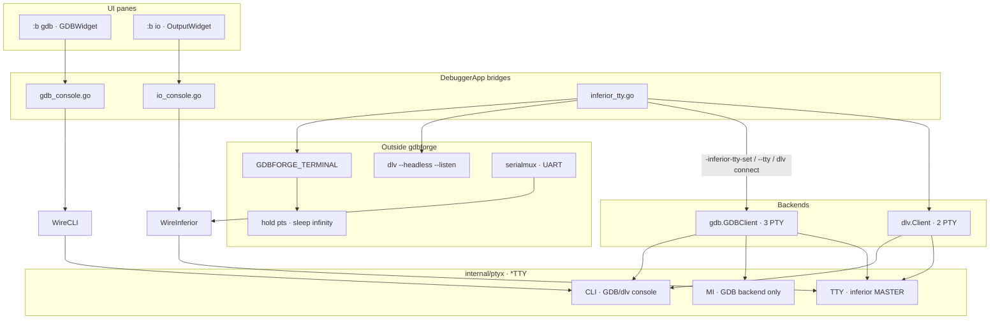
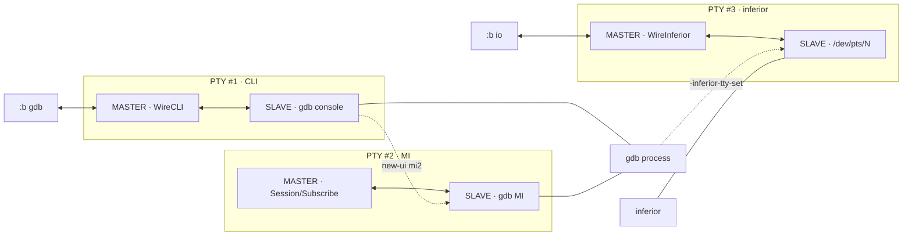
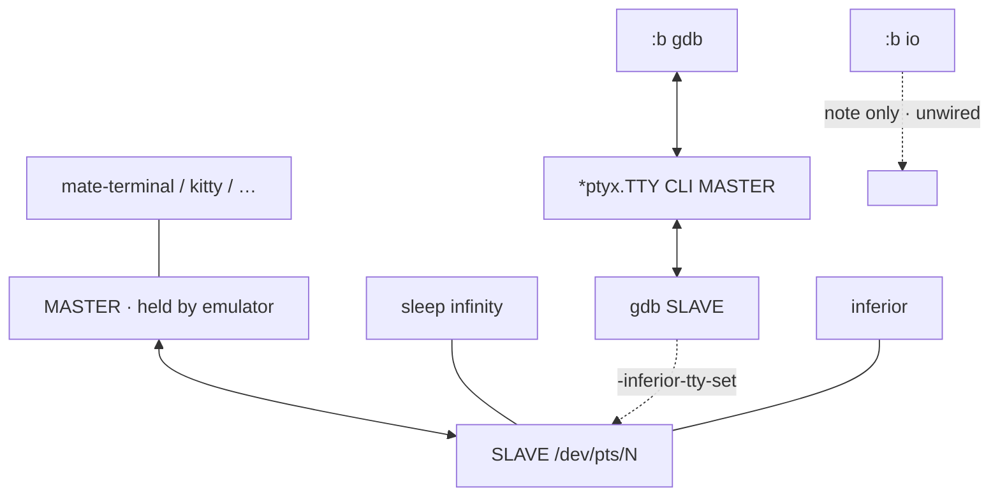
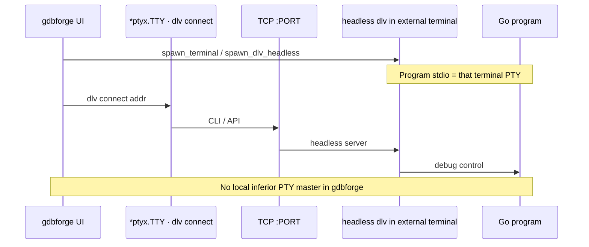

# PTY architecture — how the pieces talk

High-level view of **who holds which PTY end** (master vs slave), how the **GDB console** and the **under-debug program** get separate terminals, how **Delve** differs (PTY vs TCP), and how **`:b io`** / **external terminals** plug in.

For MI protocol, MCP, and backend details see [DEBUGGER_INTEGRATION.md](DEBUGGER_INTEGRATION.md). For user recipes see [USER_GUIDE.md](USER_GUIDE.md) and [lua/README.md](https://github.com/yairgd/gdbforge/blob/main/lua/README.md).

---

## Why two channels?

A debugger session needs **two independent byte streams**:

| Channel | What travels | UI surface |
|---------|--------------|------------|
| **Debugger console** | GDB MI / Delve CLI, prompts, replies | `:b gdb` (`GDBWidget`) |
| **Inferior stdio** | The program’s stdin / stdout / stderr | `:b io` **or** an external terminal |

Mixing them on one PTY (classic “everything in the GDB TTY”) fights TUIs and makes Ctrl-C ambiguous. gdbforge therefore uses **separate PTYs** for local sessions — **3 for GDB** (CLI + MI + inferior), **2 for Delve** — and TCP for preferred Go/Delve TUI bring-up.

---

## PTY vocabulary (master / slave)

A Linux PTY is a **pair**:

```text
                    ┌─────────────────┐
  Application  ←──► │  MASTER (/dev/ptmx side)  │  ← held by gdbforge or a terminal emulator
                    └────────┬────────┘
                             │ kernel couples bytes both ways
                    ┌────────▼────────┐
  Child process ←──► │  SLAVE  (/dev/pts/N)      │  ← GDB, Delve, or the inferior “sees” a tty
                    └─────────────────┘
```

| Role | Typical holder in gdbforge | Meaning |
|------|----------------------------|---------|
| **Master** | `*ptyx.TTY` (or the external emulator) | Read “what the slave wrote”; write “what the slave should read as keyboard” |
| **Slave** | Debugger process or inferior | Looks like a real terminal (`isatty`, line discipline, window size) |

**Rule of thumb:** whoever should see the other side’s keystrokes/output holds the **master**. The process that believes it has a terminal opens (or is given) the **slave**.

---

## Big picture — components



| Piece | Package / file | Holds |
|-------|----------------|-------|
| GDB CLI PTY | `*ptyx.TTY` (`Start`) | Master #1 — user console in `:b gdb` |
| GDB MI PTY | `*ptyx.TTY` (`Open`) | Master #2 — `core.Session`, MI parser |
| Delve CLI PTY | `*ptyx.TTY` (`Start`) | Master — dlv console + parser |
| Inferior PTY (internal) | `*ptyx.TTY` (`Open`) | Master for program stdio |
| GDB attach | `-inferior-tty-set` via MI PTY | Tells GDB which **slave** the program should use |
| Delve attach | `dlv exec --tty /dev/pts/N` | Same idea, only at **spawn** |
| `:b gdb` bridge | `WireCLI` → `CompositeTerminal` | CLI PTY bytes + keys |
| `:b io` bridge | `WireInferior` → `CompositeTerminal` | Inferior PTY bytes + keys |
| Serial console | `serialmux.TermTTY()` → IO pane | UART console leg as `*ptyx.TTY` |
| External / headless | `cmd/gdbforge/inferior_tty.go` | Opens real terminals; rewires or restarts |

---

## Mode A — GDB with internal IO (default)

**Three** PTY pairs for GDB. gdbforge holds **all masters**.

```text
  User types in :b gdb                    User types in :b io
         │                                       │
         ▼                                       ▼
  ┌──────────────────┐                  ┌──────────────────┐
  │ *ptyx.TTY        │                  │ *ptyx.TTY        │
  │ MASTER #1 CLI    │                  │ MASTER #3 inf    │
  └────────┬─────────┘                  └────────┬─────────┘
           │                                     │
           ▼                                     ▼
  ┌──────────────────┐   new-ui mi2    ┌──────────────────┐
  │ SLAVE #1 gdb     │ ──────────────► │ MASTER #2 MI     │
  │ console          │                 │ (backend Session)│
  └────────┬─────────┘                 └────────┬─────────┘
           │                                     │
           │              -inferior-tty-set      ▼
           │                 via MI      ┌──────────────────┐
           └──────────────────────────► │ SLAVE #3 /pts/N  │
                                         └────────┬─────────┘
                                                  ▼
                                           under-debug app
```



### Who talks to whom

| From → To | Path |
|-----------|------|
| You → GDB console | `:b gdb` → `WireTTYInput` → **CLI master #1** → gdb readline |
| GDB console → you | gdb → CLI slave → **WireTTY** → xterm → GDB pane |
| App/MCP → GDB MI | `Send` on **MI master #2** |
| MI → app state | **MI master #2** → Subscribe → `GdbInputState` |
| You → program | `:b io` → **inferior master #3** → program stdin |
| Program → you | stdout → **inferior master #3** → `WireTTY` → IO pane |
| GDB → program tty | `-inferior-tty-set` on MI PTY (one-time attach) |

There is **no** MI command that feeds program stdin. Stdin is always via the inferior PTY master (`:b io`) or an external terminal’s master.

`ptyx.TTY` keeps the slave FD open so `/dev/pts/N` remains valid while gdbforge holds the master.

---

## Mode B — GDB with an external terminal

Same **debugger** PTY #1. Inferior stdio moves to a **real terminal emulator**. gdbforge does **not** hold that PTY’s master.

```text
  :b gdb  ←→  MASTER #1  ←→  gdb (unchanged)

  External terminal emulator
    └── MASTER (emulator owns keyboard/display)
          └── SLAVE /dev/pts/N  ←── held open by:  tty > file; sleep infinity
                                    ▲
                                    │  GDB: -inferior-tty-set /dev/pts/N  (live, no restart)
                                    │
                               under-debug app
```



### How the external pts is created

1. `OpenExternalTTY` / `:set inferior-tty` / Lua `open_external_tty`
2. Spawn `GDBFORGE_TERMINAL` (e.g. `mate-terminal`) running roughly: `tty > /tmp/…; exec sleep infinity`
3. Read `/dev/pts/N` from the temp file
4. GDB: live `-inferior-tty-set` pointing at that path; close internal `ptyx.TTY`
5. Unwire `:b io` (shows a note — type in the other window)

**Do not** keep an internal master subscribed **and** point `-inferior-tty-set` at an external slave. Closing the external window does not auto-rewire — use `:set inferior-tty internal`.

---

## Mode C — Delve with internal / external `--tty`

Delve’s CLI rides **one `*ptyx.TTY`** (`Start`). The inferior is attached with a **spawn flag**, not a live MI switch:

```bash
dlv exec --tty /dev/pts/N -- ./prog [args…]
```

| | GDB | Delve |
|--|-----|-------|
| Attach inferior tty | `-inferior-tty-set` **anytime** | `--tty` **only when starting** `dlv exec` |
| Change mid-session | live MI | **restart** Delve with a new `--tty` (app layer) |
| Console | `*ptyx.TTY` → `WireCLI` → `(gdb)` readline | `*ptyx.TTY` → `WireCLI` → `(dlv)` CLI |


Internal default: gdbforge’s `ptyx.TTY` master + Delve `--tty` slave path.  
External: hold-open pts like Mode B, then **restart** `dlv exec --tty …`.

---

## Mode D — Delve headless + TCP (preferred Go TUI)

For Go TUIs, mid-session `--tty` restart is awkward. Preferred flow (`:lua dlv_ext_port` / `dlv_port`):

1. Open a **real terminal** running **headless** Delve:  
   `dlv exec --headless --listen=127.0.0.1:PORT -- ./prog …`  
   The program inherits **that terminal’s** stdio (emulator master ↔ pts slave).
2. Tear down the local `dlv exec` session.
3. Start a new local client: `dlv connect 127.0.0.1:PORT` on a fresh **`*ptyx.TTY`** (debugger console only).
4. Mark IO external — `:b io` is a note; type in the headless window.



```text
  External terminal
    MASTER (emulator) ←→ SLAVE
         │
         ├── headless dlv  (listens on TCP)
         └── Go program stdio (same tty)

  gdbforge
    :b gdb  ←→  *ptyx.TTY MASTER  ←→  `dlv connect` SLAVE
                      │
                      └── TCP ──► headless dlv
```

So: **control plane = TCP** (plus a local PTY only for the connect CLI); **stdio plane = the external terminal’s PTY**.

---

## How `:b io` connects

| Fact | Detail |
|------|--------|
| Widget | `OutputWidget` — does **not** own `*ptyx.TTY` |
| Wiring | `cmd/gdbforge/io_console.go` — `wireInferiorIO` / `unwireInferiorIO` |
| Read path | Inferior master → `WireTTY` → `CompositeTerminal` (xterm paint) |
| Write path | Enter → `TTY.Send`; Ctrl-C → `^C` on **inferior** master (not the debugger PTY) |
| External / headless | Unwired; note text only |

It is a **line console** (ANSI, newlines) — not a full VT. Curses / alternate-screen apps need Mode B or D.

---

## How `:b gdb` connects

| Fact | Detail |
|------|--------|
| Widget | `GDBWidget` / console pane |
| Wiring | `cmd/gdbforge/gdb_console.go` |
| Backend | `gdb.GDBClient` (MI `*ptyx.TTY`) or `dlv.Client` over CLI `*ptyx.TTY` |
| Read path | Debugger master → parser (`GdbInputState` / `dlv.InputState`) → paint |
| Write path | Enter → `Send(cmd)`; Tab completion / queries also use this PTY (with write lock) |

Ctrl-C while the inferior is **running** typically interrupts via the **debugger** path (GDB/Delve signal / `^C` on the debugger PTY), which is separate from typing `^C` into `:b io`.

---

## Side-by-side summary

| Scenario | Debugger master | Inferior stdio master | How inferior attaches |
|----------|-----------------|----------------------|------------------------|
| GDB + `:b io` | CLI + MI + inferior `*ptyx.TTY` | `-inferior-tty-set` via MI |
| GDB + external tty | CLI + MI `*ptyx.TTY` | Terminal emulator | `-inferior-tty-set` (live) |
| Delve + `:b io` | CLI `*ptyx.TTY` | internal inferior `*ptyx.TTY` | `dlv exec --tty` at spawn |
| Delve + external tty | CLI `*ptyx.TTY` | Terminal emulator | restart with `--tty` |
| Delve + `dlv_ext_port` | CLI `*ptyx.TTY` (`dlv connect`) | Terminal emulator (headless window) | inherit tty; control via **TCP** |
| Serial kgdb | `serialmux.TermTTY()` | IO pane `WireInferior` | UART ↔ console leg |

---

## Serial UART vs Unix PTY (why both?)

kgdb on a **shared UART** uses two different device types:

| Layer | Opens | Example | Role |
|-------|--------|---------|------|
| **Serial library** | `devport.Open` → `go.bug.st/serial` | `/dev/ttyUSB0` | Physical wire to the board |
| **Unix PTY** | `ptyx.Open` → `pty.Open` | `/dev/pts/N` | In-process virtual tty (not on the wire) |

The serial library talks to **hardware**. PTY pairs are **software pipes** that look like ttys to GDB and to `WireTTY`.

```text
Board UART  ←—— serial library ——→  serialmux  ←—— PTY master ——→  IO pane (WireTTY)
                                              ←—— PTY master ——→  GDB (opens PTY slave)
```

**Why PTY is still needed:**

1. **GDB** expects a device path (`target remote /dev/pts/N`) — not a Go serial handle.
2. **IO pane** reuses the same `CompositeTerminal` + `WireTTY` path as local inferior I/O.
3. **One UART, two logical channels** — console vs gdb RSP — routed by `serialmux` owner (`terminal` vs `debugger`).

UART settings (baud, 8N1) are set in `devport.Open`. `configurePTYRaw` in `serialmux` only puts the **PTY master** in raw mode for byte-accurate bridging.

See [KERNEL_KGDB.md](KERNEL_KGDB.md) for bring-up scripts and `:serial-switch`.

---

## `:b io` flood vs `:set inferior-tty`

Internal IO (`*ptyx.TTY` → `WireTTY` → `CompositeTerminal`) shares the **same event loop** that paints panes and handles keys. gdbforge applies backpressure via xterm scrollback and coalesced `WireTTY` refresh; a `printf` storm may lag behind mate-terminal/kitty but should not hard-freeze the app. Ctrl-C on the IO pane goes to the inferior PTY master.

**Prefer `:set inferior-tty` when you need:**

- Smooth scrolling under high-rate stdout
- A real VT (curses / alternate screen / full-screen TUI)
- Program I/O isolated from debugger chrome redraw

Bare `:set inferior-tty` opens `GDBFORGE_TERMINAL` and points GDB at that pts (`-inferior-tty-set`, live). `:set inferior-tty internal` restores `:b io`. Details: [USER_GUIDE.md](USER_GUIDE.md#why-set-inferior-tty-external-stdio), [DEBUGGER_INTEGRATION.md](DEBUGGER_INTEGRATION.md#external-terminal-stdio-tui-targets).

---

## Key source map

| Concern | Path |
|---------|------|
| Unified PTY transport | `internal/ptyx/tty.go` |
| Terminal bridge | `internal/termui/composite_terminal.go`, `wire_tty.go` |
| GDB 3-PTY bootstrap | `internal/gdb/gdb_client.go` |
| Delve `--tty` / connect | `internal/dlv/client.go` |
| IO / GDB / exec widgets | `internal/gdbforge/widgets/{output,gdb,exec}_widget.go` |
| Serial mux | `internal/serialmux/mux.go` |
| External tty / headless / restart | `cmd/gdbforge/inferior_tty.go` |
| IO bridge | `cmd/gdbforge/io_console.go` |
| GDB/Delve console bridge | `cmd/gdbforge/gdb_console.go` |
| Lua: open tty / spawn / dlv | `internal/luahost/user_scripts.go`, `lua/dlv_ext_port`, `lua/remotegdb` |

---

## Related docs

- [DEBUGGER_INTEGRATION.md](DEBUGGER_INTEGRATION.md) — MI, dual PTY startup details, MCP, Delve parsing
- [ARCHITECTURE.md](ARCHITECTURE.md) — app-wide MVC / subsystems
- [EXEC_SHELL.md](EXEC_SHELL.md) — `:!` also uses `*ptyx.TTY` + `CompositeTerminal`
- [LUA_API.md](LUA_API.md) — `open_external_tty`, `spawn_terminal`, `spawn_dlv_headless`, `dlv_connect`
- [lua/README.md](https://github.com/yairgd/gdbforge/blob/main/lua/README.md) — `dlv_ext_port`, `terminal_debug`, `remotegdb` recipes
