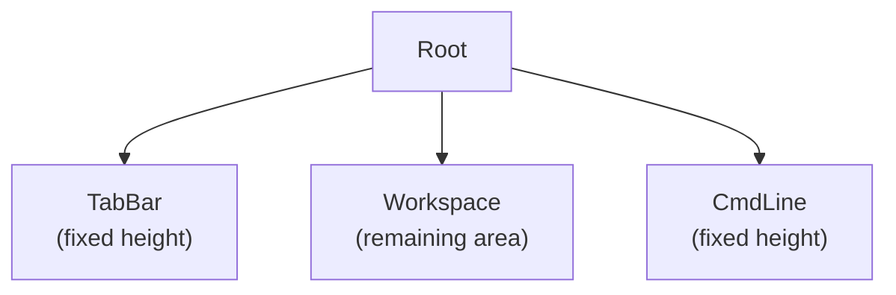

# NewCGDB Documentation

**NewCGDB** is a modern terminal debugger UI built in Go on [tcell](https://github.com/gdamore/tcell). It lives in the `promptcore` repository under `internal/termui` and is driven from `cmd/uitcell`.

The project targets a **cgdb-like experience** with a cleaner architecture: composable widgets, a recursive split-tree workspace, a replaceable rendering pipeline, and debugger backends that do not depend on the UI layer.

Standalone diagram sources live under [`diagrams/`](diagrams/).

---

## Documentation map

| Document | Audience | Use when |
|----------|----------|----------|
| **[README.md](README.md)** (this file) | Everyone | Index, quick links, how to view docs |
| **[OVERVIEW.md](OVERVIEW.md)** | Users, contributors | Vision, goals, comparison to cgdb / gdb TUI |
| **[ARCHITECTURE.md](ARCHITECTURE.md)** | Architects, reviewers | High-level subsystems and data flow |
| **[UI_ARCHITECTURE.md](UI_ARCHITECTURE.md)** | UI contributors | Widgets, canvas, grid, layout, focus |
| **[WINDOW_MANAGEMENT.md](WINDOW_MANAGEMENT.md)** | UI contributors | Splits, tabs, workspace, command line |
| **[RENDERING.md](RENDERING.md)** | Rendering contributors | Cells, borders, Unicode, diff rendering |
| **[INPUT.md](INPUT.md)** | UX contributors | Keyboard, mouse, modes, vim commands |
| **[DEBUGGER_INTEGRATION.md](DEBUGGER_INTEGRATION.md)** | Backend contributors | GDB MI2, future JTAG / OpenOCD |
| **[PLUGINS.md](PLUGINS.md)** | Extensibility | Lua plans, feature panes, automation |
| **[DIRECTORY_STRUCTURE.md](DIRECTORY_STRUCTURE.md)** | New developers | Package layout and responsibilities |
| **[ROADMAP.md](ROADMAP.md)** | Planners | Current state, planned work, vision |
| **[DEVELOPER_GUIDE.md](DEVELOPER_GUIDE.md)** | Contributors | Onboarding, file walk order, pitfalls |
| **[HOSTING.md](HOSTING.md)** | DevOps | Local docs server, CI artifacts |

---

## Quick start

### Run the debugger prototype

```bash
go run ./cmd/uitcell
```

Requires a terminal with UTF-8 support. The prototype registers a split workspace, a functional `:` command line, and an event bus that dispatches domain events through `HandleCoreEvents`.

### View documentation in a browser

```bash
./docs/serve.sh
# or: go run ./cmd/docserve
```

Open [http://127.0.0.1:8765/](http://127.0.0.1:8765/) for this index with embedded Mermaid. **GitHub Pages:** see [HOSTING.md](HOSTING.md#github-pages).

| Page | URL |
|------|-----|
| Overview | [/doc/OVERVIEW.md](http://127.0.0.1:8765/doc/OVERVIEW.md) |
| Architecture | [/doc/ARCHITECTURE.md](http://127.0.0.1:8765/doc/ARCHITECTURE.md) |
| Developer guide | [/doc/DEVELOPER_GUIDE.md](http://127.0.0.1:8765/doc/DEVELOPER_GUIDE.md) |
| Diagrams index | [/diagrams](http://127.0.0.1:8765/diagrams) |

Markdown and Mermaid render in the browser via CDN (marked + mermaid). No build step required.

---

## Top-level UI layout

The root UI is a fixed three-band layout. **TabBar**, **Workspace**, and **CmdLine** are top-level components — they are **not** part of the split tree.

```text
+--------------------------------------------------+
| Tab1 | Tab2 | Tab3                               |
+--------------------------------------------------+
|                                                  |
|                 Workspace                        |
|         (recursive split tree)                   |
|                                                  |
+--------------------------------------------------+
| : command line                                   |
+--------------------------------------------------+
```



*Source: [`diagrams/top_level_ui.mermaid`](diagrams/top_level_ui.mermaid)*

See [WINDOW_MANAGEMENT.md](WINDOW_MANAGEMENT.md) for split trees, tabs, and the command line.

---

## Core design principles

1. Widgets should not know about screen coordinates.
2. Widgets draw only inside their assigned `Rect`.
3. `Canvas` provides local drawing coordinates.
4. The layout engine owns positioning.
5. The rendering backend should be replaceable.
6. Business logic is separated from rendering logic.
7. TabBar, CmdLine, and Workspace are top-level UI components.
8. Only Workspace contains the recursive split tree.
9. Future debugger backends must not depend on the UI implementation.

Full rationale: [ARCHITECTURE.md](ARCHITECTURE.md#design-principles).

---

## Repository layout (summary)

```text
promptcore/
├── cmd/
│   ├── uitcell/          # NewCGDB prototype entry point
│   ├── docserve/         # Documentation HTTP server
│   ├── tui/              # Legacy Bubble Tea chat TUI
│   └── dbug/             # Debug utilities
├── internal/
│   ├── termui/           # NewCGDB terminal UI (primary)
│   ├── core/             # UI-agnostic logic (events, buffers, history)
│   ├── gdb/              # GDB MI2 client and parsing
│   ├── app/              # Application orchestration
│   └── ui/tui/           # Legacy Bubble Tea UI adapter
└── docs/                 # This documentation tree
```

Details: [DIRECTORY_STRUCTURE.md](DIRECTORY_STRUCTURE.md).

---

## Implementation status (at a glance)

| Area | Status |
|------|--------|
| Split tree layout | Implemented |
| Canvas / Grid / Cell borders | Implemented |
| GDB MI2 PTY client | Prototype |
| Root layout (TabBar + Workspace + CmdLine) | Partial |
| Diff rendering | Planned |
| Vim command mode | Planned |
| Lua plugins | Planned |

Full tracker: [ROADMAP.md](ROADMAP.md).

---

## Related links

- [CONTRIBUTING.md](../CONTRIBUTING.md) — contribution workflow
- [README.md (project root)](../README.md) — PromptCore context engine overview
