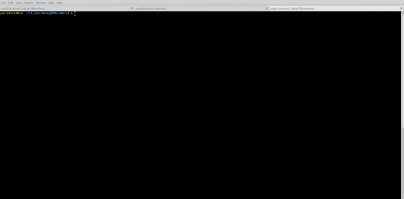
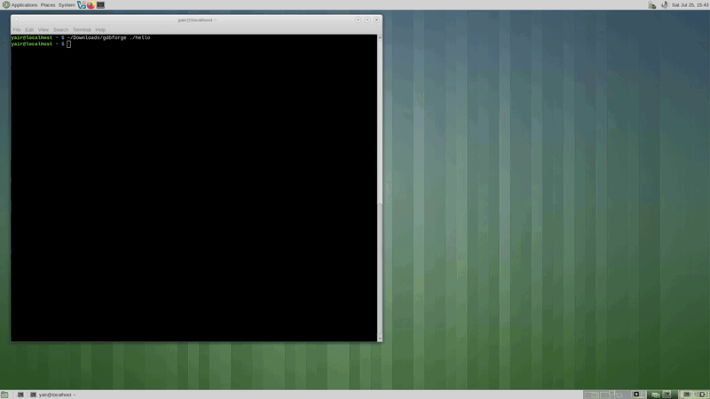
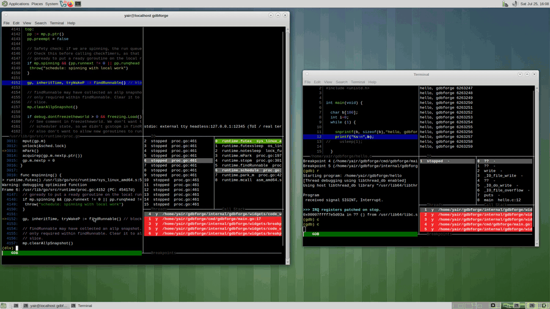
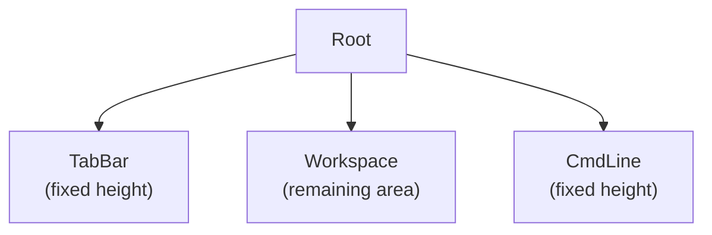

# gdbforge Documentation

**gdbforge** is a Vim-inspired terminal application framework built in Go on [tcell](https://github.com/gdamore/tcell). The debugger app (`-g gdb|dlv`) is the first application on the framework. The UI lives in `internal/termui`; the debugger app is driven from `cmd/gdbforge`.

The project targets a **cgdb-like experience** with a cleaner **MVC** architecture: `DebuggerApp` as composition root, domain on host-backed `*Ctl` controllers, widgets as views (host intents + paint), `backend.Backend` for GDB/Delve, a recursive split-tree workspace (`Workspace` above `TabWidget`), and services that do not depend on the UI layer. See [ARCHITECTURE.md — MVC](ARCHITECTURE.md#mvc-current).

Standalone diagram sources live under [`diagrams/`](https://github.com/yairgd/gdbforge/tree/main/docs/diagrams).

---

## Demos

**Cortex-R5 / J-Link** — multi-pane UI stepping a deep call stack (`gdbforge.spawn` → JLinkGDBServer → attach). Sample: [`examples/stack_demo.c`](https://github.com/yairgd/gdbforge/blob/main/examples/stack_demo.c). [Full video](https://github.com/user-attachments/assets/a5612bb4-c617-401d-b57b-3b8c5543277c).

{ loading=lazy }

**Linux app** — external terminal print vs the internal IO pane (`:b io`). [Full video](https://github.com/user-attachments/assets/7393b858-e661-44b1-af7e-dbc5d4beef3b).

{ loading=lazy }

**Debug itself** — gdbforge attached to a live gdbforge session (Go / Delve), stepping its own code. [Full video](https://github.com/user-attachments/assets/6d2466c4-f455-4c7e-a919-62ba330d025b).

{ loading=lazy }

**Linux kernel module (two UARTs)** — gdbforge + GDB on a **dedicated kgdb UART** while a **separate console UART** stays in minicom: module breakpoint from the console, step in `:b gdb`, `continue` back. See [KERNEL_KGDB.md](KERNEL_KGDB.md). [Full video](https://github.com/user-attachments/assets/57566005-8376-43ce-bffa-3f0ea160c00e).

{ loading=lazy }

---

## Documentation map

| Document | Audience | Use when |
|----------|----------|----------|
| **[README.md](README.md)** (this file) | Everyone | Index, quick links, how to view docs |
| **[USER_GUIDE.md](USER_GUIDE.md)** | Users | Full user manual (twin of in-app `:help`) |
| **[KERNEL_KGDB.md](KERNEL_KGDB.md)** | Users / embedded | Kernel kgdb: **two UARTs (manual)**, one-UART mux, kdmx, Ethernet |
| **[LUA_API.md](LUA_API.md)** | Script authors | `gdbforge.*` Lua API reference |
| **[OVERVIEW.md](OVERVIEW.md)** | Users, contributors | Vision, goals, comparison to cgdb / gdb TUI |
| **[ARCHITECTURE.md](ARCHITECTURE.md)** | Architects, reviewers | High-level subsystems and data flow |
| **[PTY_ARCHITECTURE.md](PTY_ARCHITECTURE.md)** | Architects, backend contributors | Dual PTY master/slave, GDB vs Delve, `:b io`, external terminal, TCP headless |
| **[UI_ARCHITECTURE.md](UI_ARCHITECTURE.md)** | UI contributors | Widgets, canvas, grid, layout, focus |
| **[WINDOW_MANAGEMENT.md](WINDOW_MANAGEMENT.md)** | UI contributors | Splits, tabs, workspace, command line |
| **[RENDERING.md](RENDERING.md)** | Rendering contributors | Cells, borders, Unicode, diff rendering |
| **[INPUT.md](INPUT.md)** | UX contributors | Keyboard, mouse, modes, vim commands |
| **[COMMAND_SYSTEM.md](COMMAND_SYSTEM.md)** | UX / app contributors | Command tree, DSL, parser, tab completion |
| **[EXEC_SHELL.md](EXEC_SHELL.md)** | App / UX contributors | `:!` exec panes, rest-args, live prompt, Ctrl-O |
| **[DEBUGGER_INTEGRATION.md](DEBUGGER_INTEGRATION.md)** | Backend contributors | GDB MI2, `ptyx` mux, `:AI` / GdbMcpService — see also [PTY_ARCHITECTURE.md](PTY_ARCHITECTURE.md) |
| ↳ [Delve backend (peer of GDB)](DEBUGGER_INTEGRATION.md#delve-backend-peer-of-gdb) | Backend contributors | `-g dlv`, same MVC as GDB; inferior I/O via `--tty` (spawn-only) — [dual PTY details](DEBUGGER_INTEGRATION.md#delve-inferior-io-dual-pty) |
| ↳ [Delve inferior I/O (dual PTY)](DEBUGGER_INTEGRATION.md#delve-inferior-io-dual-pty) | Backend contributors | `dlv exec --tty` → `:b io` or external terminal; `:set inferior-tty` restarts Delve; Go TUIs → `:lua dlv_port` |
| ↳ [Future OpenOCD integration](DEBUGGER_INTEGRATION.md#future-openocd-integration) | Backend contributors | Planned telnet/TCL adapter (`internal/openocd`); separate backend, not a GDB wrapper |
| **[PLUGINS.md](PLUGINS.md)** | Extensibility | Lua architecture; API details in [LUA_API.md](LUA_API.md) |
| **[DIRECTORY_STRUCTURE.md](DIRECTORY_STRUCTURE.md)** | New developers | Package layout and responsibilities |
| **[DEPENDENCIES.md](DEPENDENCIES.md)** | Architects, reviewers | Go modules and internal import rules |
| **[ROADMAP.md](ROADMAP.md)** | Planners | Current state, planned work, vision |
| **[DEVELOPER_GUIDE.md](DEVELOPER_GUIDE.md)** | Contributors | Onboarding, file walk order, pitfalls |
| **[HOSTING.md](HOSTING.md)** | DevOps | Local docs server, CI artifacts |
| **[RELEASING.md](RELEASING.md)** | Maintainers | Tag releases, dry-run CI, GitHub Release binaries |

---

## Quick start

### Run the debugger prototype

```bash
go run ./cmd/gdbforge
```

Requires a terminal with UTF-8 support. Optional for `:AI`: set `ANTHROPIC_API_KEY` or `OPENAI_API_KEY`.

```bash
go run ./cmd/gdbforge -- ./hello
# then in cgdb:  :AI what breakpoints are set?
```

The prototype registers a split workspace, a functional `:` command line with **normal/command modes**, **Ctrl+W focus chords**, **`:!` exec panes**, **`:AI` in-app LLM**, and an event bus that dispatches domain events through `HandleCoreEvents`.

### View documentation in a browser

```bash
python3 -m pip install -r requirements-docs.txt
./docs/serve.sh
# or: task docs
```

Open [http://127.0.0.1:8765/](http://127.0.0.1:8765/). MkDocs provides navigation, search, syntax highlighting, dark/light themes, and embedded Mermaid diagrams. Deployment details are in [HOSTING.md](HOSTING.md).

---

## Top-level UI layout

The root UI is a fixed three-band layout. **TabBar**, **Workspace**, and **CmdLine** are top-level components — they are **not** part of the split tree.

```text
+--------------------------------------------------+
| Tab1 | Tab2 | Tab3                               |
+--------------------------------------------------+
|                                                  |
|                 Workspace                        |
|         (recursive split tree)                   |
|                                                  |
+--------------------------------------------------+
| : command line                                   |
+--------------------------------------------------+
```



*Source: [`diagrams/top_level_ui.mermaid`](diagrams/top_level_ui.mermaid)*

See [WINDOW_MANAGEMENT.md](WINDOW_MANAGEMENT.md) for split trees, tabs, and the command line.

---

## Core design principles

1. Widgets should not know about screen coordinates.
2. Widgets draw only inside their assigned `Rect`.
3. `Canvas` provides local drawing coordinates.
4. The layout engine owns positioning.
5. The rendering backend should be replaceable.
6. Business logic lives in models; widgets display models and never talk to services directly.
7. TabBar, CmdLine, and Workspace are top-level UI components.
8. Only Workspace contains the recursive split tree.
9. Services and future debugger backends must not depend on the UI implementation.
10. Models are created at application startup; widgets are created when the user displays a model.

Full rationale: [ARCHITECTURE.md](ARCHITECTURE.md#design-principles).

---

## Repository layout (summary)

```text
gdbforge/
├── cmd/
│   ├── gdbforge/          # gdbforge debugger entry point
│   └── docserve/      # Documentation HTTP server
├── internal/
│   ├── termui/        # gdbforge terminal UI (primary)
│   ├── core/          # UI-agnostic logic (events, buffers)
│   ├── gdb/           # GDB MI2 client and parsing
│   ├── gdbforge/          # Layouts + debugger panes
└── docs/              # This documentation tree
```

Details: [DIRECTORY_STRUCTURE.md](DIRECTORY_STRUCTURE.md).

---

## Implementation status (at a glance)

| Area | Status |
|------|--------|
| Split tree layout | Implemented |
| Per-pane focus status line | Implemented |
| Canvas / Grid / Cell borders | Implemented |
| GDB MI2 PTY client | Prototype |
| Root layout (TabBar + Workspace + CmdLine) | Partial |
| Interaction modes (Normal / Command / Search) | Implemented |
| Key-sequence trie (`Ctrl+W` focus) | Partial |
| Diff rendering | Planned |
| Focus mode | Planned |
| Lua plugins | Partial (host + games; more APIs planned) |

Full tracker: [ROADMAP.md](ROADMAP.md).

---

## Related links

- [CONTRIBUTING.md](https://github.com/yairgd/gdbforge/blob/main/CONTRIBUTING.md) — contribution workflow
- [README.md (project root)](https://github.com/yairgd/gdbforge#readme) — gdbforge overview
