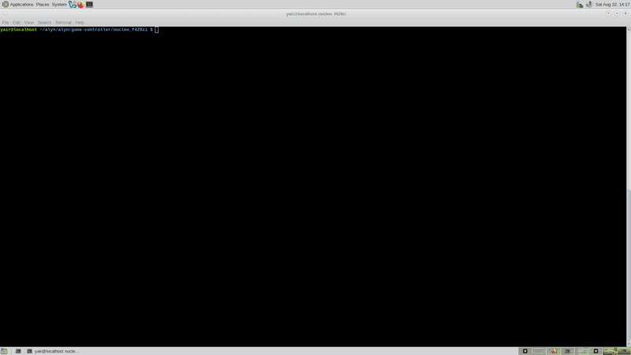
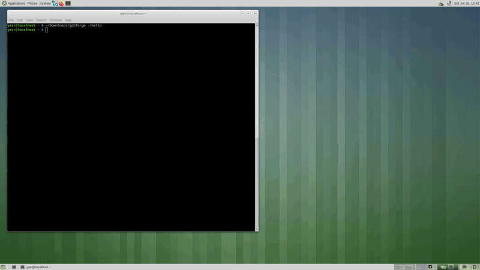
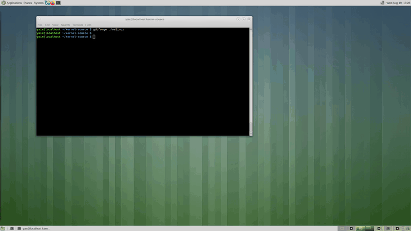
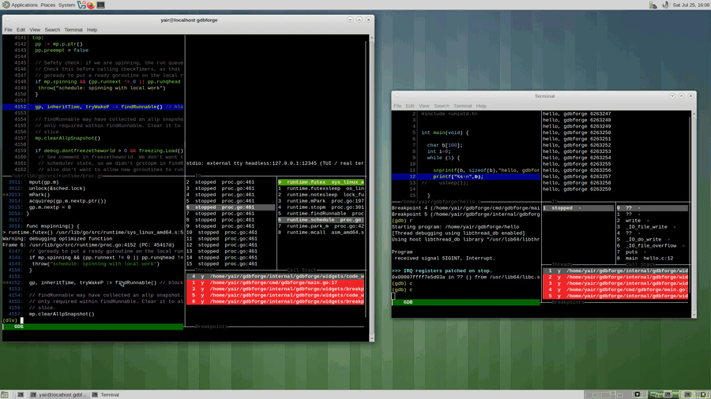

# gdbforge — Terminal Debugger for GDB and Delve

**gdbforge** is a terminal debugger front-end. It puts source, the debugger console, your
program's own input and output, threads, the call stack, and breakpoints on one
keyboard-driven screen, and drives **GDB** or **Delve** underneath (`-g gdb|dlv`).

GDB remains the debugger. gdbforge talks to it over MI on a second UI channel
(`new-ui mi2`), so the source view and the list panes follow every stop automatically
while `:b gdb` stays a normal, fully interactive GDB console.

[Install](#install){ .md-button .md-button--primary }
[First debugging session](#your-first-debugging-session){ .md-button }
[User guide](USER_GUIDE.md){ .md-button }

---

## Watch it work

**Cortex-R5 bare-metal firmware over J-Link** — gdbforge brings up the probe with one Lua
command (`:lua r5_baremetal_jlink` spawns JLinkGDBServer, attaches and loads the ELF),
then steps a deep call stack with the source, call stack, and breakpoint panes updating
together.

{ loading=lazy }

[Watch on YouTube](https://www.youtube.com/watch?v=jbS5SE7Xu3g) ·
[Zynq MPSoC guide](MPSOC_DEBUG.md) ·
samples: [`examples/stack_demo.c`](https://github.com/yairgd/gdbforge/blob/main/examples/stack_demo.c) (bare metal),
[`examples/zephyr_cortex_r5/`](https://github.com/yairgd/gdbforge/tree/main/examples/zephyr_cortex_r5) (Zephyr, thread-aware) ·
[more demos below](#demos-by-use-case)

---

## What you get

- **One screen, many panes** — source, GDB/Delve console, program I/O, threads, call
  stack, breakpoints, assembly. Named layouts (`:layout wide`, `panels`, `classic`) and a
  recursive split tree (`:vs`, `:split`).
- **A real GDB console** — `:b gdb` is the genuine GDB session. Anything you know how to
  type into GDB still works.
- **Program output that does not fight the debugger** — the inferior's stdin/stdout gets
  its own `:b io` pane, or a real external terminal for curses/TUI programs
  (`:set inferior-tty`).
- **Vim-style interaction** — normal/insert/command/search modes, a `:` command line with
  Tab completion, `Ctrl-W` focus chords, mouse and clipboard selection.
- **Breakpoints that persist** — Space toggles one on the cursor line; they are saved to
  `./.gdbforge/breakpoints.yaml` and restored next session.
- **Lua automation for target bring-up** — one `:lua` command starts OpenOCD, a J-Link GDB
  server, `gdbserver` over SSH, or kgdb, then attaches.
- **Go programs too** — the same UI over Delve with `-g dlv`.

---

## Supported workflows

| You want to debug | gdbforge gives you | Guide |
|---|---|---|
| A **Linux application** on your own machine | `gdbforge ./prog`; output in `:b io` or an external terminal | [Linux applications](EMBEDDED_LINUX_DEBUG.md) |
| An application on a **remote or embedded Linux board** | `:lua remotegdb` — scp the binary, start `gdbserver` over SSH, `target remote` | [Linux applications](EMBEDDED_LINUX_DEBUG.md) |
| **STM32 firmware** — bare-metal, Zephyr, or FreeRTOS | `:lua nucleo_f429zi` — ST-Link + OpenOCD or J-Link over SWD, stop at `main` | [STM32 and Zephyr](STM32_DEBUG.md) |
| **Zynq UltraScale+ MPSoC** Cortex-A53 / Cortex-R5 | `:lua r5_baremetal_jlink` — J-Link GDB Server or OpenOCD + Digilent HS2 | [Zynq MPSoC](MPSOC_DEBUG.md) |
| The **Linux kernel** or a loadable module | `:lua kgdb_uart` — kgdb over one UART with kdmx, two UARTs, or Ethernet | [Kernel and kgdb](KERNEL_KGDB.md) |
| A **Go program**, including one with its own TUI | `gdbforge -g dlv ./prog`, `:lua dlv_ext_port` for a separate terminal | [FAQ — Go and Delve](FAQ.md#can-i-debug-go-programs) |

Probe and transport support comes from OpenOCD, the J-Link GDB Server, or `gdbserver`.
gdbforge orchestrates those tools rather than implementing its own probe driver.

---

## Install

**Requirements:** Linux or macOS with a UTF-8 terminal, and `gdb` (or `dlv` for Go) on
your `PATH`. The hello-world below also needs `gcc`.

=== "Download a release binary"

    Prebuilt binaries are published for Linux and macOS on `amd64` and `arm64`. Replace
    the version with the [latest release](https://github.com/yairgd/gdbforge/releases/latest)
    and pick the file matching your platform.

    ```bash
    VERSION=v1.3.0
    OS=linux          # or: darwin
    ARCH=amd64        # or: arm64

    curl -fL -o gdbforge \
      "https://github.com/yairgd/gdbforge/releases/download/${VERSION}/gdbforge-${VERSION}-${OS}-${ARCH}"
    chmod +x gdbforge
    sudo mv gdbforge /usr/local/bin/
    ```

    Each binary ships a matching `.sha256` file:

    ```bash
    curl -fLO "https://github.com/yairgd/gdbforge/releases/download/${VERSION}/gdbforge-${VERSION}-${OS}-${ARCH}.sha256"
    sha256sum -c "gdbforge-${VERSION}-${OS}-${ARCH}.sha256"
    ```

=== "go install"

    ```bash
    go install github.com/yairgd/gdbforge/cmd/gdbforge@latest
    ```

    Installs into `$(go env GOPATH)/bin`. Binaries built this way report their version as
    `dev`, because the version string is stamped at release build time.

=== "Build from source"

    ```bash
    git clone https://github.com/yairgd/gdbforge.git
    cd gdbforge
    go build -o bin/gdbforge ./cmd/gdbforge
    ```

    Building requires the Go version in [`go.mod`](https://github.com/yairgd/gdbforge/blob/main/go.mod)
    or newer. Use this if you want to edit the bundled
    [Lua workflow scripts](https://github.com/yairgd/gdbforge/tree/main/lua) locally.

The Lua workflow catalog and the helper shell scripts (`gdbforge --list-scripts`) are
embedded in the binary, so `:lua r5_baremetal_jlink`, `:lua remotegdb`, `:lua kgdb_uart`
and the rest work from any of the three installs — no checkout required. Project-local
scripts in `./.gdbforge/lua/` override the embedded ones when you want to customise a
workflow ([details](LUA_API.md)).

Check the install:

```bash
gdbforge -version
gdbforge --help
```

---

## Your first debugging session

Build a program with debug symbols and open it:

```bash
cat > hello.c <<'EOF'
#include <stdio.h>

static int add(int a, int b) { return a + b; }

int main(void) {
    int sum = add(2, 3);
    printf("hello, gdbforge: %d\n", sum);
    return 0;
}
EOF

gcc -O0 -g -o hello hello.c
gdbforge ./hello
```

gdbforge opens with the source pane and the GDB console (`:b gdb`) alongside it. From
there:

1. **Set a breakpoint.** Move the cursor to the `int sum = add(2, 3);` line with the arrow
   keys and press <kbd>Space</kbd>. The line gets a red marker and the breakpoint appears
   in the Breakpoints pane. (Equivalent: type `break main` in `:b gdb`.)
2. **Start the program.** Type `:gdb run`. Execution stops on your line and `━━▶` marks the
   program counter. Use `:gdb run` — not <kbd>c</kbd> — for the first start; <kbd>c</kbd>
   is `continue`, which GDB rejects until the program is running.
3. **Step.** <kbd>s</kbd> steps into `add`, <kbd>n</kbd> steps over, <kbd>f</kbd> finishes
   the current frame, <kbd>c</kbd> continues. The Call Stack and Threads panes refresh at
   every stop.
4. **Inspect.** Press <kbd>i</kbd> to focus the GDB console and type `print sum` — or any
   other GDB command — then <kbd>Esc</kbd> to return to normal mode.
5. **See the program's output.** `:b io` shows the `printf` output in its own pane.
6. **Get help or leave.** `:help` opens the in-app manual; `:quit` or <kbd>Ctrl-D</kbd>
   exits.

Your breakpoints are written to `./.gdbforge/breakpoints.yaml` on exit and restored the
next time you start gdbforge from the same directory.

Full key and command reference: [User guide](USER_GUIDE.md) · common setup questions:
[FAQ](FAQ.md).

---

## Demos by use case

Every screencast below is a recording of a real session. The Cortex-R5 demo is at the
[top of this page](#watch-it-work).

### Embedded and bare-metal firmware

**STM32 Nucleo F429ZI — bare-metal, then Zephyr-aware.** `:lua nucleo_f429zi baremetal`
debugs the application on the board over ST-Link and OpenOCD; `:lua nucleo_f429zi zephyr`
re-attaches with OpenOCD's `-rtos Zephyr` so Zephyr threads show up in `info threads` and
in the Threads pane.
[Watch on YouTube](https://www.youtube.com/watch?v=_RAPSW77HcQ) ·
[STM32 and Zephyr guide](STM32_DEBUG.md)

{ loading=lazy }

### Linux applications

**Program I/O — internal pane versus external terminal.** The same program run two ways:
once with its stdout in the built-in `:b io` pane, and once attached to a real terminal
emulator, which is what full-screen curses programs need.
[Watch on YouTube](https://www.youtube.com/watch?v=Eya_zs4M1Cg) ·
[Linux application guide](EMBEDDED_LINUX_DEBUG.md)

{ loading=lazy }

### Linux kernel and modules

**Kernel kgdb over a single UART.** `:lua kgdb_uart` configures `kgdboc`, starts kdmx to
split the one serial line into a console PTY and a gdb PTY, opens minicom on the console,
and breaks into kgdb in about two seconds. Then `lx-symbols`, a breakpoint on a driver's
read path, and `cat /dev/…` from the console to hit it.
[Watch on YouTube](https://www.youtube.com/watch?v=6eEIxdKQTWY) ·
[Kernel and kgdb guide](KERNEL_KGDB.md)

{ loading=lazy }

**Kernel kgdb with two UARTs.** When the board has a separate console and kgdb cable there
is no mux and no bring-up script — the simplest and most reliable kgdb setup.
[Watch on YouTube](https://www.youtube.com/watch?v=yhOO8CEh1LA) ·
[Kernel guide — two UARTs](KERNEL_KGDB.md#path-0--two-uarts-manual-recommended)

### Go and Delve

**gdbforge debugging itself.** A gdbforge process attached to another live gdbforge
session through Delve (`-g dlv`), stepping its own Go code — the same panes and keys as
under GDB.
[Watch on YouTube](https://www.youtube.com/watch?v=tDNT1MQSQoE) ·
[Delve backend details](DEBUGGER_INTEGRATION.md#delve-backend-peer-of-gdb)

{ loading=lazy }

---

## Project status

gdbforge is released and versioned — see the
[releases page](https://github.com/yairgd/gdbforge/releases) and the
[changelog](CHANGELOG.md). The debugging workflows on this page are used for real work,
but the project is maintained by a small number of contributors and parts of it are still
moving. A realistic summary:

| Area | State |
|------|-------|
| GDB backend — MI2 on a dedicated channel, console, source sync, breakpoints, threads, call stack | Works; the most exercised path |
| Delve backend (`-g dlv`) | Works for everyday Go debugging, but is not a full peer of GDB: the assembly pane is disabled, and some commands differ (see [user guide](USER_GUIDE.md)) |
| Program I/O — `:b io` pane and external terminal | Works |
| Split tree, layouts, modes, `:` command line with completion, mouse | Works (provided by [termforge](https://yairgd.github.io/termforge/)) |
| Assembly pane (`:layout <name> asm`, `:vs asm`) | Works under GDB only |
| Breakpoint persistence (`./.gdbforge/breakpoints.yaml`) | Works |
| Lua workflow scripts and the `gdbforge.*` API | Works — 25 `gdbforge.*`/`pane.*` functions and about 30 bundled workflow scripts, all embedded in the binary. The API is **not** versioned or frozen and may change between releases |
| Tabs | One tab only — no tab bar, no `:tabnew` |
| Register and memory panes | Not implemented — use `:gdb info registers` and GDB's `x` in the console |
| Native OpenOCD backend (telnet/TCL) | Not implemented — OpenOCD is launched as an external GDB server by the Lua scripts |

Planned work and known gaps: [roadmap](ROADMAP.md).

---

## Documentation

### Using gdbforge

| Page | What is in it |
|------|---------------|
| [User guide](USER_GUIDE.md) | The full manual — modes, keys, colon commands, layouts, panes. Twin of the in-app `:help` |
| [FAQ](FAQ.md) | Comparisons with cgdb and the GDB TUI, program I/O, supported targets and probes, Go/Delve |
| [Linux applications](EMBEDDED_LINUX_DEBUG.md) | `:lua remotegdb` over SSH, `gdbserver`, `:b io` versus an external terminal |
| [Zynq MPSoC](MPSOC_DEBUG.md) | Cortex-A53 and Cortex-R5, J-Link and OpenOCD workflows |
| [STM32 and Zephyr](STM32_DEBUG.md) | Nucleo F429ZI and STM32F405; ST-Link, J-Link, Zephyr and FreeRTOS profiles |
| [Kernel and kgdb](KERNEL_KGDB.md) | Two UARTs, one UART with kdmx, in-process mux, Ethernet |
| [Lua API](LUA_API.md) | The `gdbforge.*` functions available to scripts |
| [Plugins](PLUGINS.md) | How Lua scripts are discovered and loaded |
| [Command system](COMMAND_SYSTEM.md) · [Input](INPUT.md) · [Window management](WINDOW_MANAGEMENT.md) · [Exec shell](EXEC_SHELL.md) | Command tree and completion, key handling, splits and tabs, `:!` panes |
| [Changelog](CHANGELOG.md) | What changed in each release |

### Developing gdbforge

The architecture — the MVC split, controllers and host interfaces, the event bus, and the
repository layout — is documented separately:

| Page | What is in it |
|------|---------------|
| [Overview](OVERVIEW.md) | Goals, motivation, and how gdbforge compares to cgdb and the GDB TUI |
| [Architecture](ARCHITECTURE.md) | Subsystems and data flow. Start with [MVC](ARCHITECTURE.md#mvc-current), [built on termforge](ARCHITECTURE.md#built-on-termforge), and the [design principles](ARCHITECTURE.md#design-principles) |
| [PTY architecture](PTY_ARCHITECTURE.md) | Dual PTY master/slave, GDB versus Delve, `:b io`, external terminal |
| [Debugger integration](DEBUGGER_INTEGRATION.md) | GDB MI2, the unified `backend.Backend`, the [Delve backend](DEBUGGER_INTEGRATION.md#delve-backend-peer-of-gdb), `:AI` / GdbMcpService |
| [Window management](WINDOW_MANAGEMENT.md) | The three-band root layout, split trees, tabs, command line |
| [Directory structure](DIRECTORY_STRUCTURE.md) | Repository layout and the responsibility of each package |
| [Dependencies](DEPENDENCIES.md) | Go modules and the import rules between the debugger and the framework |
| [Developer guide](DEVELOPER_GUIDE.md) | Onboarding, which files to read in what order, common pitfalls |
| [Flow browser](flows/browser.md) | Curated call trees (Tab completion, Ctrl-C, the stop pipeline) with links to source. Has its own search box, separate from this site's header search |
| [Roadmap](ROADMAP.md) · [Releasing](RELEASING.md) · [Hosting](HOSTING.md) | Planned work, how releases are cut, how these docs are built |

The generic terminal UI machinery — the widget system, the rendering pipeline, and the
split-tree engine — lives in **termforge** and is documented on its own site:
[UI architecture](https://yairgd.github.io/termforge/UI_ARCHITECTURE/) ·
[rendering](https://yairgd.github.io/termforge/RENDERING/) ·
[window management](https://yairgd.github.io/termforge/WINDOW_MANAGEMENT/).

Mermaid diagram sources live under
[`docs/diagrams/`](https://github.com/yairgd/gdbforge/tree/main/docs/diagrams).

### Reading these docs locally

```bash
python3 -m pip install -r requirements-docs.txt
./docs/serve.sh          # or: task docs
```

Then open <http://127.0.0.1:8765/>. Details: [Hosting](HOSTING.md).

---

## Related project: termforge

gdbforge is the debugger. The terminal UI it runs on is a separate project,
**[termforge](https://yairgd.github.io/termforge/)** — widgets, split-tree windows, tabs,
colon commands with tab completion, key-sequence bindings, and the terminal emulator pane,
with **no debugger in it**. termforge was extracted *from* gdbforge once that machinery
stood on its own, so gdbforge is both its origin and its largest consumer. This repository
is now the debugger only.

| Question | Site |
|----------|------|
| How do I debug something with GDB, Delve, an embedded target, or kgdb? | **This site** |
| How does a widget, split tree, or `:command` work in general? | [termforge documentation](https://yairgd.github.io/termforge/) — [UI architecture](https://yairgd.github.io/termforge/UI_ARCHITECTURE/), [window management](https://yairgd.github.io/termforge/WINDOW_MANAGEMENT/), [rendering](https://yairgd.github.io/termforge/RENDERING/) |
| How do I build my own terminal app on the same framework? | [termforge documentation](https://yairgd.github.io/termforge/) |
| How does gdbforge drive GDB or Delve? | [Debugger integration](DEBUGGER_INTEGRATION.md) on this site |

Source: [github.com/yairgd/termforge](https://github.com/yairgd/termforge) ·
how the split works: [ARCHITECTURE.md — Built on termforge](ARCHITECTURE.md#built-on-termforge).

---

## Related links

- [Project README on GitHub](https://github.com/yairgd/gdbforge#readme)
- [Releases and prebuilt binaries](https://github.com/yairgd/gdbforge/releases)
- [CONTRIBUTING.md](https://github.com/yairgd/gdbforge/blob/main/CONTRIBUTING.md) — contribution workflow
- [Issue tracker](https://github.com/yairgd/gdbforge/issues)
