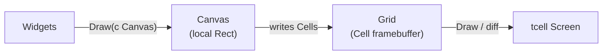
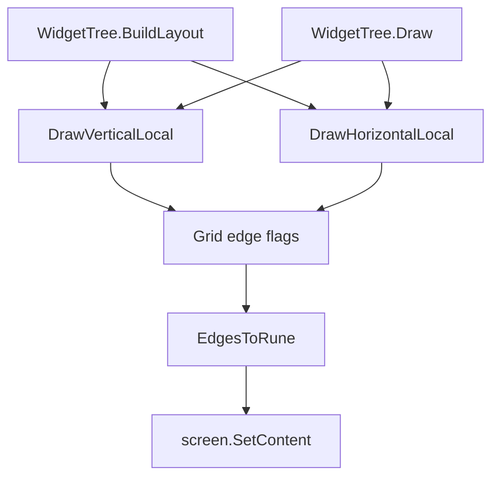
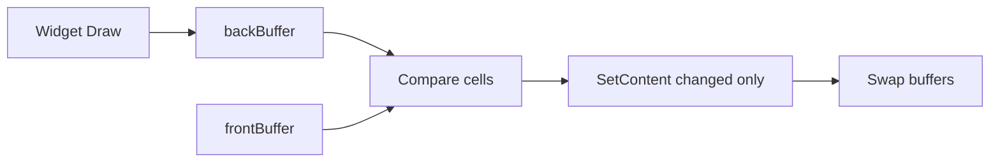

# Rendering System

gdbforge renders through an off-screen **Grid** of **Cells**, composed by widgets via **Canvas**, and flushed to **tcell**. This document covers the cell model, border drawing, Unicode text, screen synchronization, and the path to **diff-based rendering**.

**Companion docs:** [UI_ARCHITECTURE.md](UI_ARCHITECTURE.md) · [ARCHITECTURE.md](ARCHITECTURE.md)

---

## Table of contents

- [Rendering overview](#rendering-overview)
- [Grid](#grid)
- [Cell model](#cell-model)
- [Border composition](#border-composition)
- [Unicode and text drawing](#unicode-and-text-drawing)
- [Screen synchronization](#screen-synchronization)
- [Future diff rendering](#future-diff-rendering)
- [Known gaps](#known-gaps)

---

## Rendering overview

```text
Widgets
    ↓
Canvas        (local Rect, shared Grid)
    ↓
Grid          ([][]Cell framebuffer)
    ↓
tcell Screen  (terminal backend)
```



*Source: [`diagrams/rendering_pipeline.mermaid`](diagrams/rendering_pipeline.mermaid)*

**Design rationale:** an intermediate grid decouples **what changed** from **how the terminal is updated**. Without it, every widget would call `screen.SetContent` directly, making dirty tracking impossible.

---

## Grid

```go
type Grid struct {
    W, H int
    Cells     [][]Cell
    BackCells [][]Cell
    // cursor state (ShowCursor / HideCursor)
}
```

| Method | Purpose |
|--------|---------|
| `NewGrid(w, h)` | Allocate cell storage |
| `SetContent(x, y, ch, style)` | Write rune and style to a cell |
| `Print(x, y, style, text)` | Write a string through `SetContent` |
| `Clear()` | Zero all cells |
| `DrawVertical(x, y1, y2, bold)` | Mark vertical edge segments |
| `DrawHorizontal(y, x1, x2, bold)` | Mark horizontal edge segments |
| `Draw(screen)` | Compose runes, diff against `BackCells`, flush changes to tcell |
| `ClearLine(y, style)` | Clear one row |

`TermApp` holds:

| Buffer | Role |
|--------|------|
| `frontBuffer` | Shared draw target and flush source |

A separate `backBuffer` for full double-buffered diff is planned but not allocated yet. Today `BackCells` inside `frontBuffer` tracks the last flushed cell state for incremental updates.

On terminal resize, `UpdateCanvas()` calls `screen.Sync()`, reads new dimensions, and reallocates `frontBuffer`.

Implementation: `grid.go`, `term_app.go`.

---

## Cell model

```go
type Cell struct {
    Up, Down, Left, Right bool
    Rune                  rune
    Bold                  bool
    Style                 tcell.Style
}
```

Cells are **edge-centric**, not character-centric, during layout:

1. Border drawing sets edge flags on grid cells.
2. Before flush, `EdgesToRune()` composes a Unicode box-drawing rune from the flags.
3. `Grid.Draw` writes composed runes to tcell.

**Design decision:** edge flags allow adjacent panes to **share** border cells without double-drawing. When a vertical split meets a horizontal split, corner cells resolve to crosses or tees automatically.

### Edge-to-rune mapping

`Cell.EdgesToRune()` handles:

| Pattern | Light | Bold |
|---------|-------|------|
| Cross (+) | `┼` | `╋` |
| T-junctions | `├┤┬┴` | `┣┫┳┻` |
| Corners | `┌┐└┘` | `┏┓┗┛` |
| Vertical line | `│` | `┃` |
| Horizontal line | `─` | `━` |
| No edges | space | space |

Comment in source notes that **mixed-weight corners** (light meeting bold) are not yet handled — a future enhancement when focus highlighting uses bold borders.

Implementation: `cell.go`.

---

## Border composition

Split layout draws borders during `BuildLayout`:

```go
// Vertical split at column leftW
c.DrawVerticalLocal(leftW, 0, c.H(), false)

// Horizontal split at row topH
c.DrawHorizontalLocal(topH, 0, c.W(), false)
```

These call into `Grid.DrawVertical` / `DrawHorizontal`, setting edge flags on the separator line. During the draw phase, `WidgetTree.redrawGrid` repeats these calls after widget content is drawn so separators recover from overwrites. Border cells reset `Rune = 0` and `Style = tcell.StyleDefault` before edge flags are applied.



**Design decision:** borders belong to the **WidgetTree geometry pass**, not widgets. Widgets should not draw their own outer frame — this prevents double borders and misaligned corners in nested splits.

**Planned:** focused pane gets `bold=true` on its bordering edges for visual feedback. Today, focus is indicated by the per-pane status line (`▎ {name}`) at the bottom of the focused leaf.

---

## Unicode and text drawing

### UTF-8 text

`Canvas.DrawANSIText` iterates UTF-8 runes and calls `SetContent` per column:

```go
func (c Canvas) DrawANSIText(localX, localY int, text string, baseStyle tcell.Style)
```

- Uses `utf8.DecodeRuneInString` for correct wide-character iteration.
- Clips at canvas width.
- ANSI escape parsing exists but is **disabled** (`if false` block) — reserved for future styled GDB output.

**Gap:** no grapheme cluster / East Asian width handling yet. For debugger source code (mostly ASCII), this is acceptable short-term. Source view will need `runewidth` or equivalent before internationalized code display.

### Box drawing

Border runes use Unicode **Box Drawing** block (U+2500–U+257F) with **Heavy** variants (U+2501+) for bold edges.

Terminal emulators with UTF-8 enabled (the default in modern terminals) render these correctly. Fallback to ASCII `+--|` is not implemented — a future compatibility mode.

Implementation: `utf.go`, `cell.go`.

---

## Per-pane status line

The focused workspace pane paints a one-row status band below its content area. This happens in the `WidgetTree.Draw` phase **after** widgets draw and split borders are restored:

| Step | Function | Purpose |
|------|----------|---------|
| 1 | `drawWidgets` | Pane content on rows `0..H-1` |
| 2 | `clearStatusRows` | `ClearStatusLine` — reset status row to `tcell.StyleDefault` |
| 3 | `redrawGrid` | Re-apply `DrawVertical` / `DrawHorizontal` with default style |
| 4 | `drawStatusLines` | `PaintStatusBar` on focused leaf only |

`PaintStatusBar` fills the pane width on row `c.H()` and writes `▎ {name}`. Widgets should not draw on the status row inside `Draw` — use `PaneName` on `BaseWidget` or override `DrawStatusLine`.

Implementation: `status_line.go`, `widget_tree.go`, `base_widget.go`.

---

## Screen synchronization

Current frame loop (`TermApp.Run`):

```go
for !app.exit {
    select {
    case ev := <-app.events:
        app.Api.HandleCoreEvents(ev)
    default:
        ev := app.screen.PollEvent()
        app.HandleEvent(ev)   // Ctrl+D, resize, redraw interrupt; keys → AppApi.HandleKey
        app.Draw(Canvas{rect: app.canvas.Rect(), grid: app.frontBuffer})
        app.frontBuffer.Draw(app.screen)
        app.screen.Show()
    }
}
```

| Step | Purpose |
|------|---------|
| `select` | Drain pending `termui.Event` messages before polling tcell |
| `PollEvent` | Block for input or resize |
| `HandleEvent` | Global keys, resize → `UpdateCanvas`; `EventKey` → `AppApi.HandleKey` |
| `Draw` | Widgets render into shared `frontBuffer` via `Canvas` |
| `frontBuffer.Draw` | Diff changed cells → tcell |
| `Show` | Batch update to terminal |

**Ownership:** `TermApp` owns `tcell.Screen` (poll, lifecycle, `Show`). `Grid` receives the screen only at flush time.

On resize (`EventResize`):

1. `screen.Sync()` reconciles internal size state.
2. New `Grid` allocated at updated dimensions.
3. Widgets receive resize events on next poll.

**Design decision:** single-threaded draw loop — no concurrent `SetContent` calls. GDB output uses `PostEvent` to marshal async data onto this thread.

---

## Future diff rendering

**Goal:** send only **modified cells** to tcell each frame, reducing bandwidth for remote sessions and large terminals.

**Current state:** `Grid.Draw` already compares each cell against `BackCells` and skips unchanged cells. Widget drawing routes through `Canvas` → `Grid.SetContent`, so rune and style changes are tracked.

Remaining work for full double-buffered diff:



Steps:

1. Clear `backBuffer`.
2. Widgets draw into `backBuffer` (all `SetContent` routes through grid — prerequisite).
3. Compare `backBuffer.Cells` vs `frontBuffer.Cells` (rune + style).
4. Emit `screen.SetContent` only for diffs.
5. Swap buffer pointers.

Additional optimizations:

| Technique | Benefit |
|-----------|---------|
| Separate `backBuffer` draw target | Avoid drawing over previous frame in-place |
| Per-widget dirty flags | Skip draw for unchanged panes |
| Damage regions | Limit diff to affected rects |
| Idle skip | No flush when no events and no dirty |

---

## Known gaps

| Gap | Impact | Mitigation plan |
|-----|--------|-----------------|
| No per-frame grid clear | Stale cells if a pane shrinks | Clear or full redraw at frame start |
| No separate `backBuffer` | In-place draw + diff only | Allocate second grid; swap after flush |
| Grid cursor not applied to tcell | `ShowCursor` state unused at flush | Apply cursor in `Grid.Draw` or `TermApp` |
| ANSI parsing disabled | GDB color output ignored | Enable ANSI path in DrawANSIText |
| No wide-char width | Misaligned columns for CJK | Integrate runewidth |
| Mixed bold/light corners | Visual glitches at focus borders | Corner weight resolver |

---

## Related documentation

- [UI_ARCHITECTURE.md](UI_ARCHITECTURE.md) — Canvas API
- [WINDOW_MANAGEMENT.md](WINDOW_MANAGEMENT.md) — split separators
- [ROADMAP.md](ROADMAP.md) — diff rendering milestone
