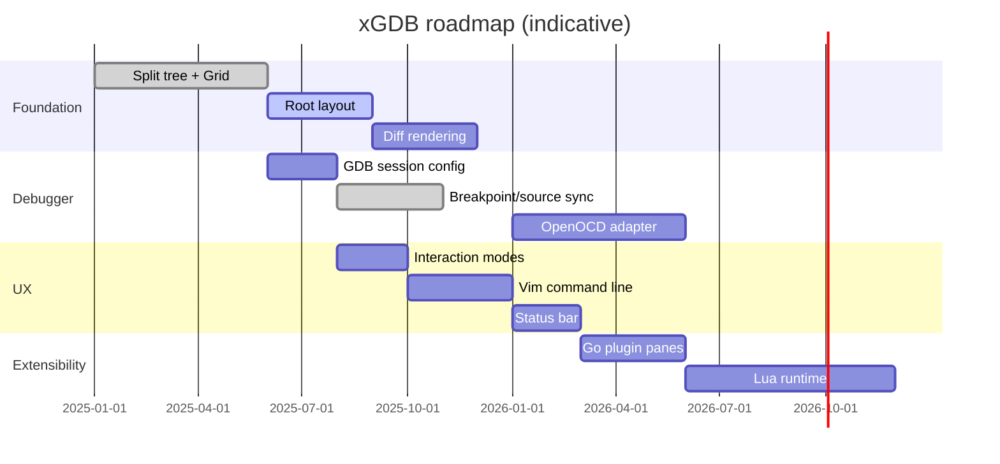

# Roadmap

This document tracks **current implementation state**, **planned features**, and the **long-term vision** for xGDB.

**Companion docs:** [OVERVIEW.md](OVERVIEW.md) · [ARCHITECTURE.md](ARCHITECTURE.md)

---

## Table of contents

- [Current state](#current-state)
- [Milestone overview](#milestone-overview)
- [Planned features](#planned-features)
- [Long-term vision](#long-term-vision)
- [Known technical debt](#known-technical-debt)
- [Future documentation needs](#future-documentation-needs)

---

## Current state

xGDB is an **architecture prototype**, not a production debugger. The split-tree UI and rendering pipeline exist; debugger integration and user-facing polish are early.

### Component status

| Component | Status | Notes |
|-----------|--------|-------|
| `Widget` interface | Done | `HandleEvent` + `Draw` + `DrawStatusLine` |
| Per-pane status line | Done | Focus bar via `BaseWidget.PaneName`; grid restore before paint |
| Split tree (`Node`, `WidgetTree`) | Done | Binary splits, ratio layout |
| `Canvas` / `Rect` | Done | Local coordinates |
| `Grid` / `Cell` borders | Done | Unicode box drawing |
| `TermApp` event loop | Done | Poll, draw, flush |
| Root layout (Tab / CompletionBar / CmdLine) | Done | Flat `AddWidget` chrome; completion overlays status row only when active |
| `TabWidget` | Stub | Single tab, no header; `NewTabTwoHozSplitWins` does not yet wire second widget |
| `CmdWidget` | Partial | Draw, history, tab complete, mode activation; emits `SubmitMsg` |
| Event bus → `HandleCoreEvents` | Partial | `CmdWidget` wired; GDB publish planned |
| Key-sequence trie | Partial | `Ctrl+W` focus chords bound in `DebuggerApp` |
| Interaction modes | Partial | **Normal + Command** via `platform.AppState`; PTYOwner + EqualAlways |
| `CodeWidget` | Working | Viewport source; `━━▶` PC; Space break toggle; red BP marks |
| `BreakpointWidget` | Working | `:b breakpoint`; internal list; `e`/`d`; syncs with GDB + CodeWidget |
| `ThreadWidget` / `CallStackWidget` | Working | Default right panes; refreshed on GDB stop |
| `LoggerWidget` | Prototype | Viewport + log sink; `PaneName: "Log"` |
| `GDBWidget` | Working | Owns `GDBClient`/`Session`; ConsolePane + streaming MI |
| `ExecWidget` / `:!` | Working | PTY exec panes via `ptyx`; ANSI; jump list `<C-o>` |
| `InputLine` / `ConsolePane` | Working | Shared readline + walking-prompt transcript |
| `ptyx.Client` | Working | Shared PTY mux: `WithWrite`, `Subscribe` fan-out |
| `GDBClient` | Working | Thin MI wrapper over `ptyx`; CLI prog/args |
| `GdbMcpService` / `:AI` | Working | Same-process LLM tools on live Session |
| Diff rendering | Partial | `BackCells` incremental diff; single `frontBuffer` |
| Runtime splits | Partial | `:vs` / `:split` wired in `HandleCoreEvents` |
| Focus mode | Not wired | `ModeInsert` / focus routing reserved |
| Mouse support | Enabled | No handlers |
| Lua plugins | Design only | See [PLUGINS.md](PLUGINS.md) |
| OpenOCD / JTAG | Not started | Design in [DEBUGGER_INTEGRATION.md](DEBUGGER_INTEGRATION.md) |
| Documentation | In progress | This docs tree + `cmd/docserve` |

### Runnable today

```bash
go run ./cmd/xgdb     # split-pane UI prototype
go run ./cmd/docserve    # documentation browser
```

---

## Milestone overview



Dates are indicative — adjust as development progresses.

---

## Planned features

### M1 — Root layout and polish (near term)

| Feature | Description |
|---------|-------------|
| Application models | Explicit model types per domain; created at startup |
| `:buffer` dispatch | Display model by name; bind widget to existing model |
| `RootWidget` | Structured TabBar + Workspace + CmdLine |
| Tab header rendering | Visible tab bar with switch keys |
| CmdLine dispatch | `SubmitMsg` on event bus → `HandleCoreEvents` by `CommandID` |
| Focus indicators | Bold border on focused pane |
| Focus movement | `Ctrl+W` + arrow keys — **partial (trie wired)** |
| Mode router | Normal / Command — **partial**; Focus / Search planned |

### M2 — Rendering efficiency

| Feature | Description |
|---------|-------------|
| Separate `backBuffer` | Full double-buffered compositing |
| Per-frame grid clear | Avoid stale cells when panes shrink |
| Diff flush | **Partial** — `BackCells` incremental diff in `Grid.Draw` |
| Damage regions | Per-widget dirty flags |

### M3 — Debugger UX

| Feature | Description |
|---------|-------------|
| Session configuration | Target binary, args, working dir |
| Source view | **Done** — file load, `━━▶` PC, Chroma, Space toggle |
| Breakpoint pane | **Done** — `:b breakpoint`; `e`/`d`; GDB + CodeWidget sync |
| Register / memory panes | Basic data display |
| `*stopped` handling | **Partial** — PC + file buffer update |
| Separate console/target streams | Route `@` vs `~` to panes |

### M4 — Commands and modes

| Feature | Description |
|---------|-------------|
| Normal / Focus / Command modes | Focus mode remaining; Normal + Command wired in `DebuggerApp` |
| Window commands | `:vs`, `:split`, `:close` — **partial (`:vs` / `:split` wired)** |
| Tab commands | `:tabnew`, `:tabn` |
| Command completion | UI + debugger vocab |

### M5 — Additional backends

| Feature | Description |
|---------|-------------|
| OpenOCD telnet client | Embedded target debugging |
| GDB remote | `target remote` sessions |
| Backend selector | Per-tab or per-session |

### M6 — Extensibility

| Feature | Description |
|---------|-------------|
| `PluginWidget` | Go-native plugin registration |
| Lua embedding | Scriptable panes and commands |
| Headless automation | CI-driven debug scripts |

---

## Long-term vision

xGDB should become a **terminal debugger platform**:

1. **Primary choice** for developers who want cgdb ergonomics with modern extensibility.
2. **Embedded-first** — OpenOCD/JTAG workflows alongside GDB.
3. **Scriptable** — Lua plugins for custom panes and CI automation.
4. **Efficient** — diff rendering for remote SSH sessions on large terminals.
5. **Clean codebase** — contributors can add a pane or backend without touching unrelated layers.

Success criteria (future 1.0):

- Daily-driver GDB debugging for C/C++ projects.
- Split layouts persist across sessions (config file).
- Plugin ecosystem documented with examples.
- Performance: < 16ms frame time on 120×40 terminal for typical updates.

---

## Known technical debt

| Item | Location | Priority |
|------|----------|----------|
| Flat widget registration | `term_app.go` | High |
| Single `frontBuffer` (no `backBuffer`) | `term_app.go` | Medium |
| `NewTabTwoHozSplitWins` ignores second widget | `tab.go` | Medium |
| Grid cursor not flushed to tcell | `grid.go` | Low |
| Empty `base_widget.go` | `termui` | Low |
| Global MI state variable | `mi.go` `var state` | Medium |

---

## Future documentation needs

Areas not yet fully documented in code or docs — track for future passes:

| Area | Why document later |
|------|-------------------|
| Session configuration file format | Not implemented |
| Keybinding reference (full table) | Modes not wired |
| Plugin API reference (Lua bindings) | No runtime yet |
| OpenOCD protocol mapping | No adapter yet |
| Testing strategy / CI | Minimal tests today |
| Performance profiling guide | Full double-buffer diff not implemented |
| Migration guide from cgdb | After feature parity assessment |
| Config / theme system | Not designed |
| Accessibility (screen reader) | Research needed for TUI a11y |

---

## Related documentation

- [OVERVIEW.md](OVERVIEW.md) — vision and motivation
- [ARCHITECTURE.md](ARCHITECTURE.md) — current vs target architecture
- [PLUGINS.md](PLUGINS.md) — extensibility plans
