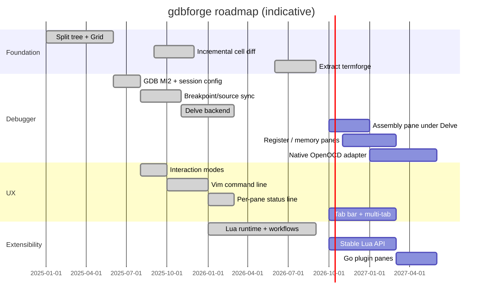

# Roadmap

This document tracks **current implementation state**, **planned features**, and the **long-term vision** for gdbforge.

**Companion docs:** [OVERVIEW.md](OVERVIEW.md) · [ARCHITECTURE.md](ARCHITECTURE.md)

---

## Table of contents

- [Current state](#current-state)
- [Milestone overview](#milestone-overview)
- [Planned features](#planned-features)
- [Long-term vision](#long-term-vision)
- [Known technical debt](#known-technical-debt)
- [Future documentation needs](#future-documentation-needs)

---

## Current state

gdbforge is **released and versioned** — see the [releases page](https://github.com/yairgd/gdbforge/releases) and [CHANGELOG.md](CHANGELOG.md). The GDB and Delve backends, the pane workspace, breakpoint persistence, and the Lua target workflows are used for real debugging.

It is not finished. There is only ever one tab, there are no register or memory panes, the assembly pane is GDB-only, there is no native OpenOCD backend, and the Lua API is not frozen. The [home page](README.md#project-status) has the short version; the tables below are per-component.

Since the [termforge extraction](ARCHITECTURE.md#built-on-termforge), the generic UI machinery — widgets, canvas, grid, split tree, rendering, PTY plumbing, the command DSL — is no longer tracked here. It lives in [termforge](https://yairgd.github.io/termforge/) and has its own roadmap.

### Debugger components (this repository)

| Component | Status | Notes |
|-----------|--------|-------|
| `GDBClient` | Working | CLI + MI + inferior PTY; `new-ui mi2` bootstrap, `mi-async on` |
| `dlv.Client` / `-g dlv` | Working | Delve headless + rpc2 + connect CLI; inferior PTY I/O |
| Unified `backend.Backend` | Working | Controllers speak semantic ops; GDB MI and Delve rpc2 stay inside the backend |
| `CodeWidget` | Working | Viewport source; `━━▶` PC; Space breakpoint toggle; red BP marks |
| `AssemblyWidget` | Working — GDB only | `:b asm`, `:layout <name> asm`, `:vs asm`. `DLVBackend.SupportsAssembly()` returns false |
| `BreakpointWidget` | Working | `:b breakpoint`; `e` / `d`; syncs with the debugger and `CodeWidget` |
| `ThreadWidget` / `CallStackWidget` | Working | Default right panes; refreshed on every stop |
| `GDBWidget` (`:b gdb`) | Working | Real interactive debugger console on its own PTY |
| `OutputWidget` (`:b io`) | Working | Inferior stdio; serial mux optional; external terminal alternative |
| `ExecWidget` (`:!`) | Working | Shell panes on their own PTY |
| Breakpoint persistence | Working | `./.gdbforge/breakpoints.yaml`, saved on quit and restored on start |
| `PostInterrupt` → `EventBus` → `*Ctl` | Working | Command submissions, GDB output, and Lua jobs all dispatch to controllers |
| `GdbMcpService` / `:AI` | Working | Same-process LLM tools over the live session |
| Lua host + workflows | Working | 25 `gdbforge.*` / `pane.*` functions and about 30 workflow scripts under [`lua/`](https://github.com/yairgd/gdbforge/tree/main/lua), embedded in the binary. The API is **not** versioned — [LUA_API.md](LUA_API.md), [PLUGINS.md](PLUGINS.md) |
| `serialmux` (one-UART kgdb) | Working | Semi-automatic; see [KERNEL_KGDB.md](KERNEL_KGDB.md) for the limitation |
| Register / memory panes | Not started | `:gdb info registers` prints to the console; no widget |
| Multi-tab UI | Not started | One tab; no `:tabnew` / `:tabn`. The tab model itself is termforge's |
| Native OpenOCD / JTAG backend | Not started | No `internal/openocd`. OpenOCD **is** usable today — the Lua scripts launch it as an external GDB server. Design: [DEBUGGER_INTEGRATION.md](DEBUGGER_INTEGRATION.md) |

### Provided by termforge

These used to be tracked in the table above. They now belong to the framework, and their state is documented on the [termforge site](https://yairgd.github.io/termforge/).

| Area | Where |
|------|-------|
| Widget interface, canvas, grid, per-pane status line | [termforge UI architecture](https://yairgd.github.io/termforge/UI_ARCHITECTURE/) |
| Split tree, tabs, three-band root layout, command line | [termforge window management](https://yairgd.github.io/termforge/WINDOW_MANAGEMENT/) |
| Incremental cell diff and the paint loop | [termforge rendering](https://yairgd.github.io/termforge/RENDERING/) |
| Modes, key-sequence trie, mouse, the `:` command DSL | [termforge documentation](https://yairgd.github.io/termforge/) |
| PTY plumbing (`ptyx`), terminal emulator pane | [termforge documentation](https://yairgd.github.io/termforge/) |

### Runnable today

```bash
go run ./cmd/gdbforge ./hello   # the debugger
go run ./cmd/docserve           # documentation browser
```

Released binaries for Linux and macOS (amd64 / arm64) are attached to each
[GitHub release](https://github.com/yairgd/gdbforge/releases); see [README.md — Install](README.md#install).

---

## Milestone overview


```mermaid
gantt
    title gdbforge roadmap (indicative)
    dateFormat YYYY-MM
    section Foundation
        Split tree + Grid           :done, m1, 2025-01, 2025-06
        Incremental cell diff       :done, m3, 2025-09, 2025-12
        Extract termforge           :done, m15, 2026-06, 2026-09
    section Debugger
        GDB MI2 + session config    :done, m4, 2025-06, 2025-08
        Breakpoint/source sync      :done, m5, 2025-08, 2025-11
        Delve backend               :done, m12, 2025-11, 2026-03
        Assembly pane under Delve   :m16, 2026-10, 2027-01
        Register / memory panes     :m13, 2026-11, 2027-03
        Native OpenOCD adapter      :m6, 2027-01, 2027-06
    section UX
        Interaction modes           :done, m7, 2025-08, 2025-10
        Vim command line            :done, m8, 2025-10, 2026-01
        Per-pane status line        :done, m9, 2026-01, 2026-03
        Tab bar + multi-tab         :m2, 2026-10, 2027-03
    section Extensibility
        Lua runtime + workflows     :done, m11, 2026-01, 2026-09
        Stable Lua API              :m14, 2026-10, 2027-03
        Go plugin panes             :m10, 2027-03, 2027-06
```

Dates are indicative — adjust as development progresses. Items with a start date in the
future are not scheduled commitments. Foundation and UX rows that are marked done were
delivered here and now live in [termforge](https://yairgd.github.io/termforge/).

---

## Planned features

Only work that is **not** in the shipped binary is listed here. For what already works,
see [Debugger components](#debugger-components-this-repository) above. Framework-level
items (tabs, rendering, modes) are tracked on the
[termforge roadmap](https://yairgd.github.io/termforge/) — the gdbforge entries below are
the parts this repository still has to wire up.

### Debugger panes and features

| Feature | Description |
|---------|-------------|
| Register pane | A real widget instead of `:gdb info registers` printing into the console |
| Memory / hex pane | Browsable memory view instead of GDB's `x` in the console |
| Watch / locals pane | Expression and local-variable list that refreshes on stop |
| Assembly under Delve | `DLVBackend.SupportsAssembly()` is false today, so `:b asm` is GDB-only |
| Multi-session | One `backend.Backend` per process today (`-g gdb\|dlv`); a per-tab backend would allow several targets at once |
| Session configuration file | Target binary, args, and working dir are command-line only; just breakpoints persist |

### Window management (needs termforge plumbing plus app wiring)

| Feature | Description |
|---------|-------------|
| Tab bar and multi-tab | gdbforge creates exactly one tab. Needs a rendered header, switch keys, and `:tabnew` / `:tabn` / `:tabclose` |
| Focus mode | A dedicated mode for window navigation. Today focus movement lives in normal mode behind `Ctrl+W` chords |
| Remaining Vim window commands | `:resize`, `:wincmd =`, move/rotate. Bound today: focus left/down/up/right, `:only`, `:close`, `:vs`, `:split` |
| Layout persistence | Save and restore the split layout across sessions |

### Backends

| Feature | Description |
|---------|-------------|
| Native OpenOCD adapter | A telnet/TCL client in `internal/openocd`, so `monitor`-style operations do not have to go through GDB. OpenOCD already works today as an externally launched GDB server |

### Extensibility

| Feature | Description |
|---------|-------------|
| Stable Lua API | Freeze and version `gdbforge.*` so scripts survive upgrades. The surface is documented in [LUA_API.md](LUA_API.md) but may still change |
| Lua-defined panes | Scripts can print to a pane and draw cells; a first-class custom widget type is not there yet |
| `PluginWidget` | Go-native plugin registration |
| Headless automation | Scripted debug runs without a terminal, for CI |

---

## Long-term vision

gdbforge aims to be a **terminal debugger platform**:

1. **Ergonomic** — cgdb-style single-screen debugging with a modern, extensible core.
2. **Embedded-friendly** — JTAG and probe workflows treated as first-class, not afterthoughts.
3. **Scriptable** — Lua plugins for custom panes, target bring-up, and CI automation.
4. **Efficient** — incremental redraw that stays responsive over SSH on large terminals.
5. **Contributable** — adding a pane or a backend should not require touching unrelated layers.

Open goals, none of which are met yet:

- A frozen, versioned plugin API with example plugins.
- Split layouts that persist across sessions.
- A measured frame-time budget (target: under 16 ms on a 120×40 terminal for a typical update) — not currently benchmarked.
- More than one debug session per process.

---

## Known technical debt

| Item | Location | Priority |
|------|----------|----------|
| Global MI state variable alongside the per-session `GdbInputState` | `internal/gdb/mi.go` `var state` | Medium |
| Assembly support is backend-gated rather than feature-detected | `internal/gdbforge/backend/dlv_backend.go` `SupportsAssembly` | Low |

Rendering and widget-registration debt moved out with the
[termforge extraction](ARCHITECTURE.md#built-on-termforge) and is tracked there.

---

## Future documentation needs

Areas not yet fully documented in code or docs — track for future passes:

| Area | Why document later |
|------|-------------------|
| Session configuration file format | Not implemented — only breakpoints persist, in `./.gdbforge/breakpoints.yaml` |
| OpenOCD protocol mapping | No native adapter yet |
| Testing strategy / CI | 94 `_test.go` files exist and `go test ./...` passes, but there is no written guidance on what to test or how CI is wired |
| Performance profiling guide | No frame-time benchmark exists to document |
| Migration guide from cgdb | Needs a feature-parity assessment first. [FAQ](FAQ.md#how-is-gdbforge-different-from-cgdb) covers the everyday equivalents |
| Config / theme system | Not designed |
| Accessibility (screen reader) | Research needed for TUI a11y |

The full keybinding table lives in [USER_GUIDE.md](USER_GUIDE.md) and the Lua API in
[LUA_API.md](LUA_API.md); both were listed here as missing and no longer are.

---

## Related documentation

- [OVERVIEW.md](OVERVIEW.md) — vision and motivation
- [ARCHITECTURE.md](ARCHITECTURE.md) — current vs target architecture
- [PLUGINS.md](PLUGINS.md) — extensibility plans
