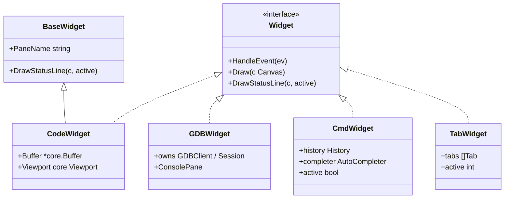
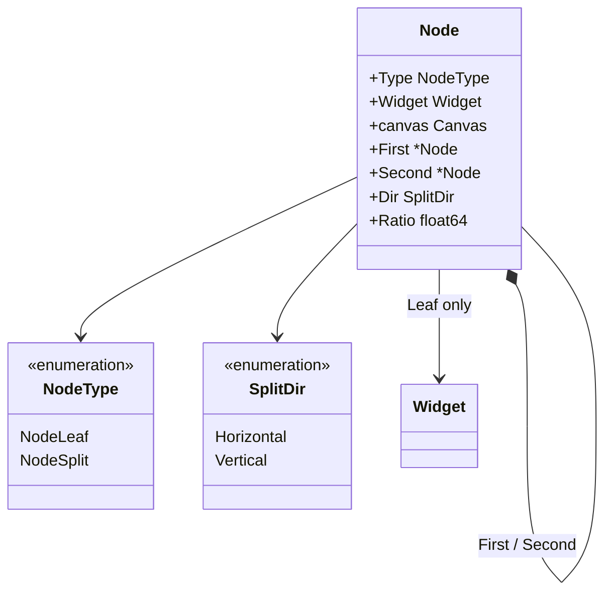
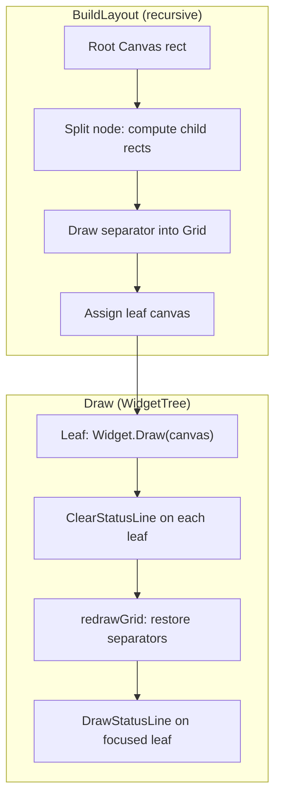
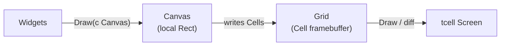
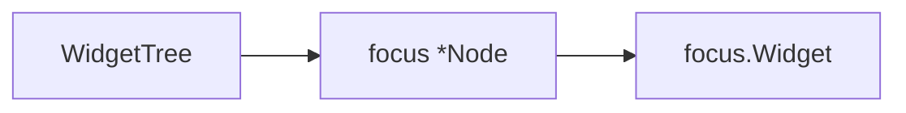
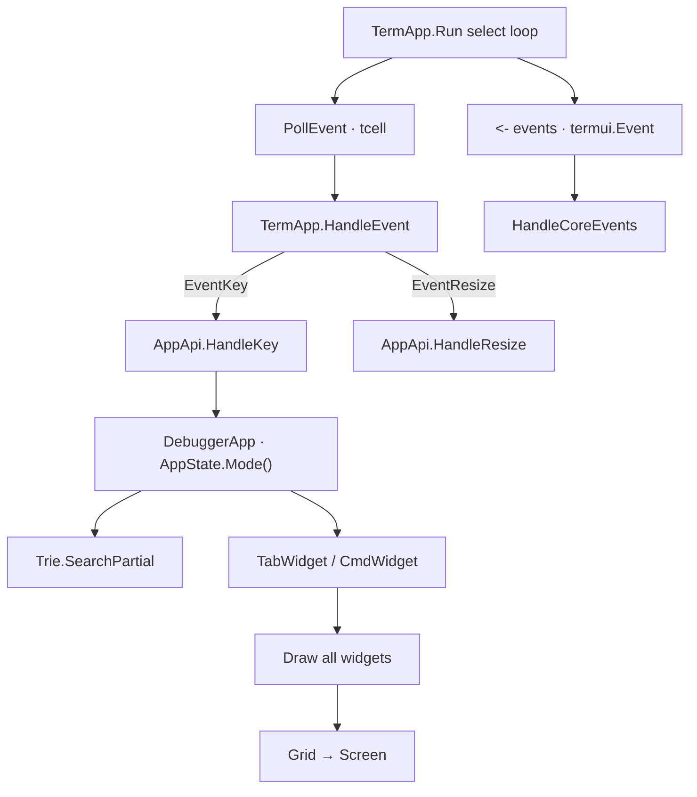
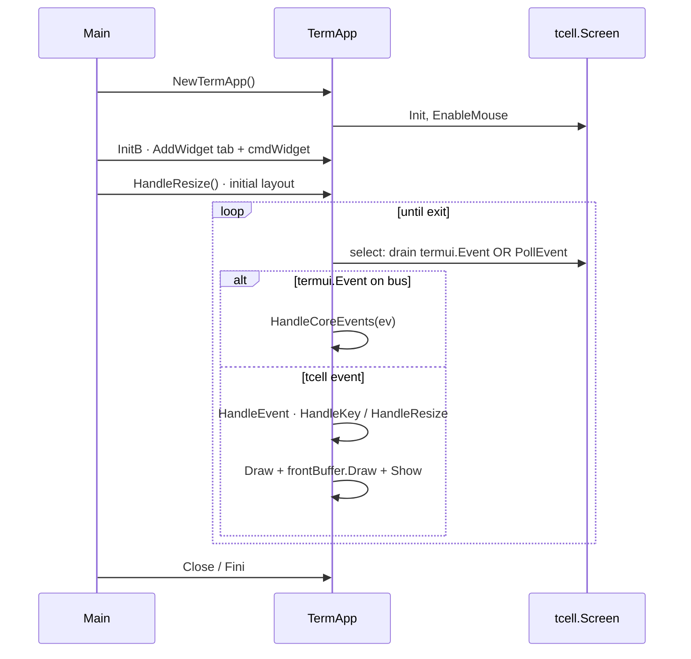

# UI Architecture

This document covers the cgdb-go presentation layer: the widget system, split-tree layout, canvas and grid abstractions, rendering pipeline, focus management, and event handling.

**Companion docs:** [WINDOW_MANAGEMENT.md](WINDOW_MANAGEMENT.md) · [RENDERING.md](RENDERING.md) · [INPUT.md](INPUT.md) · [ARCHITECTURE.md](ARCHITECTURE.md)

---

## Table of contents

- [Design goals](#design-goals)
- [Widget system](#widget-system)
- [Widget tree and nodes](#widget-tree-and-nodes)
- [Layout engine](#layout-engine)
- [Canvas abstraction](#canvas-abstraction)
- [Grid abstraction](#grid-abstraction)
- [Rendering pipeline](#rendering-pipeline)
- [Focus management](#focus-management)
- [Key-sequence trie](#key-sequence-trie)
- [Event handling](#event-handling)
- [TermApp lifecycle](#termapp-lifecycle)
- [Existing widgets](#existing-widgets)

---

## Design goals

The UI layer (`internal/termui`) exists to answer one question: **how do application models compose, draw, and receive input in a terminal?**

Design goals:

1. **Local coordinates** — widgets never compute global screen positions.
2. **Single draw path** — Widget → Canvas → Grid → tcell.
3. **Composable layout** — binary split tree, not hard-coded pane IDs.
4. **Thin widgets** — widgets are views; domain state lives in application models.
5. **Replaceable backend** — tcell is an implementation detail below `Grid`.
6. **On-demand views** — widgets are created when the user displays a model; model lifetime is independent of widget lifetime.

---

## Widget system

Widgets are **views**. They display application models and handle local input; they do not own business logic and never communicate directly with services.

Reusable widgets (`LoggerWidget`, `GraphWidget`, `TableWidget`, `TreeWidget`, `TextWidget`) depend on **generic model interfaces** (`TextModel`, `GraphModel`, …), not application-specific types. See [ARCHITECTURE.md — Widget philosophy](ARCHITECTURE.md#widget-philosophy) and [Generic widgets](ARCHITECTURE.md#generic-widgets).

A widget is created only when the user asks to display a model (for example via `:buffer code` or `:split`). Multiple widgets may display the same model simultaneously. Closing a pane destroys the widget, not the model.

Every on-screen pane implements the `Widget` interface:

```go
type Widget interface {
    HandleEvent(ev tcell.Event)
    Draw(c Canvas)
    DrawStatusLine(c Canvas, active bool)
}
```



**`BaseWidget`** (`base_widget.go`) provides shared helpers for app panes: event channels, `PaneName`, and a default `DrawStatusLine` that paints a styled bar (`▎ {name}`) when `active` is true. Widgets embed `BaseWidget` and set `PaneName` in their constructor, or override `DrawStatusLine` for custom behavior. Container widgets (`TabWidget`, `CmdWidget`) implement a no-op `DrawStatusLine`.

**REPL building blocks** (for native terminal consoles, not chat UIs):

| Type | Role |
|------|------|
| `InputLine` | Single-line editor + readline history |
| `ConsolePane` | Scrollback + walking/live prompt + `InputLine`; paste into input |
| `GDBWidget` | Owns GDB `Session` (`ptyx`); wires `ConsolePane` to MI |
| `ExecWidget` | Wires `ConsolePane` to `execcli.ExecClient` (`ptyx` + ANSI) |

**Built-in views** (`:edit about`, `:edit gdb`, `:edit exec`, …) and **`:!cmd`** swaps use `swapFocusedWidget`, which pushes the outgoing view onto a jump list. `<C-o>` (`JumpBack`) restores it. Details: [EXEC_SHELL.md](EXEC_SHELL.md).

**Built-in views** are singleton widgets owned by `DebuggerApp` and registered in `initBuiltins`. Showing one calls `ReplaceFocusedWidget` on the active leaf — O(1) widget swap, no split, no new window, no disk load. The tree never knows the concrete type.

**Why an interface, not a base struct?** Go embedding supplies defaults via `BaseWidget`, but the `Widget` interface keeps containers and prototypes independent. Not every widget embeds `BaseWidget`.

**Design decision:** widgets receive `Canvas`, not `tcell.Screen`. This prevents accidental full-screen draws and enforces layout boundaries.

**Design decision:** widgets bind to models at creation time. The window manager (`WidgetTree`, `TabWidget`, `:edit` / `:buffer` dispatch) owns widget lifecycle; models are owned by the application and outlive any single pane.

---

## Widget tree and nodes

Inside the **Workspace**, panes are arranged as a **binary split tree**. Each node is either a **leaf** (widget) or a **split** (two children).



| Field | Leaf | Split |
|-------|------|-------|
| `Widget` | The pane content | `nil` |
| `First`, `Second` | — | Child nodes |
| `Dir` | — | `Horizontal` (top/bottom) or `Vertical` (left/right) |
| `Ratio` | — | Fraction of space for `First` (0.0–1.0) |
| `canvas` | Assigned during layout | — |

`WidgetTree` wraps the root node and tracks **focus**:

```go
type WidgetTree struct {
    root  *Node
    focus *Node
}
```

Splitting converts the focused leaf into a split node:

```go
func (w *WidgetTree) Split(dir SplitDir, newWidget Widget)
```

**Design decision:** splits always occur at the **focused** pane. This matches user expectation (split the pane I'm looking at) and avoids a separate "target pane" selection step in the common case.

Implementation: `node.go`, `widget_tree.go`.

---

## Layout engine

Layout runs in two phases each frame:

1. **`BuildLayout`** — walk the tree, divide `Rect`s, draw split borders into the `Grid`, assign child `Canvas` values.
2. **`Draw`** — four sub-phases on the workspace tree:
   - **Draw widgets** — each leaf calls `Widget.Draw(canvas)` for rows `0..H-1`.
   - **Clear status rows** — `ClearStatusLine` on every leaf (`tcell.StyleDefault`).
   - **Redraw grid** — re-run `DrawVerticalLocal` / `DrawHorizontalLocal` for all splits (restores border cells and default style after widget overwrites).
   - **Draw status lines** — focused leaf calls `DrawStatusLine(canvas, true)`; inactive leaves no-op.



**Per-pane status line:** each leaf pane has a one-row band at local `y = c.H()` (immediately below the content area). Only the focused pane paints a styled label via `PaintStatusBar`. Inactive panes leave that row blank with default terminal styling after the grid restore. Helpers live in `status_line.go`.

### Split geometry

| Direction | First child | Second child | Gutter |
|-----------|-------------|--------------|--------|
| `Vertical` | Left (proportional via `Units()`) | Right (remainder) | 1 column separator |
| `Horizontal` | Top (proportional via `Units()`) | Bottom (remainder) | 1 row separator |

The gutter column/row is where `DrawVerticalLocal` / `DrawHorizontalLocal` write border cells into the shared `Grid`.

**Design decision:** `BuildLayout` sizes children using **`Units()`** (leaf-count weighting along the split axis). The `Ratio` field is set at split time (`0.5` default) and updated by `ComputeRatios` / `Rebalance`, but the current build path uses unit counts rather than `Ratio` directly.

Each tab owns a `WidgetTree` directly (no intermediate `Layout` type). `TabWidget.Draw` calls `BuildLayout` then `Draw` on the active tree.

Implementation: `widget_tree.go` (`buildLayout`), `tab.go`.

---

## Canvas abstraction

`Canvas` is a **drawing context** bound to a rectangular region of the shared `Grid`. Widgets draw in local coordinates; `Canvas` maps to absolute grid positions via `rect`.

```go
type Canvas struct {
    rect Rect
    grid *Grid
}
```

Key methods:

| Method | Purpose |
|--------|---------|
| `W()`, `H()` | Local width/height |
| `ScreenX/Y(local)` | Translate local → absolute grid coords |
| `ChildRect(localX, localY, w, h)` | Create sub-rect in screen space |
| `WithRect(r)` | New canvas sharing the same grid |
| `SetContent(localX, localY, ch, style)` | Draw a rune into the grid |
| `Fill(ch, style)` | Fill rect with a character and style |
| `Print` / `Printf` | Draw text into the grid |
| `DrawVerticalLocal` / `DrawHorizontalLocal` | Write border segments into Grid |
| `DrawANSIText` | UTF-8 text with optional ANSI styling |
| `ClearLine` | Clear one local row |

**Design decision:** `Canvas` does not hold `tcell.Screen`. All widget drawing goes through the shared `Grid`; `TermApp` owns the screen and flushes after all widgets draw. Border drawing and widget content use the same grid path.

Implementation: `canvas.go`, `rect.go`, `utf.go`.

---

## Grid abstraction

`Grid` is an off-screen **cell framebuffer**:

```go
type Grid struct {
    W, H int
    Cells     [][]Cell
    BackCells [][]Cell
}
```

Each `Cell` stores border edge flags, a composed rune, and a `tcell.Style`. See [RENDERING.md](RENDERING.md) for the cell model.

`TermApp` maintains one screen-sized grid:

| Buffer | Purpose |
|--------|---------|
| `frontBuffer` | Shared draw target; flushed to tcell each frame |

`BackCells` records the last flushed state so `Grid.Draw` can skip unchanged cells. A separate `backBuffer` for full double-buffered compositing is planned.

Implementation: `grid.go`, `term_app.go`.

---

## Rendering pipeline

```text
Widgets
    ↓
Canvas        (drawing abstraction limited to a Rect)
    ↓
Grid          (off-screen framebuffer of Cells)
    ↓
tcell Screen  (final terminal backend)
```



*Source: [`diagrams/rendering_pipeline.mermaid`](diagrams/rendering_pipeline.mermaid)*

Current `TermApp.Run` loop:

1. `select` — drain `termui.Event` channel, or poll tcell.
2. `HandleEvent` — global shortcuts, resize, redraw interrupt; `EventKey` → `AppApi.HandleKey`.
3. `Draw(Canvas)` on each top-level widget (into shared `frontBuffer`).
4. `frontBuffer.Draw(screen)` — diff flush.
5. `screen.Show()`.

Widget `HandleEvent` is **not** called from `TermApp` — the `AppApi` implementation (`DebuggerApp`) routes keys to widgets after mode and trie processing.

---

## Focus management

Focus determines which widget receives keyboard events inside the Workspace.



Current behavior:

- `WidgetTree.HandleEvent` forwards to the focused leaf's `Widget` only.
- New tree starts with focus on the root leaf.
- `Split` moves focus to the **first** (original) child.
- **`DebuggerApp`** calls `tab.FocusLeft/Right/Up/Down()` from trie-bound callbacks (`<C-w>h/j/k/l`).
- **Visual focus:** the focused leaf's `DrawStatusLine` paints `▎ {PaneName}` on the pane's bottom status row (see [Layout engine](#layout-engine)).

**Mode-aware routing** (implemented in `cmd/cgdb/input.go`):

| Mode | Terminal keys routed to |
|------|-------------------------|
| `ModeNormal` | Key bindings (partial match) + `TabWidget` → focused leaf |
| `ModeInsert` | Focused leaf widget |
| `ModeCommand` | `CmdWidget` only |

**Planned behavior** (see [INPUT.md](INPUT.md)):

- Focus mode: all keys routed to focused widget; normal-mode navigation keys suppressed.
- Bold border highlight on the focused pane's split edges (status line provides pane-name feedback today).

**Gap:** no dedicated focus mode; tab still receives keys in normal mode after trie processing.

---

## Key-sequence bindings

`commands.KeyBindingRegistry` matches **multi-key sequences** incrementally (`SearchPartial`). The application owns bindings (`cmd/cgdb/keybindings.go`):

```go
a.keyBindings.Bind(
    commands.NewCommand("move-left", func(args ...any) { a.OnFocusLeft() }),
    "<C-w>l", "<C-w><Left>",
)
```

| API | Purpose |
|-----|---------|
| `Bind(cmd, seqs...)` | Register key sequence(s) → `CommandNode` |
| `SearchPartial(key)` | Feed one key; return command on exact match |

Sequences use angle-bracket tokens (`<C-w>`, `<Up>`, …) from `platform` key parsing.

**Design decision:** binding state is per-application, not global — multiple apps or tests can bind independently.

Implementation: `internal/collections/trie.go` via `commands.KeyBindingRegistry`. Wiring: `cmd/cgdb/keybindings.go` + `input.go` (normal mode).

---

## Event handling

cgdb-go separates **terminal events** from **domain events**.

| Plane | Type | Handler |
|-------|------|---------|
| Terminal | `tcell.Event` | `TermApp.HandleEvent` → `AppApi.HandleKey` / `HandleResize` |
| Domain | `termui.Event` | **`AppApi.HandleCoreEvents`** — single application dispatch hub |

### Terminal dispatch (current)



*Source: [`diagrams/input_routing.mermaid`](diagrams/input_routing.mermaid)*

The main loop uses `select` with a `default` branch: drain pending `termui.Event` messages first, otherwise poll tcell. This keeps domain dispatch responsive without blocking keyboard input.

Global keys handled by `TermApp`:

| Key / event | Action |
|-------------|--------|
| `Ctrl+D` | Exit application |
| `EventResize` | `UpdateCanvas()`; `AppApi.HandleResize()` sets widget rects |
| `EventInterrupt` | Redraw request (`termui-redraw`) |

Application keys handled by `DebuggerApp` (`HandleKey`):

| Key / context | Action |
|---------------|--------|
| `:` (normal mode) | Enter command mode, activate `CmdWidget` |
| `<C-w>…` (normal mode) | Focus movement via trie |
| Other keys (normal mode) | Trie partial match, then `TabWidget.HandleEvent` |
| All keys (command mode) | `CmdWidget.HandleEvent` |

### Domain event bus

Any subsystem can publish to `TermApp.events` (`Events() chan termui.Event`). The bus is **not** broadcast to widgets — every event is delivered to the application:

```go
type AppApi interface {
    HandleCoreEvents(ev Event)          // all domain events land here
    HandleKey(ev *tcell.EventKey)       // mode routing, trie, widget dispatch
    HandleResize()                      // assign top-level widget rects
}
```

**Current producers:**

| Producer | Event | Example |
|----------|-------|---------|
| `CmdWidget` | `SubmitMsg` | User pressed Enter on `:quit` |
| GDB backend | `GdbOutputMsg` | Planned — today uses `EventInterrupt` into widgets |
| Other widgets | TBD | Publish via shared channel or injected `core.Emitter` |

**Example flow (`CmdWidget` → app):**

1. User types `:quit`, presses Enter.
2. `CmdWidget.submitCommand()` parses input, resolves name via `AutoCompleter`.
3. `CmdWidget` sends `SubmitMsg{CmdID: cmdQuit, Args: ""}` on `Events`.
4. `TermApp.Run` receives from channel, calls `DebuggerApp.HandleCoreEvents`.
5. App switches on `CommandID()`, calls `app.Exit()`.

See [ARCHITECTURE.md](ARCHITECTURE.md#core-events-layer) for command ID ownership (`termui.CmdUnknown` vs app-private IDs).

### Async terminal events

GDB output uses `tcell.NewEventInterrupt` to inject messages into the main loop from background goroutines. This avoids locking the screen from reader threads — a common tcell pattern.

**Planned:** route GDB output through the domain bus (`GdbOutputMsg` → `HandleCoreEvents`) instead of widget-local `EventInterrupt` handling, so debugger reactions also centralize in the application layer.

**Design decision:** prefer `EventInterrupt` for tcell wakeups today; domain bus for application-level reactions.

---

## TermApp lifecycle



`AppApi` is implemented by the application (`DebuggerApp` in `cmd/cgdb/`):

- `HandleKey` — mode routing, trie dispatch, widget `HandleEvent`.
- `HandleResize` — top-level widget rects after `UpdateCanvas`.
- `HandleCoreEvents` — **all** domain events from the bus.

`AppAPI` in `app_api.go` (`Publish`, `RequestRedraw`, …) is a separate planned surface for widgets; not yet wired everywhere.

---

## Existing widgets

| Widget | File | Status |
|--------|------|--------|
| `CodeWidget` | `internal/cgdb/widgets/code_widget.go` | Prototype — random background, title stub |
| `GDBWidget` | `internal/cgdb/widgets/gdb_widget.go` | Native GDB REPL via ConsolePane + MI/Debugger |
| `ExecWidget` | `internal/cgdb/widgets/exec_widget.go` | External PTY REPL via ConsolePane (`:!`) |
| `AboutWidget` | `internal/cgdb/widgets/about_widget.go` | Built-in About page; shown via `:edit about` |
| `ConsolePane` | `internal/termui/console_pane.go` | Shared REPL shell (scrollback + walking prompt + InputLine) |
| `InputLine` | `internal/termui/input_line.go` | Shared readline editor + history |
| `LoggerWidget` | `internal/termui/logger_widget.go` | Log pane — `platform.Sink`, scroll/clear, shared Viewport clipboard |
| `CmdWidget` | `internal/termui/cmd_widget.go` | Functional — Vim-style `:` input, tab complete, emits `SubmitMsg` on event bus |
| `TabWidget` | `internal/termui/tab.go` | Tab container forwarding to a per-tab `WidgetTree` |

Widget hierarchy target:

*Source: [`diagrams/widget_hierarchy.mermaid`](diagrams/widget_hierarchy.mermaid)*

---

## Related documentation

- [WINDOW_MANAGEMENT.md](WINDOW_MANAGEMENT.md) — splits, tabs, workspace
- [RENDERING.md](RENDERING.md) — cells, borders, Unicode
- [INPUT.md](INPUT.md) — modes and key routing
- [DEVELOPER_GUIDE.md](DEVELOPER_GUIDE.md) — file walk order
