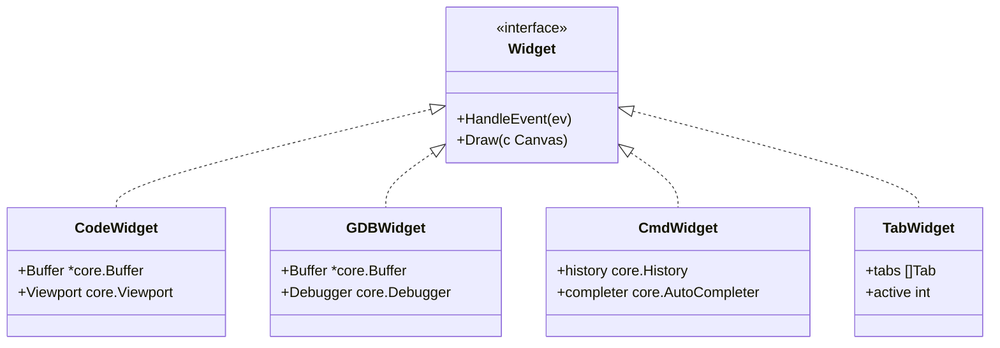
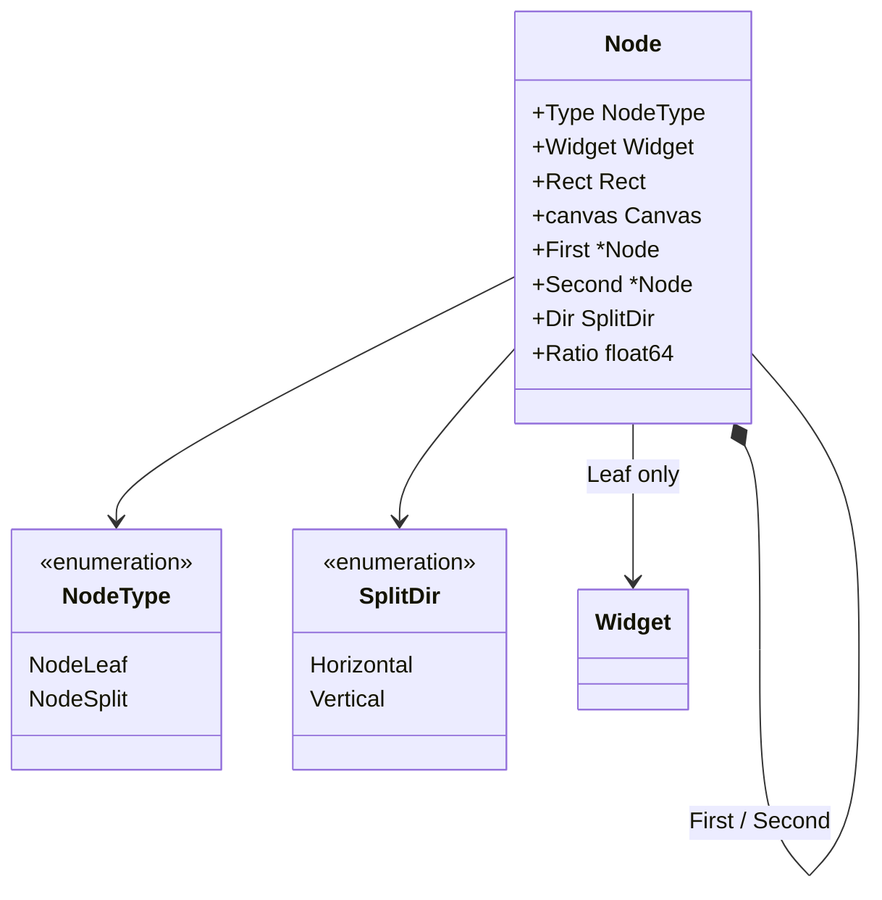
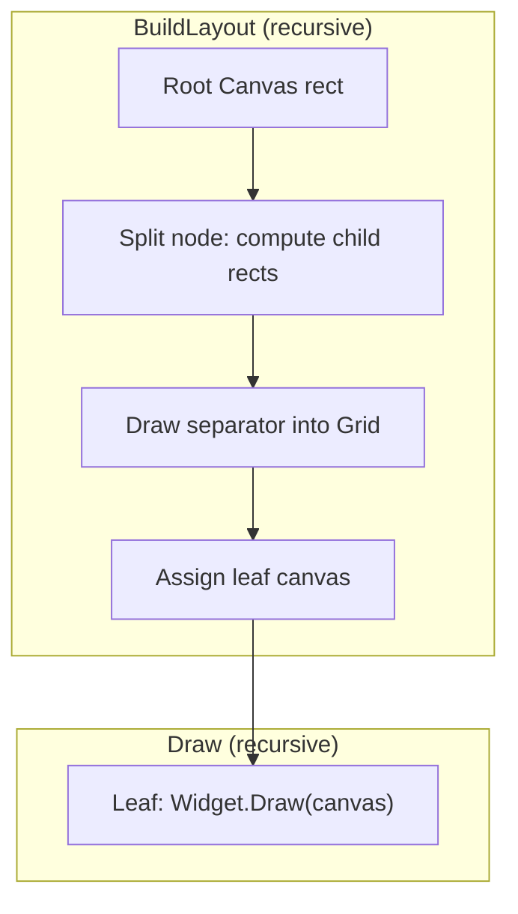
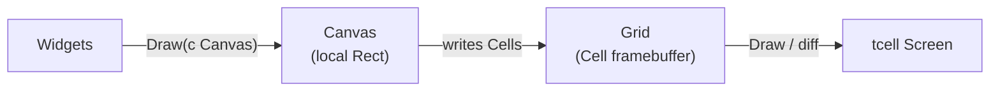
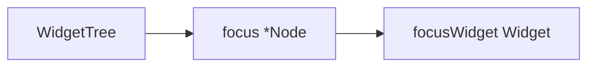
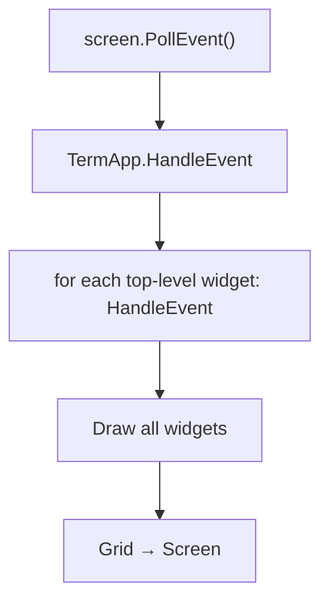
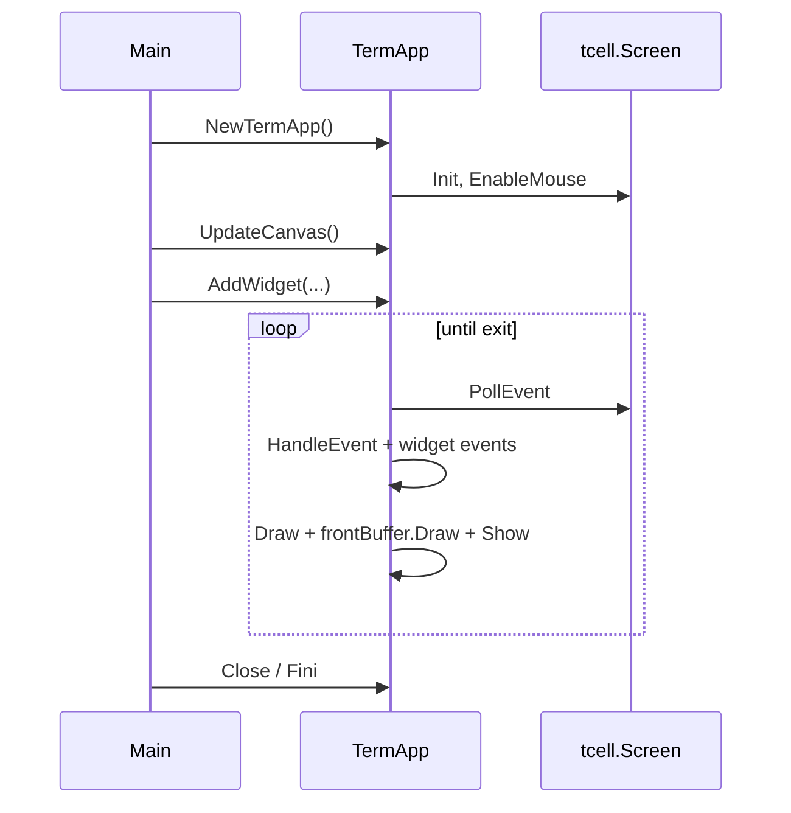

# UI Architecture

This document covers the NewCGDB presentation layer: the widget system, split-tree layout, canvas and grid abstractions, rendering pipeline, focus management, and event handling.

**Companion docs:** [WINDOW_MANAGEMENT.md](WINDOW_MANAGEMENT.md) · [RENDERING.md](RENDERING.md) · [INPUT.md](INPUT.md) · [ARCHITECTURE.md](ARCHITECTURE.md)

---

## Table of contents

- [Design goals](#design-goals)
- [Widget system](#widget-system)
- [Widget tree and nodes](#widget-tree-and-nodes)
- [Layout engine](#layout-engine)
- [Canvas abstraction](#canvas-abstraction)
- [Grid abstraction](#grid-abstraction)
- [Rendering pipeline](#rendering-pipeline)
- [Focus management](#focus-management)
- [Event handling](#event-handling)
- [TermApp lifecycle](#termapp-lifecycle)
- [Existing widgets](#existing-widgets)

---

## Design goals

The UI layer (`internal/termui`) exists to answer one question: **how do debugger panes compose, draw, and receive input in a terminal?**

Design goals:

1. **Local coordinates** — widgets never compute global screen positions.
2. **Single draw path** — Widget → Canvas → Grid → tcell.
3. **Composable layout** — binary split tree, not hard-coded pane IDs.
4. **Thin widgets** — business state lives in `core`; widgets adapt and draw.
5. **Replaceable backend** — tcell is an implementation detail below `Grid`.

---

## Widget system

Every on-screen pane implements the `Widget` interface:

```go
type Widget interface {
    HandleEvent(ev tcell.Event)
    Draw(c Canvas)
}
```



**Why an interface, not a base struct?** Go embedding could provide defaults, but the interface keeps widgets independent. A shared `BaseWidget` file exists as a placeholder for future helpers — it is intentionally empty today.

**Design decision:** widgets receive `Canvas`, not `tcell.Screen`. This prevents accidental full-screen draws and enforces layout boundaries.

---

## Widget tree and nodes

Inside the **Workspace**, panes are arranged as a **binary split tree**. Each node is either a **leaf** (widget) or a **split** (two children).



| Field | Leaf | Split |
|-------|------|-------|
| `Widget` | The pane content | `nil` |
| `First`, `Second` | — | Child nodes |
| `Dir` | — | `Horizontal` (top/bottom) or `Vertical` (left/right) |
| `Ratio` | — | Fraction of space for `First` (0.0–1.0) |
| `canvas` | Assigned during layout | — |

`WidgetTree` wraps the root node and tracks **focus**:

```go
type WidgetTree struct {
    root        *Node
    focus       *Node
    focusWidget Widget
}
```

Splitting converts the focused leaf into a split node:

```go
func (w *WidgetTree) Split(dir SplitDir, newWidget Widget)
```

**Design decision:** splits always occur at the **focused** pane. This matches user expectation (split the pane I'm looking at) and avoids a separate "target pane" selection step in the common case.

Implementation: `node.go`, `widget_tree.go`.

---

## Layout engine

Layout runs in two phases each frame:

1. **`BuildLayout`** — walk the tree, divide `Rect`s, draw split borders into the `Grid`, assign child `Canvas` values.
2. **`Draw`** — each leaf widget draws into its pre-assigned `Canvas`.



### Split geometry

| Direction | First child | Second child | Gutter |
|-----------|-------------|--------------|--------|
| `Vertical` | Left (`Ratio × width`) | Right (remainder) | 1 column separator |
| `Horizontal` | Top (`Ratio × height`) | Bottom (remainder) | 1 row separator |

The gutter column/row is where `DrawVerticalLocal` / `DrawHorizontalLocal` write border cells into the shared `Grid`.

**Design decision:** ratio-based splits (not pixel drag yet) keep the first implementation simple. Interactive resize is planned — the `Ratio` field is the extension point.

`Layout` is a thin facade over `WidgetTree`:

```go
type Layout struct {
    tree WidgetTree
}

func (l *Layout) Draw(c Canvas) {
    l.tree.BuildLayout(c)
    l.tree.Draw(c)
}
```

Implementation: `layout.go`, `widget_tree.go` (`buildLayout`).

---

## Canvas abstraction

`Canvas` is a **drawing context** bound to a rectangular region of the screen (and optionally a shared `Grid` for borders).

```go
type Canvas struct {
    screen tcell.Screen
    rect   Rect
    grid   *Grid
}
```

Key methods:

| Method | Purpose |
|--------|---------|
| `W()`, `H()` | Local width/height |
| `ScreenX/Y(local)` | Translate local → absolute screen coords |
| `ChildRect(localX, localY, w, h)` | Create sub-rect for layout children |
| `SetContent(localX, localY, ch, style)` | Draw a rune (via tcell today) |
| `DrawVerticalLocal` / `DrawHorizontalLocal` | Write border segments into Grid |
| `DrawANSIText` | UTF-8 text with optional ANSI styling |
| `Fill` | Fill rect with a character |

**Design decision:** border drawing goes through `Grid` (edge flags on cells), while widget content often goes **directly to tcell** via `SetContent`. This is a known inconsistency — see [RENDERING.md](RENDERING.md). The long-term plan is to route all drawing through the grid for diff rendering.

Implementation: `canvas.go`, `rect.go`, `utf.go`.

---

## Grid abstraction

`Grid` is an off-screen **cell framebuffer**:

```go
type Grid struct {
    W, H int
    Cells [][]Cell
}
```

Each `Cell` stores border edge flags and a composed rune. See [RENDERING.md](RENDERING.md) for the cell model.

`TermApp` maintains two grids:

| Buffer | Purpose |
|--------|---------|
| `backBuffer` | Target for widget/grid drawing (future primary) |
| `frontBuffer` | Last displayed frame; flushed to screen each loop |

**Design decision:** double-buffering enables future diff rendering — compare `frontBuffer` vs `backBuffer` and emit only changed cells to tcell.

Implementation: `grid.go`, `term_app.go`.

---

## Rendering pipeline

```text
Widgets
    ↓
Canvas        (drawing abstraction limited to a Rect)
    ↓
Grid          (off-screen framebuffer of Cells)
    ↓
tcell Screen  (final terminal backend)
```



*Source: [`diagrams/rendering_pipeline.mermaid`](diagrams/rendering_pipeline.mermaid)*

Current `TermApp.Run` loop:

1. `PollEvent` → dispatch to widgets.
2. `Draw(Canvas)` on each top-level widget.
3. `frontBuffer.Draw(screen)` — full flush.
4. `screen.Show()`.

**Gap:** widget text often bypasses the grid. Documented in [RENDERING.md](RENDERING.md#known-gaps).

---

## Focus management

Focus determines which widget receives keyboard events inside the Workspace.



Current behavior:

- `WidgetTree.HandleEvent` forwards to `focusWidget` only.
- New tree starts with focus on the root leaf.
- `Split` moves focus to the **first** (original) child.

**Planned behavior** (see [INPUT.md](INPUT.md)):

- Normal mode: global shortcuts; `Tab` / `hjkl` to move focus between leaves.
- Focus mode: all keys routed to focused widget.
- Command mode: keys routed to CmdLine.

**Gap:** no focus movement API yet; no visual focus indicator (border highlight).

---

## Event handling

### Dispatch order (current)



Global keys handled by `TermApp`:

| Key | Action |
|-----|--------|
| `Ctrl+D` | Exit application |
| Resize | Reallocate grids via `UpdateCanvas()` |

### Async events

GDB output uses `tcell.NewEventInterrupt` to inject messages into the main loop from background goroutines. This avoids locking the screen from reader threads — a common tcell pattern.

**Design decision:** prefer `EventInterrupt` over unsynchronized channel polling in the main loop, because tcell's event model is the single source of truth for wakeups.

---

## TermApp lifecycle



`AppAPI` (`app_api.go`) defines the interface widgets may use to request redraws, open windows, and publish `core.Event` — not yet wired everywhere.

---

## Existing widgets

| Widget | File | Status |
|--------|------|--------|
| `CodeWidget` | `code_widget.go` | Prototype — random background, title stub |
| `GDBWidget` | `gdb_widget.go` | Functional prototype — MI input, buffer draw |
| `CmdWidget` | `cmd_widget.go` | Stub — history keys, empty `Draw` |
| `TabWidget` | `tab.go` | Single-tab container forwarding to `Layout` |

Widget hierarchy target:

*Source: [`diagrams/widget_hierarchy.mermaid`](diagrams/widget_hierarchy.mermaid)*

---

## Related documentation

- [WINDOW_MANAGEMENT.md](WINDOW_MANAGEMENT.md) — splits, tabs, workspace
- [RENDERING.md](RENDERING.md) — cells, borders, Unicode
- [INPUT.md](INPUT.md) — modes and key routing
- [DEVELOPER_GUIDE.md](DEVELOPER_GUIDE.md) — file walk order
