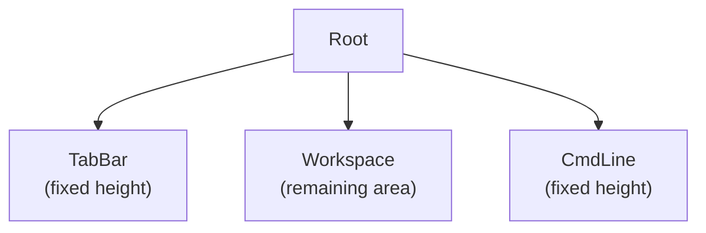
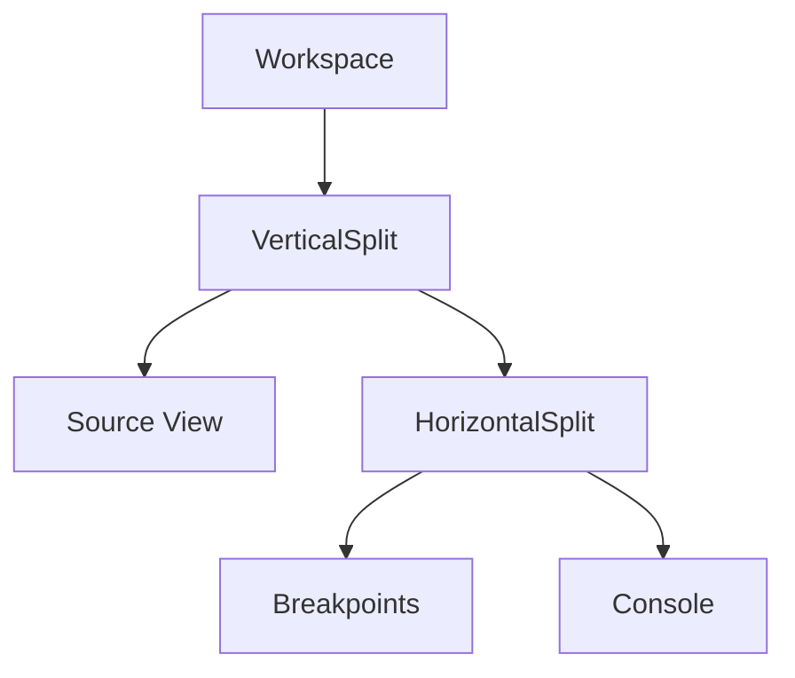
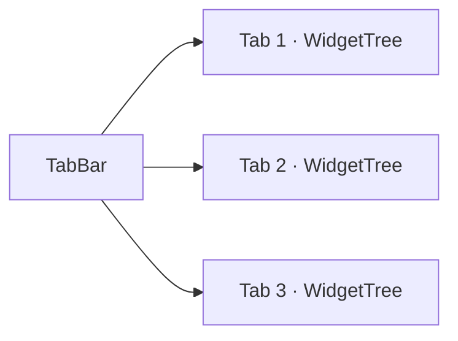

# Window Management

cgdb-go organizes debugger panes through a **Workspace** containing a recursive **split tree**, managed at the top level by **tabs** and a global **command line**. Each workspace pane shows a **per-pane status line** at its bottom edge when focused; a global debugger status bar is still planned above the command line.

**Companion docs:** [UI_ARCHITECTURE.md](UI_ARCHITECTURE.md) · [INPUT.md](INPUT.md) · [ARCHITECTURE.md](ARCHITECTURE.md)

---

## Table of contents

- [Top-level layout](#top-level-layout)
- [Workspace concept](#workspace-concept)
- [Split tree architecture](#split-tree-architecture)
- [Horizontal and vertical splits](#horizontal-and-vertical-splits)
- [Splitting at runtime](#splitting-at-runtime)
- [Tab management](#tab-management)
- [Command line](#command-line)
- [Buffer command](#buffer-command)
- [Per-pane status line](#per-pane-status-line)
- [Global status bar (planned)](#global-status-bar-planned)
- [Planned window operations](#planned-window-operations)

---

## Top-level layout

The root UI is **not** a split tree. It is a fixed vertical stack:

```text
Root
├── TabBar      (fixed height)
├── Workspace   (remaining area — contains split tree)
└── CmdLine     (fixed height)
```

```text
+--------------------------------------------------+
| Tab1 | Tab2 | Tab3                               |
+--------------------------------------------------+
|                                                  |
|                 Workspace                        |
|                                                  |
+--------------------------------------------------+
| : command line                                   |
+--------------------------------------------------+
```



*Source: [`diagrams/top_level_ui.mermaid`](diagrams/top_level_ui.mermaid)*

**Design decision:** keeping TabBar and CmdLine **outside** the split tree means:

- Tabs always remain visible regardless of pane layout.
- The command line is a stable anchor (like Vim's `:` line).
- Workspace resize math is isolated — only the middle band changes height on terminal resize.

**Current gap:** `TermApp` registers widgets in a flat slice rather than a structured `RootLayout`. **`DebuggerApp.HandleResize`** assigns rects today:

```go
w[0].SetRect(c.ChildRect(0, 0, c.W(), c.H()))       // TabWidget (workspace)
w[1].SetRect(c.ChildRect(0, c.H()-1, c.W(), 1))     // CmdWidget (bottom row)
```

Called on startup (`NewDebuggerApp`) and on every `EventResize`. Migration path: introduce `RootWidget` that owns the three bands internally.

---

## Workspace concept

The **Workspace** is the rectangular region between TabBar and CmdLine. It is the **only** place where recursive splits exist.

Workspace panes are **widgets** — views bound to application **models** that were created at startup. Typical GDB models and their views:

| Model | Widget (view) | Purpose |
|-------|---------------|---------|
| `CodeModel` | Source view | Current file, breakpoint markers, PC highlight |
| `BreakpointModel` | Breakpoints pane | Breakpoint list, enable/disable |
| `ConsoleModel` | Console pane | GDB / target output |
| `RegisterModel` | Registers pane | Register dump |
| `MemoryModel` | Memory pane | Hex memory view |
| `ThreadModel` | Threads pane | Thread list |
| `LoggerModel` | Logger pane | Application log |

```text
Workspace
└── SplitTree
    ├── CodeWidget        → CodeModel
    ├── BreakpointWidget  → BreakpointModel
    ├── ConsoleWidget     → ConsoleModel
    └── …
```

Each pane is a **leaf widget** in the split tree. The Workspace does not draw content itself — it delegates geometry to `WidgetTree.BuildLayout`. Models exist whether or not a widget is currently displaying them.

---

## Split tree architecture

The split tree is a **full binary tree** where internal nodes are splits and leaves are widgets.



*Source: [`diagrams/split_tree.mermaid`](diagrams/split_tree.mermaid)*

Example ASCII layout matching the diagram above:

```text
Workspace
└── VerticalSplit
    ├── Source
    └── HorizontalSplit
        ├── Breakpoints
        └── Console
```

### Node types

```text
Node
├── Leaf (Widget)
└── Split
    ├── Horizontal  (top / bottom)
    └── Vertical    (left / right)
```

**Design decision:** binary splits (not n-way splits) simplify ratio math and border drawing. An n-way toolbar layout can be built by composing binary nodes — the same approach used by Emacs window management and many IDE dock systems.

---

## Horizontal and vertical splits

| `SplitDir` | Orientation | First child position | Separator |
|------------|-------------|----------------------|-----------|
| `Vertical` | Left \| Right | Left | Vertical line (`│`) |
| `Horizontal` | Top / Bottom | Top | Horizontal line (`─`) |

Layout algorithm (`widget_tree.go`):

1. Compute first-child size using **`Units()`** leaf weighting along the split axis.
2. Reserve 1 cell for the separator.
3. Assign remaining space to second child.
4. Recurse into both children with child `Canvas` values (`WithRect`).

**Ratio default:** `0.5` when a split is created via `WidgetTree.Split`. `BuildLayout` currently uses unit counts, not `Ratio` directly.

**Border drawing:** separators are written into the shared `Grid` during `BuildLayout`, not by individual widgets. This ensures corners align when splits nest.

---

## Splitting at runtime

```go
tree := NewWidgetTree(initialWidget)
tree.Split(Vertical, newWidget)  // splits focused pane
```

What happens:

1. The focused leaf becomes a split node.
2. `First` retains the original widget; `Second` gets the new widget.
3. Focus moves to `First` (original pane).
4. `Ratio` is set to `0.5`.

**Design rationale:** splitting at focus matches cgdb/emacs user expectations. Alternative designs (split always right, pick target pane first) may be added as commands (`:vsplit`, `:hsplit`) later.

`NewTabTwoHozSplitWins` builds a tree with an initial horizontal split of the two widgets.

---

## Tab management

Each tab owns an independent **`WidgetTree`** (split-tree workspace).



Current `TabWidget` implementation:

```go
type Tab struct {
    Title string
    tree  *WidgetTree
}

type TabWidget struct {
    tabs   []Tab
    active int
}
```

| Feature | Status |
|---------|--------|
| Single tab container | Implemented |
| Forward events/draw to active tab | Implemented |
| Tab header rendering | Not implemented |
| Tab switching | Not implemented |
| Tab close / new tab | Not implemented |
| Persist layout per tab | Not implemented |

**Design decision:** tabs are **workspace presets**, not separate debugger sessions (initially). A tab might represent "source + console" vs "registers + memory". Multi-session tabs may come later with backend association per tab.

`TabWidget.Draw` currently shaves 2 rows from height (`r.H()-2`) — a temporary adjustment pending proper Root layout integration.

---

## Command line

The **CmdLine** is a top-level band for **Vim-style `:` commands**, distinct from the GDB `(gdb)` prompt inside a console pane.

```text
+--------------------------------------------------+
| : break main                                     |
+--------------------------------------------------+
```

`CmdWidget` (`cmd_widget.go`) provides:

- Vim-style `:` activation and drawing on the bottom line (row `H-1` of the terminal).
- Command history (`termui.History`) — Up/Down navigation.
- Tab completion (`termui.AutoCompleter`) — command name only.
- **`SubmitMsg` on the event bus** — resolved `CommandID` + args; app dispatches in `HandleCoreEvents`.

Command mode is entered by **`DebuggerApp`** (`:` → `ModeCommand`, `CmdWidget.Activate()`), not by `CmdWidget` alone. `Esc` returns to normal mode at the app layer.

**Current state:** `:quit` closes focused pane or exits via `HandleCoreEvents`. Split commands (`:vs`, `:split`) partially wired. Unknown commands emit `termui.CmdUnknown`.

**Design decision:** separate CmdLine from GDB console because:

- GDB console speaks MI/cli dialect; CmdLine speaks **UI commands** (`:split`, `:focus`, `:tabnew`, `:quit`).
- Users can run UI operations without sending spurious input to GDB.
- Completion vocabularies differ (UI vs debugger).

Planned flow details: see [INPUT.md](INPUT.md#vim-like-command-system) and [ARCHITECTURE.md](ARCHITECTURE.md#buffer-concept).

---

## Buffer command

**Implemented today:** Vim-like `:b name` switches among builtins (`about`, `logger`, `gdb`, `exec`) and open file CodeWidgets; `:e file` opens a per-file source buffer. Default panes are `[No Name]` | GDB.

The longer-term `:buffer` idea selects which **application model** to display — it does not open a text file (except via the `:e` path above).

```text
:b about
:b logger
:b gdb
:e main.c
:b main.c
```

Future model names (aspirational):

```text
:buffer breakpoints
:buffer threads
:buffer registers
:buffer memory
:buffer console
```

**Related window commands** (same model-binding semantics):

| Command | Action |
|---------|--------|
| `:buffer <name>` | Display model in focused pane |
| `:split` / `:vsplit` | Split focused pane; new pane also bound via subsequent `:buffer` or default |
| `:tab` | Open model in a new tab workspace |

The architecture does **not** use `:attach <name>`. All models exist from startup; the user only chooses which to display. See [ARCHITECTURE.md](ARCHITECTURE.md#why-not-attach).

**Current state:** `:buffer` dispatch is planned; the prototype creates widgets directly in layout at init. Model types per domain are not yet fully separated from widget state.

---

## Per-pane status line

Each leaf pane in the split tree has a one-row **status band** at local `y = c.H()` — immediately below the widget content area (`0..H-1`). This row is owned by the layout system, not by individual widget `Draw` methods.

| State | Appearance |
|-------|------------|
| Focused | Styled bar: `▎ {PaneName}` (sky blue on dark slate gray) |
| Unfocused | Blank row with `tcell.StyleDefault` (terminal default background) |

**Draw order** (after `BuildLayout`):

1. Widget content (`Draw`)
2. Clear all pane status rows (`ClearStatusLine`)
3. Redraw split separators (`redrawGrid`) — restores border glyphs and default style
4. Paint status bar on the focused pane only (`DrawStatusLine`)

Widgets set a display name via `BaseWidget.PaneName` (e.g. `"Code"`, `"Log"`) or override `DrawStatusLine`. Container widgets (`TabWidget`, `CmdWidget`) use a no-op.

Implementation: `status_line.go`, `base_widget.go`, `widget_tree.go` (`drawWidgets`, `clearStatusRows`, `redrawGrid`, `drawStatusLines`).

---

## Global status bar (planned)

A **global status bar** is still planned between Workspace and CmdLine (or integrated into CmdLine's opposite edge):

```text
+--------------------------------------------------+
| Workspace …                                      |
+--------------------------------------------------+
| Normal | main.c:42 | stopped | thread 1          |  ← StatusBar
+--------------------------------------------------+
| :                                                |
+--------------------------------------------------+
```

Planned contents:

| Segment | Source |
|---------|--------|
| Mode | `Normal` / `Focus` / `Command` |
| Location | Current file:line from debugger |
| Target state | `running` / `stopped` from MI `*stopped` |
| Thread | Active thread ID |
| Backend | `GDB` / `OpenOCD` indicator |

**Design decision:** the global status bar is **read-only** and outside the split tree — it never steals focus. Updates arrive via `core.Event` from debugger backends, not from widget polling. This is separate from the per-pane focus indicator described above.

---

## Global application state

`TermApp.State()` returns `*platform.AppState` — process-global state for the running session:

| Field | Purpose |
|-------|---------|
| `Mode` | Input mode: Normal / Insert / Command |
| `PTYOwner` | Who holds exclusive PTY write intent (`none` / `ui` / `mcp` / `app`) |
| `EqualAlways` | Vim-like: when true, split ratios rebalance to equal on every layout |
| `SourceFiles` | Paths from `-file-list-exec-source-files` (silent App query) |
| `CurrentFile` / `CurrentLine` | PC location from `*stopped` for CodeWidget |

```go
st := app.State()
st.PTYOwner()           // platform.PTYOwnerApp during silent file-list Query
st.SetEqualAlways(true) // :set equalalways
st.CurrentFile()        // after breakpoint-hit
```

PTY exclusivity is still enforced by `ptyx.WithWrite`; `PTYOwner` is the **status** so the UI can suppress console paint for App/MCP traffic. Layout: `:set equalalways` / `:set noequalalways`. Source: `:e filename` opens a per-file CodeWidget (PaneName = basename); `:b filename` switches to an already-open buffer; stops show `-->` on the PC line.

---

## Planned window operations

| Command | Action |
|---------|--------|
| `:split` / `:vsplit` | Split focused pane horizontally / vertically |
| `:close` | Close focused pane (collapse split) |
| `:focus left/right/up/down` | Move focus |
| `:tabnew` / `:tabclose` / `:tabn` | Tab management |
| `:only` | Collapse to single pane |
| `:resize +N/-N` | Adjust split ratio |

These will be implemented in the command router ([INPUT.md](INPUT.md)) and call into `WidgetTree` / `TabWidget` APIs.

---

## Related documentation

- [UI_ARCHITECTURE.md](UI_ARCHITECTURE.md) — layout engine internals
- [INPUT.md](INPUT.md) — focus and command mode
- [RENDERING.md](RENDERING.md) — split border drawing
