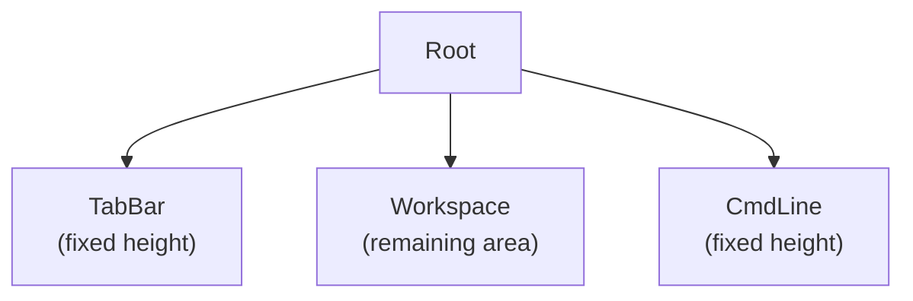
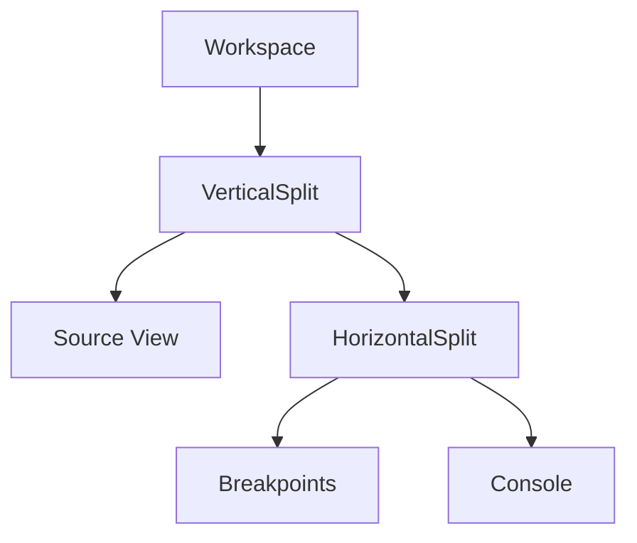
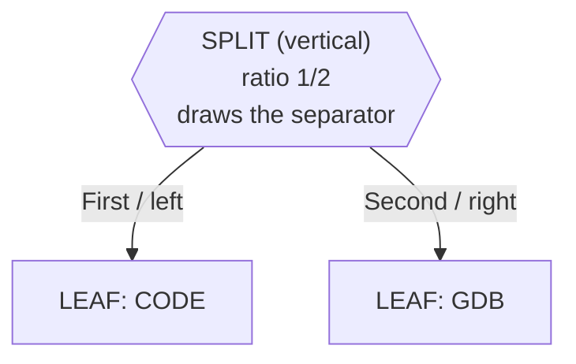
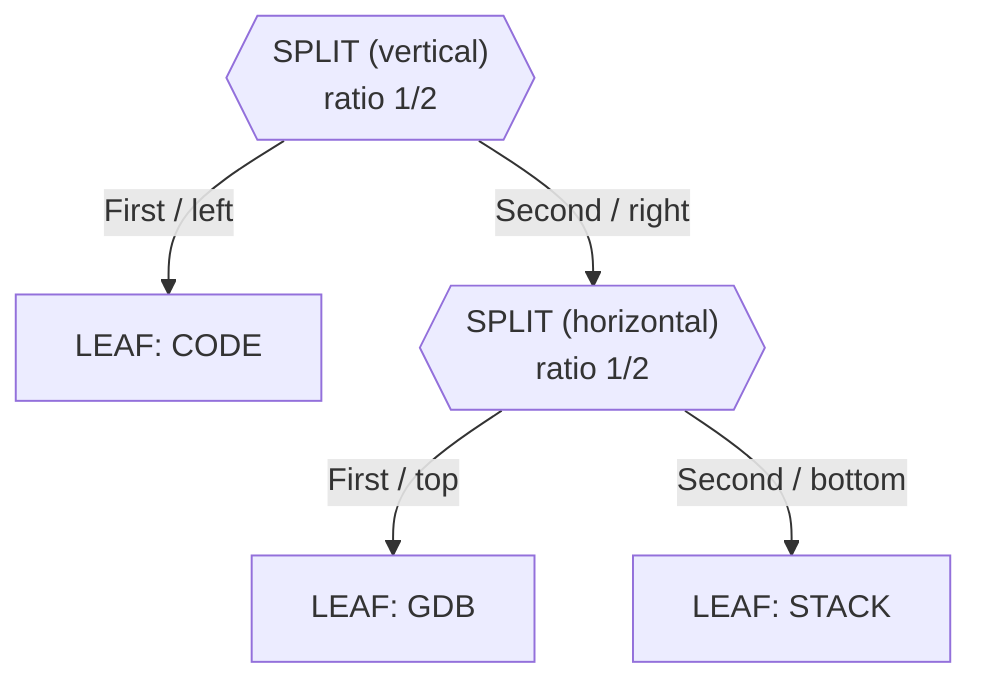
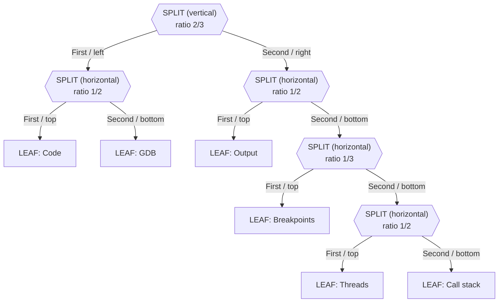
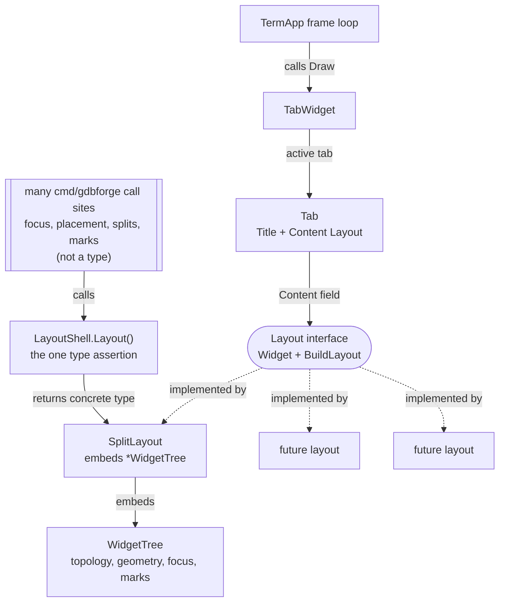
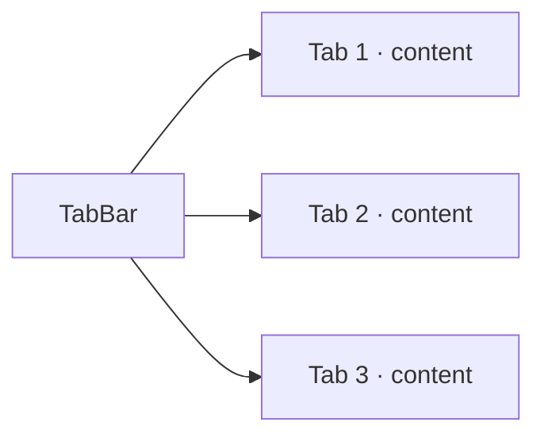

# Window Management

gdbforge organizes debugger panes through a **Workspace** containing a recursive **split tree**, managed at the top level by **tabs** and a global **command line**. Each workspace pane shows a **per-pane status line** at its bottom edge when focused; a global debugger status bar is still planned above the command line.

**Companion docs:** [UI_ARCHITECTURE.md](UI_ARCHITECTURE.md) · [INPUT.md](INPUT.md) · [ARCHITECTURE.md](ARCHITECTURE.md)

---

## Table of contents

- [Top-level layout](#top-level-layout)
- [Workspace concept](#workspace-concept)
- [Split tree architecture](#split-tree-architecture)
- [Horizontal and vertical splits](#horizontal-and-vertical-splits)
- [Splitting at runtime](#splitting-at-runtime)
- [Tab management](#tab-management)
- [Command line](#command-line)
- [Buffer command](#buffer-command)
- [Per-pane status line](#per-pane-status-line)
- [Global status bar (planned)](#global-status-bar-planned)
- [Planned window operations](#planned-window-operations)

---

## Top-level layout

The root UI is **not** a split tree. It is a fixed vertical stack:

```text
Root
├── TabBar      (fixed height)
├── Workspace   (remaining area — contains split tree)
└── CmdLine     (fixed height)
```

```text
+--------------------------------------------------+
| Tab1 | Tab2 | Tab3                               |
+--------------------------------------------------+
|                                                  |
|                 Workspace                        |
|                                                  |
+--------------------------------------------------+
| : command line                                   |
+--------------------------------------------------+
```



*Source: [`diagrams/top_level_ui.mermaid`](diagrams/top_level_ui.mermaid)*

**Design decision:** keeping TabBar and CmdLine **outside** the split tree means:

- Tabs always remain visible regardless of pane layout.
- The command line is a stable anchor (like Vim's `:` line).
- Workspace resize math is isolated — only the middle band changes height on terminal resize.
- Optional chrome overlays (wildmenu, future search/message bars) share the same TermApp layer — **no popup compositor**.

**TermApp chrome** is a flat `AddWidget` list. **`DebuggerApp.HandleResize`** assigns rects today (`cmd/gdbforge/setup.go` order = index order):

```go
// setup: AddWidget(workspace.Widget()), AddWidget(completionBar), AddWidget(cmdWidget)
w[0].SetRect(c.ChildRect(0, 0, c.W(), c.H()-2))     // TabWidget (workspace band)
w[1].SetRect(c.ChildRect(0, c.H()-2, c.W(), 1))     // CompletionBarWidget (overlay row)
w[2].SetRect(c.ChildRect(0, c.H()-1, c.W(), 1))     // CmdWidget (: line)
```

Apps own chrome banding in `HandleResize`; `TabWidget.Draw` uses its full assigned rect. `TermApp.Draw` paints in that order, so the completion bar can overwrite row `H-2` after the tab. The bar’s `Draw` is a no-op unless wildmenu is active — otherwise the pane status line stays visible.

Called on startup (`NewDebuggerApp`) and on every `EventResize`.

### Extending chrome (no popup layer)

Reuse the same pattern for future overlays (search bar, confirm strip, message line):

1. `AddWidget` a chrome widget at TermApp level (same event/draw layer as tab + cmdline).
2. Give it a rect in `HandleResize` (document the slot; avoid magic indexes).
3. Own keys with a `platform.Mode` (like `ModeCompletion`) or forward when `Active()`.
4. `Draw` only when needed so idle overlays do not cover status lines.

Do **not** introduce a separate popup/z-order system for one-line chrome.

---

## Workspace concept

The **Workspace** is the rectangular region between TabBar and CmdLine. It is the **only** place where recursive splits exist. gdbforge also has a **`LayoutShell` type** (`cmd/gdbforge/workspace*.go`) that owns pane policy above the layout — see [LayoutShell (gdbforge) vs Tab](#layoutshell-gdbforge-vs-tab-termui).

Workspace panes are **widgets** — views bound to application **models** owned by `*Ctl` controllers. Typical models and their views:

| Model | Widget (view) | Purpose |
|-------|---------------|---------|
| Source buffer (per file, `bufferCtl`) | CodeWidget | File, PC `━━▶`, BP gutters (`BreakGutter`) |
| `AssemblyList` (`asmCtl`) | AssemblyWidget | Disassembly; addr BPs; autoAsm when source missing |
| `BreakpointList` (`breakCtl`) | BreakpointWidget | Breakpoint list; host intents |
| Session via `consoleCtl` | GDBWidget | Debugger console paint + `OnSubmit` |
| Inferior `ptyx.TTY` (`inferiorIOCtl`) | OutputWidget | Program stdin/stdout |
| `ThreadList` (`debugInfoCtl`) | ThreadWidget | Thread list on stop |
| `CallStack` (`debugInfoCtl`) | CallStackWidget | Stack frames on stop |
| `AppState.SourceFiles` | FileListWidget | `:edit` project picker |
| `ExecClient` (via controller) | ExecWidget | `:!` shell / SSH |
| Logger sink | LoggerWidget | Application log |

```text
DebuggerApp (composition root)
├── backend.Backend          →  Session (GDB or Delve)
├── breakCtl.list            →  BreakpointWidget + Code/Asm gutters
├── asmCtl                   →  AssemblyWidget
├── debugInfoCtl             →  ThreadWidget / CallStackWidget
├── bufferCtl.files          →  CodeWidget(s)
├── consoleCtl               →  GDBWidget
└── Workspace                →  TabWidget (geometry + focus)
```

Each pane is a **leaf widget** in the split tree. The Workspace band does not draw content itself — it delegates geometry to `WidgetTree.BuildLayout`. Models exist whether or not a widget is currently displaying them.

---

## Split tree architecture

The split tree is a **full binary tree** where internal nodes are splits and leaves are widgets.



*Source: [`diagrams/split_tree.mermaid`](diagrams/split_tree.mermaid)*

Example ASCII layout matching the diagram above:

```text
Workspace
└── VerticalSplit
    ├── Source
    └── HorizontalSplit
        ├── Breakpoints
        └── Console
```

### Node types

```text
Node
├── Leaf (Widget)
└── Split
    ├── Horizontal  (top / bottom)
    └── Vertical    (left / right)
```

**Design decision:** binary splits (not n-way splits) simplify ratio math and border drawing. An n-way toolbar layout can be built by composing binary nodes — the same approach used by Emacs window management and many IDE dock systems.

### A separator *is* a node

The most important property of this tree, and the easiest one to miss: **it is not a tree of panes.** Internal nodes and leaves mean two completely different things.

> **Every visible separator on screen originates from an internal split node.
> Every actual pane/widget is a leaf node.**

| Node kind | Marked as | What it is | Holds a widget? |
|-----------|-----------|------------|-----------------|
| **Split** | `\|` vertical — divides into **left / right**<br>`-` horizontal — divides into **top / bottom** | the division itself, i.e. the separator line you see | No — `Split` sets `node.Widget = nil` |
| **Leaf** | the widget name (`CODE`, `GDB`, `THREADS`, …) | one pane | Yes |

A split node owns a direction, a `Ratio`, and two children. It takes the rectangle handed to it, keeps **1 cell for the separator it draws**, and gives what remains to `First` and `Second`. So counting the split nodes in a tree tells you exactly how many separator lines appear on screen.

The three cases below build this up: one separator, then a nested separator, then the real `default` layout.

#### Case 1 — simple split

One split node, two leaves. The split node *is* the vertical line between the panes.

```text
TREE                                   SCREEN

        |   <- SPLIT NODE              +----------+----------+
       / \     (vertical separator)    |          |          |
      /   \                            |   CODE   |   GDB    |
  CODE     GDB         ==>             |          |          |
    ^       ^                          +----------+----------+
  LEAF    LEAF                                    ^
                                         this separator *is*
                                         the "|" split node
```

Hexagons are split nodes (the separators); rectangles are leaf panes.



#### Case 2 — nested split

Replacing a leaf with a split node is what creates nesting. Here the root's `Second` child is no longer a pane but another separator, so the right half of the screen gets divided again — this time top/bottom.

```text
              |  <- SPLIT NODE / separator  (vertical: left / right)
             / \
            /   \
        CODE     -  <- SPLIT NODE / separator  (horizontal: top / bottom)
                / \
              GDB  STACK
               ^     ^
             LEAF   LEAF
```

```text
TREE                         SCREEN

       |                    +---------+--------+
      / \                   |         |  GDB   |
   CODE   -       ==>       |  CODE   |--------|  <- the "-" split node
         / \                |         | STACK  |
       GDB STACK            +---------+--------+
                                      ^
                              the "|" split node
```

Two split nodes, so two separators. Note the `-` separator spans only the right column: a split node divides *the rectangle it was given*, not the whole screen.



#### Case 3 — the real gdbforge `default` layout

Exactly as built by `BuildDefault` (`internal/gdbforge/layout/default.go`), with the shipped ratios from `AppState.DefaultLayoutRatios` (`Left` 2/3, `Output` 1/2, `BottomFirst` 1/3). **5 split nodes and 6 leaves**, so 5 separators on screen.

```text
|  SPLIT vertical, ratio 2/3                     <- root
├── -  SPLIT horizontal, ratio 1/2
│   ├── Code                       LEAF
│   └── GDB                        LEAF
└── -  SPLIT horizontal, ratio 1/2
    ├── Output                     LEAF
    └── -  SPLIT horizontal, ratio 1/3
        ├── Breakpoints            LEAF
        └── -  SPLIT horizontal, ratio 1/2
            ├── Threads            LEAF
            └── Call stack         LEAF
```

Resulting panes for a 120x40 workspace band:

```text
 x=0                                x=79 x=80                       x=119
  +-----------------------------------+--------------------------------+ y=0
  |                                   |                                |
  |  Code                             |  Output                        |
  |  79 x 19                          |  40 x 19                       |
  |                                   |                                |
  +-----------------------------------+--------------------------------+ y=19
  |                                   |  Breakpoints        40 x 6     |
  |  GDB                              +--------------------------------+ y=26
  |  79 x 20                          |  Threads            40 x 6     |
  |                                   +--------------------------------+ y=33
  |                                   |  Call stack         40 x 6     |
  +-----------------------------------+--------------------------------+ y=39
                                      ^
                            the root "|" split node
```

Each separator maps back to exactly one split node:

| Separator on screen | Split node | Ratio |
|---------------------|------------|-------|
| vertical at `x=79`, full height | root `\|` | 2/3 |
| horizontal at `y=19`, `x=0..78` | `-` Code / GDB | 1/2 |
| horizontal at `y=19`, `x=80..119` | `-` Output / lists | 1/2 |
| horizontal at `y=26`, `x=80..119` | `-` Breakpoints / rest | 1/3 |
| horizontal at `y=33`, `x=80..119` | `-` Threads / Call stack | 1/2 |

The two separators at `y=19` are **different split nodes** that happen to line up, because both columns are 40 rows tall and both use ratio 1/2. Widen only the left pane and they stay aligned; drag either one and only that node's `Ratio` changes.



`applyDefaultRatios` sets only the root, the right column, and the two nested list splits. The Code / GDB ratio of 1/2 comes from `ComputeRatios`, which runs on every `Split` while the builder has `equalalways` on.

---

## Horizontal and vertical splits

| `SplitDir` | Orientation | First child position | Separator |
|------------|-------------|----------------------|-----------|
| `Vertical` | Left \| Right | Left | Vertical line (`│`) |
| `Horizontal` | Top / Bottom | Top | Horizontal line (`─`) |

Layout algorithm (`widget_tree.go`):

1. Compute first-child size from the split node's **`Ratio`**, clamped to `minPaneCells`.
2. Reserve 1 cell for the separator.
3. Assign remaining space to second child.
4. Recurse into both children with child `Canvas` values (`WithRect`).

**Ratio is input only.** `BuildLayout` reads `Ratio` (in `verticalSplitRects` / `horizontalSplitRects`) and never writes it back, so geometry is a pure function of the ratios and the canvas: resizing the console scales panes and a shrink-then-grow restores them exactly. `Ratio` changes only on `Split` / `DeleteFocus` (via `Units()`-weighted `ComputeRatios`, when `equalalways` is on), on a separator drag, and when a named layout is applied.

**Border drawing:** separators are written into the shared `Grid` during `BuildLayout`, not by individual widgets. This ensures corners align when splits nest.

---

## Splitting at runtime

```go
tree := NewWidgetTree(initialWidget)
tree.Split(Vertical, newWidget)  // splits focused pane
```

What happens:

1. The focused leaf becomes a split node.
2. `First` retains the original widget; `Second` gets the new widget.
3. Focus moves to `First` (original pane).
4. `Ratio` is set to `0.5`.

**Design rationale:** splitting at focus matches cgdb/emacs user expectations. Alternative designs (split always right, pick target pane first) may be added as commands (`:vsplit`, `:hsplit`) later.

`NewTabTwoHozSplitWins` builds a tree with an initial horizontal split of the two widgets. Debugger workspaces live in `internal/gdbforge/layout` and are applied with `:layout <name>`:

| Layout | Tree |
|--------|------|
| **`panels`** (startup) | Left Code/GDB **2/3**; right IO **1/2**; bottom half = (Threads \| Callstack) **2/3** over Breakpoints **1/3** |
| **`default`** | Left Code/GDB **2/3**; right IO / Breakpoints / Threads / Call stack (`DefaultLayoutRatios`) |
| **`classic`** | Full-width Code over GDB (original cgdb) |

Per-layout normal-mode key policy is registered in `cmd/gdbforge/layout_behavior.go` (not in TermUI Tab).

---

## LayoutShell (gdbforge) vs Tab (termui)

gdbforge owns a **`LayoutShell`** layer (`cmd/gdbforge/workspace*.go`) above `termui.TabWidget`:

| Layer | Owns |
|-------|------|
| **`LayoutShell`** | Pane marks (`code` / `gdb` / `asm` / `last`), Code/GDB activation, placement (`placeCodeInSlot`, sticky GDB swap), layout apply — split-tree policy |
| **`TabWidget`** | Tab list chrome; hands the active tab's `Layout` its canvas and events |
| **`DebuggerApp` / `*Ctl`** | Debugger domain (breakpoints, stops, threads, buffers, …) |

`LayoutShell` is **workspace policy**, not debugger policy. Split-tree ops go straight to the layout via `LayoutShell.Layout()` / `DebuggerApp.Layout()`, which returns `*termui.SplitLayout` concretely — no forwarding through `Tab`.

### Tab is a generic Layout container

A `Tab` hosts any **`termui.Layout`** — the split tree today, and any future layout (a form, a text viewer, a different window arrangement, a whole embedded app):

```go
type Layout interface {
    Widget // HandleEvent, Draw, DrawStatusLine
    BuildLayout(c Canvas)
}
```

Two consumers reach the same `SplitLayout`, by two deliberately separate routes:

- **Rendering and lifecycle — the top path.** `TermApp → TabWidget → Tab → Layout interface → SplitLayout`. Everything on this path is generic: `TabWidget` and `Tab` see only the interface methods above, so neither can acquire a dependency on split-tree behaviour and a tab can host a completely different `Layout` with no changes.
- **gdbforge application logic — the left path.** Code that genuinely needs split-specific operations (focus navigation, pane placement, splitting, leaf marks) takes the concrete `*SplitLayout` from `LayoutShell.Layout()`. Those operations are intentionally absent from the interface.

Splitting the routes this way is what let the 28 forwarding methods `Tab` used to carry disappear: application code no longer hops through the container to reach the tree, while `Tab` stays small enough to host a future layout that has no panes at all. `LayoutShell.Layout()` is the single place the interface is narrowed to a concrete type.



Solid arrows are runtime use (a call, a field, an embed); dotted arrows are the `implements` relationship. Every box is a Go type except the double-barred one, whose shape marks it as a set of scattered call sites — `lay := a.Layout()` appears in about a dozen files such as `workspace_policy.go`, `workspace_place.go` and `actions.go`.

*Source: [`diagrams/tab_layout.mermaid`](diagrams/tab_layout.mermaid)*

`SplitLayout` is the tiling implementation. It **embeds `*WidgetTree`**, so every pane, focus and mark operation is reachable on the layout with no forwarding code:

```go
type SplitLayout struct {
    *WidgetTree
}
```

**Do not add `Tab` or `TabWidget` methods that forward into a `Layout`.** Code needing arrangement-specific behaviour takes the layout and drives it directly. `LayoutShell.Layout()` returns nil when the tab hosts a non-split layout, which is the signal that these mark and slot APIs do not apply.

A layout can also sit **inside a leaf** (`Layout` embeds `Widget`, and `Node.Widget` is a `Widget`), giving two independent trees in one tab. `WidgetTree.buildLayout` hands a nested layout its canvas. Focus arbitration between two trees is separate policy and is not implemented.

## Tab management

**Tab** is chrome: a title plus a `Layout`. For a `SplitLayout`, focus and named leaf marks live on the embedded **`WidgetTree`**. Mark **names** and focus policy are **app-private** on `LayoutShell`. TermUI itself stays free of debugger roles so other apps can reuse it.



Current `TabWidget` implementation:

```go
type Tab struct {
    Title   string
    Content Layout
}

type TabWidget struct {
    tabs   []Tab
    active int
}
```

Its whole surface is `Layout()`, `SetLayout()`, `Draw`, `HandleEvent`, `DrawStatusLine` and the two constructors.

| Feature | Status |
|---------|--------|
| Single tab container | Implemented |
| Hand events/draw to active tab's Layout | Implemented |
| Named leaf marks on WidgetTree | Implemented (on `SplitLayout`) |
| Generic non-tree tab content | Implemented (`Layout` interface); no second implementation yet |
| Nested layout inside a leaf | Structurally supported; focus arbitration not implemented |
| Tab header rendering | Not implemented |
| Tab switching | Not implemented |
| Tab close / new tab | Not implemented |
| Persist layout per tab | Not implemented |

**Design decision:** gdbforge tabs are **workspace presets**, not separate debugger sessions (initially). A tab might represent "source + console" vs "registers + memory". Multi-session tabs may come later with backend association per tab.

Named layout builders (`internal/gdbforge/layout`) return a `*termui.SplitLayout`; `LayoutShell.ApplyLayout` mounts it via `TabWidget.SetLayout` and then re-applies the startup wiring (status clipboard, resize hook, equalalways, marks) that a freshly built layout does not carry.

---

## Command line

The **CmdLine** is a top-level band for **Vim-style `:` commands**, distinct from the GDB `(gdb)` prompt inside a console pane.

```text
+--------------------------------------------------+
| : break main                                     |
+--------------------------------------------------+
```

`CmdWidget` (`cmd_widget.go`) provides:

- Vim-style `:` activation and drawing on the bottom line (row `H-1` of the terminal).
- Command history (`termui.History`) — Up/Down navigation.
- Tab completion (`termui.AutoCompleter`) — command name only.
- **`SubmitMsg` on the event bus** — resolved `CommandID` + args; app dispatches in `HandleCoreEvents`.

Command mode is entered by **`DebuggerApp`** (`:` → `ModeCommand`, `CmdWidget.Activate()`), not by `CmdWidget` alone. `Esc` returns to normal mode at the app layer.

**Current state:** `:quit` / `:q` exits the debug session (same as Ctrl-D). `:close` removes the focused pane/split. Split commands (`:vs`, `:split`) partially wired. Unknown commands emit `termui.CmdUnknown`.

**Design decision:** separate CmdLine from GDB console because:

- GDB console speaks MI/cli dialect; CmdLine speaks **UI commands** (`:split`, `:focus`, `:close`, `:quit`).
- Users can run UI operations without sending spurious input to GDB.
- Completion vocabularies differ (UI vs debugger).

Planned flow details: see [INPUT.md](INPUT.md#vim-like-command-system) and [ARCHITECTURE.md](ARCHITECTURE.md#buffer-concept).

---

## Buffer command

**Implemented today:** Vim-like `:b name` switches among builtins (`help`, `about`, `logger`, `gdb`, `breakpoint`, `threads`, `callstack`, `output`, `exec`, `asm`) and open file CodeWidgets; `:edit` / `:edit file` opens the project picker or a per-file source buffer (`:e` is the unique prefix). Workspace trees: `:layout default|panels|classic|wide` with optional `asm` (`internal/gdbforge/layout`).

The layout **`"gdb"` leaf is a fixed slot**: `:b` / `:edit` / `:help` / `:!` / Ctrl-O refuse to replace `GDBWidget` there. Focus another pane first to open a different view. `:b gdb` / `i` still focus (and restore) GDB on that leaf.

The longer-term `:buffer` idea selects which **application model** to display — it does not open a text file (except via the `:e` path above).

```text
:help
:b help
:b about
:b logger
:b gdb
:b breakpoint
:b threads
:b callstack
:b io
:b output
:layout default
:layout panels
:layout classic
:set clearoutput
:set noclearoutput
:edit
:edit main.c
:b main.c
:set markcolor darkblue
:set breakcolor red
:set breakdisabledcolor yellow
```

Future model names (aspirational):

```text
:buffer registers
:buffer memory
```

**Related window commands** (same model-binding semantics):

| Command | Action |
|---------|--------|
| `:buffer <name>` | Display model in focused pane |
| `:split` / `:vsplit` | Split focused pane; new pane also bound via subsequent `:buffer` or default |
| `:tab` | Open model in a new tab workspace |

The architecture does **not** use `:attach <name>`. All models exist from startup; the user only chooses which to display. See [ARCHITECTURE.md](ARCHITECTURE.md#why-not-attach).

**Current state:** `:b` / `:edit` bind views to models owned by `*Ctl` controllers (`models.*`, `AppState`). See [ARCHITECTURE.md — MVC](ARCHITECTURE.md#mvc-current).

---

## Per-pane status line

Each leaf pane in the split tree has a one-row **status band** at local `y = c.H()` — immediately below the widget content area (`0..H-1`). This row is owned by the layout system, not by individual widget `Draw` methods.

| State | Appearance |
|-------|------------|
| Focused | Styled bar: `▎ {PaneName}` (green insert / blue normal) |
| Unfocused | Grid row unchanged; gray `{PaneName}` starting at the **4th** character |

**Draw order** (after `BuildLayout`):

1. Widget content (`Draw`)
2. Clear all pane status rows (`ClearStatusLine`)
3. Redraw split separators (`redrawGrid`) — restores border glyphs and default style
4. Paint status on **every** leaf (`DrawStatusLine`) — focused bar vs inactive name overlay (no dash fill)

Widgets set a display name via `BaseWidget.PaneName` (e.g. `"Code"`, `"Log"`) or override `DrawStatusLine`. Container widgets (`TabWidget`, `CmdWidget`) use a no-op. Prefer `StatusLabel()` when the copyable text differs from `PaneName` (Code uses the full source path).

**Mouse on the status band** (row at `Bottom()` of the leaf, outside content):

| Gesture | Action |
|---------|--------|
| Double-click on the **name text** | Copy the full status label (path for Code); brief white highlight |
| Click or drag anywhere on the status row | Unchanged: split resize / focus — same as before status-copy |

Implementation: `status_line.go`, `status_sel.go`, `base_widget.go`, `widget_tree.go` (`drawWidgets`, `clearStatusRows`, `redrawGrid`, `drawStatusLines`).

---

## Global status bar (planned)

A **global status bar** is still planned between Workspace and CmdLine (or integrated into CmdLine's opposite edge):

```text
+--------------------------------------------------+
| Workspace …                                      |
+--------------------------------------------------+
| Normal | main.c:42 | stopped | thread 1          |  ← StatusBar
+--------------------------------------------------+
| :                                                |
+--------------------------------------------------+
```

Planned contents:

| Segment | Source |
|---------|--------|
| Mode | `Normal` / `Focus` / `Command` |
| Location | Current file:line from debugger |
| Target state | `running` / `stopped` from MI `*stopped` |
| Thread | Active thread ID |
| Backend | `GDB` / `OpenOCD` indicator |

**Design decision:** the global status bar is **read-only** and outside the split tree — it never steals focus. Updates arrive via `core.Event` from debugger backends, not from widget polling. This is separate from the per-pane focus indicator described above.

---

## Global application state

`TermApp.State()` returns `*platform.AppState` — process-global state for the running session:

| Field | Purpose |
|-------|---------|
| `Mode` | Input mode: Normal / Insert / Command |
| `PTYOwner` | Who holds exclusive PTY write intent (`none` / `ui` / `mcp` / `app`) |
| `EqualAlways` | Vim-like: when true, split ratios rebalance to equal after **Split** / close (not every paint). `:set equalalways` also rebalances immediately. |
| `EscToCode` | Esc restores last non-Code/non-GDB pane if any, else CodeWidget (`:set esctocode` / `:set noesctocode`; default **on**) |
| `BreakMain` | Insert `break main` on GDB session start (`:set breakmain` / `:set nobreakmain`; default **on**; skipped on YAML restore or `-x`/`-ex`) |
| `GdbListenPrint` | Paint App/MCP replies in the GDB console (`:set gdblistenprint` / `:set nogdblistenprint`; default **on**) |
| `DefaultLayoutRatios` | Presets for `:layout default`: `Left` **2/3**, `Output` **1/2** (right IO column), `BottomFirst` **1/3** (Breakpoints share of bottom half) |
| `LayoutLeftRatio` | Alias for `DefaultLayoutRatios.Left` |
| `SourceFiles` | Paths from `-file-list-exec-source-files` (App query on stop / `:edit`) |
| `MarkColor` | Focused list selection background (`:set markcolor`; default blue) |
| `MarkDimColor` | Unfocused list selection background (`:set markdimcolor`; default gray) |
| `BreakColor` | Enabled breakpoint background (`:set breakcolor`; default red) |
| `BreakDisabledColor` | Disabled breakpoint background (`:set breakdisabledcolor`; default yellow) |
| `PCColor` | Code ━━▶ row background (`:set pccolor`; default darkslategray) |
| `StackBreakColor` | Stop-PC highlight on BP / stack #0 / thread (`:set stackbreakcolor`; default green) |
| `CodeSelColor` | Code browse cursor (`:set codeselcolor`; default darkblue) |
| `MutedColor` | Empty-list / dim text (`:set mutedcolor`; default gray) |
| `StopFile` / `StopLine` | Real PC from `*stopped` (━━▶); not moved by BP list browse |
| `CurrentFile` / `CurrentLine` | Browse / selected frame location for CodeWidget |

```go
st := app.State()
st.PTYOwner()           // platform.PTYOwnerApp during silent file-list Query
st.SetEqualAlways(true) // :set equalalways
st.StopFile()           // after *stopped (━━▶)
```

PTY exclusivity is still enforced by `ptyx.WithWrite`; `PTYOwner` is the **status** so the UI can suppress console paint for App/MCP traffic when listen-print is off (`:set nogdblistenprint`; default paints). Layout: `:set equalalways` / `:set noequalalways`; `:layout default|panels|classic`. IO: `:b io` (alias `:b output`), `:set clearoutput` / `:set noclearoutput`. Source: `:edit name` opens a per-file CodeWidget (PaneName = basename); `:edit` opens the project file picker (`:e` = unique prefix); `:b filename` switches to an already-open buffer; stops show `━━▶` on the PC line. Breakpoints: `:b breakpoint`, CodeWidget **Space**, sync + YAML persist in [DEBUGGER_INTEGRATION.md](DEBUGGER_INTEGRATION.md#breakpoints-and-source-sync) / [breakpoint persistence](DEBUGGER_INTEGRATION.md#breakpoint-persistence).

---

## Planned window operations

| Command | Action | Status |
|---------|--------|--------|
| `:split` / `:vsplit` | Split focused pane horizontally / vertically | **Done** (`:vs` / `:split`) |
| `:close` | Close focused pane (collapse split) | Partial |
| `:focus left/right/up/down` | Move focus | **Done** (`:window` / Ctrl-W) |
| `:tabnew` / `:tabclose` / `:tabn` | Tab management | Planned |
| `:only` | Collapse to single pane | **Done** (`:only` / Ctrl-W o) |
| `:resize +N/-N` | Adjust split ratio | Planned |

Remaining items call into `WidgetTree` / `TabWidget` APIs from the command router ([INPUT.md](INPUT.md)).

---

## Related documentation

- [UI_ARCHITECTURE.md](UI_ARCHITECTURE.md) — layout engine internals
- [INPUT.md](INPUT.md) — focus and command mode
- [RENDERING.md](RENDERING.md) — split border drawing
