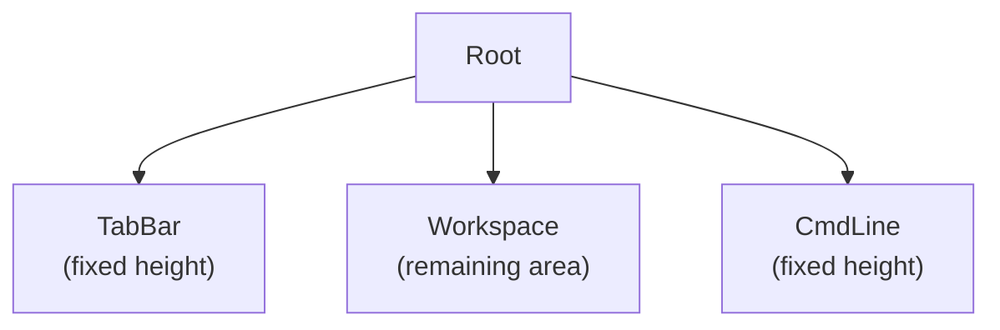
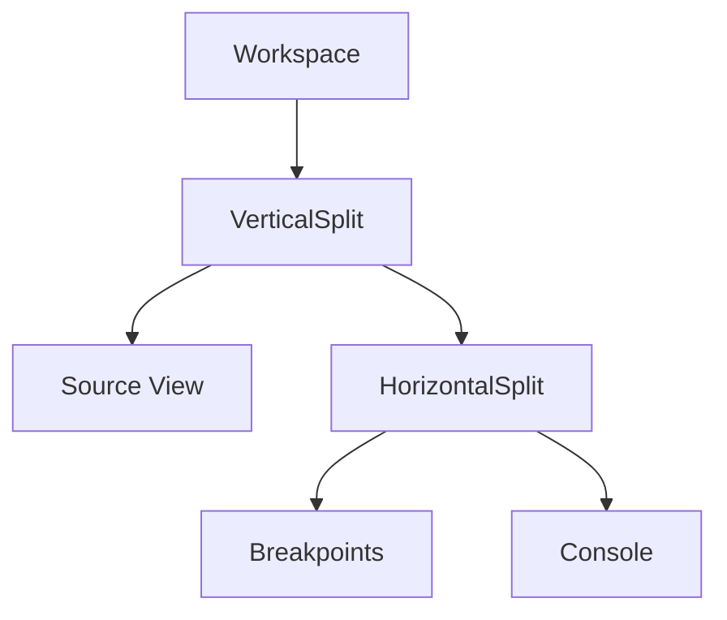
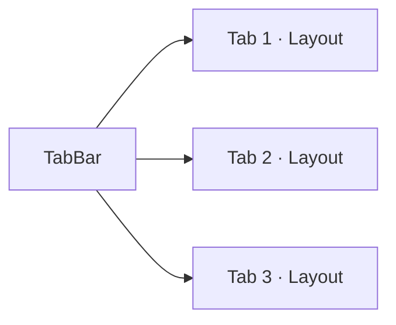

# Window Management

NewCGDB organizes debugger panes through a **Workspace** containing a recursive **split tree**, managed at the top level by **tabs** and a global **command line**. A future **status bar** will sit below the workspace or above the command line.

**Companion docs:** [UI_ARCHITECTURE.md](UI_ARCHITECTURE.md) · [INPUT.md](INPUT.md) · [ARCHITECTURE.md](ARCHITECTURE.md)

---

## Table of contents

- [Top-level layout](#top-level-layout)
- [Workspace concept](#workspace-concept)
- [Split tree architecture](#split-tree-architecture)
- [Horizontal and vertical splits](#horizontal-and-vertical-splits)
- [Splitting at runtime](#splitting-at-runtime)
- [Tab management](#tab-management)
- [Command line](#command-line)
- [Future status bar](#future-status-bar)
- [Planned window operations](#planned-window-operations)

---

## Top-level layout

The root UI is **not** a split tree. It is a fixed vertical stack:

```text
Root
├── TabBar      (fixed height)
├── Workspace   (remaining area — contains split tree)
└── CmdLine     (fixed height)
```

```text
+--------------------------------------------------+
| Tab1 | Tab2 | Tab3                               |
+--------------------------------------------------+
|                                                  |
|                 Workspace                        |
|                                                  |
+--------------------------------------------------+
| : command line                                   |
+--------------------------------------------------+
```



*Source: [`diagrams/top_level_ui.mermaid`](diagrams/top_level_ui.mermaid)*

**Design decision:** keeping TabBar and CmdLine **outside** the split tree means:

- Tabs always remain visible regardless of pane layout.
- The command line is a stable anchor (like Vim's `:` line).
- Workspace resize math is isolated — only the middle band changes height on terminal resize.

**Current gap:** `TermApp` registers widgets in a flat slice rather than a structured `RootLayout`. Migration path: introduce `RootWidget` that owns the three bands internally.

---

## Workspace concept

The **Workspace** is the rectangular region between TabBar and CmdLine. It is the **only** place where recursive splits exist.

Typical debugger panes inside the Workspace:

| Pane | Purpose |
|------|---------|
| Source view | Current file, breakpoint markers, PC highlight |
| Breakpoints | Breakpoint list, enable/disable |
| Console | GDB / target output |
| Registers | Register dump |
| Memory | Hex memory view |
| Locals / Watch | Variable inspection |

```text
Workspace
└── SplitTree
    ├── Source View
    ├── Breakpoints
    ├── Console
    ├── Registers
    ├── Memory
    └── Future Views
```

Each pane is a **leaf widget** in the split tree. The Workspace does not draw content itself — it delegates geometry to `WidgetTree.BuildLayout`.

---

## Split tree architecture

The split tree is a **full binary tree** where internal nodes are splits and leaves are widgets.



*Source: [`diagrams/split_tree.mermaid`](diagrams/split_tree.mermaid)*

Example ASCII layout matching the diagram above:

```text
Workspace
└── VerticalSplit
    ├── Source
    └── HorizontalSplit
        ├── Breakpoints
        └── Console
```

### Node types

```text
Node
├── Leaf (Widget)
└── Split
    ├── Horizontal  (top / bottom)
    └── Vertical    (left / right)
```

**Design decision:** binary splits (not n-way splits) simplify ratio math and border drawing. An n-way toolbar layout can be built by composing binary nodes — the same approach used by Emacs window management and many IDE dock systems.

---

## Horizontal and vertical splits

| `SplitDir` | Orientation | First child position | Separator |
|------------|-------------|----------------------|-----------|
| `Vertical` | Left \| Right | Left | Vertical line (`│`) |
| `Horizontal` | Top / Bottom | Top | Horizontal line (`─`) |

Layout algorithm (`widget_tree.go`):

1. Compute first-child size: `int(float64(dimension) * Ratio)`.
2. Reserve 1 cell for the separator.
3. Assign remaining space to second child.
4. Recurse into both children with child `Canvas` values.

**Ratio default:** `0.5` (equal split) when created via `WidgetTree.Split`.

**Border drawing:** separators are written into the shared `Grid` during `BuildLayout`, not by individual widgets. This ensures corners align when splits nest.

---

## Splitting at runtime

```go
layout := NewLayout(initialWidget)
layout.NewSplit(Vertical, newWidget)  // splits focused pane
```

What happens:

1. The focused leaf becomes a split node.
2. `First` retains the original widget; `Second` gets the new widget.
3. Focus moves to `First` (original pane).
4. `Ratio` is set to `0.5`.

**Design rationale:** splitting at focus matches cgdb/emacs user expectations. Alternative designs (split always right, pick target pane first) may be added as commands (`:vsplit`, `:hsplit`) later.

**Current gap in `TabWidget`:** `NewTabTwoHozSplitWins` contains experimental repeated `NewSplit` calls used for layout testing — not a production default layout.

---

## Tab management

Each tab owns an independent **Workspace layout** (a `Layout` / `WidgetTree` instance).



Current `TabWidget` implementation:

```go
type Tab struct {
    Title  string
    Layout *Layout
}

type TabWidget struct {
    tabs   []Tab
    active int
}
```

| Feature | Status |
|---------|--------|
| Single tab container | Implemented |
| Forward events/draw to active tab | Implemented |
| Tab header rendering | Not implemented |
| Tab switching | Not implemented |
| Tab close / new tab | Not implemented |
| Persist layout per tab | Not implemented |

**Design decision:** tabs are **workspace presets**, not separate debugger sessions (initially). A tab might represent "source + console" vs "registers + memory". Multi-session tabs may come later with backend association per tab.

`TabWidget.Draw` currently shaves 2 rows from height (`r.H()-2`) — a temporary adjustment pending proper Root layout integration.

---

## Command line

The **CmdLine** is a top-level band for **Vim-style `:` commands**, distinct from the GDB `(gdb)` prompt inside a console pane.

```text
+--------------------------------------------------+
| : break main                                     |
+--------------------------------------------------+
```

`CmdWidget` (`cmd_widget.go`) provides:

- Vim-style `:` activation and drawing on the bottom line.
- Command history (`core.History`) — Up/Down navigation.
- Tab completion (`core.AutoCompleter`) — command name only.
- **`SubmitMsg` on the event bus** — resolved `CommandID` + args; app dispatches in `HandleCoreEvents`.

**Design decision:** separate CmdLine from GDB console because:

- GDB console speaks MI/cli dialect; CmdLine speaks **UI commands** (`:split`, `:focus`, `:tabnew`, `:quit`).
- Users can run UI operations without sending spurious input to GDB.
- Completion vocabularies differ (UI vs debugger).

**Current state:** `:quit` exits via `HandleCoreEvents`. Other debugger commands registered but not yet dispatched. Unknown commands emit `core.CmdUnknown`.

Planned flow details: see [INPUT.md](INPUT.md#vim-like-command-system) and [ARCHITECTURE.md](ARCHITECTURE.md#core-events-layer).

---

## Future status bar

A **status bar** is planned between Workspace and CmdLine (or integrated into CmdLine's opposite edge):

```text
+--------------------------------------------------+
| Workspace …                                      |
+--------------------------------------------------+
| Normal | main.c:42 | stopped | thread 1          |  ← StatusBar
+--------------------------------------------------+
| :                                                |
+--------------------------------------------------+
```

Planned contents:

| Segment | Source |
|---------|--------|
| Mode | `Normal` / `Focus` / `Command` |
| Location | Current file:line from debugger |
| Target state | `running` / `stopped` from MI `*stopped` |
| Thread | Active thread ID |
| Backend | `GDB` / `OpenOCD` indicator |

**Design decision:** status bar is **read-only** and outside the split tree — it never steals focus. Updates arrive via `core.Event` from debugger backends, not from widget polling.

---

## Planned window operations

| Command | Action |
|---------|--------|
| `:split` / `:vsplit` | Split focused pane horizontally / vertically |
| `:close` | Close focused pane (collapse split) |
| `:focus left/right/up/down` | Move focus |
| `:tabnew` / `:tabclose` / `:tabn` | Tab management |
| `:only` | Collapse to single pane |
| `:resize +N/-N` | Adjust split ratio |

These will be implemented in the command router ([INPUT.md](INPUT.md)) and call into `Layout` / `WidgetTree` APIs.

---

## Related documentation

- [UI_ARCHITECTURE.md](UI_ARCHITECTURE.md) — layout engine internals
- [INPUT.md](INPUT.md) — focus and command mode
- [RENDERING.md](RENDERING.md) — split border drawing
