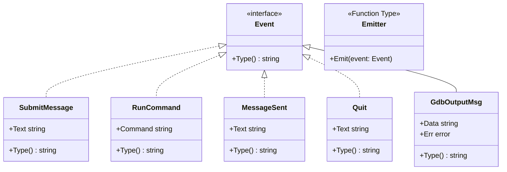

# Project Architecture

This document describes the main architecture of the project in terms of its types and their relationships.

## Mermaid Diagram: Core Events Layer

## Mermaid Diagram: Terminal UI Node

```mermaid
classDiagram
    direction TB

    class Node {
        +Type NodeType
        +Widget Widget
        +Rect Rect
        +First *Node
        +Second *Node
        +Dir SplitDir
        +Ratio float64
    }

    class NodeType {
        <<Enum>>
        +NodeLeaf
        +NodeSplit
    }

    class SplitDir {
        <<Enum>>
        +Horizontal
        +Vertical
    }

    Node *-- Node
    Node --> NodeType
    Node --> SplitDir
```

## Notes
- The `Event` interface in the Core module is extended by several struct types, each of which represents a specific kind of event.
- The `Node` struct in the Terminal UI module is a composite structure supporting both "Leaf" (simple widgets) and "Split" (divided layouts) nodes, providing flexibility for UI layout designs.