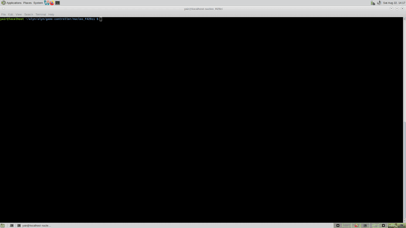

# STM32 MCU debugging

Self-contained Lua scripts for **STM32** bare-metal and **Zephyr** app debug. Each board is a folder under **`lua/stm32/<board>/`** with `:lua` scripts and optional OpenOCD cfg sidecars.

**Full guide:** **[STM32_DEBUG.md](../../docs/STM32_DEBUG.md)** (intro order, OpenOCD install, board quick starts).

## Demo — Nucleo F429ZI (Zephyr)

Bare-metal debug of a Zephyr app on **Nucleo-F429ZI**, then switch to **Zephyr-aware** debug with thread info and on-board displays. [Watch on YouTube](https://www.youtube.com/watch?v=_RAPSW77HcQ) · [STM32_DEBUG.md](../../docs/STM32_DEBUG.md#demo--nucleo-f429zi-zephyr).

{ loading=lazy }

## Quick path

1. Install **OpenOCD 0.12.x** on PATH (`openocd --version`) — see [OpenOCD in STM32_DEBUG.md](../../docs/STM32_DEBUG.md#openocd-version-and-install)
2. `cp lua/stm32/stm32_common.lua .gdbforge/lua/`
3. `cp -r lua/stm32/stm32-stlink .gdbforge/lua/` (generic) **or** `cp -r lua/stm32/<board> .gdbforge/lua/` (board alias)
4. `gdbforge ./your.elf` → `:lua stm32-stlink <board|mcu> [baremetal|zephyr|freertos]`

**Profile** (optional; Tab completes):

| Profile | OpenOCD | GDB |
|---------|---------|-----|
| `baremetal` | no `-rtos` (**default**) | no extra `dir` |
| `zephyr` | `-rtos Zephyr` | `dir $ZEPHYR_BASE` + app dir from `$PWD` |
| `freertos` | `-rtos FreeRTOS` | no extra `dir` |

Examples: `:lua stm32-stlink nucleo_f429zi` · `:lua stm32-stlink f411re zephyr` · `:lua nucleo_f429zi baremetal`

## OpenOCD (ST-Link scripts)

| | |
|--|--|
| Tested | **0.12.0** |
| Minimum | **> 0.11.0** (Zephyr `info threads` needs `-rtos Zephyr`) |
| Install | [openocd.org](https://openocd.org/pages/getting-openocd/) · [GitHub releases](https://github.com/openocd-org/openocd/releases) · distro `apt`/`emerge` · [Zephyr SDK](https://github.com/zephyrproject-rtos/sdk-ng/releases) |

```bash
export GDBFORGE_OPENOCD=openocd   # or full path to SDK/distro binary
```

## Board catalog (extensible)

| # | Board / script | MCU / kit | `:lua` | Probe |
|---|----------------|-----------|--------|-------|
| **0** | **`stm32-stlink/`** | **any catalog board** | `stm32-stlink <board> [profile]` | On-board ST-Link + OpenOCD |
| **1** | **`nucleo_f429zi/`** | STM32F429ZI (Nucleo-F429ZI) | `nucleo_f429zi`, `nucleo_f429zi_stlink` | alias for board 0 |
| **2** | **`stm32f405/`** | STM32F405 | `stm32f405_stlink`, `stm32f405_jlink` | ST-Link + OpenOCD or J-Link SWD |
| _3+_ | `<board>/` | _(add over time)_ | per board | per board |

**Generic entry:** `:lua stm32-stlink help` lists all boards (F4/F7/H7/L4/G4/U5 Nucleo kits + `stm32f405`). Add new boards in `stm32_common.lua` → `M.BOARDS` or add `lua/stm32/<board>/<board>_openocd.cfg`.

New boards: add a row to `M.BOARDS` in `stm32_common.lua` (and optional sidecar cfg under `lua/stm32/<board>/`).

## Script catalog (by board)

### 1 — Nucleo F429ZI

| `:lua` | Probe | Flow |
|--------|-------|------|
| `nucleo_f429zi` | ST-Link + OpenOCD | OpenOCD → attach → stop at `main` (profile selects RTOS) |
| `nucleo_f429zi_stlink` | _(alias)_ | same |

Use `:lua nucleo_f429zi zephyr` for Zephyr (`ZEPHYR_BASE`, `CONFIG_DEBUG_THREAD_INFO=y`). Default `baremetal` needs no RTOS env.

### 2 — STM32F405

| `:lua` | Probe | Flow |
|--------|-------|------|
| `stm32f405_stlink` | ST-Link + OpenOCD | same OpenOCD attach flow as board 1 |
| `stm32f405_jlink` | J-Link SWD | spawn J-Link → `target remote` → `load` → `break main` |

## Quick start — board 1 · Nucleo F429ZI

```bash
cd ~/alyn/alyn/game-controller/nucleo_f429zi
mkdir -p .gdbforge/lua
cp /path/to/gdbforge/lua/stm32/stm32_common.lua .gdbforge/lua/
cp -r /path/to/gdbforge/lua/stm32/nucleo_f429zi .gdbforge/lua/

export ZEPHYR_BASE=~/alyn/zephyr-3.4.99/zephyr

gdbforge ./zephyr/zephyr.elf
:lua nucleo_f429zi zephyr
```

OpenOCD cfg and GDB app dir are derived from `ZEPHYR_BASE` and your current directory — no other exports needed.

Requires **OpenOCD ≥ 0.12.0** on PATH. Falls back to bundled `nucleo_f429zi_openocd.cfg` without Zephyr env vars.

## Quick start — board 2 · STM32F405 (ST-Link)

```bash
mkdir -p .gdbforge/lua
cp -r lua/stm32/stm32f405 .gdbforge/lua/
export GDBFORGE_OPENOCD_SCRIPTS=/usr/share/openocd/scripts
gdbforge ./build/firmware.elf
:lua stm32f405_stlink
```

Re-running disconnects GDB and kills the previous OpenOCD.

## Quick start — board 2 · STM32F405 (J-Link)

```bash
cp -r lua/stm32/stm32f405 .gdbforge/lua/
export GDBFORGE_JLINK=/opt/JLink_Linux_V914a_x86_64/JLinkGDBServer
gdbforge ./build/firmware.elf
:lua stm32f405_jlink
```

## Directory layout

```text
lua/stm32/
├── README.md                 # this file — update catalog when adding boards
├── stm32_common.lua          # board catalog + shared OpenOCD/GDB flow
├── stm32-stlink/             # generic :lua stm32-stlink <board> [profile]
│   └── stm32-stlink.lua
├── stm32_stlink/             # back-compat alias (underscore)
│   └── stm32_stlink.lua
├── nucleo_f429zi/            # board 1 alias
│   ├── nucleo_f429zi.lua
│   ├── nucleo_f429zi_stlink.lua
│   └── nucleo_f429zi_openocd.cfg
├── stm32f405/                # board 2
│   ├── stm32f405_stlink.lua
│   ├── stm32f405_jlink.lua
│   └── stm32f405_openocd.cfg
└── <board>/                  # optional sidecar cfgs
```

## Environment variables

| Variable | Used by | Default |
|----------|---------|---------|
| `GDBFORGE_STM32_BOARD` | `stm32_stlink` | _(unset)_ — default board when only profile is passed |
| `ZEPHYR_BASE` | zephyr profile | **required** — kernel tree; OpenOCD cfg derived from board |
| `GDBFORGE_OPENOCD` | ST-Link scripts | `openocd` |
| `GDBFORGE_OPENOCD_PORT` | ST-Link scripts | `3333` |
| `GDBFORGE_JLINK` | `stm32f405_jlink` | `/opt/.../JLinkGDBServer` |
| `GDBFORGE_JLINK_DEVICE` | `stm32f405_jlink` | `STM32F405RG` |
| `GDBFORGE_JLINK_PORT` | `stm32f405_jlink` | `2334` |
